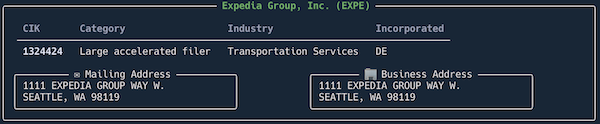
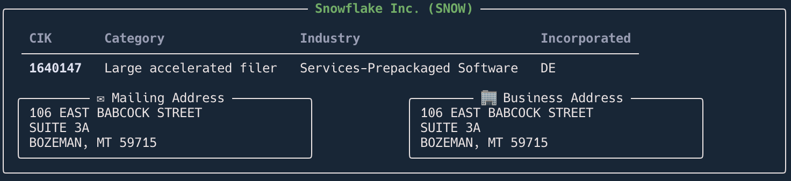

# Using the Company API

---

With the company API you find a company using the cik or ticker. From this you can get

- Basic company information like **industry**, **state of incorporation**, **mailing** and **business addresses** and **former names**
- The company's filings including all their historical filings
- Company facts, which is a tabular dataset with extensive information about the company


## Find a company using the cik
The cik uniquely identifies a company at the SEC. It is a number, but is sometimes shown in SEC Edgar resources as a string padded with leading zero's. 
For the edgar client API, just use the numbers and omit the leading zeroes.

```python
expe = Company(1324424) # or Company('1324424') or Company('0001324424')
expe
```




## Find a company using ticker

You can get a company using a ticker e.g. **SNOW**. This will do a lookup for the company cik using the ticker, then load the company using the cik.
This makes it two calls versus one for the cik company lookup, but is sometimes more convenient since tickers are easier to remember that ciks.

Note that some companies have multiple tickers, so you technically cannot get SEC filings for a ticker.
You instead get the SEC filings for the company to which the ticker belongs.

The ticker is case-insensitive so you can use `Company("snow")`
or `Company("SNOW")`
```python
snow = Company("SNOW")
snow
```

