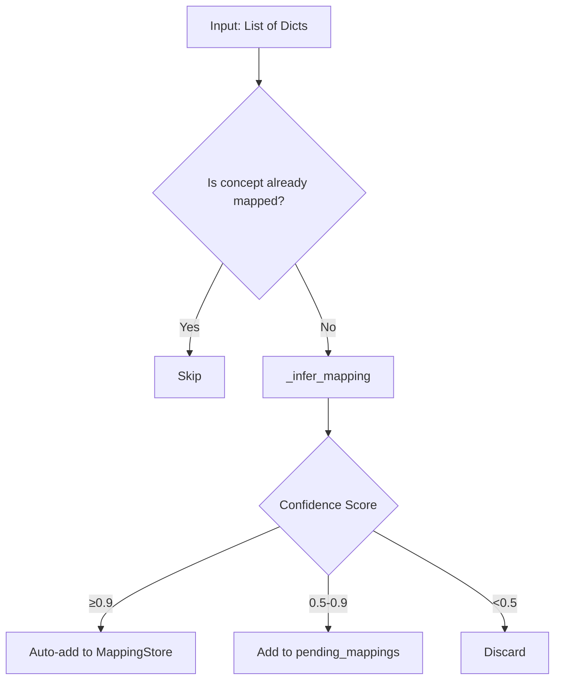

# ConceptMapper.learn_mappings() Deep Dive

**Date:** 2026-01-03
**Author:** Antigravity (Assistant)
**Related Task:** Mapping Limitations Analysis
**Tags:** #mapping #automation #concept-discovery

## Purpose
This note documents the `ConceptMapper.learn_mappings()` method in detail, including its capabilities, gaps, and recommended improvements.

## Location
`edgar/xbrl/standardization/core.py`, lines 617-663

## How It Works


## Input Format Required
```python
filings = [
    {
        "concept": "us-gaap:RevenueFromContractWithCustomer",
        "label": "Revenue from Contract with Customer",
        "statement_type": "IncomeStatement",
        "calculation_parent": "",  # optional
        "position": ""  # optional
    },
    # ...
]
mapper.learn_mappings(filings)
```

## Inference Logic (`_infer_mapping`)
1.  **Fast Path**: Exact label matches to common patterns ("total assets", "revenue", "net income").
2.  **Direct Match**: Check if label exactly matches a `StandardConcept` value.
3.  **Fuzzy Match**: Use `SequenceMatcher` to find similarity to `StandardConcept` values.
4.  **Contextual Boost**: Add +0.2 confidence for statement-type-appropriate matches.

## Current Gaps
| Gap | Description | Impact |
|-----|-------------|--------|
| No CLI | Users must write Python integration | Barrier to adoption |
| No EntityFacts helper | Manual conversion required | Error-prone |
| pending_mappings not persisted | Lost on exit | Wasted discoveries |
| No review workflow | Medium-confidence items never approved | Mapping gaps persist |

## Proposed Improvements

### 1. CLI Command
```bash
edgar learn-mappings --ticker AAPL --dry-run  # Preview changes
edgar learn-mappings --ticker AAPL --apply    # Apply to concept_mappings.json
```

### 2. EntityFacts Helper
```python
# Proposed addition to EntityFacts class
def to_learn_input(self) -> List[Dict[str, Any]]:
    """Convert facts to format expected by ConceptMapper.learn_mappings()"""
    return [
        {
            "concept": fact.concept,
            "label": fact.label,
            "statement_type": fact.statement_type or ""
        }
        for fact in self._facts
    ]
```

### 3. Persistence for pending_mappings
```python
# Proposed: save_pending_mappings() already exists but needs CLI exposure
mapper.save_pending_mappings("pending_review.json")
```

### 4. Review Workflow
```bash
edgar review-pending-mappings pending_review.json
# Interactive: Accept/Reject/Skip each mapping
```

## Next Steps
-   [ ] Prototype CLI wrapper for `learn_mappings`.
-   [ ] Add `to_learn_input()` to `EntityFacts`.
-   [ ] Test with a batch of S&P 500 companies.
