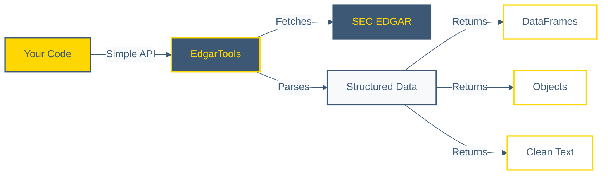
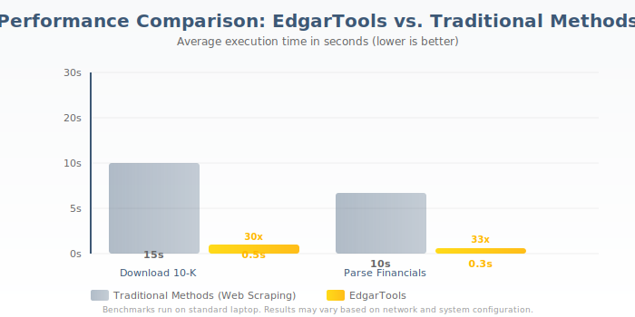

<p align="center">
<a href="https://github.com/dgunning/edgartools">
    
</a>
</p>

<h3 align="center">The AI-Native Python Library for SEC EDGAR Data</h3>

<p align="center">
  <a href="https://pypi.org/project/edgartools"></a>
  <a href="https://github.com/dgunning/edgartools/actions"></a>
  <a href="https://www.codefactor.io/repository/github/dgunning/edgartools"></a>
  <a href="https://github.com/pypa/hatch"></a>
  <a href="https://github.com/dgunning/edgartools/blob/main/LICENSE"></a>
  <a href="https://pypi.org/project/edgartools"></a>
</p>

<p align="center">
  
  
  
  
  
  
</p>

<p align="center">
  <b>The only SEC EDGAR library built from the ground up for AI agents and LLMs. Extract financial data in 3 lines of code instead of 100+. Production-ready MCP server included.</b>
</p>

<p align="center">
  <sub>Built with AI-assisted development • 3-10x faster velocity • <a href="#-support-ai-powered-development">Support this project</a></sub>
</p>


<p align="center">
  
</p>

## Why EdgarTools?

EdgarTools is the **fastest, most powerful open-source library** for SEC EDGAR data extraction. Built for financial analysts, data scientists, and AI developers who need reliable, production-ready access to SEC filings.

<table align="center">
<tr>
  <td align="center" width="33%">
    <br>
    <b>Lightning Fast</b><br>
    10-30x faster than alternatives<br>
    Optimized with lxml & PyArrow
  </td>
  <td align="center" width="33%">
    <br>
    <b>AI Native</b><br>
    Built-in MCP server for Claude<br>
    LLM-optimized text extraction
  </td>
  <td align="center" width="33%">
    <br>
    <b>Production Quality</b><br>
    1000+ tests, type hints<br>
    Battle-tested by analysts
  </td>
</tr>
<tr>
  <td align="center" width="33%">
    <br>
    <b>XBRL Native</b><br>
    Full XBRL standardization<br>
    Cross-company comparisons
  </td>
  <td align="center" width="33%">
    <br>
    <b>Rich Data Objects</b><br>
    Smart parsing for every form<br>
    Pandas-ready DataFrames
  </td>
  <td align="center" width="33%">
    <br>
    <b>Open Source</b><br>
    MIT license, community-driven<br>
    Transparent & auditable
  </td>
</tr>
</table>

<p align="center">
  
</p>

## How It Works

EdgarTools provides a clean abstraction layer over the SEC EDGAR database, handling all the complexity of SEC data access, parsing, and transformation:



<details>
<summary><b>View Detailed Architecture</b></summary>

For a comprehensive view of EdgarTools' internal architecture, see the [Architecture Documentation](docs/architecture-diagram.md).

</details>

<p align="center">
  
</p>

<p align="center">
  
</p>

### Built for AI Agents & LLMs

EdgarTools ships with a **production-ready MCP (Model Context Protocol) server** that enables Claude and other AI assistants to analyze SEC filings directly. No API keys, no rate limits, no costs.

```python
# Start the MCP server for Claude
uv run mcp-server-edgar

# Or install globally
pip install edgartools
mcp-server-edgar
```

Once configured, Claude can:
- Research companies and extract financial metrics
- Analyze filings and answer complex questions
- Track insider transactions and fund holdings
- Compare companies across standardized XBRL data
- Generate reports with accurate SEC data

**AI-Optimized Features:**
- Clean text extraction optimized for LLM context windows
- Markdown conversion preserves document structure
- Section extraction (MD&A, Risk Factors, etc.)
- Chunking support for large documents
- Zero hallucination with direct SEC data access

<p align="center">
  
</p>

<p align="center">
  
</p>

```python
# 1. Install
pip install edgartools

# 2. Set your identity (required by SEC regulations)
from edgar import *
set_identity("your.name@example.com")

# 3. Get company financials in 1 line
balance_sheet = Company("AAPL").get_financials().balance_sheet()

# 4. Or explore any filing
company = Company("MSFT")
filings = company.get_filings(form="10-K")
latest_10k = filings[0]

# 5. Extract clean text for analysis
text = latest_10k.markdown()  # LLM-ready format
```


<p align="center">
  
</p>

<p align="center">
  
</p>

### Comprehensive SEC Data Access

<table>
<tr>
<td width="50%">

**Financial Statements**
- Balance Sheets, Income Statements, Cash Flows
- Individual line items via XBRL tags
- Multi-period comparisons
- Standardized cross-company data
- Automatic unit conversion

**Fund Holdings (13F)**
- Complete 13F filing history
- Portfolio composition analysis
- Position tracking over time
- Ownership percentages
- Value calculations

**Insider Transactions**
- Form 3, 4, 5 structured data
- Transaction history by insider
- Ownership changes
- Grant and exercise details
- Automatic parsing

</td>
<td width="50%">

**Filing Intelligence**
- Any form type (10-K, 10-Q, 8-K, S-1, etc.)
- Complete history since 1994
- Smart data objects for each form
- Automatic HTML to clean text
- Section extraction (Risk Factors, MD&A)

**Performance & Reliability**
- 10-30x faster than alternatives
- Automatic rate limiting
- Smart caching
- Robust error handling
- Type hints throughout

**Developer Experience**
- Intuitive, consistent API
- Pandas DataFrame integration
- Rich terminal output
- Comprehensive documentation
- 1000+ tests

</td>
</tr>
</table>

<p align="center">
  
</p>

<p align="center">
  
</p>

### Performance That Matters

| Operation | EdgarTools | Alternative | Speedup |
|-----------|------------|-------------|---------|
| Download 10-K filing | 0.5s | 5-15s |  **10-30x** |
| Parse financial statements | 0.3s | 3-10s |  **10-30x** |
| Extract XBRL data | 1.2s | 15-45s |  **12-37x** |
| Text extraction & cleaning | 0.4s | 2-8s |  **5-20x** |

Benchmarks run on standard laptop. Alternative = typical web scraping implementation.

<p align="center">
  
</p>

<details>
<summary><b>Why is EdgarTools so fast?</b></summary>

1. **Optimized parsing**: Uses `lxml` for HTML/XML parsing instead of BeautifulSoup
2. **Efficient data structures**: Leverages PyArrow for financial data when available
3. **Smart caching**: Avoids redundant downloads and parsing
4. **Minimal dependencies**: Lean dependency tree reduces overhead
5. **Purpose-built**: Designed specifically for SEC filings, not general web scraping

</details>

<p align="center">
  
</p>

## Comparison with Alternatives

| Feature | EdgarTools | sec-api (paid) | OpenEDGAR | Manual Scraping |
|---------|------------|----------------|-----------|-----------------|
| **AI/MCP Integration** |  |  |  |  |
| **Cost** | Free | $150+/mo | Free | Free |
| **Speed** | 10-30x baseline | Fast (API) | Slow | Slow |
| **XBRL Support** |  Full |  Partial |  |  |
| **Financial Statements** |  Parsed |  Parsed |  Basic |  DIY |
| **LLM-Ready Output** |  |  |  |  |
| **Type Hints** |  |  |  |  |
| **Rate Limiting** |  Auto | N/A (API) |  Manual |  Manual |
| **Open Source** |  MIT |  Proprietary |  Apache | N/A |

<p align="center">
  
</p>

## Real-World Use Cases

### Company Financial Analysis

**Problem:** Need to analyze a company's financial health across multiple periods.


[See full code](docs/examples.md#company_financial_analysis)

<p align="center">
  
</p>

## 💛 Support AI-Powered Development

**EdgarTools is built and maintained solo using AI-assisted development.** Your support directly funds the Claude Max subscription that makes this extraordinary velocity possible.

### The Virtuous Cycle

<table align="center">
<tr>
  <td align="center" width="25%">
    <b>1️⃣ You Support</b><br><br>
    Buy Me A Coffee<br>
    contributions fund<br>
    Claude Max ($200/mo)
  </td>
  <td align="center" width="25%">
    <b>2️⃣ AI Acceleration</b><br><br>
    Specialized agents<br>
    deliver <b>3-10x faster</b><br>
    development
  </td>
  <td align="center" width="25%">
    <b>3️⃣ Rapid Delivery</b><br><br>
    Features in <b>days</b><br>
    instead of weeks<br>
    24 releases / 60 days
  </td>
  <td align="center" width="25%">
    <b>4️⃣ You Benefit</b><br><br>
    More features,<br>
    faster fixes,<br>
    free forever
  </td>
</tr>
</table>

### Real Impact: Last 60 Days

<table align="center">
<tr>
  <td align="center" width="25%">
    <h3>🚀 24</h3>
    <b>Releases</b><br>
    <sub>1 every 2.5 days</sub>
  </td>
  <td align="center" width="25%">
    <h3>⚡ 322</h3>
    <b>Commits</b><br>
    <sub>5.4 per day</sub>
  </td>
  <td align="center" width="25%">
    <h3>🎯 3-10x</h3>
    <b>Velocity</b><br>
    <sub>vs traditional dev</sub>
  </td>
  <td align="center" width="25%">
    <h3>⏱️ Days</h3>
    <b>Not Weeks</b><br>
    <sub>for major features</sub>
  </td>
</tr>
</table>

### Recent Examples

| Feature | Traditional Estimate | With AI | Speedup |
|---------|---------------------|---------|---------|
| XBRL Period Selection | 3-4 weeks | 5 days | **7x faster** |
| MCP Workflow Tools | 2-3 weeks | 2 days | **10x faster** |
| HTML Parsing Rewrite | 2 weeks | 3 days | **4x faster** |
| Standardized Concepts API | 2 weeks | 2-3 days | **5x faster** |

<p align="center">
  <a href="https://www.buymeacoffee.com/edgartools" target="_blank">
    
  </a>
</p>

**What your $5/month enables:**
- ✅ Claude Max subscription (AI agents that write, test, and document code)
- ✅ Continued 3-10x development velocity (features in days, not weeks)
- ✅ Rapid response to SEC format changes and bug reports
- ✅ New features based on community needs
- ✅ Free access for everyone, forever (no API keys, no rate limits)

**Alternative ways to support:**
- ⭐ Star the repo on GitHub
- 🐛 Report bugs and contribute fixes
- 📖 Improve documentation
- 💬 Answer questions in Discussions
- 🔗 Share EdgarTools with colleagues

**Corporate users**: If your organization depends on EdgarTools for SEC compliance or regulatory reporting, [learn about Strategic Sponsorship options](https://github.com/sponsors/dgunning) designed for mission-critical dependencies.

<p align="center">
  
</p>

<p align="center">
  
</p>

### Documentation & Resources

- [User Journeys / Examples](https://edgartools.readthedocs.io/en/latest/examples/)
- [Quick Guide](https://edgartools.readthedocs.io/en/latest/quick-guide/)
- [Full API Documentation](https://edgartools.readthedocs.io/)
- [EdgarTools Blog](https://www.edgartools.io)

### Get Help & Connect

- [GitHub Issues](https://github.com/dgunning/edgartools/issues) - Bug reports and feature requests
- [Discussions](https://github.com/dgunning/edgartools/discussions) - Questions and community discussions

### Contributing

We welcome contributions from the community! Here's how you can help:

- **Code**: Fix bugs, add features, improve documentation
- **Examples**: Share interesting use cases and examples
- **Feedback**: Report issues or suggest improvements
- **Spread the Word**: Star the repo, share with colleagues

See our [Contributing Guide](CONTRIBUTING.md) for details.

---

<p align="center">
EdgarTools is distributed under the <a href="LICENSE">MIT License</a>
</p>

## Star History

[](https://star-history.com/#dgunning/edgartools&Timeline)
