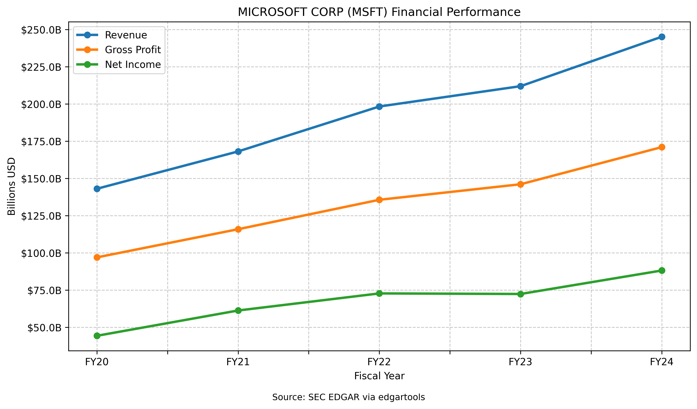

<p align="center">
<a href="https://github.com/dgunning/edgartools">
    
</a>
</p>

<h3 align="center">Unlock SEC data in seconds, not hours</h3>

<p align="center">
  <a href="https://pypi.org/project/edgartools"></a>
  <a href="https://github.com/dgunning/edgartools/actions"></a>
  <a href="https://www.codefactor.io/repository/github/dgunning/edgartools"></a>
  <a href="https://github.com/pypa/hatch"></a>
  <a href="https://github.com/dgunning/edgartools/blob/main/LICENSE"></a>
  <a href="https://pypi.org/project/edgartools"></a>
</p>

<p align="center">
  <b>Extract financial data from SEC filings in 3 lines of code instead of 100+</b>
</p>

<!-- MEDIA PLACEHOLDER: Hero Video Demo (30-second overview of key capabilities) -->

## Why Financial Professionals Choose EdgarTools


| Without EdgarTools | With EdgarTools |
|---|---|
| ❌ Hours spent navigating SEC.gov | ✅ Instant access to any filing since 1994 |
| ❌ Complex web scraping code | ✅ Clean Python API with intuitive methods |
| ❌ Manual extraction of financial data | ✅ Automatic parsing into pandas DataFrames |
| ❌ Custom code for each filing type | ✅ Specialized data objects for each form type |
| ❌ Messy HTML parsing for text extraction | ✅ One-line conversion to clean, readable text |
| ❌ Extra processing for AI/LLM compatibility | ✅ LLM-ready text extraction for AI pipelines |
| ❌ Rate limiting headaches | ✅ Automatic throttling to avoid blocks |


```python
# Get Apple's latest annual report and extract the balance sheet in 3 lines:
from edgar import *

filing = Company("AAPL").latest("10-K")      # Get the latest 10-K
xb = filing.xbrl()                           # Create the data object
balance_sheet = xb.statements.balance_sheet  # Extract the balance sheet
```


## 📦 Installation

```bash
pip install edgartools
```

## 🚀 Quick Start (2-minute tutorial)

```python
# 1. Import the library
from edgar import *

# 2. Tell the SEC who you are (required by SEC regulations)
set_identity("your.name@example.com")  # Replace with your email

# 3. Find a company
company = Company("MSFT")  # Microsoft

# 4. Get recent filings
filings = company.get_filings().latest(5)  # Get the latest 5 filings
filings
```

## 🔍 Key Features

- **Comprehensive Coverage**: Access any SEC filing since 1994
- **Intuitive API**: Simple, consistent interface for all SEC data
- **Smart Data Objects**: Automatic parsing of filings into structured objects
- **Clean Text Extraction**: One-line conversion from HTML to clean, readable text
- **AI/LLM Ready**: Text formatting and chunking optimized for AI pipelines
- **Financial Statements**: Extract balance sheets, income statements, and cash flows
- **Performance Optimized**: Uses PyArrow for efficient data handling
- **Beautiful Output**: Rich terminal displays and visualization helpers
- **Insider Transactions**: Track Form 3, 4, and 5 filings
- **Investment Funds**: Analyze fund structures, classes, and holdings
- **XBRL Support**: Extract and analyze XBRL-tagged data
- **Automatic Throttling**: Respectful of SEC.gov rate limits

## 🧭 User Journeys: Solve Real Problems

<details>
<summary><H3>1. Company Financial Analysis</H3> - Analyze a company's financial health across multiple periods</summary>

**Problem:** Need to analyze a company's financial health across multiple periods.

```python
def plot_revenue(ticker:str):
    c = Company(ticker)
    filings = c.get_filings(form="10-K").latest(5)
    xbs = XBRLS.from_filings(filings)
    income_statement = xbs.statements.income_statement()
    income_df = income_statement.to_dataframe()
    
    # Extract financial metrics
    net_income = income_df[income_df.concept == "us-gaap_NetIncomeLoss"][income_statement.periods].iloc[0]
    gross_profit = income_df[income_df.concept == "us-gaap_GrossProfit"][income_statement.periods].iloc[0]
    revenue = income_df[income_df.label == "Revenue"][income_statement.periods].iloc[0]
    
    # Convert periods to fiscal years for better readability
    periods = [pd.to_datetime(period).strftime('FY%y') for period in income_statement.periods]
    
    # Reverse the order so most recent years are last (oldest to newest)
    periods = periods[::-1]
    revenue_values = revenue.values[::-1]
    gross_profit_values = gross_profit.values[::-1]
    net_income_values = net_income.values[::-1]
    
    # Create a DataFrame for plotting
    plot_data = pd.DataFrame({
        'Revenue': revenue_values,
        'Gross Profit': gross_profit_values,
        'Net Income': net_income_values
    }, index=periods)
    
    # Convert to billions for better readability
    plot_data = plot_data / 1e9
    
    # Create the figure
    fig, ax = plt.subplots(figsize=(10, 6))
    
    # Plot the data as lines with markers
    plot_data.plot(kind='line', marker='o', ax=ax, linewidth=2.5)
    
    # Format the y-axis to show billions with 1 decimal place
    ax.yaxis.set_major_formatter(mtick.FuncFormatter(lambda x, _: f'${x:.1f}B'))
    
    # Add labels and title
    ax.set_xlabel('Fiscal Year')
    ax.set_ylabel('Billions USD')
    ax.set_title(f'{c.name} ({ticker}) Financial Performance')
    
    # Add a grid for better readability
    ax.grid(True, linestyle='--', alpha=0.7)
    
    # Add a source note
    plt.figtext(0.5, 0.01, 'Source: SEC EDGAR via edgartools', ha='center', fontsize=9)
    
    # Improve layout
    plt.tight_layout(rect=[0, 0.03, 1, 0.97])
    
    return fig
```


</details>


## 📊 Data Objects

EdgarTools automatically converts filings into specialized data objects based on form type:

| Form | Data Object | Description |
|------|-------------|-------------|
| 10-K | `TenK` | Annual reports with financials, business description, risk factors |
| 10-Q | `TenQ` | Quarterly reports with financials |
| 8-K | `EightK` | Current reports for material events |
| 13F-HR | `ThirteenF` | Investment manager holdings |
| 3, 4, 5 | `Form3`, `Form4`, `Form5` | Insider ownership and transactions |
| NPORT-P | `FundReport` | Fund portfolio reports |

```python
from edgar import find, obj

# Get a filing by accession number
filing = find("0001326801-23-000006")  # Tesla 10-K

# Convert to appropriate data object
data_object = obj(filing)  # Returns a TenK object

# Access specialized properties
print(f"Filing Type: {type(data_object).__name__}")
print(f"Risk Factors: {len(data_object.risk_factors)} characters")
print(f"Business Description: {len(data_object.business_description)} characters")
```

## 🛠️ Advanced Usage

### Bulk Data Downloads

For faster processing or offline use, download bulk data:

```python
from edgar import download_edgar_data, use_local_storage

# Download all company data (one-time operation)
download_edgar_data()

# Use local data for all subsequent operations
use_local_storage()
```


## 📚 Documentation

- [Full API Documentation](https://edgartools.readthedocs.io/)
- [User Guides](https://edgartools.readthedocs.io/en/latest/guides/)
- [Examples Gallery](https://edgartools.readthedocs.io/en/latest/examples/)
- [Blog & Tutorials](https://www.edgartools.io)

## 👥 Community & Support

- [GitHub Issues](https://github.com/dgunning/edgartools/issues) - Bug reports and feature requests
- [Discussions](https://github.com/dgunning/edgartools/discussions) - Questions and community discussions
- [Stack Overflow](https://stackoverflow.com/questions/tagged/edgartools) - Technical Q&A

## 🔮 Roadmap

- **Coming Soon**: Enhanced visualization tools for financial data
- **In Development**: Machine learning integrations for financial sentiment analysis
- **Planned**: Interactive dashboard for filing exploration

## 🤝 Contributing

We welcome contributions from the community! Here's how you can help:

- **Code**: Fix bugs, add features, improve documentation
- **Examples**: Share interesting use cases and examples
- **Feedback**: Report issues or suggest improvements
- **Spread the Word**: Star the repo, share with colleagues

See our [Contributing Guide](CONTRIBUTING.md) for details.

## ❤️ Sponsors & Support

If you find EdgarTools valuable, please consider supporting its development:

<a href="https://buy.polar.sh/polar_cl_4URWus0XT8CtHrbOEP4FfDTAbVFkp0RiZqgwd1tNIdg" data-polar-checkout data-polar-checkout-theme="dark">**Donate to EdgarTools**</a>

## 📜 License

EdgarTools is distributed under the [MIT License](LICENSE).

## 📊 Star History

[](https://star-history.com/#dgunning/edgartools&Timeline)