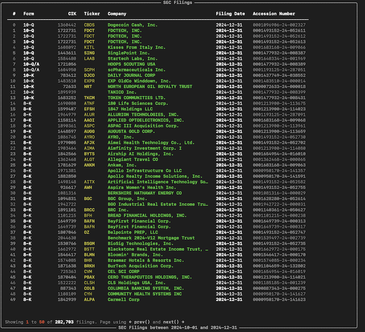
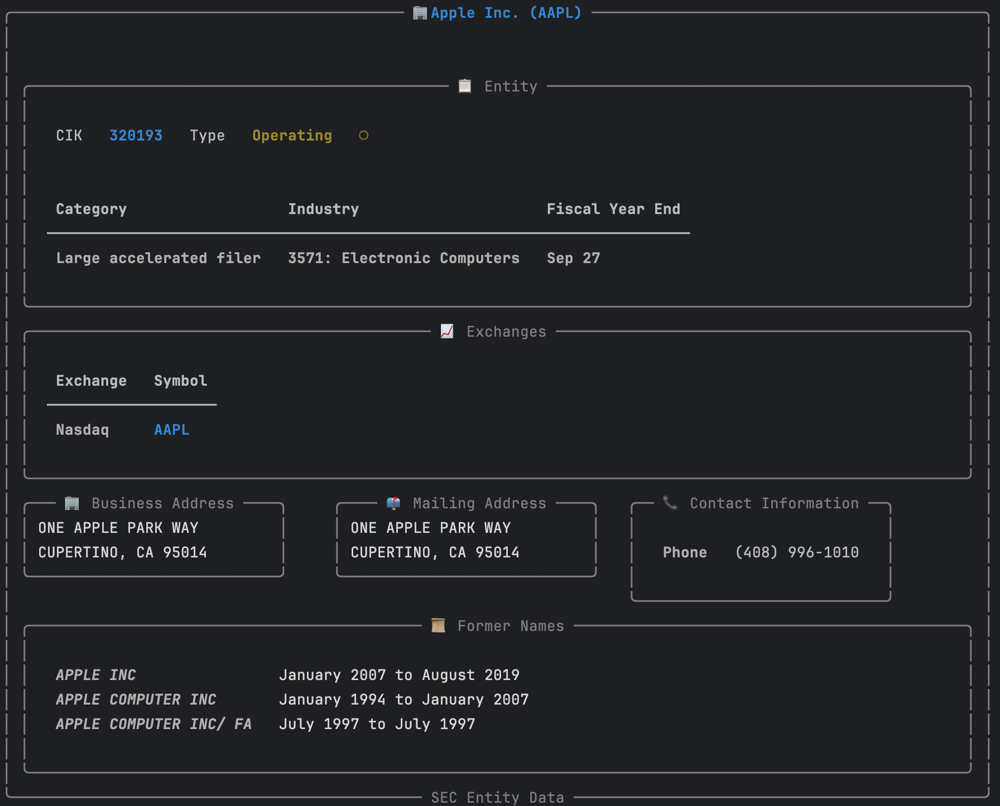
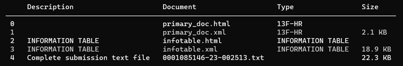
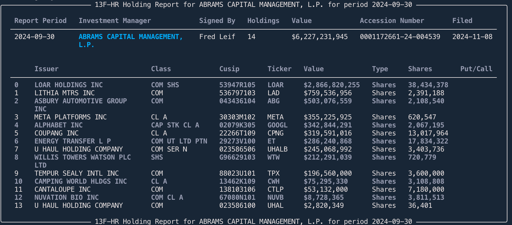
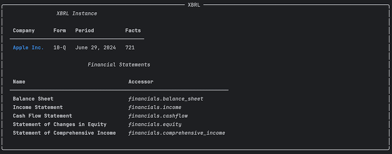

<!-- align a paragraph to the center -->
<p align="center">
<a href="https://github.com/dgunning/edgartools">
    
</a>
</p>
<p align="center">The world's easiest, most powerful edgar library</p>

[](https://pypi.org/project/edgartools)


[](https://www.codefactor.io/repository/github/dgunning/edgartools)
[](https://github.com/pypa/hatch)

-----

<p align="center">
<a href="https://github.com/dgunning/edgartools">
    
</a>
</p>

# Why edgartools?
📊 Access company financials, insider trades, and SEC filings instantly with Python's most powerful EDGAR data library. 🚀 Easy to use, fast results.

# Features
- 📁 **Access any SEC filing**: You can access any SEC filing since 1994.
- 💰 **Company Financials**: Comprehensive company financials from 10-K and 10-Q filings
- 👤 **Insider Transactions**: Search for and get insider transactions
- 📅 **List filings for any date range**: List filings for **year, quarter** e.g. or date range `2024-02-29:2024-03-15`
- 🌟 **Best looking edgar library**: Uses **[rich](https://rich.readthedocs.io/en/stable/introduction.html)** library to display SEC Edgar data in a beautiful way.
- 🧠 **Intuitive and easy to use**: **edgartools** has a super simple API that is easy to use.
- ��️ **Works as a library or a CLI**: You can use edgartools as a library in your code or as a CLI tool.
- 🔄 **Page through filings**: Use `filings.next()` and `filings.previous()` to page through filings
- 🏗️ **Build Data Pipelines**: Build data pipelines by finding, filtering, transforming and saving filings
- ✅ **Select a filing**: You can select a filing from the list of filings.
- 📄 **View the filing as HTML or text**: Find a filing then get the content as HTML or text.
- 🔢 **Chunk filing text**: You can chunk the filing text into sections for vector embedding.
- 🔍 **Preview the filing**: You can preview the filing in the terminal or a notebook.
- 🔎 **Search through a filing**: You can search through a filing for a keyword.
- 📊 **Parse XBRL**: Extract XBRL data into intuitive data structures.
- 💾 **Data Objects**: Automatically downloads and parses filings into data objects.
- 📥 **Download any attachment**: You can download any attachment from the filing.
- 🕒 **Automatic throttling**: Automatically throttles requests to Edgar to avoid being blocked.
- 📥 **Bulk downloads**: Faster batch processing through bulk downloads of filings and facts
- 🔢 **Get company by Ticker or Cik**: Get a company by ticker `Company("SNOW")` or cik `Company(1640147)`
-  **Get company filings**: You can get all the company's historical filings using `company.get_filings()`
- 📈 **Get company facts**: You can get company facts using `company.get_facts()`
- 🔍 **Lookup Ticker by CUSIP**: You can lookup a ticker by CUSIP
- 📑 **Dataset of SEC entities**: You can get a dataset of SEC companies and persons
- 📈 **Fund Reports**: Search for and get 13F-HR fund reports
- 🛠️ **Works as a library or a CLI**: You can use edgartools as a library in your code or as a CLI tool.


# Getting started

## Installing
```bash
pip install edgartools
```


## Usage

### Importing and setting your identity

To get started import the library using `from edgar import *` then set your identity using `set_identity()`

```python
# 1. Import the necessary functions from edgartools
from edgar import *

# 2. Tell the SEC who you are
set_identity("mike@indigo.com")

# 3. Start using the library
filings = get_filings()
```



After getting filings you can select a single filing and view its attachments


## [Using the Filing API](https://github.com/dgunning/edgartools/wiki/WorkingWithFilings)
Use the Filing API when you are not working with a specific company, but want to get a list of filings.

For details on how to use the Filing API see **[Using the Filing API](https://github.com/dgunning/edgartools/wiki/WorkingWithFilings)**

## [Using the Company API](https://github.com/dgunning/edgartools/wiki/WorkingWithCompanies)

You can use the company ticker or CIK to get a company.

```python
c = Company("AAPL") # or Company("0000320193") or Company(320193)
```


With the Company API you can find a company by ticker or CIK, and get the company's filings, facts and financials.

```python
Company("AAPL")
        .latest("10-Q")
        .obj()
```


See **[Using the Company API](https://github.com/dgunning/edgartools/wiki/WorkingWithCompanies)**

## Viewing and downloading attachments

Every filing has a list of attachments. You can view the attachments using `filing.attachments`

```python
# View the attachments
filing.attachments
```



You can access each attachment using the bracket operator `[]` and the index of the attachment.
    
```python
# Get the first attachment
attachment = filing.attachments[0]
```


You can download the attachment using `attachment.download()`. This will download the attachment to string or bytes in memory. 

## Data Objects

Now the reason you may want to download attachments is to get information contained in data files.
For example, **13F-HR** filings have attached infotable.xml files containing data from the holding report for that filing.

Fortunately, the library handles this for you. If you call `filing.obj()` it will automatically download and parse the data files
into a data object, for several different form types. Currently, the following forms are supported:

| Form                       | Data Object                  | Description                           |
|----------------------------|------------------------------|---------------------------------------|
| 10-K                       | `TenK`                       | Annual report                         |
| 10-Q                       | `TenQ`                       | Quarterly report                      |
| 8-K                        | `EightK`                     | Current report                        |
| MA-I                       | `MunicipalAdvisorForm`       | Municipal advisor initial filing      |
| Form 144                   | `Form144`                    | Notice of proposed sale of securities |
| C, C-U, C-AR, C-TR         | `FormC`                      | Form C Crowdfunding Offering          |
| D                          | `FormD`                      | Form D Offering                       |
| 3,4,5                      | `Ownership`                  | Ownership reports                     |
| 13F-HR                     | `ThirteenF`                  | 13F Holdings Report                   |
| NPORT-P                    | `FundReport`                 | Fund Report                           |
| EFFECT                     | `Effect`                     | Notice of Effectiveness               |
| Any other filing with XBRL | `XBRLData` or `XBRLInstance` | Container for XBRL data               |

For example, to get the data object for a **13F-HR** filing you can do the following:

```python
filings = get_filings(form="13F-HR")
filing = filings[0]
thirteenf = filing.obj()
```



If you call `obj()` on a filing that does not have a data file, then it will return `None`.


## Working with XBRL filings

Some filings are in **XBRL (eXtensible Business Markup Language)** format. 
These are mainly the newer filings, as the SEC has started requiring this for newer filings.

If a filing is in XBRL format then it opens up a lot more ways to get structured data about that specific filing and also 
about the company referred to in that filing.

The `Filing` class has an `xbrl` function that will download, parse and structure the filing's XBRL document if one exists.
If it does not exist, then `filing.xbrl()` will return `None`.

The function `filing.xbrl()` returns an `XBRLData` instance if the XBRL files contain presentation information or `XBRLInstance` if it a simple instance document with just the facts.
For more details see **[Parsing XBRL](https://github.com/dgunning/edgartools/wiki/ParsingXBRL)**

```python
filing_xbrl = filing.xbrl()
```



## Financials

Some filings, notably **10-K** and **10-Q** filings contain financial statements in XBRL format. 
You can get the financials from the XBRL data using the `Financials` class.

The Company object has a `financials` property that will return the financials for the company.
```python
from edgar.financials import Financials

company = Company("AAPL")
financials = company.financials

```
You can also get the financials through the `Tenk` and `TenQ` data objects.

Here is an example that gets the latest Apple financials

```python
tenk = Company("AAPL").get_filings(form="10-K").latest(1).obj()

financials = tenk.financials

financials.get_balance_sheet()                     # or financials.balance_sheet
financials.get_income_statement()                  # or financials.income
financials.get_cash_flow_statement()               # or financials.cashflow
financials.get_statement_of_changes_in_equity()    # or financials.equity
financials.get_statement_of_comprehensive_income() # or financials.comprehensive_income
```


### Get the financial data as a pandas dataframe

Each of the financial statements - `BalanceSheet`, `IncomeStatement` and `CashFlowStatement` - have a `get_dataframe()` method that will return the data as a pandas dataframe.

```python
balance_sheet_df = financials.get_balance_sheet().get_dataframe()
```


## TenK (10-K) Data Object

For 10-K filngs the 10-K Data Object allows you to access almost any data related to the filing - both text and financial data.

```python
c = Company("ORCL")
filing = c.get_filings(form="10-K").latest()
tenk = filing.obj()
```

You can also get it directly using the property `latest_tenk` on the `Company` object.

```python
c = Company("ORCL")
c.latest_tenk
```


### Getting 10-K Items

You can get the text of individual sections of the 10-K filing using tge bracket `[]` operator.

```python
tenk['Item 1']
```

There are also a few convenience methods to get the most common sections.

```python
# Get Item 1 - Business
tenk.business

# Get Item 1A - Risk Factors
tenk.risk_factors

# Get Item 7 - Management's Discussion and Analysis
tenk.management_discussion

# Get Item 10 - Directors, Officers and Corporate Governance
tenk.directors_officers_and_governance
```


## Downloading Edgar Data

The library is designed to make real time calls to EDGAR to get the latest data. However, you may want to download data for offline use or to build a dataset.

### Download Bulk Company Data
You can download all the company **filings** and **facts** from Edgar using the `download_edgar_data` function.
Note that this will store json files for each company of their facts and submissions, but it will not include the actual HTML or other attachments.
It will however dramatically speed up loading companies by cik or ticker.

The submissions and facts bulk data files are each over 1.GB in size, and take around a few minutes each.
The data is stored by default in the `~/.edgar` directory. You can change this by setting the `EDGAR_LOCAL_DATA_DIR` environment variable.


```python
def download_edgar_data(submissions: bool = True, facts: bool = True, reference: bool = True):
    """
    Download all the company data from Edgar
    :param submissions: Download all the company submissions
    :param facts: Download all the company facts
    :param reference: Download reference data
    """
download_edgar_data()

```
### Using Bulk Data
If you want edgartools to use the bulk data files you can call `use_local_storage()` before you start making calls using the library.
Alternatively, set `EDGAR_USE_LOCAL_DATA` to `True` in your environment.

### Downsides of using bulk data
- The filings downloaded for each company is limited to the last 1000
- You will need to download the latest data every so often to keep it up to date.

## Downloading Attachments

You can download attachments from a filing using the `download` method on the attachments. This will download all the attached files to a folder of your choice.

```python
class Attachments:
    
    def download(self, path: Union[str, Path], archive: bool = False):
        """
        Download all the attachments to a specified path.
        If the path is a directory, the file is saved with its original name in that directory.
        If the path is a file, the file is saved with the given path name.
        If archive is True, the attachments are saved in a zip file.
        path: str or Path - The path to save the attachments
        archive: bool (default False) - If True, save the attachments in a zip file
        """ 
        ...
        
# Usage
filing.attachments.download(path)
```

# Contributing

A big welcome and thank you to all contributors! 🎉

There are many ways to contribute to this project. Here are a few:
- **Report bugs**: If you find a bug, please open an issue.
- **Fix bugs**: If you can fix a bug, please open a pull request.
- **Add features**: If you have an idea for a feature, please open a pull request.
- **Improve the documentation**: If you see something that could be improved, please open a pull request.
- **Write tutorials**: If you have a good understanding of how to use the library, please write a tutorial.
- **Write tests**: If you can write tests, please write tests for the library.
- **Expertise**: If you have expertise in SEC filings, XBRL, company finance contact me.
- **Star the project**: If you like the project, please star it on GitHub.

## Donations

If you find this library useful, please consider making a donation to support its development.

Your contribution helps support:
- Ongoing development and maintenance
- Bug fixes and performance improvements
- New features to make SEC filing analysis even easier
- Documentation updates and examples
- Community support and issue resolution

<a href="https://buy.polar.sh/polar_cl_4URWus0XT8CtHrbOEP4FfDTAbVFkp0RiZqgwd1tNIdg" data-polar-checkout data-polar-checkout-theme="dark">**Donate to edgartools**</a>

## Reporting Issues
We use GitHub issues to track public bugs. 
Report a bug by [opening a new issue](https://github.com/dgunning/edgartools/issues); it's that easy!

## Making code changes
- Fork the repo and create your branch from master.
- If you've added code that should be tested, add tests.
- If you've changed APIs, update the documentation.
- Ensure the test suite passes.
- Make sure your code lints.
- Issue that pull request!


# License

`edgartools` is distributed under the terms of the [MIT](https://spdx.org/licenses/MIT.html) license.

## Contact

- **[Project Documentation](https://edgartools.readthedocs.io/)**
- **[Edgartools Blog](https://www.edgartools.io)**
- **[Dwight Gunning on LinkedIn](https://www.linkedin.com/in/dwight-gunning-860124/)**

## Star History

[](https://star-history.com/#dgunning/edgartools&Timeline)

