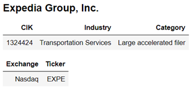

# edgar

[](https://pypi.org/project/edgar)
[](https://pypi.org/project/edgar)

-----

**Table of Contents**

- [Installation](#installation)
- [License](#license)

## Installation

```console
pip install edgar
```

## Usage

## Filing API

```python
filings = get_filings(2021)
```

## Company API

With the company API you find a company using the **cik** or **ticker**. 
From the company you can access all their historical **filings**,
and a dataset of the company **facts**.
The SEC's company API also supplies a lot more details about a company including industry, the SEC filer type,
the mailing and business address and much more.

### Find a company using the cik
The **cik** is the id that uniquely identifies a company at the SEC.
It is a number, but is sometimes shown in SEC Edgar resources as a string padded with leading zero's.
For the edgar client API, just use the numbers and omit the leading zeroes.

```python
company = Company.for_cik(1318605)
```



### Find a company using ticker

You can get a company using a ticker e.g. **SNOW**. This will do a lookup for the company cik using the ticker, then load the company using the cik.
This makes it two calls versus one for the cik company lookup, but is sometimes more convenient since tickers are easier to remember that ciks.

Note that some companies have multiple tickers, so you technically cannot get SEC filings for a ticker.
You instead get the SEC filings for the company to which the ticker belongs.

The ticker is case-insensitive so you can use `Company.for_ticker("snow")`
or `Company.for_ticker("SNOW")`
```python
snow = Company.for_ticker("snow")
```


### 


```python
Company.for_cik(1832950)
```

### Get company filings
To get the company's filings use `get_filings()`. This gets all the company's filings, unless you apply filters.
```python
company.get_filings()
```

### Get company facts


## License

`edgar` is distributed under the terms of the [MIT](https://spdx.org/licenses/MIT.html) license.
