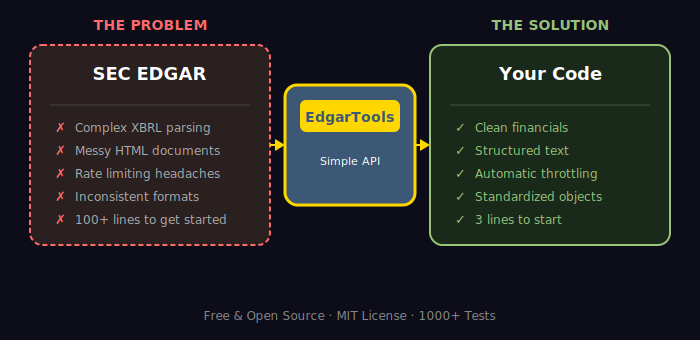
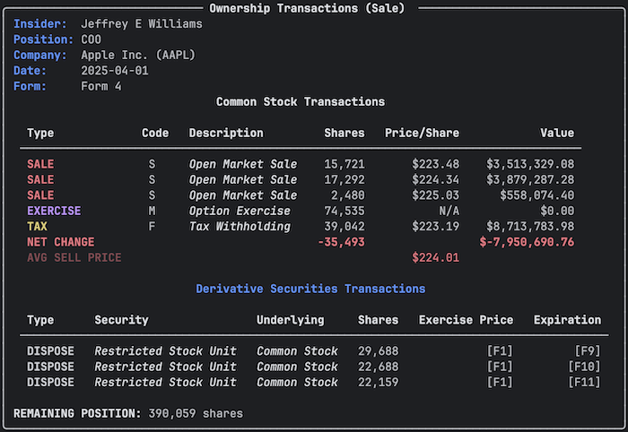

<p align="center">
<a href="https://github.com/dgunning/edgartools">
    
</a>
</p>

<h1 align="center">EdgarTools - Python Library for SEC EDGAR Filings</h1>
<h3 align="center">The AI Native Python library for SEC EDGAR Data</h3>

<p align="center">
  <a href="https://pypi.org/project/edgartools"></a>
  <a href="https://github.com/dgunning/edgartools/actions"></a>
  <a href="https://www.codefactor.io/repository/github/dgunning/edgartools"></a>
  <a href="https://github.com/pypa/hatch"></a>
  <a href="https://github.com/dgunning/edgartools/blob/main/LICENSE"></a>
  <a href="https://pypi.org/project/edgartools"></a>
</p>

<p align="center">
  
  
  
  
  
  
</p>

<p align="center">
  <b>The only SEC EDGAR library built from the ground up for AI agents and LLMs. Extract financial data in 3 lines of code instead of 100+. Production-ready MCP server included.</b>
</p>

<p align="center">
  <sub>Built with AI-assisted development • 3-10x faster velocity • <a href="#-support-ai-powered-development">Support this project</a></sub>
</p>

**EdgarTools** is a Python library for downloading and analyzing SEC EDGAR filings. Extract 10-K, 10-Q, 8-K reports, parse XBRL financial statements, and access insider trading data (Form 4) with a simple Python API. Free and open-source.


<p align="center">
  
</p>

## Why EdgarTools?

EdgarTools is the **fastest, most powerful open-source library** for SEC EDGAR data extraction. Built for financial analysts, data scientists, and AI developers who need reliable, production-ready access to SEC filings.

<table align="center">
<tr>
  <td align="center" width="33%">
    <br>
    <b>Lightning Fast</b><br>
    10-30x faster than alternatives<br>
    Optimized with lxml & PyArrow
  </td>
  <td align="center" width="33%">
    <br>
    <b>AI Native</b><br>
    Built-in MCP server for Claude<br>
    LLM-optimized text extraction
  </td>
  <td align="center" width="33%">
    <br>
    <b>Production Quality</b><br>
    1000+ tests, type hints<br>
    Battle-tested by analysts
  </td>
</tr>
<tr>
  <td align="center" width="33%">
    <br>
    <b>XBRL Native</b><br>
    Full XBRL standardization<br>
    Cross-company comparisons
  </td>
  <td align="center" width="33%">
    <br>
    <b>Rich Data Objects</b><br>
    Smart parsing for every form<br>
    Pandas-ready DataFrames
  </td>
  <td align="center" width="33%">
    <br>
    <b>Open Source</b><br>
    MIT license, community-driven<br>
    Transparent & auditable
  </td>
</tr>
</table>

<p align="center">
  
</p>

## How It Works

<p align="center">
  
</p>

<p align="center">
  
</p>

<p align="center">
  
</p>

```python
# Install the SEC EDGAR Python library
pip install edgartools

# Set your identity (required by SEC regulations)
from edgar import *
set_identity("your.name@example.com")

# Get SEC 10-K, 10-Q filings and XBRL financial statements
balance_sheet = Company("AAPL").get_financials().balance_sheet()

# Access any company's SEC filings
company = Company("MSFT")

# Parse Form 4 insider trading transactions
filings = company.get_filings(form="4")
form4_filing = filings[0]
form4 = form4_filing.obj()
```



<p align="center">
  
</p>

<p align="center">
  
</p>

### Comprehensive SEC Data Access

<table>
<tr>
<td width="50%" valign="top">

**Financial Statements (XBRL)**
- Balance Sheets, Income Statements, Cash Flows
- Individual line items via XBRL tags
- Multi-period comparisons with comparative periods
- Standardized cross-company data
- Automatic unit conversion
- Metadata columns (dimensions, members, units)
- Complete dimensional data support

**Fund Holdings (13F)**
- Complete 13F filing history
- Portfolio composition analysis
- Position tracking over time
- Ownership percentages
- Value calculations

**Company Dataset & Reference Data**
- Industry and state filtering
- Company subsets with metadata
- Standardized industry classifications
- SEC ticker/CIK lookups
- Exchange information

**Insider Transactions**
- Form 3, 4, 5 structured data
- Transaction history by insider
- Ownership changes
- Grant and exercise details
- Automatic parsing

</td>
<td width="50%" valign="top">

**Filing Intelligence**
- Any form type (10-K, 10-Q, 8-K, S-1, etc.)
- Complete history since 1994
- Smart data objects for each form
- Automatic HTML to clean text
- Section extraction (Risk Factors, MD&A)

**Performance & Reliability**
- 10-30x faster than alternatives
- Configurable rate limiting (enterprise mirrors supported)
- Custom SEC data sources (corporate/academic mirrors)
- Smart caching (30-second fresh filing cache)
- Robust error handling
- SSL verification with fail-fast retry
- Type hints throughout
- [Enterprise configuration →](docs/configuration.md#enterprise-configuration)

**Developer Experience**
- Intuitive, consistent API
- Pandas DataFrame integration
- Rich terminal output
- Comprehensive documentation
- 1000+ tests

</td>
</tr>
</table>

EdgarTools supports all SEC form types including **10-K annual reports**, **10-Q quarterly filings**, **8-K current reports**, **13F institutional holdings**, **Form 4 insider transactions**, **proxy statements (DEF 14A)**, and **S-1 registration statements**. Parse XBRL financial data, extract text sections, and convert filings to pandas DataFrames.

<p align="center">
  
</p>

## Comparison with Alternatives

| Feature | EdgarTools | sec-api (paid) | OpenEDGAR | Manual Scraping |
|---------|------------|----------------|-----------|-----------------|
| **AI/MCP Integration** |  |  |  |  |
| **Cost** | Free | $150+/mo | Free | Free |
| **Speed** | 10-30x baseline | Fast (API) | Slow | Slow |
| **XBRL Support** |  Full |  Partial |  |  |
| **Financial Statements** |  Parsed |  Parsed |  Basic |  DIY |
| **LLM-Ready Output** |  |  |  |  |
| **Type Hints** |  |  |  |  |
| **Rate Limiting** |  Auto | N/A (API) |  Manual |  Manual |
| **Open Source** |  MIT |  Proprietary |  Apache | N/A |

<p align="center">
  
</p>

<p align="center">
  
</p>

### Use EdgarTools with Claude Code & Claude Desktop

EdgarTools provides **AI Skills** that enable Claude and other AI assistants to perform sophisticated SEC filing analysis. Once configured, you can ask Claude questions like:

- *"Compare Apple and Microsoft's revenue growth rates over the past 3 years"*
- *"Which Tesla executives sold more than $1 million in stock in the past 6 months?"*
- *"Find all technology companies that filed proxy statements with executive compensation changes"*

Claude will write the Python code, execute it, and explain the results - all powered by EdgarTools.

<details>
<summary><b>Setup Instructions</b></summary>

### Option 1: AI Skills (Recommended)

Install the EdgarTools skill for Claude Code or Claude Desktop:

```bash
pip install "edgartools[ai]"
python -c "from edgar.ai import install_skill; install_skill()"
```

This adds SEC analysis capabilities to Claude, including 3,450+ lines of API documentation, code examples, and form type reference.

### Option 2: MCP Server

Run EdgarTools as an MCP server for Claude Code or Claude Desktop:

```bash
pip install "edgartools[ai]"
python -m edgar.ai
```

Add to Claude Desktop config (`~/Library/Application Support/Claude/claude_desktop_config.json`):

```json
{
  "mcpServers": {
    "edgartools": {
      "command": "python",
      "args": ["-m", "edgar.ai"],
      "env": {
        "EDGAR_IDENTITY": "Your Name your.email@example.com"
      }
    }
  }
}
```

See [AI Integration Guide](docs/ai-integration.md) for complete documentation.

</details>

<p align="center">
  
</p>

##  Support AI Powered Development

**I build and maintain EdgarTools solo using AI-assisted development.** Your support directly funds the Claude Max subscription that makes this extraordinary velocity possible.

### The Virtuous Cycle

<table align="center">
<tr>
  <td align="center" width="25%" valign="top">
    <br>
    <b>You Support</b><br><br>
    Buy Me A Coffee<br>
    contributions fund<br>
    Claude Max
  </td>
  <td align="center" width="25%" valign="top">
    <br>
    <b>AI Acceleration</b><br><br>
    Specialized agents<br>
    deliver <b>3-10x faster</b><br>
    development
  </td>
  <td align="center" width="25%" valign="top">
    <br>
    <b>Rapid Delivery</b><br><br>
    Features in <b>days</b><br>
    instead of weeks<br>
    24 releases / 60 days
  </td>
  <td align="center" width="25%" valign="top">
    <br>
    <b>You Benefit</b><br><br>
    More features,<br>
    faster fixes,<br>
    free forever
  </td>
</tr>
</table>

### Real Impact: Last 60 Days

<table align="center">
<tr>
  <td align="center" width="25%" valign="top">
    <br>
    <h3>24</h3>
    <b>Releases</b><br>
    <sub>1 every 2.5 days</sub>
  </td>
  <td align="center" width="25%" valign="top">
    <br>
    <h3>322</h3>
    <b>Commits</b><br>
    <sub>5.4 per day</sub>
  </td>
  <td align="center" width="25%" valign="top">
    <br>
    <h3>3-10x</h3>
    <b>Velocity</b><br>
    <sub>vs traditional dev</sub>
  </td>
  <td align="center" width="25%" valign="top">
    <br>
    <h3>Days</h3>
    <b>Not Weeks</b><br>
    <sub>for major features</sub>
  </td>
</tr>
</table>

### Recent Examples

| Feature | Traditional Estimate | With AI | Speedup |
|---------|---------------------|---------|---------|
| XBRL Period Selection | 3-4 weeks | 5 days | **7x faster** |
| MCP Workflow Tools | 2-3 weeks | 2 days | **10x faster** |
| HTML Parsing Rewrite | 2 weeks | 3 days | **4x faster** |
| Standardized Concepts API | 2 weeks | 2-3 days | **5x faster** |

<p align="center">
  <a href="https://github.com/sponsors/dgunning" target="_blank">
    
  </a>
  &nbsp;&nbsp;
  <a href="https://www.buymeacoffee.com/edgartools" target="_blank">
    
  </a>
</p>

**What your support enables:**
-  Claude Max subscription (AI agents that write, test, and document code)
-  Continued 3-10x development velocity (features in days, not weeks)
-  Rapid response to SEC format changes and bug reports
-  New features based on community needs
-  Free access for everyone, forever (no API keys, no rate limits)

**Alternative ways to support:**
-  Star the repo on GitHub
-  Report bugs and contribute fixes
-  Improve documentation
-  Answer questions in Discussions
-  Share EdgarTools with colleagues

**Corporate users**: If your organization depends on EdgarTools for SEC compliance or regulatory reporting, [GitHub Sponsors](https://github.com/sponsors/dgunning) offers strategic sponsorship options designed for mission-critical dependencies.

<p align="center">
  
</p>

<p align="center">
  
</p>

### Documentation & Resources

- [User Journeys / Examples](https://edgartools.readthedocs.io/en/latest/examples/)
- [Quick Guide](https://edgartools.readthedocs.io/en/latest/quick-guide/)
- [Full API Documentation](https://edgartools.readthedocs.io/)
- [EdgarTools Blog](https://www.edgartools.io)

### Get Help & Connect

- [GitHub Issues](https://github.com/dgunning/edgartools/issues) - Bug reports and feature requests
- [Discussions](https://github.com/dgunning/edgartools/discussions) - Questions and community discussions

### Contributing

We welcome contributions from the community! Here's how you can help:

- **Code**: Fix bugs, add features, improve documentation
- **Examples**: Share interesting use cases and examples
- **Feedback**: Report issues or suggest improvements
- **Spread the Word**: Star the repo, share with colleagues

See our [Contributing Guide](CONTRIBUTING.md) for details.

---

<p align="center">
EdgarTools is distributed under the <a href="LICENSE">MIT License</a>
</p>

## Star History

[](https://star-history.com/#dgunning/edgartools&Timeline)
