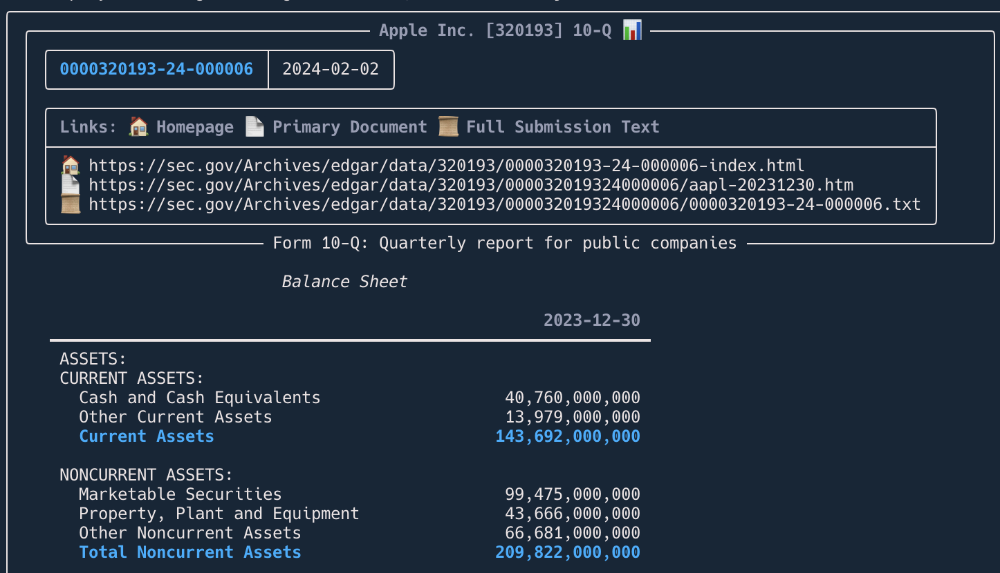
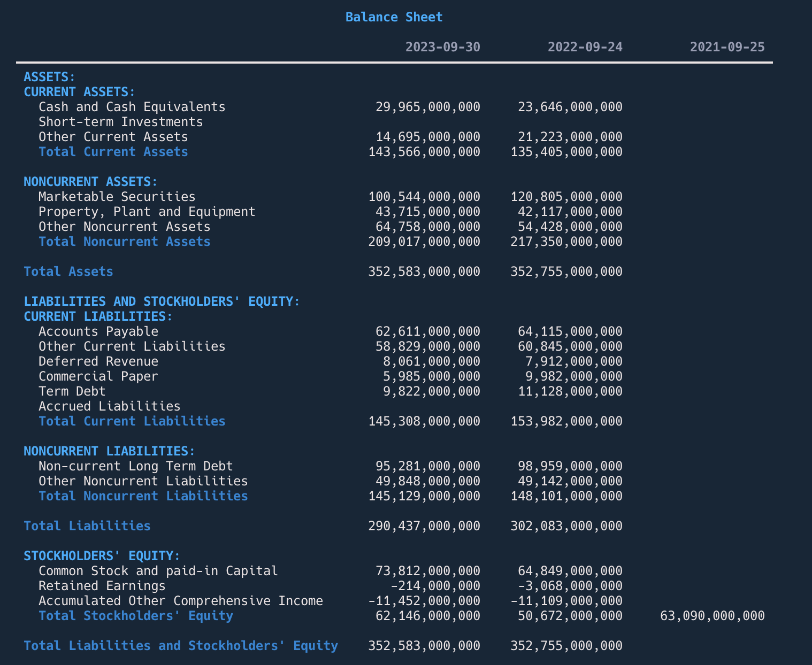

<!-- align a paragraph to the center -->
<p align="center">
<a href="https://github.com/dgunning/edgartools">
    
</a>
</p>
<p align="center">The world's easiest, most powerful edgar library</p>

[](https://pypi.org/project/edgartools)


[](https://www.codefactor.io/repository/github/dgunning/edgartools)
[](https://github.com/pypa/hatch)

-----

<p align="center">
<a href="https://github.com/dgunning/edgartools">
    
</a>
</p>

# Features
- 📁 **Access any SEC filing**: You can access any SEC filing since 1994.
- 💰 **Company Financials**: Comprehensive company financials from 10-K and 10-Q filings
- 👤 **Insider Transactions**: Search for and get insider transactions
- 📅 **List filings for any date range**: List filings for **year, quarter** e.g. or date range `2024-02-29:2024-03-15`
- 🌟 **Best looking edgar library**: Uses **[rich](https://rich.readthedocs.io/en/stable/introduction.html)** library to display SEC Edgar data in a beautiful way.
- 🧠 **Intuitive and easy to use**: **edgartools** has a super simple API that is easy to use.
- ��️ **Works as a library or a CLI**: You can use edgartools as a library in your code or as a CLI tool.
- 🔄 **Page through filings**: Use `filings.next()` and `filings.previous()` to page through filings
- 🏗️ **Build Data Pipelines**: Build data pipelines by finding, filtering, transforming and saving filings
- ✅ **Select a filing**: You can select a filing from the list of filings.
- 📄 **View the filing as HTML or text**: Find a filing then get the content as HTML or text.
- 🔢 **Chunk filing text**: You can chunk the filing text into sections for vector embedding.
- 🔍 **Preview the filing**: You can preview the filing in the terminal or a notebook.
- 🔎 **Search through a filing**: You can search through a filing for a keyword.
- 📊 **Parse XBRL**: Extract XBRL data into intuitive data structures.
- 💾 **Data Objects**: Automatically downloads and parses filings into data objects.
- 📥 **Download any attachment**: You can download any attachment from the filing.
- 🕒 **Automatic throttling**: Automatically throttles requests to Edgar to avoid being blocked.
- 📥 **Bulk downloads**: Faster batch processing through bulk downloads of filings and facts
- 🔢 **Get company by Ticker or Cik**: Get a company by ticker `Company("SNOW")` or cik `Company(1640147)`
-  **Get company filings**: You can get all the company's historical filings using `company.get_filings()`
- 📈 **Get company facts**: You can get company facts using `company.get_facts()`
- 🔍 **Lookup Ticker by CUSIP**: You can lookup a ticker by CUSIP
- 📑 **Dataset of SEC entities**: You can get a dataset of SEC companies and persons
- 📈 **Fund Reports**: Search for and get 13F-HR fund reports
- 🛠️ **Works as a library or a CLI**: You can use edgartools as a library in your code or as a CLI tool.


# Getting started

Install using pip
```bash
pip install edgartools
```

Import and start using
```python
from edgar import *

# Tell the SEC who you are
set_identity("Michael Mccallum mike.mccalum@indigo.com")

filings = get_filings()
```

# Key Concepts

## How do I find a filing?
Depends on what you know

### A. I know the accession number

```python
filing = find("0001065280-23-000273")
```

### B. I know the company ticker or cik

```python
filings = Company("NFLX").get_filings(form="10-Q").latest(1)
```

For a deeper dive see **[Finding things with edgartools](https://github.com/dgunning/edgartools/wiki/FindingThings)**

### C. Show me a list of filings

```python
filings = get_filings(form="10-Q")
filing = filings[0]
```

## What can I do with a filing

You can **view** it in the terminal or **open** it in the browser, get the filing as **html**, **xml** or **text**, 
and download **attachments**. You can extract data from the filing into a data object.

## What can I do with a company

You can get the company's **filings**, **facts** and **financials**.

# How to use edgartools

|                                      | Code                                                  |
|--------------------------------------|-------------------------------------------------------|
| Set your EDGAR identity in Linux/Mac | `export EDGAR_IDENTITY="email@domain.com"` |
| Set your EDGAR identity in Windows   | `set EDGAR_IDENTITY="email@domain.com"`    |
| Set identity in Windows Powershell   | `$env:EDGAR_IDENTITY="email@domain.com"`   |
| Set identity in Python               | `set_identity("email@domain.com")`         |
| Importing the library                | `from edgar import *`                                 |

### Working with filings 📁

#### 🔍 Getting Filings

|                                        | Code                                            |
|----------------------------------------|--------------------------------------------------|
| 📅 Get filings for the year to date    | `filings = get_filings()`                       |
| 📊 Get only XBRL filings               | `filings = get_filings(index="xbrl")`           |
| 📆 Get filings for a specific year     | `filings = get_filings(2020)`                   |
| 🗓️ Get filings for a specific quarter | `filings = get_filings(2020, 1)`              |
| 📚 Get filings for multiple years      | `filings = get_filings([2020, 2021])`           |
| 📈 Get filings for a range of years    | `filings = get_filings(year=range(2010, 2020))` |

#### 📄 Filtering Filings

|                                   | Code                                                  |
|-----------------------------------|-------------------------------------------------------|
| 📝 Filter by form type            | `filings.filter(form="10-K")`                         |
| 📑 Filter by multiple forms       | `filings.filter(form=["10-K", "10-Q"])`               |
| 🔄 Include form amendments        | `filings.filter(form="10-K", amendments=True)`        |
| 🏢 Filter by CIK                  | `filings.filter(cik="0000320193")`                    |
| 🏙️ Filter by multiple CIKs       | `filings.filter(cik=["0000320193", "1018724"])`       |
| 🏷️ Filter by ticker              | `filings.filter(ticker="AAPL")`                       |
| 🏷️🏷️ Filter by multiple tickers | `filings.filter(ticker=["AAPL", "MSFT"])`             |
| 📅 Filter on a specific date      | `filings.filter(date="2020-01-01")`                   |
| 📅↔️📅 Filter between dates       | `filings.filter(date="2020-01-01:2020-03-01")`        |
| 📅⬅️ Filter before a date         | `filings.filter(date=":2020-03-01")`                  |
| 📅➡️ Filter after a date          | `filings.filter(date="2020-03-01:")`                  |
| 🔀 Combine multiple filters       | `filings.filter(form="10-K", date="2020-01-01:", ticker="AAPL")` |

#### 📊 Viewing and Manipulating Filings

|                                      | Code                     |
|--------------------------------------|--------------------------|
| ⏭️ Show the next page of filings     | `filings.next()`         |
| ⏮️ Show the previous page of filings | `filings.prev()`       |
| 🔝 Get the first n filings           | `filings.head(20)`       |
| 🔚 Get the last n filings            | `filings.tail(20)`       |
| 🕒 Get the latest n filings by date  | `filings.latest(20)`    |
| 🎲 Get a random sample of filings    | `filings.sample(20)`     |
| 🐼 Get filings as a pandas dataframe | `filings.to_pandas()`  |

### Working with a filing 📄

#### 🔍 Accessing and viewing a Filing

|                                     | Code                                                      |
|-------------------------------------|-----------------------------------------------------------|
| 📌 Get a single filing              | `filing = filings[3]`                                     |
| 🔢 Get a filing by accession number | `filing = get_by_accession_number("0000320193-20-34576")` |
| 🏠 Get the filing homepage          | `filing.homepage`                                         |
| 🌐 Open a filing in the browser     | `filing.open()`                                           |
| 🏠 Open homepage in the browser     | `filing.homepage.open()`                                  |
| 💻 View the filing in the terminal  | `filing.view()`                                           |

#### 📊 Extracting Filing Content

|                                     | Code                         |
|-------------------------------------|-----------------------------|
| 🌐 Get the HTML of the filing       | `filing.html()`              |
| 📊 Get the XBRL of the filing       | `filing.xbrl()`              |
| 📝 Get the filing as markdown       | `filing.markdown()`          |
| 📄 Get the full submission text     | `filing.full_text_submission()` |
| 🔢 Get and parse filing data object | `filing.obj()`               |
| 📑 Get filing header                | `filing.header`              |

#### 🔎 Searching inside a Filing

|                             | Code                                    |
|-----------------------------|----------------------------------------|
| 🔍 Search within the filing | `filing.search("query")`                |
| 🔍 Search with regex        | `filing.search("pattern", regex=True)`  |
| 📊 Get filing sections      | `filing.sections()`                     |

#### 📎 Working with Attachments

|                               | Code                               |
|-------------------------------|-----------------------------------|
| 📁 Get all filing attachments | `filing.attachments`              |
| 📄 Get a single attachment    | `attachment = filing.attachments[0]` |
| 🌐 Open attachment in browser | `attachment.open()`               |
| ⬇️ Download an attachment     | `content = attachment.download()` |

### Working with a company

|                                         | Code                                                          |
|-----------------------------------------|---------------------------------------------------------------|
| Get a company by ticker                 | `company = Company("AAPL")`                                   |
| Get a company by CIK                    | `company = Company("0000320193")`                             |
| Get company facts                       | `company.get_facts()`                                         |
| Get company facts as a pandas dataframe | `company.get_facts().to_pandas()`                             |
| Get company filings                     | `company.get_filings()`                                       |
| Get company filings by form             | `company.get_filings(form="10-K")`                            |
| Get a company filing by accession_number | `company.get_filing(accession_number="0000320193-21-000139")` |
| Get the company's financials            | `company.financials`                                          |
| Get the company's balance sheet         | `company.financials.balance_sheet`                            |
| Get the company's income statement      | `company.financials.income_statement`                         |
| Get the company's cash flow statement   | `company.financials.cash_flow_statement`                      |

# Installation

```console
pip install edgartools
```

# Usage


## Set your Edgar user identity

Before you can access the SEC Edgar API you need to set the identity that you will use to access Edgar.
This is usually your name and email, or a company name and email but you can also just use an email.
```bash
Sample Company Name AdminContact@<sample company domain>.com
```

The user identity is sent in the User-Agent string and the Edgar API will refuse to respond to your request without it.

EdgarTools will look for an environment variable called `EDGAR_IDENTITY` and use that in each request.
So, you need to set this environment variable before using it.

### Setting EDGAR_IDENTITY in Linux/Mac
```bash
export EDGAR_IDENTITY="mcalum@gmail.com"
```

### Setting EDGAR_IDENTITY in Windows Powershell
```bash
 $Env:EDGAR_IDENTITY="mcalum@gmail.com"
```
Alternatively, you can call `set_identity` which does the same thing.

```python
from edgar import set_identity
set_identity("mcalum@gmail.com")
```
For more detail see https://www.sec.gov/os/accessing-edgar-data

## Usage

### Importing edgar

```python
from edgar import *
```

## [Using the Filing API](https://github.com/dgunning/edgartools/wiki/WorkingWithFilings)
Use the Filing API when you are not working with a specific company, but want to get a list of filings.

For details on how to use the Filing API see **[Using the Filing API](https://github.com/dgunning/edgartools/wiki/WorkingWithFilings)**

## [Using the Company API](https://github.com/dgunning/edgartools/wiki/WorkingWithCompanies)

With the Company API you can find a company by ticker or CIK, and get the company's filings, facts and financials.

```python
Company("AAPL")
        .get_filings(form="10-Q")
        .latest(1)
        .obj()
```



See **[Using the Company API](https://github.com/dgunning/edgartools/wiki/WorkingWithCompanies)**

## Viewing and downloading attachments

Every filing has a list of attachments. You can view the attachments using `filing.attachments`

```python
# View the attachments
filing.attachments
```


You can access each attachment using the bracket operator `[]` and the index of the attachment.
    
```python
# Get the first attachment
attachment = filing.attachments[0]
```


You can download the attachment using `attachment.download()`. This will download the attachment to string or bytes in memory. 

## Automatic parsing of filing data

Now the reason you may want to download attachments is to get information contained in data files.
For example, **13F-HR** filings have attached infotable.xml files containing data from the holding report for that filing.

Fortunately, the library handles this for you. If you call `filing.obj()` it will automatically download and parse the data files
into a data object, for several different form types. Currently, the following forms are supported:

| Form                       | Data Object                  | Description                           |
|----------------------------|------------------------------|---------------------------------------|
| 10-K                       | `TenK`                       | Annual report                         |
| 10-Q                       | `TenQ`                       | Quarterly report                      |
| 8-K                        | `EightK`                     | Current report                        |
| MA-I                       | `MunicipalAdvisorForm`       | Municipal advisor initial filing      |
| Form 144                   | `Form144`                    | Notice of proposed sale of securities |
| C, C-U, C-AR, C-TR         | `FormC`                      | Form C Crowdfunding Offering          |
| D                          | `FormD`                      | Form D Offering                       |
| 3,4,5                      | `Ownership`                  | Ownership reports                     |
| 13F-HR                     | `ThirteenF`                  | 13F Holdings Report                   |
| NPORT-P                    | `FundReport`                 | Fund Report                           |
| EFFECT                     | `Effect`                     | Notice of Effectiveness               |
| And other filing with XBRL | `XBRLData` or `XBRLInstance` | Container for XBRL data               |

For example, to get the data object for a **13F-HR** filing you can do the following:

```python
filings = get_filings(form="13F-HR")
filing = filings[0]
thirteenf = filing.obj()
```


If you call `obj()` on a filing that does not have a data file, then it will return `None`.


## Working with XBRL filings

Some filings are in **XBRL (eXtensible Business Markup Language)** format. 
These are mainly the newer filings, as the SEC has started requiring this for newer filings.

If a filing is in XBRL format then it opens up a lot more ways to get structured data about that specific filing and also 
about the company referred to in that filing.

The `Filing` class has an `xbrl` function that will download, parse and structure the filing's XBRL document if one exists.
If it does not exist, then `filing.xbrl()` will return `None`.

The function `filing.xbrl()` returns an `XBRLData` instance if the XBRL files contain presentation information or `XBRLInstance` if it a simple instance document with just the facts.
For more details see **[Parsing XBRL](https://github.com/dgunning/edgartools/wiki/ParsingXBRL)**

```python
filing_xbrl = filing.xbrl()
```


## Financials

Some filings, notably **10-K** and **10-Q** filings contain financial statements in XBRL format. 
You can get the financials from the XBRL data using the `Financials` class.

```python
from edgar.financials import Financials
financials = Financials(filing.xbrl())
financials.get_balance_sheet()
financials.get_income_statement()
financials.get_cash_flow_statement()
```
Or automatically through the `Tenk` and `TenQ` data objects.

Here is an example that gets the latest Apple financials

```python
tenk = Company("AAPL").get_filings(form="10-K").latest(1).obj()
financials = tenk.financials
financials.balance_sheet
```


### Get the financial data as a pandas dataframe

Each of the financial statements - `BalanceSheet`, `IncomeStatement` and `CashFlowStatement` - have a `get_dataframe()` method that will return the data as a pandas dataframe.

```python
balance_sheet_df = financials.balance_sheet.get_dataframe()
```

## Downloading Edgar Data

The library is designed to make real time calls to EDGAR to get the latest data. However, you may want to download data for offline use or to build a dataset.

### Download Bulk Company Data
You can download all the company **filings** and **facts** from Edgar using the `download_edgar_data` function.
Note that this will store json files for each company of their facts and submissions, but it will not include the actual HTML or other attachments.
It will however dramatically speed up loading companies by cik or ticker.

The submissions and facts bulk data files are each over 1.GB in size, and take around a few minutes each.
The data is stored by default in the `~/.edgar` directory. You can change this by setting the `EDGAR_LOCAL_DATA_DIR` environment variable.

```bash

```python
def download_edgar_data(submissions: bool = True, facts: bool = True):
    """
    Download all the company data from Edgar
    :param submissions: Download all the company submissions
    :param facts: Download all the company facts
    """
download_edgar_data()

```
### Using Bulk Data
If you want edgartools to use the bulk data files you can call `use_local_storage()` before you start making calls using the library.
Alternatively, set `EDGAR_USE_LOCAL_DATA` to `True` in your environment.

### Downsides of using bulk data
- The filings downloaded for each company is limited to the last 1000
- You will need to download the latest data every so often to keep it up to date.

## Downloading Attachments

You can download attachments from a filing using the `download` method on the attachments. This will download all the attached files to a folder of your choice.

```python
class Attachments:
    
    ...
    
    def download(self, path: Union[str, Path], archive: bool = False):
        """
        Download all the attachments to a specified path.
        If the path is a directory, the file is saved with its original name in that directory.
        If the path is a file, the file is saved with the given path name.
        If archive is True, the attachments are saved in a zip file.
        path: str or Path - The path to save the attachments
        archive: bool (default False) - If True, save the attachments in a zip file
        """ 
        ...
        
# Usage
filing.attachments.download(path)
```


# Contributing

Contributions are welcome! We would love to hear your thoughts on how this library could be better at working with SEC Edgar.

## Reporting Issues
We use GitHub issues to track public bugs. 
Report a bug by [opening a new issue](https://github.com/dgunning/edgartools/issues); it's that easy!

## Making code changes
- Fork the repo and create your branch from master.
- If you've added code that should be tested, add tests.
- If you've changed APIs, update the documentation.
- Ensure the test suite passes.
- Make sure your code lints.
- Issue that pull request!


# License

`edgartools` is distributed under the terms of the [MIT](https://spdx.org/licenses/MIT.html) license.

## Contact

[LinkedIn](https://www.linkedin.com/in/dwight-gunning-860124/)

## Star History

[](https://star-history.com/#dgunning/edgartools&Timeline)


## Subscribe to Polar
<picture>
2  <source media="(prefers-color-scheme: dark)" srcset="https://polar.sh/embed/subscribe.svg?org=polarsource&label=Subscribe&darkmode">
3  
4</picture>
