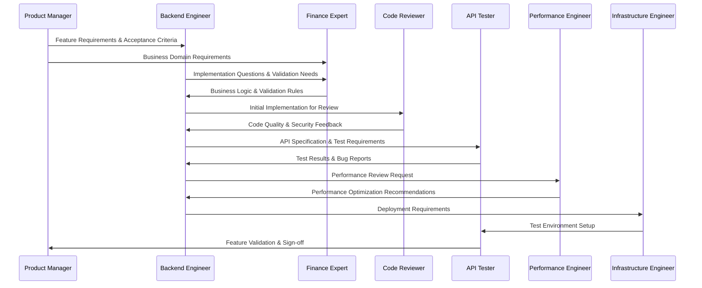
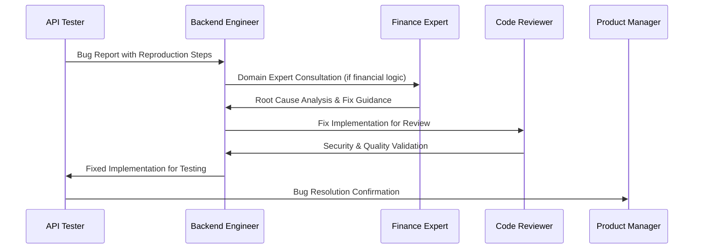
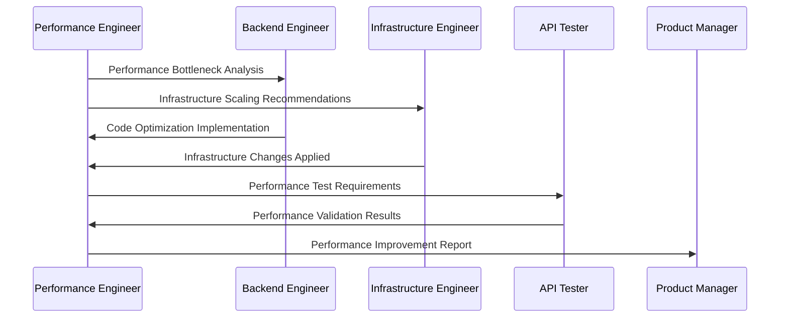

# Team Coordination & Workflows

## Team Interaction Patterns

This document defines how the EdgarTools SAAS API Development Team agents collaborate effectively to deliver high-quality financial API products.

## Agent Collaboration Matrix

| From → To | Product Manager | Backend Engineer | Infrastructure | API Tester | Finance Expert | Performance | Code Reviewer |
|-----------|----------------|------------------|----------------|------------|----------------|-------------|---------------|
| **Product Manager** | - | Requirements & Specs | Scaling Requirements | Test Scenarios | Business Rules | SLA Targets | Feature Requirements |
| **Backend Engineer** | Progress Updates | - | Deployment Needs | API Specifications | Implementation Questions | Optimization Needs | Code Reviews |
| **Infrastructure** | Capacity Reports | Environment Setup | - | Test Environments | Compliance Infrastructure | Performance Metrics | Security Configurations |
| **API Tester** | Quality Reports | Bug Reports | Environment Issues | - | Data Validation Results | Performance Test Results | Test Code Reviews |
| **Finance Expert** | Domain Guidance | Business Logic Validation | Compliance Requirements | Test Data Validation | - | Performance Impact Analysis | Financial Logic Review |
| **Performance** | Performance Reports | Optimization Recommendations | Scaling Recommendations | Performance Requirements | Calculation Optimization | - | Performance Code Review |
| **Code Reviewer** | Quality Metrics | Code Feedback | Security Review | Test Quality Review | Compliance Code Review | Performance Code Review | - |

## Development Workflows

### 1. Feature Development Workflow



### 2. Bug Fix Workflow



### 3. Performance Optimization Workflow



## Communication Protocols

### Daily Standups (Async Updates)
Each agent provides updates in the following format:

```yaml
agent_name: "Backend Engineer"
yesterday:
  - "Implemented company overview endpoint"
  - "Fixed authentication middleware bug"
today:
  - "Working on financial statements API"
  - "Code review with Code Reviewer agent"
blockers:
  - "Need Finance Expert validation on ratio calculations"
requests:
  - "@finance-expert: Review financial ratio formulas in PR #123"
```

### Weekly Planning Sessions
1. **Product Manager** presents upcoming priorities and roadmap updates
2. **Backend Engineer** estimates effort and identifies technical dependencies
3. **Infrastructure Engineer** addresses scaling and deployment needs
4. **Performance Engineer** sets performance targets and monitoring requirements
5. **Finance Expert** validates business requirements and compliance needs
6. **API Tester** plans testing strategies and quality gates
7. **Code Reviewer** highlights code quality focus areas

### Cross-Agent Review Process

#### 1. Technical Design Reviews
**Participants**: Product Manager, Backend Engineer, Infrastructure Engineer, Performance Engineer
**Frequency**: Before major feature implementation
**Deliverables**: Technical design document, implementation plan, performance targets

#### 2. Security & Compliance Reviews
**Participants**: Code Reviewer, Finance Expert, Infrastructure Engineer
**Frequency**: Before production deployment
**Deliverables**: Security assessment, compliance checklist, audit trail validation

#### 3. Quality Gates Reviews
**Participants**: API Tester, Code Reviewer, Performance Engineer
**Frequency**: Before release candidate
**Deliverables**: Quality report, performance validation, test coverage analysis

## Shared Artifacts & Documentation

### 1. Requirements Documents
**Owner**: Product Manager
**Contributors**: Finance Expert (domain requirements), Backend Engineer (technical feasibility)
**Location**: `/internal/docs/product/requirements/`

### 2. API Specifications
**Owner**: Backend Engineer
**Contributors**: Product Manager (business requirements), API Tester (test scenarios)
**Location**: `/docs/api/` (OpenAPI specs)

### 3. Architecture Documentation
**Owner**: Backend Engineer
**Contributors**: Infrastructure Engineer (deployment architecture), Performance Engineer (scalability)
**Location**: `/internal/docs/architecture/`

### 4. Security Guidelines
**Owner**: Code Reviewer
**Contributors**: Infrastructure Engineer (infrastructure security), Finance Expert (compliance)
**Location**: `/internal/docs/security/`

### 5. Testing Strategies
**Owner**: API Tester
**Contributors**: Performance Engineer (performance tests), Finance Expert (data validation)
**Location**: `/internal/docs/testing/`

### 6. Performance Baselines
**Owner**: Performance Engineer
**Contributors**: Infrastructure Engineer (capacity planning), Backend Engineer (optimization opportunities)
**Location**: `/internal/docs/performance/`

## Decision-Making Framework

### 1. Technical Decisions
**Decision Maker**: Backend Engineer
**Consultation Required**: Code Reviewer (quality impact), Performance Engineer (performance impact)
**Documentation**: Technical Decision Records (TDRs)

### 2. Product Decisions
**Decision Maker**: Product Manager
**Consultation Required**: Finance Expert (domain validation), API Tester (quality impact)
**Documentation**: Product Requirements Documents (PRDs)

### 3. Security Decisions
**Decision Maker**: Code Reviewer
**Consultation Required**: Infrastructure Engineer (implementation impact), Finance Expert (compliance impact)
**Documentation**: Security Assessment Reports

### 4. Performance Decisions
**Decision Maker**: Performance Engineer
**Consultation Required**: Infrastructure Engineer (cost impact), Backend Engineer (implementation complexity)
**Documentation**: Performance Analysis Reports

## Escalation Procedures

### Level 1: Peer Consultation
- Direct agent-to-agent communication
- Quick questions and clarifications
- Implementation guidance

### Level 2: Cross-Functional Review
- Multiple agents involved in decision
- Requires formal review process
- Documented decision rationale

### Level 3: Team Lead Intervention
- Conflicting recommendations between agents
- Resource allocation decisions
- Timeline impact decisions

## Quality Assurance Workflows

### 1. Code Quality Pipeline
```yaml
stages:
  - name: "Initial Implementation"
    owner: "Backend Engineer"
    reviewers: ["Finance Expert"]

  - name: "Code Review"
    owner: "Code Reviewer"
    criteria: ["Security", "Quality", "Standards"]

  - name: "Testing"
    owner: "API Tester"
    types: ["Unit", "Integration", "Security"]

  - name: "Performance Validation"
    owner: "Performance Engineer"
    criteria: ["Response Time", "Throughput", "Resource Usage"]

  - name: "Deployment Review"
    owner: "Infrastructure Engineer"
    criteria: ["Security", "Scalability", "Monitoring"]
```

### 2. Feature Validation Pipeline
```yaml
validation_stages:
  - name: "Requirements Validation"
    owner: "Product Manager"
    validators: ["Finance Expert"]

  - name: "Implementation Validation"
    owner: "Backend Engineer"
    validators: ["Code Reviewer", "Performance Engineer"]

  - name: "Quality Validation"
    owner: "API Tester"
    validators: ["Finance Expert"]

  - name: "Production Readiness"
    owner: "Infrastructure Engineer"
    validators: ["Performance Engineer", "Code Reviewer"]
```

## Conflict Resolution

### Technical Disagreements
1. **Documentation**: Both perspectives documented with rationale
2. **Proof of Concept**: Implement both approaches if feasible
3. **Performance Testing**: Measure objective performance differences
4. **Expert Consultation**: Involve relevant domain expert
5. **Decision Documentation**: Record final decision and reasoning

### Priority Conflicts
1. **Business Impact Assessment**: Product Manager evaluates business impact
2. **Technical Risk Assessment**: Code Reviewer and Infrastructure Engineer assess technical risks
3. **Resource Impact Analysis**: All agents provide resource estimates
4. **Stakeholder Consultation**: Product Manager consults with stakeholders
5. **Priority Matrix**: Use impact vs. effort matrix for decision

### Resource Allocation Conflicts
1. **Capacity Planning**: Infrastructure Engineer provides current capacity analysis
2. **Performance Impact**: Performance Engineer assesses system impact
3. **Quality Impact**: API Tester and Code Reviewer assess quality implications
4. **Business Justification**: Product Manager provides business case
5. **Resource Reallocation**: Adjust timelines and priorities accordingly

## Success Metrics

### Team Collaboration Metrics
- **Cross-agent review participation**: > 90% of decisions involve appropriate agents
- **Decision documentation**: 100% of major decisions documented with rationale
- **Conflict resolution time**: < 2 days for technical disagreements
- **Knowledge sharing**: Regular updates and documentation maintenance

### Product Quality Metrics
- **Feature delivery**: Meet planned delivery dates 85% of the time
- **Quality gates**: 100% compliance with quality gate requirements
- **Security compliance**: Zero security vulnerabilities in production
- **Performance SLAs**: Meet performance targets 99% of the time

### Process Efficiency Metrics
- **Review cycle time**: < 24 hours for code reviews
- **Bug fix time**: < 48 hours for critical bugs
- **Feature development cycle**: Predictable and improving velocity
- **Technical debt**: Decreasing trend in technical debt metrics

This coordination framework ensures that all agents work together effectively to deliver high-quality, secure, and performant financial API solutions while maintaining clear accountability and efficient communication patterns.