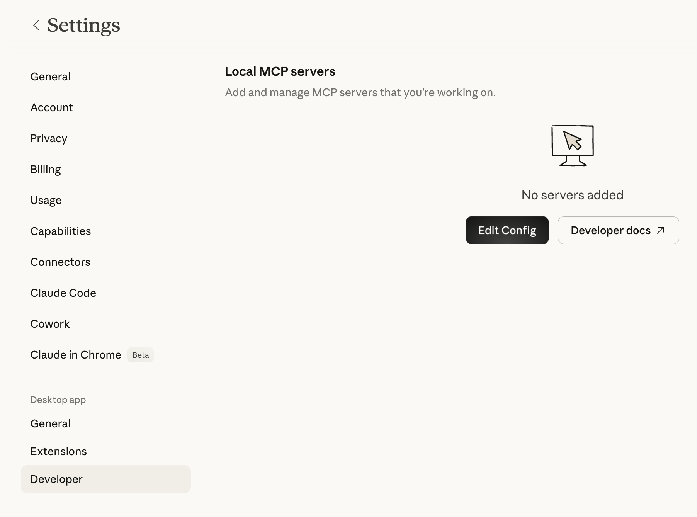
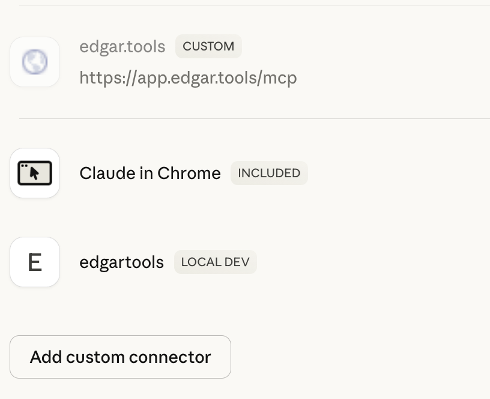

# MCP Server Setup

Get the EdgarTools MCP server running in under 2 minutes. Once connected, Claude can query any SEC filing, extract financial data, and analyze companies directly.

## Quick Setup

### Claude Desktop

**Step 1: Install EdgarTools**

```bash
pip install "edgartools[ai]"
```

**Step 2: Find your Python path**

Claude Desktop launches the MCP server as a subprocess. It does not inherit your shell's PATH, so you need the full path to your Python binary:

```bash
which python3
```

Note the output (e.g., `/usr/local/bin/python3` or `/opt/homebrew/bin/python3`).

**Step 3: Configure Claude Desktop**

Open Claude Desktop → Settings → Developer → Edit Config:



Add this to your config, replacing the `command` with the full path from Step 2:

```json
{
  "mcpServers": {
    "edgartools": {
      "command": "/usr/local/bin/python3",
      "args": ["-m", "edgar.ai"],
      "env": {
        "EDGAR_IDENTITY": "Your Name your.email@example.com"
      }
    }
  }
}
```

On Windows, use `python` (usually already on PATH):

```json
{
  "mcpServers": {
    "edgartools": {
      "command": "python",
      "args": ["-m", "edgar.ai"],
      "env": {
        "EDGAR_IDENTITY": "Your Name your.email@example.com"
      }
    }
  }
}
```

**Config file location:**

- **macOS**: `~/Library/Application Support/Claude/claude_desktop_config.json`
- **Windows**: `%APPDATA%\Claude\claude_desktop_config.json`

**Step 4: Restart and verify**

Restart Claude Desktop (quit fully, then relaunch). You should see **edgartools** appear in your connectors:



Try asking: *"What did Apple file with the SEC this quarter?"*

!!! tip "Why the full path?"
    Claude Desktop runs MCP servers as subprocesses with a minimal system PATH (`/usr/local/bin`, `/usr/bin`, `/bin`). If your Python is installed via Homebrew, pyenv, conda, or another tool, Claude Desktop won't find it by name alone. Using the full path avoids "spawn python3 ENOENT" errors.

#### Alternative: uvx (no pip install needed)

If you have [uv](https://docs.astral.sh/uv/getting-started/installation/) installed, `uvx` runs the server in an isolated environment without installing edgartools globally. Find the full path with `which uvx`:

```json
{
  "mcpServers": {
    "edgartools": {
      "command": "/Users/yourname/.local/bin/uvx",
      "args": ["--from", "edgartools[ai]", "edgartools-mcp"],
      "env": {
        "EDGAR_IDENTITY": "Your Name your.email@example.com"
      }
    }
  }
}
```

Replace `/Users/yourname/.local/bin/uvx` with the actual path from `which uvx`.

### Claude Code

```bash
claude mcp add edgartools -- uvx --from "edgartools[ai]" edgartools-mcp
```

Set your SEC identity:
```bash
export EDGAR_IDENTITY="Your Name your.email@example.com"
```

Claude Code runs in your shell environment, so `uvx` works by name -- no full path needed.

### Verify

Confirm the server starts correctly from your terminal:

```bash
python3 -m edgar.ai --test
```

```
✓ EdgarTools v5.26.1 imports successfully
✓ MCP framework available
✓ 13 tools registered
✓ EDGAR_IDENTITY configured
✓ All checks passed — MCP server is ready to run
```

## EDGAR_IDENTITY

The SEC [requires](https://www.sec.gov/os/webmaster-faq#developers) that automated tools identify themselves. Set `EDGAR_IDENTITY` to your name and email:

```
EDGAR_IDENTITY="Jane Smith jane.smith@example.com"
```

No registration. No approval process. No API key. Just tell them who you are. If not set, the server starts with a warning and SEC API requests may be rate-limited.

## Other MCP Clients

The server works with any MCP-compatible client. The `mcpServers` config block is the same -- only the config file location changes:

| Client | Config location |
|--------|----------------|
| **Claude Desktop** | `~/Library/Application Support/Claude/claude_desktop_config.json` (macOS) |
| **Cline** | `.vscode/cline_mcp_settings.json` in your project |
| **Continue.dev** | `~/.continue/config.json` |

## Advanced Deployment

### Docker

For server deployments, CI/CD pipelines, or teams that want isolated runtime:

```bash
docker run -i hackerdogs/edgartools-mcp
```

Or build your own:

```dockerfile
FROM python:3.12-slim
RUN pip install "edgartools[ai]"
ENV EDGAR_IDENTITY="Your Name your.email@example.com"
ENTRYPOINT ["python", "-m", "edgar.ai"]
```

See [hackerdogs/edgartools-mcp](https://hub.docker.com/r/hackerdogs/edgartools-mcp) on Docker Hub for a community-maintained container.

### HTTP Transport (Team / Remote)

For shared servers or multi-user deployments, use Streamable HTTP transport:

```bash
edgartools-mcp --transport streamable-http --port 8000
```

Clients connect with a URL instead of launching a subprocess:

```json
{
  "mcpServers": {
    "edgartools": {
      "url": "http://your-server:8000/mcp"
    }
  }
}
```

| Flag | Default | Description |
|------|---------|-------------|
| `--transport` | `stdio` | `stdio` or `streamable-http` |
| `--host` | `0.0.0.0` | Bind address |
| `--port` | `8000` | Listen port |

The server is stateless -- no database, no session storage. Safe to run multiple instances behind a load balancer.

Docker with HTTP transport:

```dockerfile
FROM python:3.12-slim
RUN pip install "edgartools[ai]"
ENV EDGAR_IDENTITY="Your Name your.email@example.com"
ENTRYPOINT ["edgartools-mcp", "--transport", "streamable-http"]
EXPOSE 8000
```

!!! info "edgar.tools also runs a hosted MCP server"
    The local edgartools MCP server queries EDGAR directly through Python. The **[edgar.tools hosted MCP server](https://app.edgar.tools/docs/mcp/setup?utm_source=edgartools-docs&utm_medium=see-live&utm_content=ai-integration)** adds AI-enriched data processed server-side:

    | Capability | Local (edgartools) | Hosted (edgar.tools) |
    |---|---|---|
    | Material events | Basic 8-K parsing | LLM-classified event types |
    | Disclosure search | — | 12 XBRL topic clusters, all years |
    | Insider data | Individual Form 4s | 802K+ transactions with sentiment |
    | Filing sections | Raw text | AI summaries and key takeaways |

    Free tier: truncated MCP responses. Professional ($24.99/mo): full results.

    **[Set up the hosted MCP server →](https://app.edgar.tools/docs/mcp/setup?utm_source=edgartools-docs&utm_medium=see-live&utm_content=ai-integration)**

## Troubleshooting

**"spawn python3 ENOENT" or "spawn uvx ENOENT"**

Claude Desktop can't find the binary. Use the full path in your config:

```bash
# Find the right path
which python3    # e.g., /opt/homebrew/bin/python3
which uvx        # e.g., /Users/you/.local/bin/uvx
```

Then use that full path as the `command` in your config. This is the most common setup issue on macOS.

**"EDGAR_IDENTITY environment variable is required"**

Add your name and email to the `env` section of your MCP config.

**"Module edgar.ai not found"**

Install with AI extras: `pip install "edgartools[ai]"`

**"Output validation error: outputSchema defined but no structured output returned"**

You're running EdgarTools v5.25.1 or earlier. Upgrade: `pip install --upgrade edgartools`

**MCP server not appearing in Claude Desktop**

1. Verify JSON syntax in your config file
2. Restart Claude Desktop completely (quit and relaunch -- not just close the window)
3. Check the logs at `~/Library/Logs/Claude/mcp-server-edgartools.log` for errors
4. Run `python3 -m edgar.ai --test` to verify server health

**Claude answers questions without calling any tools**

Claude may use its training data instead of querying EDGAR. Be specific: *"Using your SEC tools, show me Apple's latest 10-K financials"* or *"Check EDGAR for Tesla's recent insider transactions."*

**Server running old version after upgrade**

If using `uvx`, clear its cache: `uvx --refresh --from "edgartools[ai]" edgartools-mcp --test`. If using `pip`, verify the right Python is being used: check `command` in your config points to the same Python where you installed edgartools.

## Migration from Legacy Setup

If you're using the old `run_mcp_server.py` entry point:

```json
// Old (deprecated)
{ "command": "python", "args": ["/path/to/edgartools/edgar/ai/run_mcp_server.py"] }

// New
{ "command": "uvx", "args": ["--from", "edgartools[ai]", "edgartools-mcp"] }
```

The old entry point still works but shows a deprecation warning.
