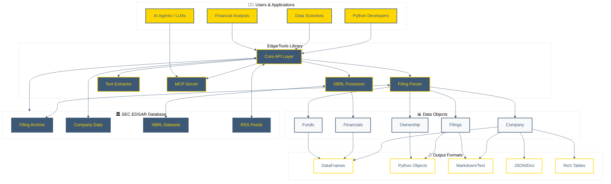

# EdgarTools Architecture Diagram

## System Architecture



## Component Details

### Core API Layer
- **Company**: Entry point for company-specific data
- **get_filings()**: Retrieve and filter filings
- **set_identity()**: SEC-required user identification
- **get_funds()**: Access fund holdings data

### Filing Parser
- **HTML Parsing**: lxml-based high-performance parsing
- **Form Recognition**: Automatic detection of form types
- **Data Extraction**: Structured data from forms (10-K, 10-Q, 8-K, Form 4, 13F, etc.)
- **Attachment Handling**: Access exhibits and attachments

### XBRL Processor
- **Financial Statements**: Balance sheets, income statements, cash flows
- **Standardization**: Cross-company comparable data
- **Tag Mapping**: XBRL tag to human-readable names
- **Validation**: Data quality checks

### Text Extractor
- **Clean Text**: HTML to clean text conversion
- **Section Extraction**: Item 1A (Risk Factors), Item 7 (MD&A), etc.
- **Markdown Conversion**: Formatted for LLMs
- **Chunking Support**: Large document handling

### MCP Server
- **Company Research**: AI-driven company analysis
- **Financial Analysis**: Automated financial metric extraction
- **Filing Search**: Natural language filing queries
- **Zero Configuration**: No API keys required

## Data Flow

1. **User Request** → Core API Layer
2. **API** → SEC EDGAR Database
3. **Raw Data** → Filing Parser
4. **Parsed Data** → Data Objects (Company, Filings, Financials)
5. **Data Objects** → Output Formats (DataFrame, Text, JSON)
6. **Output** → User Application

## Integration Points

### For Python Developers
```python
from edgar import Company
company = Company("AAPL")
financials = company.get_financials()
```

### For AI Agents (via MCP)
```python
# Automatic via Claude Desktop or other MCP clients
# No code needed - configure once, use forever
```

### For Data Scientists
```python
import pandas as pd
filings = Company("MSFT").get_filings()
df = filings.to_pandas()
```

---

**Diagram Usage in README:**

Add to README.md under an "Architecture" or "How It Works" section:

```markdown
## How It Works

EdgarTools provides a clean abstraction layer over the SEC EDGAR database:

[Include Mermaid diagram here]

The library handles all the complexity of SEC data access, parsing, and transformation, exposing a simple, intuitive API for financial data analysis.
```
