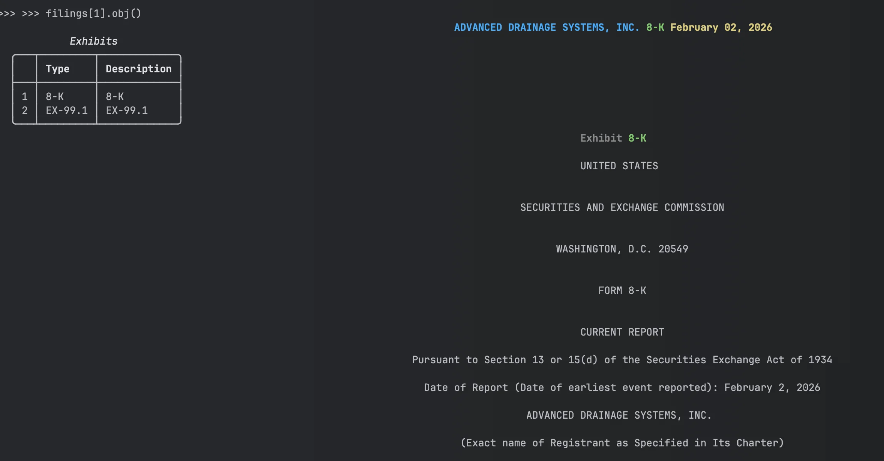

# 8-K Current Reports: Parse SEC Corporate Events and Earnings with Python

Companies file 8-K current reports within four business days of material events -- acquisitions, executive changes, earnings releases, bankruptcy. EdgarTools parses these filings into structured Python objects so you can access the event items, press releases, and financial tables.

```python
from edgar import *

filing = get_filings(form="8-K").latest()
eight_k = filing.obj()
eight_k
```



Three lines to get a parsed 8-K with company info, filing date, items disclosed, and exhibits.

---

## Read Item Content

Every 8-K discloses one or more numbered items (1.01 through 9.01). The `items` property lists what was disclosed:

```python
eight_k.items  # ['Item 2.02', 'Item 9.01']
```

Access the text of any item by number:

```python
# Works with or without "Item" prefix
content = eight_k['2.02']
content = eight_k['Item 2.02']

print(content)
```

Common items:

| Item | What it reports |
|------|----------------|
| **1.01** | Material agreements |
| **2.02** | Earnings and financial condition |
| **5.02** | Director or officer changes |
| **8.01** | Other events |
| **9.01** | Financial statements and exhibits |

The complete mapping is in `eight_k.structure`.

---

## Access Press Releases

Most 8-Ks attach press releases as EX-99 exhibits:

```python
if eight_k.has_press_release:
    releases = eight_k.press_releases
    pr = releases[0]

    # Get content in different formats
    pr.text()         # Plain text
    pr.html()         # HTML
    pr.to_markdown()  # Markdown
    pr.open()         # Open in browser
```

Press releases are indexed by position. `press_releases[0]` is the first release, `press_releases[1]` is the second.

---

## Extract Earnings and Financial Statements from 8-K Filings

When a company reports quarterly earnings, the numbers first appear in an 8-K -- weeks before the formal 10-Q. The company files **Item 2.02** ("Results of Operations and Financial Condition") and attaches the earnings press release as an EX-99.1 exhibit. That exhibit contains HTML tables with income statements, balance sheets, and cash flows. EdgarTools detects this pattern and parses the tables automatically.

```python
from edgar import Company

aapl = Company("AAPL")
filing = aapl.get_filings(form="8-K").latest()
eight_k = filing.obj()

eight_k.has_earnings  # True if Item 2.02 + parseable EX-99.1 exhibit
```

### Get Financial Statements

```python
if eight_k.has_earnings:
    # Direct access to parsed statements
    eight_k.income_statement       # FinancialTable or None
    eight_k.balance_sheet          # FinancialTable or None
    eight_k.cash_flow_statement    # FinancialTable or None

    # Safe accessors -- always return a DataFrame (empty if missing)
    df = eight_k.get_income_statement()
    df = eight_k.get_balance_sheet()
    df = eight_k.get_cash_flow_statement()
```

### Work with the Data

Each statement is a `FinancialTable` with the parsed data and detected scale:

```python
income = eight_k.income_statement

income.dataframe         # Parsed data as DataFrame
income.scaled_dataframe  # Values multiplied by detected scale
income.scale             # Scale enum (UNITS, THOUSANDS, MILLIONS, BILLIONS)
income.title             # Table title if detected
income.to_html()         # HTML export for web apps
income.to_json()         # JSON export for APIs
```

Press releases often report values "in millions" or "in thousands." EdgarTools detects the scale from the document text. Use `scaled_dataframe` to get actual dollar amounts, or check `scale` to apply your own multiplier.

### Access All Parsed Tables

The `earnings` property returns the full `EarningsRelease` object, which may contain more than just the three core statements:

```python
earnings = eight_k.earnings

earnings.financial_tables   # All parsed financial tables
earnings.segment_data       # Business segment breakdown
earnings.eps_reconciliation # GAAP to Non-GAAP EPS reconciliation
earnings.guidance           # Forward guidance table
earnings.detected_scale     # Document-level scale factor
```

Not every press release includes all of these -- `segment_data`, `eps_reconciliation`, and `guidance` return `None` when the company doesn't report them.

---

## Work with Exhibits

All 8-K attachments (press releases, financial statements, material agreements):

```python
exhibits = filing.exhibits

for ex in exhibits:
    print(f"{ex.document_type}: {ex.description}")

# Access specific exhibit
ex_99 = exhibits[0]
content = ex_99.download()
```

Exhibits are indexed by position. The `document_type` shows what kind of exhibit it is (EX-99.1, EX-10.1, etc.).

---

## Common Analysis Patterns

### Find all earnings releases in a quarter

```python
from edgar import get_filings

filings = get_filings(
    form="8-K",
    date="2024-01-01:2024-03-31"
)

for filing in filings[:20]:
    eight_k = filing.obj()
    if eight_k.has_earnings:
        print(f"{filing.company}: {filing.filing_date}")
```

### Extract all financial tables

```python
if eight_k.has_earnings:
    for table in eight_k.earnings.financial_tables:
        print(f"{table.statement_type.value}: {table.dataframe.shape}")
```

### Check for specific events

```python
# Director changes
if 'Item 5.02' in eight_k.items:
    print(eight_k['5.02'])

# Material agreements
if 'Item 1.01' in eight_k.items:
    print(eight_k['1.01'])

# Stock split announcements (Item 8.01 or 5.03)
if 'Item 8.01' in eight_k.items or 'Item 5.03' in eight_k.items:
    content = eight_k.get('8.01') or eight_k.get('5.03') or ''
    if 'split' in content.lower():
        print(f"Stock split announced: {filing.filing_date}")
```

---

## Metadata Quick Reference

| Property | Returns | Example |
|----------|---------|---------|
| `company` | Company name | `"Apple Inc."` |
| `form` | Form type | `"8-K"` |
| `filing_date` | Date filed with SEC | `"2024-02-01"` |
| `period_of_report` | Report date | `"2024-01-31"` |
| `date_of_report` | Formatted report date | `"January 31, 2024"` |
| `items` | List of disclosed items | `['Item 2.02', 'Item 9.01']` |
| `has_press_release` | Has EX-99 press release? | `True` |
| `has_earnings` | Has parseable earnings data? | `True` |

---

## Methods Quick Reference

| Call | Returns | What it does |
|------|---------|--------------|
| `eight_k['2.02']` | `str` | Get item content by number |
| `eight_k.press_releases` | `PressReleases` | Collection of press release exhibits |
| `eight_k.earnings` | `EarningsRelease` | Parsed earnings tables from EX-99.1 |
| `eight_k.income_statement` | `FinancialTable` | Income statement or None |
| `eight_k.balance_sheet` | `FinancialTable` | Balance sheet or None |
| `eight_k.cash_flow_statement` | `FinancialTable` | Cash flow statement or None |
| `eight_k.get_income_statement()` | `DataFrame` | Income statement (empty DataFrame if missing) |
| `eight_k.get_balance_sheet()` | `DataFrame` | Balance sheet (empty DataFrame if missing) |
| `eight_k.get_cash_flow_statement()` | `DataFrame` | Cash flow (empty DataFrame if missing) |

---

## Things to Know

**Item detection is multi-tier.** EdgarTools uses document parser first (95% accuracy), falls back to text extraction for legacy SGML filings (1999-2001).

**Earnings parsing requires EX-99.1.** The `has_earnings` property returns True only if Item 2.02 is present AND an EX-99.1 exhibit contains parseable tables. Some earnings 8-Ks only have narrative text.

**Scale matters.** Financial tables include scale detection (thousands, millions, billions). Use `scaled_dataframe` to get values with scale applied, or check `table.scale` to apply manually.

**Not all 8-Ks have XBRL.** 8-K filings typically contain only DEI (Document and Entity Information) XBRL metadata. Actual financial data is in HTML tables within EX-99 exhibits.

**Press releases use pattern matching.** EdgarTools looks for EX-99, EX-99.1, EX-99.01 exhibits or exhibits with "RELEASE" in the description. Some companies use non-standard exhibit numbering.

---

## Related

- [Stock Splits & EPS Normalization](guides/stock-splits-eps-normalization.md) -- detect split announcements and normalize metrics
- [Working with Filings](guides/working-with-filing.md) -- general filing access patterns
- [10-K Annual Reports](tenk-filings.md) -- annual report parsing
- [10-Q Quarterly Reports](tenq-filings.md) -- quarterly report parsing
