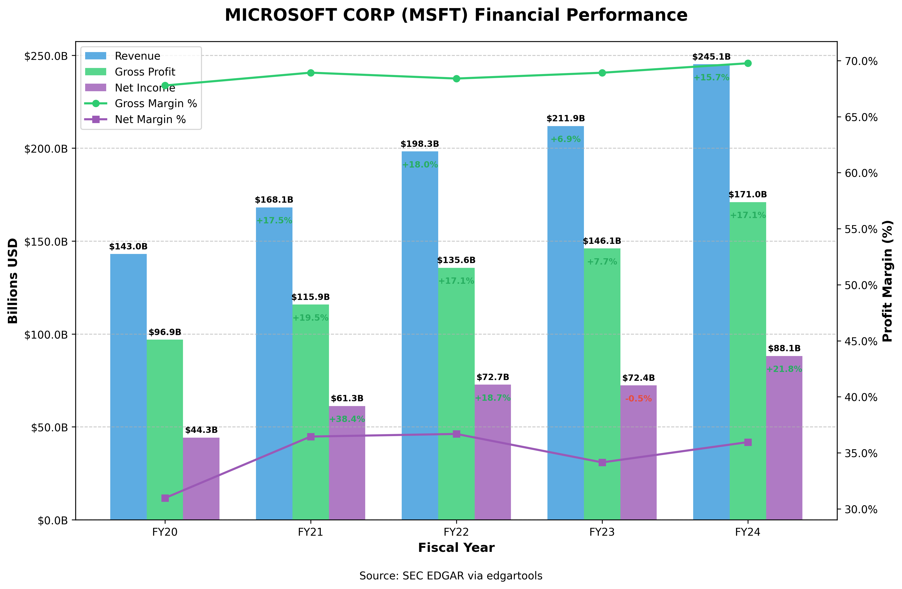

# Solve Real Problems with EdgarTools

This document showcases common workflows and tasks that financial professionals, developers, and researchers can accomplish using EdgarTools. Each journey addresses a specific problem and provides a concise code example.

## 1. Company Financial Analysis

**Problem:** Need to analyze a company's financial health across multiple periods.



```python

def get_income_dataframe(ticker:str):
    c = Company(ticker)
    filings = c.get_filings(form="10-K").latest(5)
    xbs = XBRLS.from_filings(filings)
    income_statement = xbs.statements.income_statement()
    income_df = income_statement.to_dataframe()
    return income_df
    

def plot_revenue(ticker:str):
    income_df = get_income_dataframe(ticker)
    
    # Extract financial metrics
    net_income = income_df[income_df.concept == "us-gaap_NetIncomeLoss"][income_statement.periods].iloc[0]
    gross_profit = income_df[income_df.concept == "us-gaap_GrossProfit"][income_statement.periods].iloc[0]
    revenue = income_df[income_df.label == "Revenue"][income_statement.periods].iloc[0]
    
    # Convert periods to fiscal years for better readability
    periods = [pd.to_datetime(period).strftime('FY%y') for period in income_statement.periods]
    
    # Reverse the order so most recent years are last (oldest to newest)
    periods = periods[::-1]
    revenue_values = revenue.values[::-1]
    gross_profit_values = gross_profit.values[::-1]
    net_income_values = net_income.values[::-1]
    
    # Create a DataFrame for plotting
    plot_data = pd.DataFrame({
        'Revenue': revenue_values,
        'Gross Profit': gross_profit_values,
        'Net Income': net_income_values
    }, index=periods)
    
    # Convert to billions for better readability
    plot_data = plot_data / 1e9
    
    # Create the figure
    fig, ax = plt.subplots(figsize=(10, 6))
    
    # Plot the data as lines with markers
    plot_data.plot(kind='line', marker='o', ax=ax, linewidth=2.5)
    
    # Format the y-axis to show billions with 1 decimal place
    ax.yaxis.set_major_formatter(mtick.FuncFormatter(lambda x, _: f'${x:.1f}B'))
    
    # Add labels and title
    ax.set_xlabel('Fiscal Year')
    ax.set_ylabel('Billions USD')
    ax.set_title(f'{c.name} ({ticker}) Financial Performance')
    
    # Add a grid for better readability
    ax.grid(True, linestyle='--', alpha=0.7)
    
    # Add a source note
    plt.figtext(0.5, 0.01, 'Source: SEC EDGAR via edgartools', ha='center', fontsize=9)
    
    # Improve layout
    plt.tight_layout(rect=[0, 0.03, 1, 0.97])
    
    return fig
```


## 2. Investment Fund Research

**Problem:** Need to analyze fund holdings and compare share classes.

```python
from edgar import find

# Find a fund by ticker
fund = find("VFIAX")  # Vanguard 500 Index Fund

# Get the fund's structure
classes = fund.get_classes()
print(f"Fund has {len(classes)} share classes")

# Get the latest portfolio holdings
portfolio = fund.get_portfolio()

# Show top 10 holdings by value
top_holdings = portfolio.sort_values('value', ascending=False).head(10)
top_holdings
```