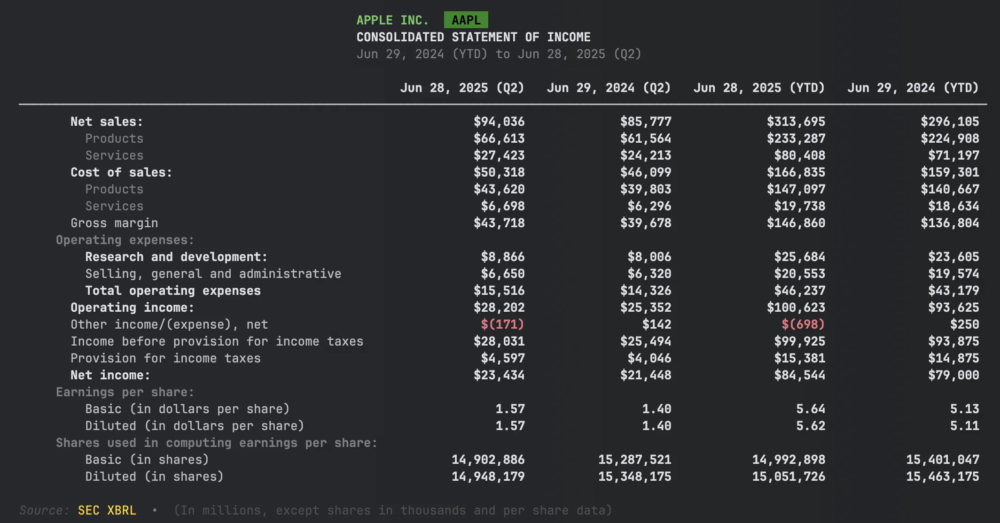
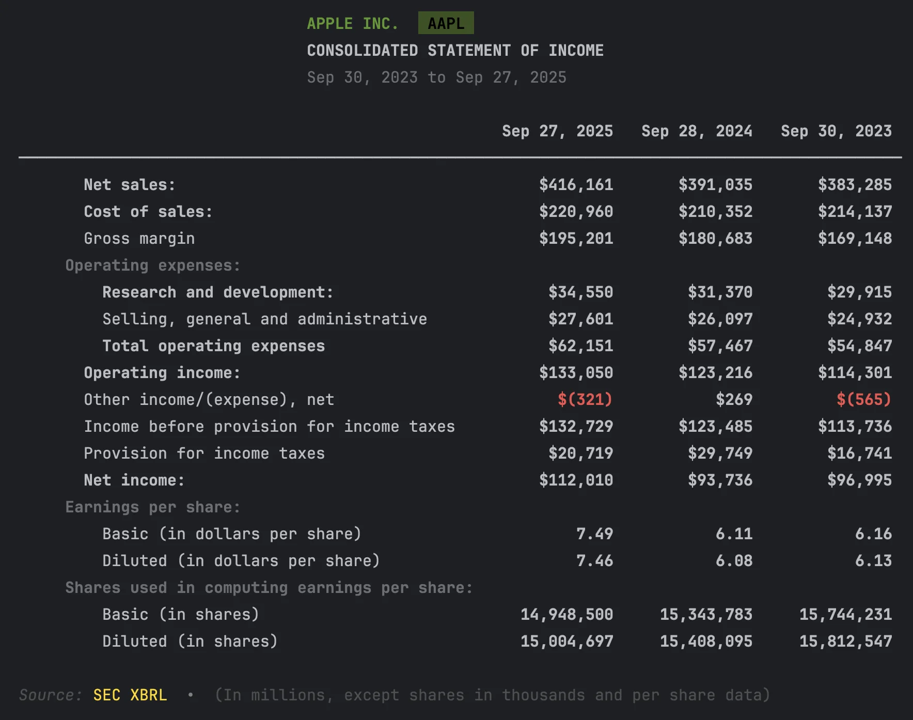
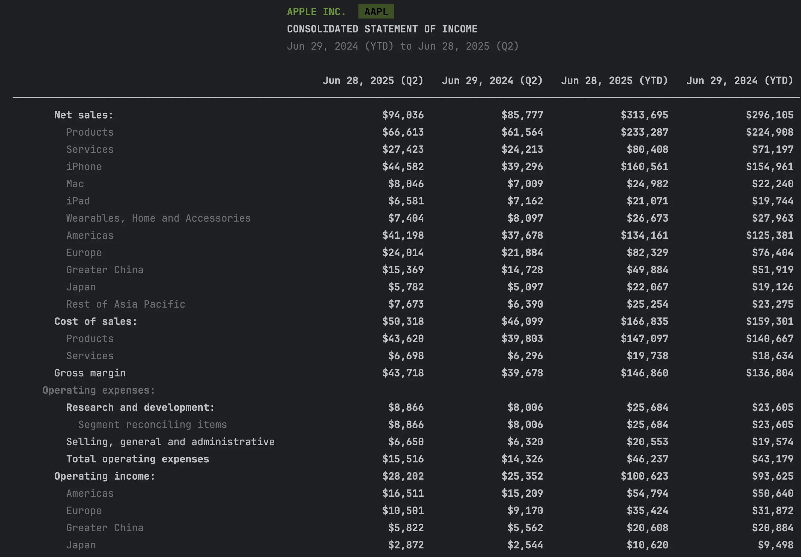

# Financial Statements: Income, Balance Sheet, and Cash Flow from SEC Filings

**Get financial statements from SEC filings in Python**

## Quick Start

Three lines to Apple's income statement:

```python
from edgar import Company

company = Company("AAPL")
financials = company.get_financials()
income_statement = financials.income_statement()
```


That's it. You now have Apple's full income statement from their latest 10-K filing.

---

## Get Specific Values

Need just one number? Use the convenience methods:

```python
financials = company.get_financials()

revenue = financials.get_revenue()
net_income = financials.get_net_income()
total_assets = financials.get_total_assets()
```

| Method | Returns |
|--------|---------|
| `get_revenue()` | Total revenue / net sales |
| `get_net_income()` | Net income |
| `get_total_assets()` | Total assets |
| `get_total_liabilities()` | Total liabilities |
| `get_stockholders_equity()` | Stockholders' equity |
| `get_operating_cash_flow()` | Operating cash flow |
| `get_free_cash_flow()` | Free cash flow |
| `get_capital_expenditures()` | Capital expenditures |
| `get_current_assets()` | Current assets |
| `get_current_liabilities()` | Current liabilities |

All methods accept `period_offset` to access prior periods (0=current, 1=previous).

---

## Available Statements

```python
financials = company.get_financials()

income = financials.income_statement()
balance = financials.balance_sheet()
cashflow = financials.cashflow_statement()
equity = financials.statement_of_equity()
comprehensive = financials.comprehensive_income()
```

| Statement | Method |
|-----------|--------|
| Income Statement | `income_statement()` |
| Balance Sheet | `balance_sheet()` |
| Cash Flow Statement | `cashflow_statement()` |
| Statement of Equity | `statement_of_equity()` |
| Comprehensive Income | `comprehensive_income()` |

!!! tip "Cash flow naming"
    The method is `cashflow_statement()` (no underscore between "cash" and "flow"). The `Company` object also accepts `company.cash_flow()` as an alias, but on the `Financials` object always use `cashflow_statement()`.

---

## Export to DataFrame

Every statement converts to a pandas DataFrame:

```python
income = financials.income_statement()

# Convert to DataFrame
df = income.to_dataframe()

# Export to CSV
df.to_csv("apple_income_statement.csv")

# Export to Excel
df.to_excel("apple_income_statement.xlsx")
```

The DataFrame preserves the statement structure with labeled rows and period columns.

---

## Quarterly Financials

Use `get_quarterly_financials()` for 10-Q data:

```python
quarterly = company.get_quarterly_financials()
income = quarterly.income_statement()
```



| Need | Method |
|------|--------|
| Annual (10-K) | `company.get_financials()` |
| Quarterly (10-Q) | `company.get_quarterly_financials()` |

---


## Getting Different Levels of Detail

Financial statements can show different levels of detail. Use the `view` parameter to control what you see:

```python
financials = company.get_financials()

# Summary: Matches SEC Viewer (~15-20 rows)
income = financials.income_statement(view="summary")

# Standard: Matches the filing document (default)
income = financials.income_statement(view="standard")

# Detailed: All dimensional breakdowns
income = financials.income_statement(view="detailed")
```

### Summary View



### Detailed View



| View | Shows | Typical Rows | Best For |
|------|-------|--------------|----------|
| `"summary"` | Matches SEC Viewer | ~15-20 | Quick overview, validation |
| `"standard"` | Matches filing document | ~25-35 | Display, full context |
| `"detailed"` | All dimensional breakdowns | ~50+ | Data extraction, segment analysis |

### Example: Apple Revenue

With `view="summary"`:
```
Revenue                              $391,035M
```

With `view="standard"`:
```
Revenue:
  Products                           $298,085M
  Services                            $92,950M
```

With `view="detailed"`:
```
Revenue:
  Products                           $298,085M
    iPhone                           $201,183M
    Mac                               $29,357M
    iPad                              $26,694M
    Wearables, Home and Accessories   $40,851M
  Services                            $92,950M
```

### Views with DataFrames

The `view` parameter also works when exporting to DataFrame:

```python
income = financials.income_statement()

df_summary = income.to_dataframe(view="summary")
df_standard = income.to_dataframe(view="standard")
df_detailed = income.to_dataframe(view="detailed")
```

### When to Use Each View

- **Summary**: Quick checks, matches SEC Viewer, comparing many companies
- **Standard**: Matches the filing document, full context with face-level dimensions
- **Detailed**: Data extraction, segment analysis, complete dimensional breakdowns

**Learn more:** [Dimension Handling Guide](../xbrl/concepts/dimension-handling.md)

---

## Compare Multiple Periods

To analyze trends across multiple filings, use `XBRLS`:

```python
from edgar.xbrl import XBRLS

# Get last 3 annual filings
filings = company.get_filings(form="10-K").head(3)

# Stitch them together
xbrls = XBRLS.from_filings(filings)

# Get income statement across all periods
income = xbrls.statements.income_statement()

# Use view="detailed" for dimensional breakdowns across periods
income_detailed = xbrls.statements.income_statement(view="detailed")
```

The `view` parameter works the same as on single-period statements (`"standard"`, `"detailed"`, `"summary"`).
This aligns the periods and concepts across filings for easy comparison.

**Learn more:** [Multi-Period Analysis Guide](../xbrl/guides/multi-period-analysis.md)

---

### Why skip amendments?

Use `amendments=False` when fetching filings. Amended filings (10-K/A) sometimes contain only the corrected sections, not complete financial statements.

---

## Advanced Topics

### Raw Facts Query

Query individual XBRL facts for research or custom calculations:

```python
xbrl = filing.xbrl()

# Find all revenue facts
revenue_facts = xbrl.facts.query()\
    .by_concept("Revenue")\
    .to_dataframe()

# Search by label
rd_facts = xbrl.facts.query()\
    .by_label("Research", exact=False)\
    .to_dataframe()
```

**Learn more:** [XBRL Querying Guide](../xbrl-querying.md)

---

## Troubleshooting

### "No financial data found"

Some companies (especially newer or smaller ones) may not have XBRL data:

```python
filing = company.get_filings(form="10-K").latest()
if filing.xbrl():
    print("XBRL available")
else:
    print("No XBRL - try filing.text() for raw content")
```

### "Statement is empty"

Try using the detailed view to include all dimensional data:

```python
df = income.to_dataframe(view="detailed")
```

### "Numbers don't match the SEC website"

Check that you're looking at the right period:

```python
xbrl = filing.xbrl()
print(xbrl.reporting_periods)
```

---

## API Quick Reference

### Company-Level (Easiest)

| Method | Description |
|--------|-------------|
| `company.get_financials()` | Latest annual financials (10-K) |
| `company.get_quarterly_financials()` | Latest quarterly financials (10-Q) |

### Financials Object

| Method | Description |
|--------|-------------|
| `financials.income_statement()` | Income statement |
| `financials.balance_sheet()` | Balance sheet |
| `financials.cashflow_statement()` | Cash flow statement |
| `financials.get_revenue()` | Revenue value |
| `financials.get_net_income()` | Net income value |
| `financials.get_total_assets()` | Total assets value |
| `financials.get_financial_metrics()` | Dict of all key metrics |

### Statement Object

| Method | Description |
|--------|-------------|
| `statement.to_dataframe()` | Convert to pandas DataFrame |
| `statement.to_dataframe(view="summary")` | Matches SEC Viewer |
| `statement.to_dataframe(view="standard")` | Matches filing document |
| `statement.to_dataframe(view="detailed")` | All dimensional breakdowns |

### Filing-Level (More Control)

| Method | Description |
|--------|-------------|
| `filing.xbrl()` | Parse XBRL from filing |
| `xbrl.statements.income_statement()` | Get income statement |
| `xbrl.facts.query()` | Query individual facts |

### Multi-Period Analysis

| Method | Description |
|--------|-------------|
| `XBRLS.from_filings(filings)` | Stitch multiple filings together |
| `xbrls.statements.income_statement()` | Aligned multi-period statement |

---

## Next Steps

- **[Stock Splits & EPS Normalization](stock-splits-eps-normalization.md)** – Detect splits and normalize per-share metrics
- **[Multi-Period Analysis](../xbrl/guides/multi-period-analysis.md)** – Build custom time series
- **[Standardization](../xbrl/concepts/standardization.md)** – How cross-company comparison works
- **[XBRL Documentation](../xbrl/index.md)** – Complete XBRL reference

---

[](https://edgar.tools)

Want to share SEC data with colleagues who don't use Python? 

**edgar.tools** provides the same data through a visual interface:

- **No code required** — Browse filings, view financials, search companies
- **Share with your team** — Analysts and executives can access data directly
- **REST API** — For JavaScript, mobile apps, or other non-Python integrations
- **MCP server** — Query SEC data through Claude and other AI assistants

[Try edgar.tools →](https://edgar.tools)

