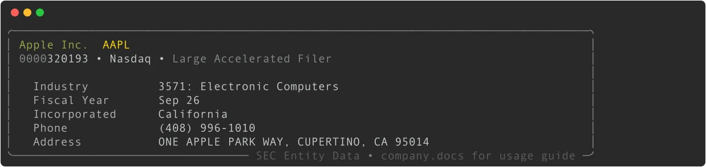
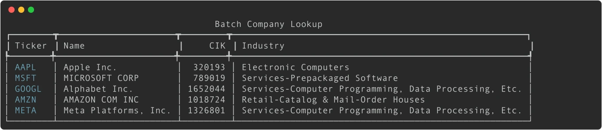
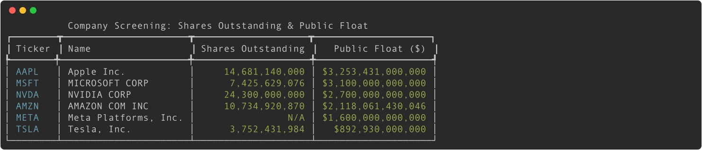
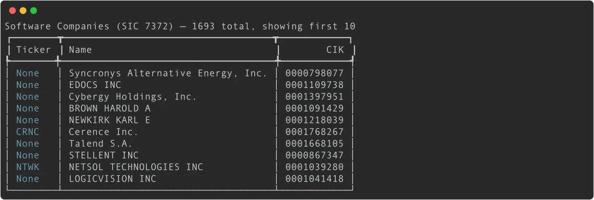
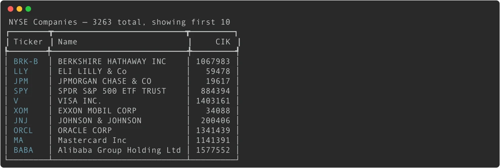

# Find SEC Companies by Ticker, CIK, or Name

Learn how to locate companies in the SEC database using tickers, CIKs, or company names.


## Method 1: Find by Ticker Symbol

The most common way to find a company is by its stock ticker symbol:

```python
from edgar import Company

# Find Apple by ticker (case-insensitive)
apple = Company("AAPL")
print(apple)
```



**Key points:**
- Tickers are case-insensitive: `Company("aapl")` works the same as `Company("AAPL")`
- This performs a ticker lookup then loads the company data
- Some companies have multiple tickers for the same entity

## Method 2: Find by CIK (Central Index Key)

The CIK uniquely identifies every SEC filer and is more reliable than tickers:

```python
# Using numeric CIK
apple = Company(320193)

# Using string CIK (with or without zero padding)
apple = Company("320193")
apple = Company("0000320193")

print(apple)
```

**Why use CIK:**
- **Unique**: Every company has exactly one CIK
- **Permanent**: CIKs don't change like tickers might
- **Faster**: Direct lookup without ticker resolution

## Method 3: Search by Company Name

When you don't know the exact ticker or CIK:

```python
from edgar import find

# Search for companies by name
results = find("Apple")
print(f"Found {len(results)} companies:")
for company in results:
    print(f"  {company.ticker}: {company.name}")
```

**Output:**
```plaintext
Found 3 companies:
  AAPL: Apple Inc.
  APPL: Apple Hospitality REIT Inc
  APOG: Apogee Enterprises Inc
```

**Then select the right one:**
```python
# Get the first result
apple = results[0]

# Or be more specific
apple = Company("AAPL")  # If you know the ticker from search
```

## Working with Company Objects

Once you have a Company object, you can access detailed information:

```python
company = Company("MSFT")

# Basic information
print(f"Name: {company.name}")
print(f"CIK: {company.cik}")
print(f"Ticker: {company.ticker}")
print(f"Industry: {company.industry}")
print(f"Website: {company.website}")
print(f"Location: {company.city}, {company.state}")

# SEC-specific information
print(f"SIC Code: {company.sic}")
print(f"Fiscal Year End: {company.fiscal_year_end}")
print(f"Exchange: {company.exchange}")
```

**Output:**
```plaintext
Name: Microsoft Corporation
CIK: 0000789019
Ticker: MSFT
Industry: SERVICES-PREPACKAGED SOFTWARE
Website: https://www.microsoft.com
Location: Redmond, WA
SIC Code: 7372
Fiscal Year End: 0630
Exchange: Nasdaq
```

## Handling Edge Cases

### Company Not Found
```python
try:
    company = Company("INVALID")
except Exception as e:
    print(f"Company not found: {e}")
    # Fallback to search
    results = find("Invalid Corp")
    if results:
        company = results[0]
    else:
        print("No companies found matching that name")
```

### Multiple Tickers for Same Company
```python
# Berkshire Hathaway has multiple share classes
brk_a = Company("BRK-A")  # Class A shares
brk_b = Company("BRK-B")  # Class B shares

# Both point to the same CIK and SEC filings
print(f"BRK-A CIK: {brk_a.cik}")
print(f"BRK-B CIK: {brk_b.cik}")
# Both will show: 0001067983
```

### Historical Tickers
```python
# Some companies change tickers over time
# The Company object will find the current entity
try:
    company = Company("FB")  # Meta's old ticker
    print(f"Found: {company.name}")  # May find Meta Platforms Inc
except:
    # Try the new ticker
    company = Company("META")
    print(f"Found: {company.name}")
```

## Batch Company Lookup

For analyzing multiple companies efficiently:

```python
from edgar import Company
import pandas as pd

tickers = ["AAPL", "MSFT", "GOOGL", "AMZN", "META"]
companies = []

for ticker in tickers:
    try:
        company = Company(ticker)
        companies.append({
            'ticker': ticker,
            'name': company.name,
            'cik': company.cik,
            'industry': company.industry,
        })
        print(f"Found {ticker}: {company.name}")
    except Exception as e:
        print(f"Error with {ticker}: {e}")

df = pd.DataFrame(companies)
print(df)
```



## Company Screening with Shares Outstanding & Public Float

Every public company reports **shares outstanding** and **public float** to the SEC. EdgarTools gives you direct access to these as simple properties:

```python
company = Company("AAPL")

# Shares outstanding — total common shares issued
print(f"Shares Outstanding: {company.shares_outstanding:,.0f}")
# 15,115,785,000

# Public float — dollar value of shares available for public trading
print(f"Public Float: ${company.public_float:,.0f}")
# $2,899,948,348,000
```

### Screen Multiple Companies

Build a screening table across any set of companies:

```python
import pandas as pd
from edgar import Company

tickers = ["AAPL", "MSFT", "NVDA", "AMZN", "META", "TSLA"]
rows = []

for ticker in tickers:
    company = Company(ticker)
    rows.append({
        'ticker': ticker,
        'name': company.name,
        'industry': company.industry,
        'shares_outstanding': company.shares_outstanding,
        'public_float': company.public_float,
    })

df = pd.DataFrame(rows)

# Sort by public float (largest first)
df = df.sort_values('public_float', ascending=False)
print(df.to_string(index=False))
```



### Filter by Float Size

```python
# Find mega-cap companies (float > $1 trillion)
mega_caps = df[df['public_float'] > 1e12]
print(f"Mega-cap companies: {list(mega_caps['ticker'])}")

# Find companies with low share count (< 1 billion shares)
low_share_count = df[df['shares_outstanding'] < 1e9]
print(f"Low share count: {list(low_share_count['ticker'])}")
```

## Advanced Search Techniques

### Search by Industry

Use the reference module to find companies by SIC industry code:

```python
from edgar.reference import get_companies_by_industry

# Get all software companies (SIC 7372)
software = get_companies_by_industry(sic=7372)
print(f"Found {len(software)} software companies")
print(software.head())
```



### Search by Exchange

```python
from edgar.reference import get_companies_by_exchanges

# Get all NYSE-listed companies
nyse = get_companies_by_exchanges("NYSE")
print(f"NYSE companies: {len(nyse)}")
print(nyse.head())

# Get Nasdaq companies
nasdaq = get_companies_by_exchanges("Nasdaq")
print(f"Nasdaq companies: {len(nasdaq)}")
```



### Search by State

```python
from edgar.reference import get_companies_by_state

# Get all companies incorporated in Delaware
delaware = get_companies_by_state("DE")
print(f"Delaware companies: {len(delaware)}")
```

### Search by Filing Activity
```python
from edgar import get_filings, Company
import pandas as pd

# Find companies that filed 8-K forms recently
recent_8k_filings = get_filings(form="8-K")

active_companies = []
for filing in recent_8k_filings.head(50):
    try:
        company = Company(filing.cik)
        active_companies.append({
            'ticker': company.ticker,
            'name': company.name,
            'filing_date': filing.filing_date,
            'cik': company.cik,
        })
    except Exception:
        continue

df = pd.DataFrame(active_companies)
recent_activity = df.sort_values('filing_date', ascending=False).head(10)
print(recent_activity)
```

## Performance Tips

1. **Use CIK when possible**: Faster than ticker lookup
2. **Cache company objects**: If analyzing the same companies repeatedly
3. **Batch processing**: Handle errors gracefully in loops
4. **Check data availability**: Not all companies have all fields populated

## Common Issues

### Ticker vs Company Name Confusion
```python
# This will fail - searching for ticker in name search
results = find("AAPL")  # Returns companies with "AAPL" in name, not ticker

# Use Company() for ticker lookup
company = Company("AAPL")  # Correct for ticker lookup
```

### International Companies
```python
# Some foreign companies trade on US exchanges
try:
    company = Company("ASML")  # Dutch company on NASDAQ
    print(f"Found: {company.name} in {company.country}")
except:
    print("Company not found or not SEC-registered")
```

### Delisted Companies
```python
# Some companies may be delisted but still have SEC filings
try:
    company = Company("1234567")  # Use CIK for delisted companies
    print(f"Company: {company.name}")
    print(f"Status: {'Active' if company.ticker else 'Possibly delisted'}")
except:
    print("Company not found in SEC database")
```

## Next Steps

Now that you can find and screen companies, learn how to:

- **[Company Facts & Financial Data](company-facts.md)** - Shares outstanding, public float, and financial statements
- **[Search for Specific Filings](searching-filings.md)** - Find the documents you need
- **[Extract Financial Statements](extract-statements.md)** - Get financial data
- **[Filter Filings by Date/Type](filtering-filings.md)** - Narrow down your search

## Related Documentation

- **[Company API Reference](../api/company.md)** - Complete Company class documentation
- **[Business Overview Data Sources](business-overview-data-sources-guide.md)** - Build company overview pages