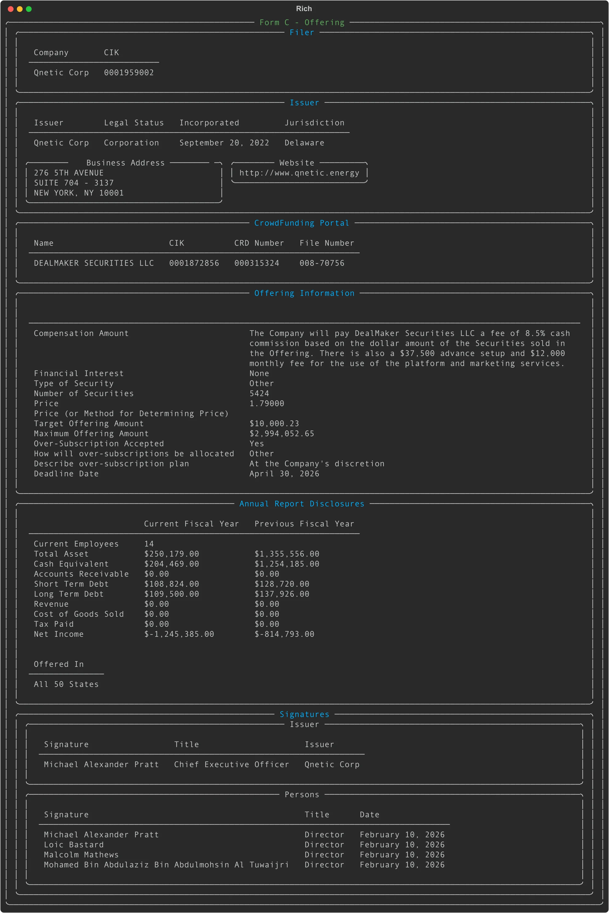

# Form C: Parse Crowdfunding Offerings (Regulation CF)

## Overview

**Form C** is an SEC filing used by companies raising capital through crowdfunding under Regulation Crowdfunding (Regulation CF). These filings provide insights into small business fundraising campaigns, including offering terms, issuer financials, and funding portal information.

The `FormC` class in edgartools parses Form C XML filings into structured Python objects, making it easy to track crowdfunding campaigns, analyze issuer financials, and monitor offering progress.

## What Form C Covers

Form C encompasses several filing types that track the complete lifecycle of a crowdfunding offering:

- **Form C** - Initial crowdfunding offering
- **Form C/A** - Amendment to the offering
- **Form C-U** - Progress update during the offering period
- **Form C-AR** - Annual report (filed yearly after offering closes)
- **Form C-TR** - Termination report (when offering is withdrawn)

## Access Pattern

```python
from edgar import get_filings

# Get recent Form C filings
filing = get_filings(form="C").head(1)[0]

# Parse into FormC object
formc = filing.obj()

# Access offering details
print(f"{formc.issuer_name}")
print(f"Target: ${formc.offering_information.target_amount:,.0f}")
print(f"Maximum: ${formc.offering_information.maximum_offering_amount:,.0f}")
print(f"Deadline: {formc.offering_information.deadline_date}")
```

When you call `filing.obj()` on a Form C filing, edgartools displays a rich formatted panel showing all filing details:



---

## Core Data Structure

### FormC (Top-Level Object)

| Property | Type | Description |
|----------|------|-------------|
| `filer_information` | `FilerInformation` | CIK, filing period, test/live flag |
| `issuer_information` | `IssuerInformation` | Company name, address, website, legal status, jurisdiction |
| `offering_information` | `Optional[OfferingInformation]` | Offering terms (present in C, C-U; absent in C-AR, C-TR) |
| `annual_report_disclosure` | `Optional[AnnualReportDisclosure]` | Financial disclosures (present in C-AR) |
| `signature_info` | `SignatureInfo` | Officer and director signatures |
| `form` | `str` | Form type (C, C/A, C-U, C-AR, C-TR) |
| `description` | `str` | Human-readable form description |
| `issuer_name` | `str` | Convenience property for issuer name |
| `portal_name` | `Optional[str]` | Funding portal name (if present) |
| `campaign_status` | `str` | Derived status (Active, Terminated, Annual Report, etc.) |
| `days_to_deadline` | `Optional[int]` | Days until offering deadline (negative if expired) |
| `is_expired` | `bool` | Whether offering deadline has passed |

### Computed Properties

| Property | Returns | Description |
|----------|---------|-------------|
| `issuer` | `IssuerCompany` | Company wrapper with offering-specific methods |
| `docs` | `Docs` | Access comprehensive API documentation |

### Methods

| Method | Returns | Description |
|--------|---------|-------------|
| `get_offering()` | `Offering` | Complete offering lifecycle (all related filings) |
| `to_context(detail)` | `str` | Token-efficient text representation for AI context |

---

## Offering Information

The `offering_information` property contains the core fundraising terms. It is present in Form C and Form C-U but **not** in Form C-AR or C-TR.

### OfferingInformation

| Property | Type | Description |
|----------|------|-------------|
| `compensation_amount` | `str` | Portal fees and compensation structure |
| `security_offered_type` | `Optional[str]` | Type of security (Equity, Debt, Other) |
| `security_offered_other_desc` | `Optional[str]` | Description if type is "Other" |
| `offering_amount` | `Optional[float]` | Target offering amount in dollars |
| `maximum_offering_amount` | `Optional[float]` | Maximum offering amount (for over-subscription) |
| `price` | `Optional[str]` | Price per security (as string) |
| `no_of_security_offered` | `Optional[str]` | Number of securities offered (as string) |
| `deadline_date` | `Optional[date]` | Offering deadline |
| `over_subscription_accepted` | `Optional[str]` | "Y" or "N" |
| `over_subscription_allocation_type` | `Optional[str]` | How over-subscriptions are allocated |
| `price_determination_method` | `Optional[str]` | How price was determined |

### Computed Properties

| Property | Returns | Description |
|----------|---------|-------------|
| `security_description` | `str` | Combined type and description |
| `target_amount` | `Optional[float]` | Alias for `offering_amount` |
| `offering_deadline` | `Optional[date]` | Alias for `deadline_date` |
| `price_per_security` | `Optional[float]` | Price parsed as float |
| `number_of_securities` | `Optional[int]` | Number of securities as int |
| `percent_to_maximum` | `Optional[float]` | Target as percentage of maximum |

### Example: Analyzing Offering Terms

```python
from edgar import get_filings

filing = get_filings(form="C").head(1)[0]
formc = filing.obj()

offering = formc.offering_information
if offering:
    print(f"Security: {offering.security_description}")
    print(f"Target: ${offering.target_amount:,.0f}")
    print(f"Maximum: ${offering.maximum_offering_amount:,.0f}")
    print(f"Target is {offering.percent_to_maximum:.0f}% of maximum")

    if offering.price_per_security and offering.number_of_securities:
        print(f"Price: ${offering.price_per_security:.2f} per unit")
        print(f"Units: {offering.number_of_securities:,}")

    # Check deadline
    days_left = formc.days_to_deadline
    if days_left is not None:
        if days_left > 0:
            print(f"Deadline: {days_left} days remaining")
        else:
            print(f"Offering expired {abs(days_left)} days ago")
```

---

## Financial Disclosures

The `annual_report_disclosure` property contains financial statements for the current and prior fiscal year. It is present in **Form C-AR** (annual reports) and sometimes in Form C.

### AnnualReportDisclosure

| Property | Type | Description |
|----------|------|-------------|
| `current_employees` | `int` | Number of employees |
| `total_asset_most_recent_fiscal_year` | `float` | Total assets (current year) |
| `total_asset_prior_fiscal_year` | `float` | Total assets (prior year) |
| `cash_equi_most_recent_fiscal_year` | `float` | Cash and equivalents (current) |
| `cash_equi_prior_fiscal_year` | `float` | Cash and equivalents (prior) |
| `act_received_most_recent_fiscal_year` | `float` | Accounts receivable (current) |
| `act_received_prior_fiscal_year` | `float` | Accounts receivable (prior) |
| `short_term_debt_most_recent_fiscal_year` | `float` | Short-term debt (current) |
| `short_term_debt_prior_fiscal_year` | `float` | Short-term debt (prior) |
| `long_term_debt_most_recent_fiscal_year` | `float` | Long-term debt (current) |
| `long_term_debt_prior_fiscal_year` | `float` | Long-term debt (prior) |
| `revenue_most_recent_fiscal_year` | `float` | Revenue (current) |
| `revenue_prior_fiscal_year` | `float` | Revenue (prior) |
| `cost_goods_sold_most_recent_fiscal_year` | `float` | Cost of goods sold (current) |
| `cost_goods_sold_prior_fiscal_year` | `float` | Cost of goods sold (prior) |
| `tax_paid_most_recent_fiscal_year` | `float` | Taxes paid (current) |
| `tax_paid_prior_fiscal_year` | `float` | Taxes paid (prior) |
| `net_income_most_recent_fiscal_year` | `float` | Net income (current) |
| `net_income_prior_fiscal_year` | `float` | Net income (prior) |
| `offering_jurisdictions` | `List[str]` | States where offering is available |

### Computed Financial Metrics

| Property | Returns | Description |
|----------|---------|-------------|
| `total_debt_most_recent` | `float` | Short-term + long-term debt (current year) |
| `total_debt_prior` | `float` | Short-term + long-term debt (prior year) |
| `debt_to_asset_ratio` | `Optional[float]` | Debt-to-asset ratio as percentage |
| `revenue_growth_yoy` | `Optional[float]` | Year-over-year revenue growth percentage |
| `asset_growth_yoy` | `Optional[float]` | Year-over-year asset growth percentage |
| `is_pre_revenue` | `bool` | True if no revenue in current year |
| `burn_rate_change` | `Optional[float]` | Change in net income (shows burn rate trend) |

### Convenience Aliases (Most Recent Year)

For easier access to current year data:

| Property | Returns | Maps To |
|----------|---------|---------|
| `total_assets` | `float` | `total_asset_most_recent_fiscal_year` |
| `cash_and_cash_equivalents` | `float` | `cash_equi_most_recent_fiscal_year` |
| `accounts_receivable` | `float` | `act_received_most_recent_fiscal_year` |
| `short_term_debt` | `float` | `short_term_debt_most_recent_fiscal_year` |
| `long_term_debt` | `float` | `long_term_debt_most_recent_fiscal_year` |
| `revenues` | `float` | `revenue_most_recent_fiscal_year` |
| `cost_of_goods_sold` | `float` | `cost_goods_sold_most_recent_fiscal_year` |
| `taxes_paid` | `float` | `tax_paid_most_recent_fiscal_year` |
| `net_income` | `float` | `net_income_most_recent_fiscal_year` |
| `number_of_employees` | `int` | `current_employees` |

### Example: Analyzing Issuer Financials

```python
from edgar import get_filings

# Get a Form C-AR (annual report)
filing = get_filings(form="C-AR").head(1)[0]
formc_ar = filing.obj()

financials = formc_ar.annual_report_disclosure
if financials:
    # Basic metrics
    print(f"Employees: {financials.number_of_employees}")
    print(f"Total Assets: ${financials.total_assets:,.0f}")
    print(f"Cash: ${financials.cash_and_cash_equivalents:,.0f}")

    # Revenue analysis
    if financials.is_pre_revenue:
        print("Status: Pre-revenue")
    else:
        print(f"Revenue: ${financials.revenues:,.0f}")
        if financials.revenue_growth_yoy is not None:
            print(f"Revenue Growth: {financials.revenue_growth_yoy:+.1f}% YoY")

    # Profitability
    print(f"Net Income: ${financials.net_income:,.0f}")

    # Debt analysis
    total_debt = financials.total_debt_most_recent
    if total_debt > 0:
        print(f"Total Debt: ${total_debt:,.0f}")
        if financials.debt_to_asset_ratio:
            print(f"Debt-to-Asset Ratio: {financials.debt_to_asset_ratio:.0f}%")
```

---

## Issuer Information

### IssuerInformation

The `issuer_information` property contains company details.

| Property | Type | Description |
|----------|------|-------------|
| `name` | `str` | Legal name of the issuing company |
| `address` | `Address` | Business address |
| `website` | `str` | Company website |
| `co_issuer` | `bool` | Whether there is a co-issuer |
| `funding_portal` | `Optional[FundingPortal]` | Crowdfunding portal intermediary |
| `legal_status` | `str` | Legal structure (Corporation, LLC, etc.) |
| `jurisdiction` | `str` | State/country of incorporation |
| `date_of_incorporation` | `date` | Date company was formed |

### FundingPortal

The intermediary platform facilitating the crowdfunding raise.

| Property | Type | Description |
|----------|------|-------------|
| `name` | `str` | Portal name (e.g., "StartEngine", "Wefunder") |
| `cik` | `str` | SEC Central Index Key for the portal |
| `crd` | `Optional[str]` | FINRA CRD number |
| `file_number` | `str` | SEC commission file number for the portal |

### IssuerCompany

The `issuer` property returns an `IssuerCompany` object that provides offering-specific methods:

| Method | Returns | Description |
|--------|---------|-------------|
| `as_company()` | `Company` | Convert to full Company object |
| `get_offerings()` | `List[Offering]` | All crowdfunding offerings by this issuer |
| `latest_offering()` | `Optional[Offering]` | Most recent offering |

### Example: Working with Issuers

```python
from edgar import get_filings

filing = get_filings(form="C").head(1)[0]
formc = filing.obj()

# Basic issuer info
print(f"Company: {formc.issuer_name}")
print(f"Incorporated: {formc.issuer_information.jurisdiction} "
      f"({formc.issuer_information.date_of_incorporation.year})")
print(f"Website: {formc.issuer_information.website}")

# Funding portal
if formc.portal_name:
    print(f"Portal: {formc.portal_name}")

# Get all offerings by this company
issuer = formc.issuer
offerings = issuer.get_offerings()
print(f"{issuer.name} has {len(offerings)} crowdfunding offerings")

# Convert to full Company object for more data
company = issuer.as_company()
print(f"All SEC filings: {len(company.get_filings())}")
```

---

## Offering Lifecycle

Each crowdfunding campaign goes through multiple filing stages. The `get_offering()` method returns an `Offering` object that tracks the complete lifecycle.

### Example: Tracking an Offering Over Time

```python
from edgar import get_filings

# Get a Form C filing
filing = get_filings(form="C").head(1)[0]
formc = filing.obj()

# Get the complete offering lifecycle
offering = formc.get_offering()

# View all filings for this offering
print(offering.timeline())

# Access specific filing types
initial_filing = offering.initial()      # Original Form C
updates = offering.updates()             # Form C-U progress updates
annual_reports = offering.annual_reports()  # Form C-AR reports
amendments = offering.amendments()       # Form C/A amendments
```

---

## Form Variants and Data Availability

Different Form C variants contain different data sections:

| Form | `offering_information` | `annual_report_disclosure` | `funding_portal` |
|------|----------------------|---------------------------|------------------|
| **C** | Yes | Sometimes | Yes |
| **C/A** | Yes | Sometimes | Yes |
| **C-U** | Limited | Sometimes | Yes |
| **C-AR** | No | Yes | No |
| **C-TR** | No | No | Usually minimal |

**Key patterns:**

- **Form C** (initial offering): Has full offering terms and portal info
- **Form C-U** (progress update): May have limited offering info updates
- **Form C-AR** (annual report): Has financial disclosures, no offering terms
- **Form C-TR** (termination): Minimal data, indicates offering withdrawn

Always check for `None` before accessing `offering_information` or `annual_report_disclosure`:

```python
if formc.offering_information:
    print(f"Target: ${formc.offering_information.target_amount:,.0f}")

if formc.annual_report_disclosure:
    print(f"Revenue: ${formc.annual_report_disclosure.revenues:,.0f}")
```

---

## Signature Information

### SignatureInfo

| Property | Type | Description |
|----------|------|-------------|
| `issuer_signature` | `IssuerSignature` | Company signature |
| `signatures` | `List[PersonSignature]` | Individual officer/director signatures |
| `signers` | `List[Signer]` | Consolidated list of unique signers |

### IssuerSignature

| Property | Type | Description |
|----------|------|-------------|
| `issuer` | `str` | Company name as signed |
| `title` | `str` | Title of signer (e.g., "Chief Executive Officer") |
| `signature` | `str` | Signature as signed |

### PersonSignature

| Property | Type | Description |
|----------|------|-------------|
| `signature` | `str` | Person's name as signed |
| `title` | `str` | Title (e.g., "Director") |
| `date` | `date` | Date signed |

---

## Common Use Cases

### Finding Active Offerings

```python
from edgar import get_filings

# Get recent Form C filings
active_offerings = get_filings(form="C").head(20)

for filing in active_offerings:
    formc = filing.obj()

    # Filter for non-expired offerings
    if not formc.is_expired and formc.offering_information:
        offering = formc.offering_information
        print(f"{formc.issuer_name}")
        print(f"  Target: ${offering.target_amount:,.0f}")
        print(f"  Deadline: {offering.deadline_date}")
        print(f"  Days left: {formc.days_to_deadline}")
        print()
```

### Analyzing Issuer Financial Health

```python
from edgar import get_filings

# Get Form C-AR annual reports
annual_reports = get_filings(form="C-AR").head(10)

for filing in annual_reports:
    formc = filing.obj()
    fin = formc.annual_report_disclosure

    if fin:
        print(f"{formc.issuer_name}")
        print(f"  Assets: ${fin.total_assets:,.0f}")
        print(f"  Cash: ${fin.cash_and_cash_equivalents:,.0f}")

        if fin.is_pre_revenue:
            print(f"  Status: Pre-revenue")
        else:
            print(f"  Revenue: ${fin.revenues:,.0f}")
            if fin.revenue_growth_yoy:
                print(f"  Growth: {fin.revenue_growth_yoy:+.1f}% YoY")

        print(f"  Net Income: ${fin.net_income:,.0f}")
        print()
```

### Tracking a Company's Crowdfunding History

```python
from edgar import Company

# Get a company that has done crowdfunding
company = Company("1881570")  # Example: ViiT Health

# Get all crowdfunding filings
cf_filings = company.get_filings(form=['C', 'C/A', 'C-U', 'C-AR', 'C-TR'])

# Group by offering
from edgar.offerings.formc import group_offerings_by_file_number
grouped = group_offerings_by_file_number(cf_filings)

print(f"{company.name} has {len(grouped)} crowdfunding offerings")

for file_num, offering_filings in grouped.items():
    print(f"\nOffering {file_num}:")
    for filing in offering_filings:
        print(f"  {filing.form:8} - {filing.filing_date}")
```

---

## AI-Optimized Context

The `to_context()` method provides a token-efficient text representation optimized for AI/LLM context windows:

```python
from edgar import get_filings

filing = get_filings(form="C").head(1)[0]
formc = filing.obj()

# Minimal detail (~100-200 tokens)
print(formc.to_context(detail='minimal'))

# Standard detail (~300-500 tokens)
print(formc.to_context(detail='standard'))

# Full detail (~600-1000 tokens)
print(formc.to_context(detail='full'))
```

This is useful when passing Form C data to language models or building AI-powered analysis tools.

---

## Quick Reference

### Properties Quick Lookup

| Access | Returns | Example |
|--------|---------|---------|
| `formc.issuer_name` | `str` | Company name |
| `formc.portal_name` | `Optional[str]` | Funding portal |
| `formc.campaign_status` | `str` | "Active", "Terminated", etc. |
| `formc.days_to_deadline` | `Optional[int]` | Days remaining (negative if expired) |
| `formc.is_expired` | `bool` | Deadline passed? |
| `formc.offering_information` | `Optional[OfferingInformation]` | Offering terms |
| `formc.annual_report_disclosure` | `Optional[AnnualReportDisclosure]` | Financial data |
| `formc.issuer` | `IssuerCompany` | Company wrapper with offering methods |

### Methods Quick Lookup

| Method | Returns | Use Case |
|--------|---------|----------|
| `formc.get_offering()` | `Offering` | Get complete offering lifecycle |
| `formc.to_context(detail)` | `str` | Token-efficient text for AI |
| `formc.issuer.get_offerings()` | `List[Offering]` | All offerings by this company |
| `formc.issuer.as_company()` | `Company` | Convert to full Company object |

---

## Things to Know

**Monetary amounts are floats.** All dollar amounts are parsed as floats and can be used directly in calculations.

**Check for None before accessing optional sections.** The `offering_information` and `annual_report_disclosure` fields may be `None` depending on the form type.

**Deadlines can be in the past.** Use `days_to_deadline` to check if an offering is still active. Negative values mean the deadline has passed.

**Pre-revenue companies are common.** Many crowdfunding issuers have zero revenue. Use `is_pre_revenue` to detect this.

**Portal file numbers identify the portal, not the offering.** To track a specific offering, use the issuer file number from `filing.file_number` or the `Offering` object.

**Form C-AR has no offering information.** Annual reports focus on financial disclosures and don't include the original offering terms.

**State jurisdictions are abbreviated.** The `jurisdiction` field uses state codes like "DE", "CA", "NY".

---

## Related

- **User Guide:** Working with Form C Filings (coming soon)
- **API Reference:** `edgar.offerings.formc` module
- **Related Filings:** [Form D: Private Placements](formd-data-object-guide.md)
- **Company Data:** [Find a Company](finding-companies.md)
