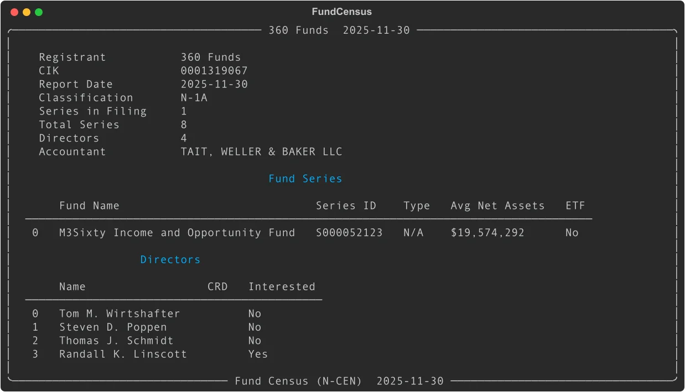

# Fund Census (N-CEN): Parse Annual Fund Reports with Python

Every registered investment company files Form N-CEN annually -- a comprehensive census of fund operational data. EdgarTools parses these filings into structured Python objects, revealing fund series, service providers, board composition, ETF mechanics, broker relationships, and securities lending programs.

```python
from edgar import get_filings

filings = get_filings(form="N-CEN")
census = filings[0].obj()
census
```



Three lines to get a fully parsed annual census with registrant info, fund series, directors, and all operational disclosures.

---

## Access Series Data

The `series_data()` method returns a DataFrame with one row per fund series, showing assets, commission totals, and service provider counts:

```python
census.series_data()
```

| Column | What it is |
|--------|-----------|
| `name` | Fund series name |
| `series_id` | SEC series identifier (e.g., `"S000052123"`) |
| `lei` | Legal Entity Identifier |
| `fund_type` | Fund classification |
| `avg_net_assets` | Average monthly net assets |
| `aggregate_commission` | Total broker commissions paid |
| `num_advisers` | Count of investment advisers |
| `num_custodians` | Count of custodians |
| `has_etf` | Whether series has ETF structure |

Average net assets and commission figures are in full dollars (not thousands). An `avg_net_assets` of 19,574,292 means exactly $19.6 million.

---

## Access Service Provider Network

See who manages, custodies, administers, and services the funds:

```python
census.service_providers()
```

Returns a DataFrame with all service providers flattened across fund series:

| Column | What it is |
|--------|-----------|
| `series_name` | Fund series name |
| `series_id` | Series identifier |
| `role` | Provider role (`"adviser"`, `"custodian"`, `"transfer agent"`, etc.) |
| `provider_name` | Provider firm name |
| `lei` | Legal Entity Identifier |
| `affiliated` | Whether provider is affiliated with the fund |

This includes advisers, custodians, transfer agents, administrators, pricing services, and shareholder servicing agents -- everyone touching the fund's operations.

---

## Analyze Broker Relationships

N-CEN discloses broker-dealer and broker commission payments:

```python
census.broker_data()
```

| Column | What it is |
|--------|-----------|
| `series_name` | Fund series name |
| `series_id` | Series identifier |
| `type` | `"broker-dealer"` or `"broker"` |
| `broker_name` | Firm name |
| `lei` | Legal Entity Identifier |
| `commission` | Commission amount paid |

Commission values are in full dollars. Use this to analyze broker concentration and trading costs across the fund complex.

---

## Examine Board Composition

Access the board of directors with interested-person flags:

```python
census.director_data()
```

| Column | What it is |
|--------|-----------|
| `name` | Director name |
| `crd_number` | CRD identifier (if registered) |
| `interested_person` | Whether director is an interested person under the '40 Act |

Directors marked as "interested persons" have material relationships with the fund or its adviser. Independent directors are not interested persons.

---

## Access ETF-Specific Data

For funds with ETF structures, get creation/redemption mechanics and authorized participants:

```python
census.etf_data()
```

Returns a DataFrame with ETF-specific metrics:

| Column | What it is |
|--------|-----------|
| `series_name` | Fund series name |
| `series_id` | Series identifier |
| `exchange` | Primary exchange (e.g., `"NYSE"`, `"NASDAQ"`) |
| `ticker` | Trading symbol |
| `creation_unit_size` | Number of shares per creation unit |
| `avg_pct_purchased_in_kind` | Average percentage of creations settled in-kind |
| `avg_pct_redeemed_in_kind` | Average percentage of redemptions settled in-kind |
| `is_in_kind` | Whether fund permits in-kind transactions |
| `num_authorized_participants` | Count of authorized participants |

This DataFrame is empty for fund complexes without ETFs. Always check with `df.empty` before analysis.

---

## Look Up a Specific Fund Complex

Search by management company CIK or name:

```python
from edgar import Company

company = Company("VANGUARD")
filing = company.get_filings(form="N-CEN").latest(1)
census = filing.obj()

print(census.name)                      # Registrant name
print(f"{census.num_series} series")    # Series count in this filing
print(census.report_date)               # Report period end
```

A single N-CEN filing may cover multiple fund series, or just one series from a larger complex. Check `census.total_series` to see how many series the registrant has total.

---

## Common Analysis Patterns

### Service provider concentration

```python
providers = census.service_providers()
# Count unique providers per role
providers.groupby('role')['provider_name'].nunique()

# Find affiliated providers
affiliated = providers[providers['affiliated'] == True]
```

### Commission analysis

```python
brokers = census.broker_data()
if not brokers.empty:
    # Top brokers by commission
    top_brokers = brokers.groupby('broker_name')['commission'].sum().sort_values(ascending=False)
    print(top_brokers.head(10))
```

### Board independence

```python
directors = census.director_data()
total = len(directors)
interested = directors['interested_person'].sum()
independent = total - interested
print(f"Board composition: {independent} independent, {interested} interested")
```

### ETF creation mechanics

```python
etf = census.etf_data()
if not etf.empty:
    for idx, row in etf.iterrows():
        print(f"{row['ticker']}: {row['avg_pct_purchased_in_kind']:.1f}% in-kind purchases")
```

---

## Access Individual Objects

The FundCensus class uses Pydantic models for structured access to all fund census data. These are useful when building custom applications or exporting to other formats.

### Registrant Information

```python
reg = census.registrant

print(reg.name)                    # Registrant name
print(reg.cik)                     # CIK
print(reg.classification_type)     # Fund classification
print(reg.total_series)            # Total series count
print(reg.accountant.name)         # Public accountant
print(reg.cco_name)                # Chief Compliance Officer
```

### Fund Series

```python
for series in census.series:
    print(f"{series.name} ({series.series_id})")
    print(f"  Advisers: {len(series.advisers)}")
    print(f"  Custodians: {len(series.custodians)}")
    print(f"  Securities lending: {series.is_securities_lending}")

    # ETF details
    if series.etf_info:
        etf = series.etf_info
        print(f"  ETF ticker: {etf.ticker}")
        print(f"  Exchange: {etf.exchange}")
        print(f"  Creation unit: {etf.creation_unit_size}")
```

### Service Providers

```python
series = census.series[0]

# Investment advisers
for adviser in series.advisers:
    print(f"{adviser.name} - {adviser.role}")
    print(f"  Affiliated: {adviser.is_affiliated}")

# Custodians
for custodian in series.custodians:
    print(f"{custodian.name}")
```

### Broker Dealers

```python
series = census.series[0]

for bd in series.broker_dealers:
    print(f"{bd.name}")
    print(f"  Commission: ${bd.commission:,.2f}" if bd.commission else "  No commission reported")
    print(f"  LEI: {bd.lei}")
```

### Line of Credit

```python
series = census.series[0]

if series.line_of_credit:
    loc = series.line_of_credit
    if loc.has_line_of_credit:
        print(f"Line of credit: ${loc.size:,.0f}")
        print(f"Committed: {loc.is_committed}")
        print(f"Institutions: {', '.join(loc.institution_names)}")
```

### Securities Lending

```python
series = census.series[0]

for sl in series.securities_lending:
    print(f"Agent: {sl.agent_name}")
    print(f"  Affiliated: {sl.is_affiliated}")
    print(f"  Indemnified: {sl.is_indemnified}")
```

---

## Metadata Quick Reference

| Property | Returns | Example |
|----------|---------|---------|
| `name` | Registrant name | `"360 Funds"` |
| `cik` | CIK identifier | `"0001319067"` |
| `report_date` | Report period end date | `"2025-11-30"` |
| `num_series` | Number of series in filing | `1` |
| `total_series` | Total series registered | `8` |
| `classification_type` | Fund classification | `"N-1A"` |
| `is_etf_company` | Has any ETF series | `True` or `False` |
| `registrant` | RegistrantInfo object | Full registrant details |
| `series` | List of FundSeriesInfo | All series with full details |

---

## Methods Quick Reference

| Method | Returns | What it does |
|--------|---------|-------------|
| `series_data()` | `DataFrame` | Fund series summary with assets and counts |
| `service_providers()` | `DataFrame` | All service providers flattened across series |
| `broker_data()` | `DataFrame` | Broker-dealer and broker commission data |
| `director_data()` | `DataFrame` | Board of directors with interested-person flags |
| `etf_data()` | `DataFrame` | ETF-specific metrics for ETF series |

---

## Things to Know

**Values are in full dollars.** Unlike 13F filings (which report in thousands), N-CEN values are in actual USD. An `avg_net_assets` of 19,574,292 means exactly $19.6 million.

**Annual filings.** N-CEN is filed once per year, unlike monthly N-PORT or N-MFP reports. Each filing covers the fund's fiscal year.

**Multiple series.** A single N-CEN filing may cover one series or dozens, depending on how the fund complex structures its filings. Check `num_series` vs `total_series` to understand coverage.

**N/A sentinel values.** The XML uses "N/A" as a sentinel. EdgarTools converts these to `None` automatically.

**Boolean display.** Pydantic booleans render as "Yes/No" in the Rich display for readability.

**Service provider diversity.** Funds use many service provider types: advisers, custodians, transfer agents, administrators, pricing services, shareholder servicing agents. All are captured in `service_providers()`.

**ETF mechanics.** Only series with ETF structures have `etf_info` populated. Use `etf_data()` to filter to ETF series automatically.

**Securities lending.** Not all funds engage in securities lending. Check `is_securities_lending` or the length of `series.securities_lending`.

**Line of credit.** Funds may have committed or uncommitted lines of credit with one or more institutions. The `line_of_credit` object captures all details.

**Director CRD numbers.** Only registered directors have CRD numbers. Many directors won't have one -- this is normal.

---

## Related

- [Working with Filings](working-with-filing.md) -- general filing access patterns
- [Fund Portfolios (N-PORT)](nport-data-object-guide.md) -- monthly fund portfolio holdings
- [Money Market Funds (N-MFP)](moneymarketfund-data-object-guide.md) -- money market fund holdings and yields
