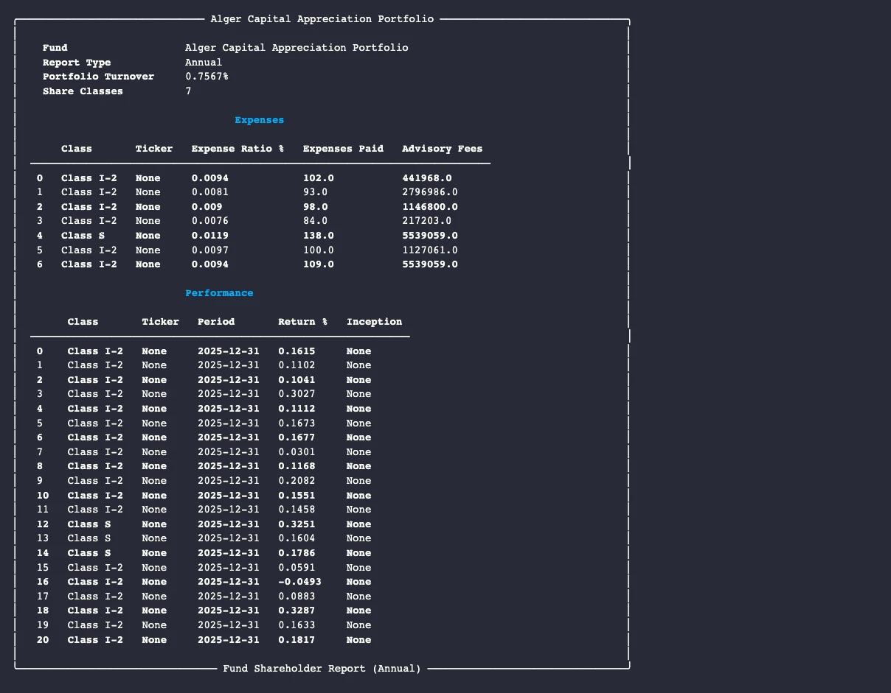

# Fund Shareholder Reports (N-CSR / N-CSRS): Parse Certified Shareholder Reports with Python

Registered investment companies file Form N-CSR annually and Form N-CSRS semiannually -- certified shareholder reports that include expense ratios, annual performance data, and top portfolio holdings for every share class. EdgarTools parses these Inline XBRL filings into structured Python objects using the OEF (Open-End Fund) taxonomy.

```python
from edgar import get_filings

filings = get_filings(form="N-CSR")
report = filings[0].obj()
report
```



Three lines to get a fully parsed certified shareholder report with fund name, net assets, expense ratios, and annual returns for every share class.

---

## Access Expense Data

The `expense_data()` method returns a DataFrame with one row per share class, showing expense ratios and fees paid during the period:

```python
report.expense_data()
```

| Column | What it is |
|--------|-----------|
| `class_name` | Share class name (e.g., `"Investor Shares"`, `"Admiral Shares"`) |
| `ticker` | Share class ticker symbol (if available) |
| `expense_ratio_pct` | Total expense ratio as a decimal fraction |
| `expenses_paid` | Total expenses paid in dollars during the period |
| `advisory_fees_paid` | Advisory fees paid in dollars during the period |

Expense ratios are stored as decimal fractions. An `expense_ratio_pct` of `0.0094` means a 0.94% expense ratio. Multiply by 100 to display as a percentage.

---

## Access Performance Data

The `performance_data()` method returns a DataFrame of average annual returns across all share classes and reporting periods:

```python
report.performance_data()
```

| Column | What it is |
|--------|-----------|
| `class_name` | Share class name |
| `ticker` | Share class ticker symbol |
| `period` | Return period label (e.g., `"1-Year"`, `"5-Year"`, `"10-Year"`) |
| `return_pct` | Average annual return as a decimal fraction |
| `inception_date` | Share class inception date (if reported) |

Returns are decimal fractions. A `return_pct` of `0.1615` means a 16.15% return. Use this DataFrame to compare performance across share classes and time horizons in a single query.

---

## Access Holdings Data

The `holdings_data()` method returns a DataFrame of top portfolio holdings disclosed in the report:

```python
report.holdings_data()
```

| Column | What it is |
|--------|-----------|
| `class_name` | Share class name |
| `holding` | Holding name derived from the XBRL dimension member |
| `pct_of_nav` | Holding as a percentage of net asset value (decimal fraction) |
| `pct_of_total_inv` | Holding as a percentage of total investments (decimal fraction) |

Holdings data availability varies significantly across filers. Some funds report detailed top-ten holdings; others omit this section entirely. Check `df.empty` before analysis.

---

## Look Up a Specific Fund

Search by management company name or CIK:

```python
from edgar import Company

company = Company("VANGUARD")
filing = company.get_filings(form="N-CSR").latest(1)
report = filing.obj()

print(report.fund_name)          # Fund name from the OEF taxonomy
print(report.report_type)        # "Annual"
print(report.num_share_classes)  # Number of share classes parsed
print(report.net_assets)         # Net assets (Decimal, or None)
```

A single N-CSR filing may cover multiple fund series within a complex. The `fund_name` property returns the first fund name found in the Inline XBRL document.

---

## Access Semiannual Reports

N-CSRS filings follow the same structure as N-CSR but cover the fund's semiannual period. The `is_annual` property distinguishes them:

```python
from edgar import get_filings

filings = get_filings(form="N-CSRS")
report = filings[0].obj()

print(report.report_type)  # "Semi-Annual"
print(report.is_annual)    # False
```

Both form types return the same `FundShareholderReport` object. All three DataFrame methods work identically for both annual and semiannual reports.

---

## Common Analysis Patterns

### Compare expense ratios across share classes

```python
expenses = report.expense_data()

# Display expense ratios as percentages
expenses["expense_ratio_pct_display"] = expenses["expense_ratio_pct"] * 100
print(expenses[["class_name", "ticker", "expense_ratio_pct_display"]].to_string(index=False))
```

### Sort share classes by long-term return

```python
perf = report.performance_data()

# Focus on 10-year returns
ten_year = perf[perf["period"].str.contains("10", na=False)].copy()
ten_year["return_display"] = ten_year["return_pct"] * 100
ten_year_sorted = ten_year.sort_values("return_display", ascending=False)
print(ten_year_sorted[["class_name", "ticker", "return_display"]])
```

### Check portfolio turnover

```python
if report.portfolio_turnover is not None:
    turnover_pct = float(report.portfolio_turnover) * 100
    print(f"Portfolio turnover: {turnover_pct:.1f}%")
else:
    print("Portfolio turnover not reported")
```

### Identify missing data before analysis

```python
expenses = report.expense_data()
performance = report.performance_data()
holdings = report.holdings_data()

for label, df in [("Expenses", expenses), ("Performance", performance), ("Holdings", holdings)]:
    if df.empty:
        print(f"{label}: not available in this filing")
    else:
        print(f"{label}: {len(df)} rows")
```

---

## Access Individual Objects

The `share_classes` list provides direct access to each share class's `ShareClassInfo` object. These are useful for custom display, export, or filtering logic.

### Iterate over share classes

```python
for sc in report.share_classes:
    ticker = f" ({sc.class_ticker})" if sc.class_ticker else ""
    print(f"{sc.class_name}{ticker}")
    print(f"  Expense ratio: {float(sc.expense_ratio_pct) * 100:.2f}%" if sc.expense_ratio_pct else "  Expense ratio: N/A")
    print(f"  Holdings reported: {sc.holdings_count}" if sc.holdings_count else "  Holdings count: N/A")
```

### Inspect annual returns for a single class

```python
sc = report.share_classes[0]

for ret in sc.annual_returns:
    if ret.return_pct is not None:
        print(f"  {ret.period_label}: {float(ret.return_pct) * 100:.2f}%")
```

### Inspect top holdings for a single class

```python
sc = report.share_classes[0]

for holding in sc.holdings:
    if holding.pct_of_nav is not None:
        print(f"  {holding.name}: {float(holding.pct_of_nav) * 100:.2f}% of NAV")
```

---

## Metadata Quick Reference

| Property | Returns | Example |
|----------|---------|---------|
| `fund_name` | Fund name from OEF taxonomy | `"Vanguard 500 Index Fund"` |
| `report_type` | `"Annual"` or `"Semi-Annual"` | `"Annual"` |
| `is_annual` | Whether this is an N-CSR (annual) report | `True` |
| `net_assets` | Net assets as `Decimal` (or `None`) | `Decimal("47382956000")` |
| `portfolio_turnover` | Turnover rate as decimal fraction (or `None`) | `Decimal("0.7567")` |
| `num_share_classes` | Number of share classes parsed | `3` |
| `share_classes` | `List[ShareClassInfo]` for all share classes | Full per-class data |
| `filing` | Source Filing object | `Filing` or `None` |
| `cik` | CIK of the filer | `"0000102909"` |
| `series_id` | SEC series ID | `"S000002277"` or `None` |

---

## Methods Quick Reference

| Method | Returns | What it does |
|--------|---------|-------------|
| `expense_data()` | `DataFrame` | Expense ratios and fees for all share classes |
| `performance_data()` | `DataFrame` | Average annual returns across all share classes and periods |
| `holdings_data()` | `DataFrame` | Top holdings by percentage of NAV for all share classes |

---

## Things to Know

**Values are decimal fractions, not percentages.** Expense ratios, portfolio turnover, and return values are all stored as decimals. An `expense_ratio_pct` of `0.0094` means 0.94%. Multiply by 100 before displaying to users.

**Net assets are in full dollars.** A `net_assets` value of `47382956000` means exactly $47.4 billion. There is no thousands scaling.

**Annual and semiannual reports use the same object.** N-CSR (annual) and N-CSRS (semiannual) filings both produce a `FundShareholderReport`. Use `is_annual` to distinguish them.

**XBRL is required.** `from_filing()` calls `filing.xbrl()` internally. If the filing does not contain Inline XBRL -- which is uncommon but possible for older filings -- `filing.obj()` returns `None`. Always check for `None` before accessing properties.

**Ticker symbols are often absent.** The OEF taxonomy includes a `ClassTicker` concept, but many filers do not populate it. The `class_ticker` field will be `None` for most share classes from smaller fund complexes.

**Holdings by NAV are sparsely populated.** The `pct_of_nav` field requires the filer to tag `oef:HoldingPctOfNav` against a `HoldingAxis` dimension. Many filers report only `holdings_count` (the total number of holdings) without disclosing individual holding percentages.

**Multiple fund series per filing.** A single N-CSR filing can cover multiple series from a fund family. Only the first `oef:FundName` fact is captured in `fund_name`. The DataFrame methods aggregate data across all discovered share classes regardless of series.

**Share class discovery uses ClassAxis dimensions.** Share classes are identified from the `oef:ClassAxis` dimension in the Inline XBRL. For single-class funds that do not use this dimension, a single placeholder class is constructed from undimensioned facts.

**Approximately 6,600 filings per year.** N-CSR and N-CSRS together account for roughly 6,623 annual filings from registered investment companies, covering thousands of individual fund series.

---

## Related

- [Fund Entities](fund-entity-guide.md) -- look up funds by ticker, navigate hierarchies
- [Working with Filings](working-with-filing.md) -- general filing access patterns
- [Fund Portfolios (N-PORT)](nport-data-object-guide.md) -- monthly fund portfolio holdings
- [Money Market Funds (N-MFP)](moneymarketfund-data-object-guide.md) -- money market fund holdings and yields
- [Fund Census (N-CEN)](fundcensus-data-object-guide.md) -- annual fund operational census with service provider data
