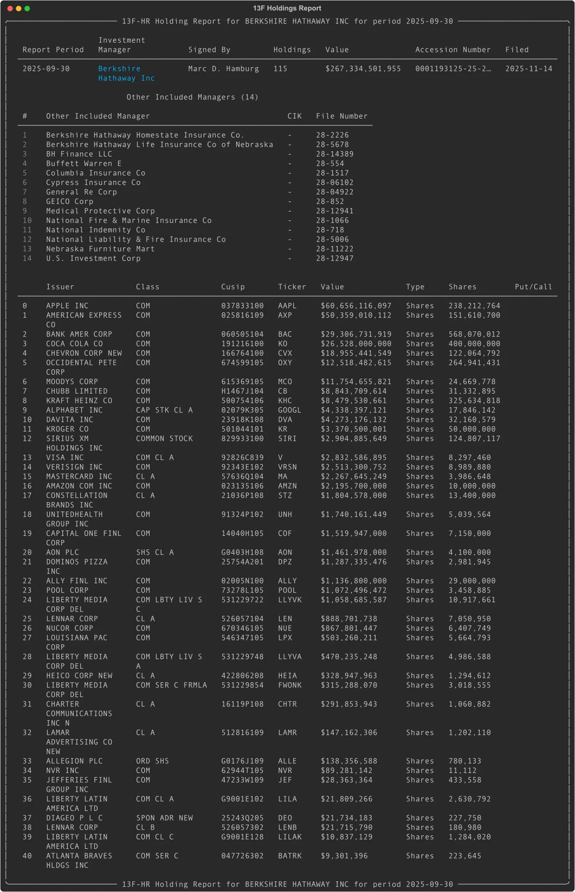
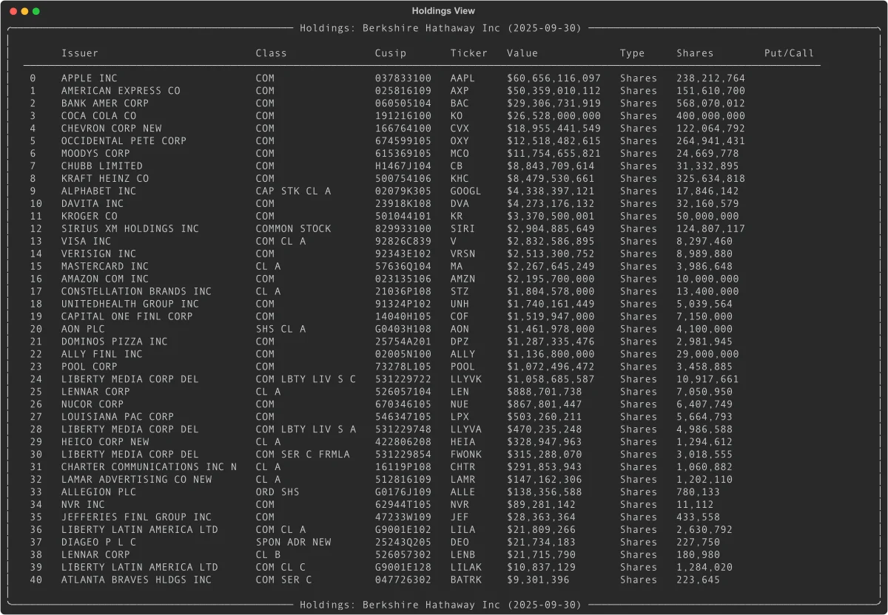
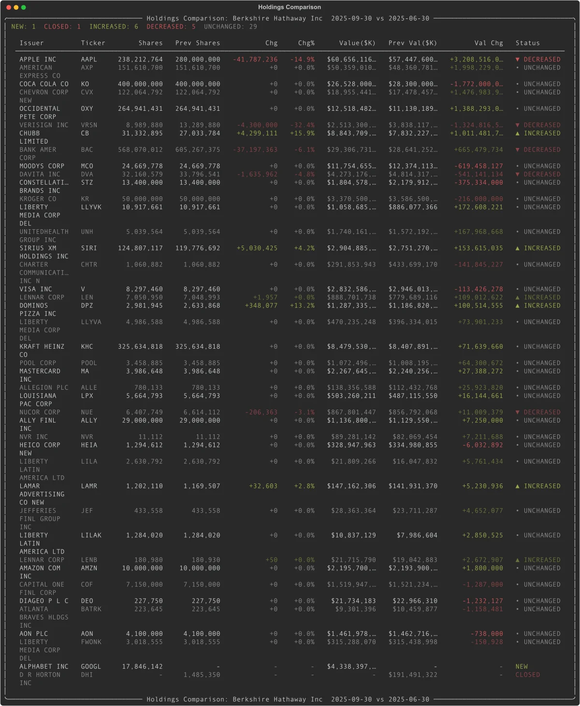

# Institutional Holdings: Analyze Hedge Fund Portfolios with Python

Every quarter, institutional investment managers with over $100 million in assets must disclose their equity holdings to the SEC via 13F filings. EdgarTools parses these filings into structured Python objects, giving you a window into what the biggest funds are buying and selling -- in a few lines of code.

```python
from edgar import Company

berkshire = Company("BRK.A")
report = berkshire.get_filings(form="13F-HR")[0].obj()
report
```



One call to `filing.obj()` and you get a fully parsed report: the investment manager, total portfolio value, every position, and the subsidiary managers involved.

---

## Find 13F Filings

### Search by Fund

If you know the fund's ticker or name, start with `Company`:

```python
from edgar import Company

# By ticker
berkshire = Company("BRK.A")
filings = berkshire.get_filings(form="13F-HR")

# Latest filing
report = filings[0].obj()
print(report.management_company_name)  # "Berkshire Hathaway Inc"
print(f"${report.total_value:,} across {report.total_holdings} holdings")
```

### Search Across All Filers

To browse 13F filings market-wide, use `get_filings`:

```python
from edgar import get_filings

# All 13F holdings reports filed in Q3 2024
filings = get_filings(form="13F-HR", year=2024, quarter=3)

# Filter to a specific date range
filings = get_filings(
    form="13F-HR",
    filing_date="2024-11-01:2024-11-15"
)
```

---

## Access Holdings Data

The `.holdings` property returns a pandas DataFrame with one row per security, sorted by value:

```python
report.holdings_view()
```



Every position includes the issuer name, resolved ticker symbol, CUSIP, market value, share count, and voting authority breakdown.

### Key Columns

| Column | What it is |
|--------|-----------|
| `Issuer` | Company name (`"APPLE INC"`) |
| `Ticker` | Resolved ticker symbol (`"AAPL"`) |
| `Value` | Market value in **thousands** of dollars |
| `SharesPrnAmount` | Share count or principal amount |
| `Cusip` | 9-character CUSIP |
| `Type` | `"Shares"` or `"Principal"` |
| `PutCall` | `"PUT"`, `"CALL"`, or empty |

Values are in thousands -- the SEC's reporting unit. A `Value` of 60,656,116 means approximately $60.7 billion.

### Work with the DataFrame Directly

```python
h = report.holdings

# Top 5 positions
h.head(5)

# Filter by ticker
apple = h[h['Ticker'] == 'AAPL']

# Total portfolio value in dollars
total = h['Value'].sum() * 1000
```

---

## Compare Holdings Quarter-over-Quarter

One call to see what changed since last quarter:

```python
report.compare_holdings()
```



Every position gets a status: **NEW**, **CLOSED**, **INCREASED**, **DECREASED**, or **UNCHANGED**. Results are sorted by absolute value change so the biggest moves appear first.

### Dig into the Comparison Data

```python
comparison = report.compare_holdings()
df = comparison.data

# New buys this quarter
new_buys = df[df['Status'] == 'NEW']

# Positions that were sold entirely
exits = df[df['Status'] == 'CLOSED']

# Positions where shares increased
increases = df[df['Status'] == 'INCREASED']
```

The comparison DataFrame includes `Shares`, `PrevShares`, `ShareChange`, `ShareChangePct`, `Value`, `PrevValue`, `ValueChange`, `ValueChangePct`, and `Status`.

---

## Track Holdings Trends Across Quarters

See how positions evolve over multiple quarters with sparkline visualizations:

```python
history = report.holding_history(periods=4)
history
```

Each row shows share counts per quarter and a Unicode sparkline so you can spot trends at a glance. Access the underlying data with `history.data`.

---

## Analyze Portfolio Concentration

```python
h = report.holdings
total = h['Value'].sum()
h['Weight'] = (h['Value'] / total * 100).round(2)

# Top 10 holdings by portfolio weight
h[['Ticker', 'Issuer', 'Value', 'Weight']].head(10)
```

### Find Options Positions

```python
options = report.holdings.query("PutCall in ['PUT', 'CALL']")
puts = options.query("PutCall == 'PUT'")
calls = options.query("PutCall == 'CALL'")
```

### Access the Previous Quarter

```python
previous = report.previous_holding_report()  # Returns a ThirteenF or None
if previous:
    print(f"Previous period: {previous.report_period}")
    print(f"Previous holdings: {previous.total_holdings}")
```

---

## Understand Multi-Manager Filings

Large institutions like Berkshire Hathaway file consolidated 13F reports covering multiple subsidiary managers. The `.holdings` property automatically aggregates across all managers. If you need per-manager detail, use `.infotable` instead:

```python
report.infotable    # Disaggregated: one row per manager-security pair
report.holdings     # Aggregated: one row per security (recommended)

# See who the other managers are
for mgr in report.other_managers:
    print(f"{mgr.name} (File: {mgr.file_number})")
```

---

## Use View Objects in Your Own App

`holdings_view()`, `compare_holdings()`, and `holding_history()` all return view objects. They render beautifully in the terminal via Rich, but also support iteration, indexing, and direct DataFrame access:

```python
view = report.holdings_view()

# Iterate rows as dicts
for row in view:
    print(row['Ticker'], row['Value'])

# Index a single row
view[0]

# Slice (returns DataFrame)
view[:10]

# Access the full DataFrame
view.data
```

---

## Things to Know

**Values are in thousands.** The SEC requires 13F values in $000s. A `Value` of 135,364 means $135.4 million.

**`holdings` vs `infotable`.** Use `holdings` (aggregated by CUSIP) for portfolio analysis. Use `infotable` only when you need per-manager detail in multi-manager filings.

**Ticker resolution.** Tickers are resolved from CUSIPs. Most resolve correctly, but delisted or obscure securities may show as blank.

**13F-NT means no holdings.** Notice filings indicate the manager had nothing to report. Check with `report.has_infotable()`.

**Report period vs filing date.** The `report_period` is the quarter end (e.g., 2025-09-30). The `filing_date` can be up to 45 days later.

---

## Related

- [13F Data Object Guide](thirteenf-data-object-guide.md) -- complete property and method reference for `ThirteenF` objects
- [13F Holdings Reference](../13f-filings.md) -- step-by-step walkthrough for getting and filtering 13F filings
- [Working with Filings](working-with-filing.md) -- general filing access patterns
