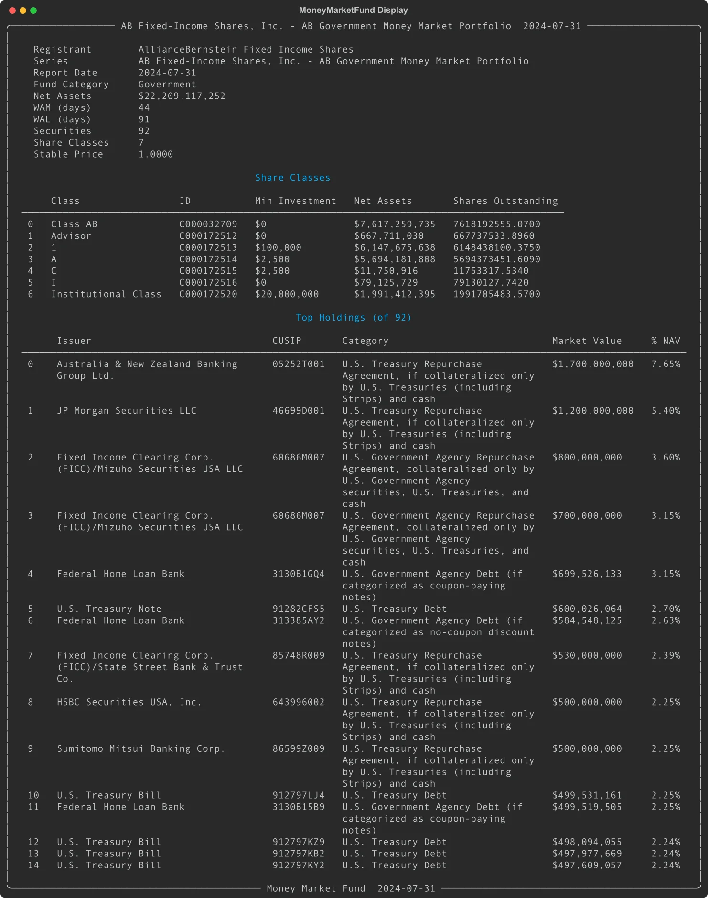
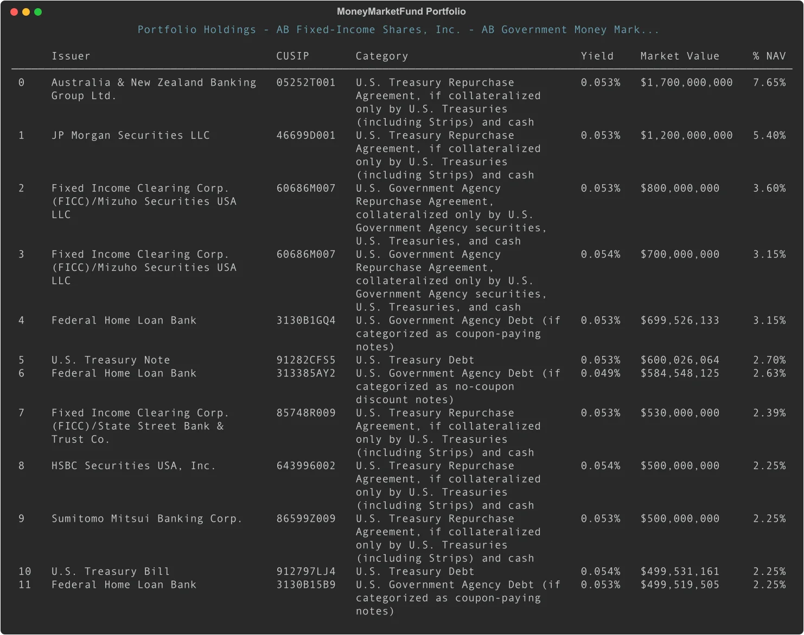
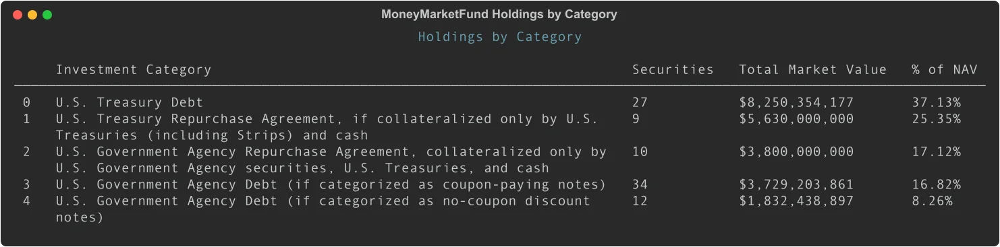

# N-MFP: Parse Money Market Fund Filings with Python

Money market funds file Form N-MFP monthly to report their complete portfolios, yields, net asset values, and liquidity metrics. EdgarTools parses both N-MFP3 (June 2024+) and N-MFP2 (2010–mid 2024) filings into structured Python objects.

```python
from edgar import get_filings

filings = get_filings(form="N-MFP3")
mmf = filings[0].obj()
mmf
```



Three lines to get a fully parsed money market fund report with net assets, weighted average maturity, portfolio holdings, and share class details.

---

## Portfolio Holdings

The `portfolio_data()` method returns a DataFrame with every security in the fund, sorted by market value:

```python
mmf.portfolio_data()
```



| Column | What it is |
|--------|-----------|
| `issuer` | Issuer name (`"U.S. Treasury"`) |
| `title` | Security title (`"T-Bill"`) |
| `cusip` | 9-character CUSIP |
| `isin` | ISIN identifier |
| `category` | Investment category (`"TreasuryDebt"`, `"CommPaper"`, etc.) |
| `maturity_wam` | Maturity date for WAM calculation |
| `maturity_wal` | Maturity date for WAL calculation |
| `yield` | Yield rate as decimal |
| `market_value` | Market value in **full dollars** |
| `amortized_cost` | Amortized cost in full dollars |
| `pct_of_nav` | Percentage of net asset value |
| `daily_liquid` | Daily liquid asset flag |
| `weekly_liquid` | Weekly liquid asset flag |
| `has_repo` | Has repurchase agreement collateral |

Market values are in full dollars -- not thousands. A `market_value` of 5,000,000,000 means exactly $5 billion.

---

## Repurchase Agreement Collateral

Money market funds often hold repurchase agreements secured by government or agency securities. The `collateral_data()` method flattens all repo collateral into a single DataFrame:

```python
mmf.collateral_data()
```

| Column | What it is |
|--------|-----------|
| `security_issuer` | The repo counterparty |
| `security_cusip` | CUSIP of the repo agreement |
| `collateral_issuer` | Issuer of the collateral security |
| `collateral_cusip` | CUSIP of the collateral |
| `collateral_lei` | LEI of collateral issuer |
| `maturity_date` | Collateral maturity date |
| `coupon` | Collateral coupon rate |
| `principal_amount` | Principal amount of collateral |
| `collateral_value` | Market value of collateral |
| `collateral_category` | Type of collateral security |

This is useful for analyzing the credit quality and composition of repo collateral backing the fund's assets.

---

## Share Class Information

Money market funds typically offer multiple share classes with different expense structures and minimum investments. Access share class details with:

```python
mmf.share_class_data()
```

| Column | What it is |
|--------|-----------|
| `class_name` | Share class name (`"Class A"`, `"Institutional"`) |
| `class_id` | SEC series identifier |
| `min_investment` | Minimum initial investment |
| `net_assets` | Net assets for this share class |
| `shares_outstanding` | Total shares outstanding |

---

## Yield and NAV Time Series

### N-MFP3 (June 2024+): Daily Time Series

N-MFP3 filings include 20 days of daily data for yields, NAV, and liquidity metrics.

```python
# 7-day gross yield history (series-level)
mmf.yield_history()

# Daily NAV per share history (series-level)
mmf.nav_history()

# Daily and weekly liquid asset percentages
mmf.liquidity_history()
```

Each method returns a DataFrame with a `date` column and the corresponding metric values.

**Yield history** shows the 7-day gross yield over the reporting period. **NAV history** tracks daily NAV per share. **Liquidity history** shows both daily liquid assets (securities that can convert to cash in 1 business day) and weekly liquid assets (convertible within 5 business days), reported as both dollar amounts and percentages of net assets.

### N-MFP2 (2010–mid 2024): Weekly Snapshots

N-MFP2 filings report weekly Friday snapshots instead of daily time series. The same methods work, but the `date` column uses labels like `"week_1"`, `"week_2"`, etc., and yields are single scalar values rather than a time series.

---

## Holdings by Investment Category

Group holdings by SEC investment category to see asset class allocation:

```python
mmf.holdings_by_category()
```



Returns a DataFrame with columns:

| Column | What it is |
|--------|-----------|
| `category` | Investment category (e.g., `"TreasuryDebt"`, `"CommPaper"`) |
| `count` | Number of securities in this category |
| `total_market_value` | Sum of market values |
| `total_pct` | Percentage of fund NAV |

Sorted by total market value descending, making it easy to identify the fund's largest asset class exposures.

---

## Look Up a Specific Fund

Search for a fund by the management company CIK or name:

```python
from edgar import Company

# By management company name or CIK
vanguard = Company("VANGUARD")
filing = vanguard.get_filings(form="N-MFP3").latest(1)
mmf = filing.obj()

print(mmf.name)                  # Fund series name
print(mmf.report_date)           # Reporting period end date
print(f"${mmf.net_assets:,.0f}") # Net assets
```

The `name` property returns the full series name (e.g., "Vanguard Prime Money Market Fund"), and `report_date` shows the period end date.

---

## Common Analysis Patterns

### Weighted average maturity and credit quality

```python
print(f"WAM: {mmf.average_maturity_wam} days")
print(f"WAL: {mmf.average_maturity_wal} days")
print(f"Fund category: {mmf.fund_category}")
```

Weighted Average Maturity (WAM) and Weighted Average Life (WAL) are key metrics for assessing interest rate sensitivity. Fund category indicates the type of money market fund (e.g., "Government", "Prime", "Tax-Exempt").

### Top holdings concentration

```python
holdings = mmf.portfolio_data()
# The pct_of_nav column already contains percentages
holdings[['issuer', 'title', 'market_value', 'pct_of_nav']].head(10)

# Or calculate manually if needed
import pandas as pd
holdings['market_value_float'] = holdings['market_value'].astype(float)
total = holdings['market_value_float'].sum()
holdings['weight_pct'] = (holdings['market_value_float'] / total * 100).round(2)
```

### Treasury vs. agency vs. repo exposure

```python
by_category = mmf.holdings_by_category()
treasury = by_category[by_category['category'] == 'TreasuryDebt']['total_pct'].sum()
agency = by_category[by_category['category'] == 'AgencyDebt']['total_pct'].sum()
repo = by_category[by_category['category'] == 'Repo']['total_pct'].sum()

print(f"Treasury: {treasury:.1f}%")
print(f"Agency: {agency:.1f}%")
print(f"Repo: {repo:.1f}%")
```

### Liquidity buffer analysis

```python
liq = mmf.liquidity_history()
if not liq.empty:
    latest = liq.iloc[-1]
    print(f"Daily liquid assets: {latest['pct_daily_liquid']:.1f}%")
    print(f"Weekly liquid assets: {latest['pct_weekly_liquid']:.1f}%")
```

SEC rules require money market funds to maintain minimum liquidity levels. Daily liquid assets must be at least 10% of total assets, and weekly liquid assets must be at least 30%.

---

## Metadata Quick Reference

| Property | Returns | Example |
|----------|---------|---------|
| `name` | Fund series name | `"Vanguard Prime Money Market Fund"` |
| `report_date` | Reporting period end | `"2024-10-31"` |
| `fund_category` | Fund type | `"Prime"` |
| `net_assets` | Net assets (Decimal) | `Decimal('26435168844.97')` |
| `num_securities` | Number of holdings | `92` |
| `num_share_classes` | Number of share classes | `4` |
| `average_maturity_wam` | WAM in days | `45` |
| `average_maturity_wal` | WAL in days | `52` |

---

## Methods Quick Reference

| Call | Returns | What it does |
|------|---------|-------------|
| `mmf.portfolio_data()` | `DataFrame` | All securities sorted by market value |
| `mmf.share_class_data()` | `DataFrame` | Share class details and net assets |
| `mmf.yield_history()` | `DataFrame` | 7-day gross yield time series |
| `mmf.nav_history()` | `DataFrame` | Daily NAV per share time series |
| `mmf.liquidity_history()` | `DataFrame` | Daily/weekly liquid asset metrics |
| `mmf.collateral_data()` | `DataFrame` | Repo collateral details flattened |
| `mmf.holdings_by_category()` | `DataFrame` | Holdings grouped by investment category |

---

## Things to Know

**Values are in full dollars.** Unlike 13F filings (which report in thousands), N-MFP market values are in actual USD. A `market_value` of 5,000,000,000 means exactly $5 billion.

**N-MFP3 vs N-MFP2.** N-MFP3 (June 2024+) includes daily time series with dates for the past 20 business days. N-MFP2 (2010–mid 2024) includes weekly Friday snapshots without explicit dates. EdgarTools parses both transparently.

**Time series data.** For N-MFP3, `yield_history()`, `nav_history()`, and `liquidity_history()` return DataFrames with 20 daily observations. For N-MFP2, they return weekly snapshots labeled `"week_1"` through `"week_5"`.

**Repo collateral.** Repurchase agreements are a common money market fund investment. Use `collateral_data()` to analyze what securities back these repos. The `has_repo` column in `portfolio_data()` indicates which securities have collateral details.

**Monthly filings, quarterly public disclosure.** Funds file monthly, but only quarter-end filings are immediately public. Mid-quarter filings are released with a 60-day delay.

**Share class structure.** The same underlying portfolio may be divided into multiple share classes with different expense ratios and minimum investments. `share_class_data()` shows this structure.

**WAM and WAL.** Weighted Average Maturity (WAM) uses the next interest rate reset date for floating-rate securities. Weighted Average Life (WAL) uses final maturity. WAL is always ≥ WAM.

---

## Related

- [Working with Filings](working-with-filing.md) -- general filing access patterns
- [Fund Portfolios (N-PORT)](nport-data-object-guide.md) -- mutual fund and ETF portfolio holdings
