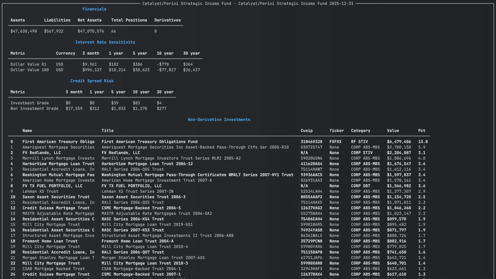

# N-PORT: Parse Mutual Fund Portfolio Holdings with Python

Every registered mutual fund and ETF files Form NPORT-P with the SEC each month, disclosing their complete portfolio -- every stock, bond, swap, and option they hold. EdgarTools parses these filings into structured Python objects so you can analyze fund portfolios in a few lines of code.

```python
from edgar import get_filings

filings = get_filings(form="NPORT-P")
report = filings[0].obj()
report
```



Three lines to get a fully parsed fund report with total assets, all investment positions, derivative exposures, and risk metrics.

---

## Investment Data

The `investment_data()` method returns a DataFrame with one row per position, sorted by absolute value:

```python
report.investment_data()
```

| Column | What it is |
|--------|-----------|
| `name` | Issuer name (`"APPLE INC"`) |
| `title` | Security title (`"COMMON STOCK"`) |
| `cusip` | 9-character CUSIP |
| `ticker` | Resolved ticker symbol |
| `balance` | Share count or par amount |
| `units` | `"NS"` (shares), `"PA"` (principal), or `"NC"` (contracts) |
| `value_usd` | Market value in **US dollars** |
| `pct_value` | Percentage of net asset value |
| `asset_category` | SEC category (`"EC"` equity, `"DBT"` debt, etc.) |
| `issuer_category` | Issuer type (`"CORP"`, `"USG"`, `"MUN"`, etc.) |
| `currency_code` | Currency of the position |
| `investment_country` | Country code |
| `is_derivative` | `True` for derivatives, `False` for securities |

Values are in full US dollars -- unlike 13F filings, NPORT values are **not** in thousands.

---

## Securities vs Derivatives

Split the portfolio into traditional securities and derivative positions:

```python
# Non-derivative positions only (stocks, bonds, etc.)
report.securities_data()

# Derivative positions only
report.derivatives_data()
```

The `derivatives_data()` DataFrame adds columns specific to derivatives:

| Column | What it is |
|--------|-----------|
| `subtype` | Derivative subtype (e.g., `"CDS"`, `"IRS"`) |
| `reference` | Reference entity or index |
| `counterparty` | Counterparty name |
| `notional_amount` | Notional value |
| `unrealized_pnl` | Unrealized appreciation/depreciation |
| `termination_date` | Contract expiration date |
| `pct_value` | Percentage of NAV |

---

## Derivative-Specific DataFrames

For detailed analysis of specific derivative types, use the dedicated methods. Each returns a DataFrame with type-specific fields:

```python
report.swaps_data()       # Interest rate swaps, CDS, total return swaps
report.options_data()     # Options with strike price, expiry, put/call
report.forwards_data()    # FX forwards with currencies and settlement
report.futures_data()     # Futures with payoff profile and expiry
report.swaptions_data()   # Swaption contracts
```

All derivative DataFrames share common fields (`name`, `title`, `counterparty`, `notional_amount`, `unrealized_pnl`) plus type-specific columns. For example, `swaps_data()` includes directional receive/pay legs, and `options_data()` includes `strike_price`, `written_or_purchased`, and `shares_per_contract`.

---

## Fund Financials

Access the fund's balance sheet data through `fund_info`:

```python
print(f"Total assets:      ${report.fund_info.total_assets:,.0f}")
print(f"Total liabilities:  ${report.fund_info.total_liabilities:,.0f}")
print(f"Net assets:         ${report.fund_info.net_assets:,.0f}")
```

---

## Risk Metrics

### Interest rate sensitivity

NPORT filings include DV01 (dollar value of a 1 basis point move) and DV100 (dollar value of a 100 basis point move) across multiple time horizons:

```python
for currency, metric in report.fund_info.current_metrics.items():
    print(f"{currency} DV01 (1yr): {metric.intrstRtRiskdv01.period1Yr}")
    print(f"{currency} DV100 (1yr): {metric.intrstRtRiskdv100.period1Yr}")
```

### Credit spread risk

Investment grade and non-investment grade spread sensitivity, when reported:

```python
ig = report.fund_info.credit_spread_risk_investment_grade
if ig:
    print(f"IG spread risk (1yr): {ig.period1Yr}")

nig = report.fund_info.credit_spread_risk_non_investment_grade
if nig:
    print(f"Non-IG spread risk (1yr): {nig.period1Yr}")
```

---

## Look Up a Specific Fund

Search for a fund by its CIK or by the management company:

```python
from edgar import Company

# By management company CIK
vanguard = Company("0000102909")
filing = vanguard.get_filings(form="NPORT-P").latest(1)
report = filing.obj()

print(report.general_info.name)         # Management company
print(report.general_info.series_name)  # Specific fund/series
print(report.reporting_period)          # Report date
```

---

## Common Analysis Patterns

### Top holdings by value

```python
df = report.investment_data(include_derivatives=False)
total = df['value_usd'].sum()
df['weight'] = (df['value_usd'] / total * 100).round(2)
df[['name', 'ticker', 'value_usd', 'weight']].head(10)
```

### Sector allocation

```python
df = report.securities_data()
df.groupby('asset_category')['value_usd'].sum().sort_values(ascending=False)
```

### Derivative exposure as percentage of NAV

```python
net_assets = report.fund_info.net_assets
deriv = report.derivatives_data()
if not deriv.empty:
    total_notional = deriv['notional_amount'].abs().sum()
    print(f"Derivative notional: ${total_notional:,.0f}")
    print(f"As % of NAV: {total_notional / net_assets * 100:.1f}%")
```

---

## Metadata Quick Reference

| Property | Returns | Example |
|----------|---------|---------|
| `general_info.name` | Management company | `"VANGUARD CHESTER FUNDS"` |
| `general_info.series_name` | Fund/series name | `"Vanguard Target Retirement 2035 Fund"` |
| `general_info.cik` | SEC CIK | `"0000102909"` |
| `general_info.rep_period_date` | Report date | `"2024-03-31"` |
| `general_info.fiscal_year_end` | Fiscal year end | `"0131"` |
| `general_info.series_id` | SEC series ID | `"S000004104"` |
| `general_info.reg_lei` | LEI | `"549300..."` |
| `reporting_period` | Same as rep_period_date | `"2024-03-31"` |
| `name` | Company - Series | `"VANGUARD CHESTER FUNDS - Vanguard Target..."` |
| `has_investments` | Has any positions? | `True` |
| `header.submission_type` | Form type filed | `"NPORT-P"` |

---

## Methods Quick Reference

| Call | Returns | What it does |
|------|---------|-------------|
| `report.investment_data()` | `DataFrame` | All positions (securities + derivatives) |
| `report.securities_data()` | `DataFrame` | Non-derivative positions only |
| `report.derivatives_data()` | `DataFrame` | Derivative positions with P&L |
| `report.swaps_data()` | `DataFrame` | Swap details with receive/pay legs |
| `report.options_data()` | `DataFrame` | Options with strike, expiry, put/call |
| `report.forwards_data()` | `DataFrame` | FX forwards with settlement info |
| `report.futures_data()` | `DataFrame` | Futures contracts |
| `report.swaptions_data()` | `DataFrame` | Swaption contracts |
| `report.derivatives` | `list` | Raw derivative investment objects |
| `report.non_derivatives` | `list` | Raw non-derivative investment objects |
| `report.get_fund_series()` | `FundSeries` | Fund series object |
| `report.get_ticker_for_series()` | `str` | Ticker for this series |

---

## Things to Know

**Values are in full dollars.** Unlike 13F filings (which report in thousands), NPORT values are in actual USD. A `value_usd` of 135,364,000 means exactly $135.4 million.

**NPORT-P vs NPORT-EX.** NPORT-P is the full monthly filing with all positions and risk metrics. NPORT-EX is a quarterly exhibit containing only a subset of holdings. EdgarTools handles both, but NPORT-P has the most complete data.

**Monthly reporting.** Funds file NPORT-P every month, but only the quarter-end filings are made public. The other two months in each quarter are confidential (released after 60 days).

**Derivative coverage.** EdgarTools parses all five derivative types: swaps, options, forwards, futures, and swaptions. Each type has a dedicated `*_data()` method for detailed analysis.

**Ticker resolution.** Tickers are resolved from CUSIPs and fund metadata. Most common securities resolve correctly, but obscure or private placements may have blank tickers.

**Empty DataFrames.** Methods like `derivatives_data()` and `swaps_data()` return an empty DataFrame when no positions of that type exist. Always check with `df.empty` before analysis.

---

## Related

- [Working with Filings](working-with-filing.md) -- general filing access patterns
