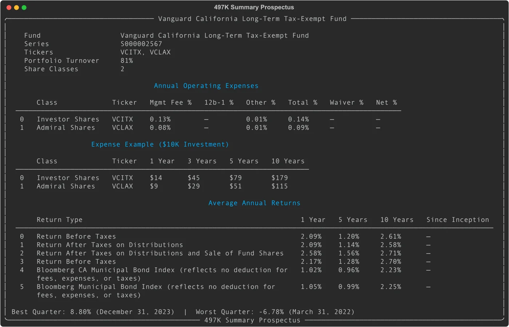
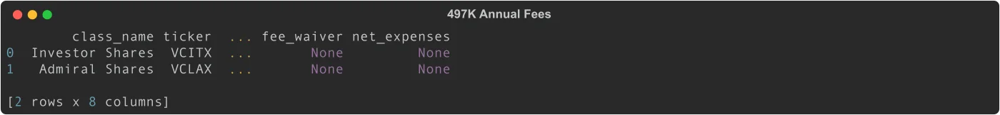
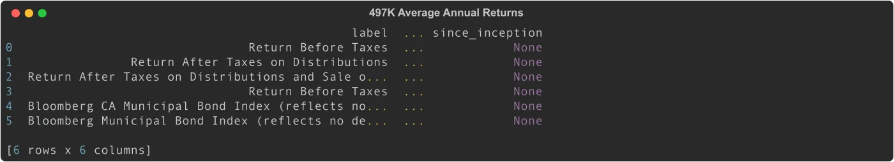
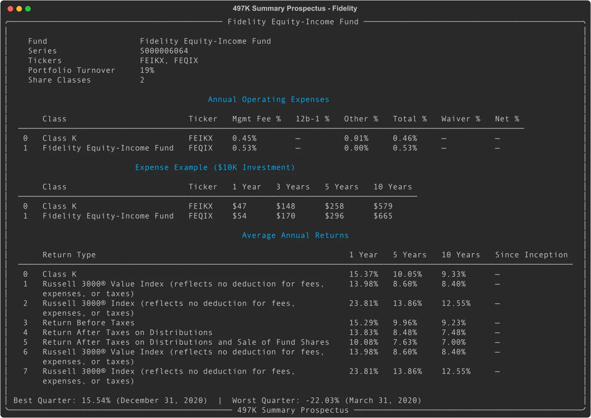

# Form 497K: Parse Mutual Fund Summary Prospectus Filings with Python

Form 497K is the SEC-mandated summary prospectus for mutual funds and ETFs. EdgarTools parses these filings into structured Python objects, giving you fee tables, expense examples, and performance returns without touching any XBRL (there isn't any). With about 20,000 filings per year, the HTML structure is tightly standardized under Form N-1A rules, making extraction reliable across fund families.

```python
from edgar import find

filing = find("0001683863-25-002784")  # Vanguard California Long-Term Tax-Exempt Fund
p = filing.obj()
p
```



You get the fund name, series ID, tickers, portfolio turnover, fees, expense examples, and average annual returns in one shot.

---

## Access Fee Data

The `.fees` property returns a DataFrame with one row per share class, showing the breakdown of annual operating expenses:

```python
p.fees
```



| Column | What it is |
|--------|-----------|
| `class_name` | Share class name (`"Admiral Shares"`) |
| `ticker` | Ticker symbol (`"VCLAX"`) |
| `management_fee` | Management fee as a percentage |
| `twelve_b1_fee` | 12b-1 distribution fee |
| `other_expenses` | Other operating expenses |
| `total_annual_expenses` | Gross total before any waivers |
| `fee_waiver` | Fee waiver or expense reimbursement |
| `net_expenses` | Net total after waivers |

All fee values are percentages of net assets. A `management_fee` of `0.08` means 0.08%.

---

## See Expense Examples

The `.expense_example` property shows the hypothetical cost of holding $10,000 for 1, 3, 5, and 10 years:

```python
p.expense_example
```

| Column | What it is |
|--------|-----------|
| `class_name` | Share class name |
| `ticker` | Ticker symbol |
| `1yr` | Cost after 1 year |
| `3yr` | Cost after 3 years |
| `5yr` | Cost after 5 years |
| `10yr` | Cost after 10 years |

These are dollar amounts computed by the SEC formula: assume 5% annual return and no change in expense ratios. They are the same hypothetical numbers printed in the paper prospectus.

---

## Read Performance Returns

The `.performance` property returns average annual total returns across all share classes and any benchmark indices:

```python
p.performance
```



| Column | What it is |
|--------|-----------|
| `label` | Return type label (e.g. `"Return Before Taxes"`) |
| `section` | Share class section header |
| `1yr` | 1-year return as a percentage |
| `5yr` | 5-year return as a percentage |
| `10yr` | 10-year return as a percentage |
| `since_inception` | Return since inception (if available) |

Benchmark rows (like `"Bloomberg Municipal Bond Index"`) appear alongside fund rows and can be filtered by checking whether the label matches a share class ticker or name.

---

## Work with Individual Share Classes

The `.share_classes` property gives you a list of `ShareClassFees` objects, one per share class, with all fee data as attributes:

```python
for sc in p.share_classes:
    print(sc.class_name, sc.ticker, f"{sc.total_annual_expenses}%")
# Investor Shares VCITX 0.14%
# Admiral Shares VCLAX 0.09%
```

Access individual share class attributes directly:

```python
sc = p.share_classes[0]
sc.management_fee        # Decimal('0.13')
sc.twelve_b1_fee         # None (Vanguard has no 12b-1 fees)
sc.total_annual_expenses # Decimal('0.14')
sc.expense_1yr           # 14  (dollars)
sc.max_sales_load        # None (no front-end load)
```

---

## Compare Fund Families

Using a Fidelity filing from the same form type:

```python
fidelity = find("0000035341-25-000099").obj()
fidelity
```



The same structure works regardless of fund family because Form N-1A mandates the section layout. Vanguard, Fidelity, BlackRock, and others all produce the same table structure.

---

## Search for 497K Filings by Fund Company

```python
from edgar import Company

# Get recent 497K filings for a fund company
vanguard = Company("VANGUARD CALIFORNIA TAX-FREE FUNDS")
filings = vanguard.get_filings(form="497K")
filings.head(5)
```

To look up a specific fund series across all its filings:

```python
# Multiple filings from the same company CIK will often cover different fund series
for filing in filings.head(10):
    p = filing.obj()
    print(p.fund_name, p.series_id, p.tickers)
```

---

## Common Analysis Patterns

### Find the cheapest share class

```python
df = p.fees
cheapest = df.loc[df['net_expenses'].fillna(df['total_annual_expenses']).idxmin()]
print(cheapest['class_name'], cheapest['ticker'])
```

### Check for fee waivers

```python
funds_with_waivers = p.fees[p.fees['fee_waiver'].notna()]
```

### Check quarterly performance extremes

```python
# Best and worst quarters are parsed from the bar chart section
print(p.best_quarter)   # (Decimal('8.80'), 'December 31, 2023')
print(p.worst_quarter)  # (Decimal('-6.78'), 'March 31, 2022')

best_pct, best_date = p.best_quarter
```

### Extract investment objective

```python
print(p.investment_objective)
# "The Fund seeks to provide a moderate and sustainable level of current
#  income that is exempt from federal and California personal income taxes..."
```

### Filter performance to fund rows only (exclude benchmarks)

```python
fund_tickers = set(p.tickers)
# Keep rows where the label contains a ticker or class name
perf = p.performance
fund_rows = perf[perf['label'].str.contains('Return')]
```

---

## Quick Reference: Properties

| Property | Type | Description | Example |
|----------|------|-------------|---------|
| `fund_name` | `str` | Fund name from header or HTML | `"Vanguard California Long-Term Tax-Exempt Fund"` |
| `tickers` | `list[str]` | All share class tickers | `["VCITX", "VCLAX"]` |
| `series_id` | `str` | Series ID from SGML header | `"S000002567"` |
| `class_ids` | `list[str]` | Class/Contract IDs | `["C000006936", "C000044247"]` |
| `cik` | `str` | Filing entity CIK | `"783401"` |
| `num_share_classes` | `int` | Number of share classes | `2` |
| `share_classes` | `list[ShareClassFees]` | Per-class fee models | see ShareClassFees below |
| `best_quarter` | `tuple[Decimal, str]` | Best quarterly return and period | `(Decimal('8.80'), 'December 31, 2023')` |
| `worst_quarter` | `tuple[Decimal, str]` | Worst quarterly return and period | `(Decimal('-6.78'), 'March 31, 2022')` |
| `portfolio_turnover` | `Decimal` | Annual portfolio turnover rate | `Decimal('81')` |
| `investment_objective` | `str` | Text of the investment objective | `"The Fund seeks..."` |
| `prospectus_date` | `str` | Date printed on the prospectus | `"March 28, 2025"` |
| `portfolio_managers` | `list[str]` | Portfolio manager names | `["James M. D'Arcy"]` |

---

## Quick Reference: DataFrame Properties

| Property | Columns | What it contains |
|----------|---------|-----------------|
| `fees` | `class_name, ticker, management_fee, twelve_b1_fee, other_expenses, total_annual_expenses, fee_waiver, net_expenses` | Annual operating expenses per share class |
| `expense_example` | `class_name, ticker, 1yr, 3yr, 5yr, 10yr` | Hypothetical $10K investment costs |
| `performance` | `label, section, 1yr, 5yr, 10yr, since_inception` | Average annual total returns |

---

## ShareClassFees Fields

| Field | Type | Description |
|-------|------|-------------|
| `class_name` | `str` | Share class name |
| `ticker` | `str` | Ticker symbol |
| `class_id` | `str` | SEC class/contract ID (`C000xxxxx`) |
| `management_fee` | `Decimal` | Management fee percentage |
| `twelve_b1_fee` | `Decimal` | 12b-1 fee percentage |
| `other_expenses` | `Decimal` | Other expenses percentage |
| `acquired_fund_fees` | `Decimal` | Acquired fund fees (for funds of funds) |
| `total_annual_expenses` | `Decimal` | Gross total expenses |
| `fee_waiver` | `Decimal` | Fee waiver/expense reimbursement |
| `net_expenses` | `Decimal` | Net expenses after waiver |
| `expense_1yr` | `int` | $10K hypothetical cost, 1 year |
| `expense_3yr` | `int` | $10K hypothetical cost, 3 years |
| `expense_5yr` | `int` | $10K hypothetical cost, 5 years |
| `expense_10yr` | `int` | $10K hypothetical cost, 10 years |
| `max_sales_load` | `Decimal` | Maximum front-end sales load |
| `max_deferred_sales_load` | `Decimal` | Maximum deferred sales charge |
| `redemption_fee` | `Decimal` | Redemption fee percentage |

---

## Things to Know

**No XBRL.** 497K filings contain no XBRL data. All structured data comes from HTML table parsing. The SEC mandates the table layout under Form N-1A, which is why parsing is reliable across fund families.

**Fee percentages are small numbers.** A `management_fee` of `Decimal('0.13')` means 0.13%, not 13%. Do not multiply by 100 before displaying.

**`fee_waiver` may be None.** Many funds have no active waivers. Check `net_expenses` first; fall back to `total_annual_expenses` if `net_expenses` is None.

**Performance rows include benchmarks.** The `.performance` DataFrame mixes fund share class rows with index/benchmark rows. Use the `label` and `section` columns to distinguish them.

**`best_quarter` and `worst_quarter` may be None.** Some 497K filings (particularly those for new funds with less than a calendar year of performance) omit the bar chart section, leaving both as None.

**Series ID vs CIK.** The `series_id` (e.g., `S000002567`) identifies the specific fund series within the filing entity. The `cik` identifies the registrant (fund company). A single registrant CIK can have dozens of series IDs.

---

## Related

- [Working with Filings](working-with-filing.md) -- general filing access and navigation
- [Fund Technical Reference](fund-technical-reference.md) -- N-PORT, N-CEN, and other fund form types
