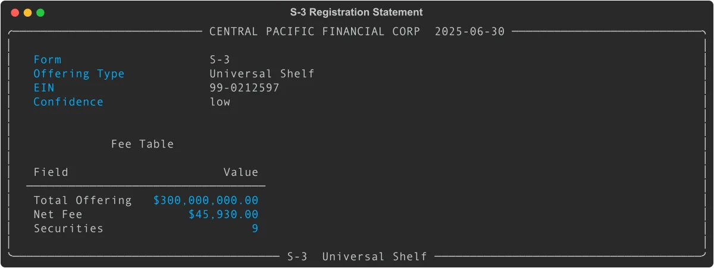
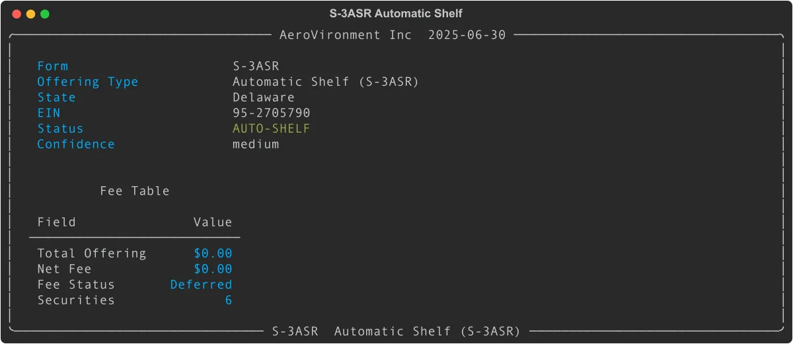

# S-3 Shelf Registration: Parse SEC Filings with Python

S-3 filings are shelf registration statements that allow companies to register securities for future offering. Rather than registering each deal separately, a company files an S-3 once and then draws down from it over three years. EdgarTools parses S-3, S-3/A, S-3ASR, S-3D, and S-3DPOS filings into a `RegistrationS3` object.

```python
from edgar import find

filing = find("0001140361-25-024210")   # Central Pacific Financial S-3
s3 = filing.obj()                       # RegistrationS3
s3
```



You can also find S-3 filings through a company:

```python
from edgar import Company

company = Company("CPF")                        # Central Pacific Financial
filing = company.get_filings(form="S-3")[0]
s3 = filing.obj()                               # RegistrationS3
```

---

## Check the Offering Type

The `offering_type` property classifies what the shelf is for. This matters because resale shelves, debt shelves, and universal shelves have different data profiles.

```python
s3.offering_type              # S3OfferingType.UNIVERSAL_SHELF
s3.offering_type.display_name # "Universal Shelf"
```

| Value | Display Name | Description |
|-------|-------------|-------------|
| `UNIVERSAL_SHELF` | Universal Shelf | Any security type (most common) |
| `RESALE` | Resale Registration | Selling stockholders reselling private placement shares |
| `DEBT` | Debt Offering | Debt securities only |
| `AUTO_SHELF` | Automatic Shelf (S-3ASR) | Large accelerated filers; fees deferred |
| `UNKNOWN` | Unknown | Classification failed |

```python
# Automatic shelf (S-3ASR) for a large accelerated filer
from edgar import find

filing = find("0001104659-25-064107")    # AeroVironment S-3ASR
s3 = filing.obj()

s3.is_auto_shelf    # True
s3.fee_deferred     # True (fees paid per takedown, not upfront)
```



---

## Read the Fee Table

Every S-3 includes Exhibit 107 (EX-FILING FEES) listing how much the company is registering and the SEC filing fee owed. EdgarTools extracts this automatically.

```python
s3.total_offering    # 300000000.0  (total registered amount in dollars)
s3.net_fee           # 45930.0      (SEC registration fee owed)
s3.fee_deferred      # False        (auto-shelves defer fees to takedown time)

# Per-security breakdown
for sec in s3.securities:
    print(sec.security_type, sec.security_title, sec.max_aggregate_amount)
```

For S-3ASR filings, fees are deferred under Rule 457(r) — the company pays at the time of each 424B takedown rather than at registration. In that case `fee_deferred` is `True` and `net_fee` is 0.

```python
# Fee table object has full detail
ft = s3.fee_table                   # RegistrationFeeTable | None
ft.total_offering_amount            # 300000000.0
ft.net_fee_due                      # 45930.0
ft.has_carry_forward                # False
len(ft.securities)                  # 9 (one per security class registered)
```

---

## Read the Cover Page

The cover page captures who is registering, how they're classified by the SEC, and which rules apply.

```python
cp = s3.cover_page                          # S3CoverPage

cp.company_name                             # "CENTRAL PACIFIC FINANCIAL CORP"
cp.registration_number                      # "333-284853"
cp.state_of_incorporation                   # "Hawaii"
cp.ein                                      # "99-0212597"

# Filer category checkboxes
cp.is_large_accelerated_filer               # True / False / None
cp.is_accelerated_filer                     # True / False / None
cp.is_non_accelerated_filer                 # True / False / None
cp.is_smaller_reporting_company             # True / False / None
cp.is_emerging_growth_company               # True / False / None

# Rule checkboxes
cp.is_rule_415                              # True if Rule 415 shelf offering
cp.is_rule_462b                             # True if Rule 462(b) amendment
cp.is_rule_462e                             # True if auto-shelf (S-3ASR)

# How much of the cover page was successfully extracted
cp.confidence                               # "low", "medium", or "high"
```

These fields come from the checkbox grid on the S-3 cover page. The `confidence` score reflects how many fields were successfully parsed. You can also access the shortcut properties directly on the `RegistrationS3` object:

```python
s3.registration_number        # same as s3.cover_page.registration_number
s3.state_of_incorporation     # same as s3.cover_page.state_of_incorporation
s3.ein                        # same as s3.cover_page.ein
s3.is_amendment               # True when form contains "/A"
s3.is_auto_shelf              # True for S-3ASR
```

---

## Navigate to 424B Takedowns

A shelf registration is the starting point. Each time the company actually sells securities, it files a 424B prospectus supplement. Use `.takedowns` to get all of those filings from this shelf.

```python
takedowns = s3.takedowns        # Filings object with all 424B forms, or None
if takedowns:
    print(f"{len(takedowns)} offerings from this shelf")
    for filing in takedowns:
        print(filing.form, filing.filing_date)

# Get parsed deal data for each takedown
for filing in takedowns:
    prospectus = filing.obj()   # Prospectus424B
    deal = prospectus.deal
    print(deal.gross_proceeds, deal.offering_type)
```

`.takedowns` uses the registration file number (e.g. `333-284853`) to fetch all 424B filings under this shelf. It requires a network call and is cached after first access.

To get every filing under the same file number (not just 424B forms), use `.related_filings`:

```python
all_filings = s3.related_filings    # Filings: S-3, EFFECT, 424Bs, etc.
```

---

## Build a Shelf Offering History

Combine `RegistrationS3` and `Prospectus424B` to see everything a company raised from a single shelf:

```python
import pandas as pd
from edgar import Company

company = Company("CPF")
s3_filings = company.get_filings(form="S-3")

for s3_filing in s3_filings.head(3):
    s3 = s3_filing.obj()
    print(f"Shelf: {s3.total_offering:,.0f} registered ({s3.offering_type.display_name})")

    if s3.takedowns:
        rows = []
        for td in s3.takedowns:
            prospectus = td.obj()
            d = prospectus.deal.to_dict()
            d["date"] = str(td.filing_date)
            rows.append(d)
        df = pd.DataFrame(rows)
        print(df[["date", "gross_proceeds", "offering_type"]].to_string())
        print()
```

---

## Get AI-Friendly Context

`.to_context()` returns a structured text summary for language model prompts:

```python
print(s3.to_context())
# REGISTRATION STATEMENT: CENTRAL PACIFIC FINANCIAL CORP (S-3)
#
# Filed: 2025-06-30
# Offering Type: Universal Shelf
# Registration No.: 333-284853
# EIN: 99-0212597
# ...

print(s3.to_context(detail='full'))   # Includes available properties/actions
print(s3.to_context(detail='minimal'))  # Filing header only
```

---

## Understand the Shelf Lifecycle

The relationship between S-3 and 424B filings follows a consistent pattern:

```
Company files S-3
    └── SEC reviews (8-40 days typical)
        └── SEC issues EFFECT notice (shelf becomes active)
            └── Company files 424B5 (takedown #1)
            └── Company files 424B5 (takedown #2)
                 ...
            └── Shelf expires 3 years from filing date
```

You can also navigate this in reverse -- starting from a 424B prospectus back to the S-3. See the [Prospectus424B guide](prospectus424b-data-object-guide.md) for `prospectus.lifecycle.shelf_registration`.

---

## Supported Form Variants

| Form | Description |
|------|-------------|
| `S-3` | Standard shelf registration |
| `S-3/A` | Amendment to a shelf registration |
| `S-3ASR` | Automatic shelf (large accelerated filers; immediate effectiveness) |
| `S-3ASR/A` | Amendment to an automatic shelf |
| `S-3D` | Shelf for dividend reinvestment plans |
| `S-3DPOS` | Post-effective amendment for DRIPs |

All variants are dispatched automatically by `filing.obj()`.

---

## Quick Reference

### RegistrationS3 Properties

| Property | Type | Description |
|----------|------|-------------|
| `form` | `str` | Form type (`"S-3"`, `"S-3ASR"`, etc.) |
| `company` | `str` | Company name from filing metadata |
| `filing_date` | `date` | Date the S-3 was filed |
| `accession_number` | `str` | SEC accession number |
| `offering_type` | `S3OfferingType` | Classification enum |
| `cover_page` | `S3CoverPage` | Extracted cover page fields |
| `fee_table` | `RegistrationFeeTable \| None` | Parsed Exhibit 107 fee table |
| `total_offering` | `float \| None` | Total registered offering amount in dollars |
| `net_fee` | `float \| None` | Net SEC registration fee owed |
| `fee_deferred` | `bool` | True for S-3ASR (fees paid at takedown) |
| `securities` | `list` | Per-security breakdowns from fee table |
| `registration_number` | `str \| None` | File number (`"333-XXXXXX"`) |
| `state_of_incorporation` | `str \| None` | State of incorporation |
| `ein` | `str \| None` | Employer identification number |
| `is_amendment` | `bool` | True when form contains `/A` |
| `is_auto_shelf` | `bool` | True for S-3ASR |

### RegistrationS3 Methods

| Method | Returns | Description |
|--------|---------|-------------|
| `to_context(detail)` | `str` | AI-formatted text (`'minimal'`, `'standard'`, `'full'`) |

### RegistrationS3 Cached Properties

| Property | Type | Description |
|----------|------|-------------|
| `takedowns` | `Filings \| None` | 424B filings under this shelf (network call) |
| `related_filings` | `Filings \| None` | All filings under this file number (network call) |

### S3CoverPage Fields

| Property | Type | Description |
|----------|------|-------------|
| `company_name` | `str` | Company name |
| `registration_number` | `str \| None` | SEC file number |
| `state_of_incorporation` | `str \| None` | State of incorporation |
| `ein` | `str \| None` | EIN |
| `is_large_accelerated_filer` | `bool \| None` | Checkbox state |
| `is_accelerated_filer` | `bool \| None` | Checkbox state |
| `is_non_accelerated_filer` | `bool \| None` | Checkbox state |
| `is_smaller_reporting_company` | `bool \| None` | Checkbox state |
| `is_emerging_growth_company` | `bool \| None` | Checkbox state |
| `is_rule_415` | `bool` | Rule 415 shelf offering |
| `is_rule_462b` | `bool` | Rule 462(b) amendment |
| `is_rule_462e` | `bool` | Automatic shelf |
| `confidence` | `str` | Extraction confidence (`"low"`, `"medium"`, `"high"`) |

### S3OfferingType Values

| Enum Value | display_name | When |
|------------|-------------|------|
| `UNIVERSAL_SHELF` | Universal Shelf | Multiple security types; most common |
| `RESALE` | Resale Registration | Selling stockholders in cover text |
| `DEBT` | Debt Offering | Debt securities only |
| `AUTO_SHELF` | Automatic Shelf (S-3ASR) | S-3ASR form or deferred fees |
| `UNKNOWN` | Unknown | Classification failed |

---

## Things to Know

The `.takedowns` and `.related_filings` properties require a network call to the SEC. Both are cached as `@cached_property` so they only fetch once per object.

Cover page extraction is best-effort. The `confidence` property tells you how many fields were found: `"high"` (4+ fields), `"medium"` (2-3), `"low"` (0-1). For older filings with non-standard HTML layouts, confidence may be lower.

S-3 filings are intentionally short (typically 50-200KB). They incorporate financial disclosures by reference from the company's most recent 10-K and 10-Q rather than repeating them.

The fee table comes from Exhibit 107 (EX-FILING FEES), which SEC rules have required since 2022. Filings before 2022 may have `fee_table` as `None`.

---

## Related

- [Prospectus Supplements (424B)](prospectus424b-data-object-guide.md) -- parse the 424B takedowns that draw from a shelf
- [Working with Filings](working-with-filing.md) -- how to navigate from a filing to its data object
- [Finding Companies](finding-companies.md) -- how to look up companies by ticker, CIK, or name
