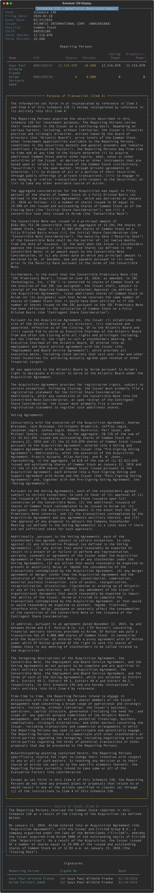
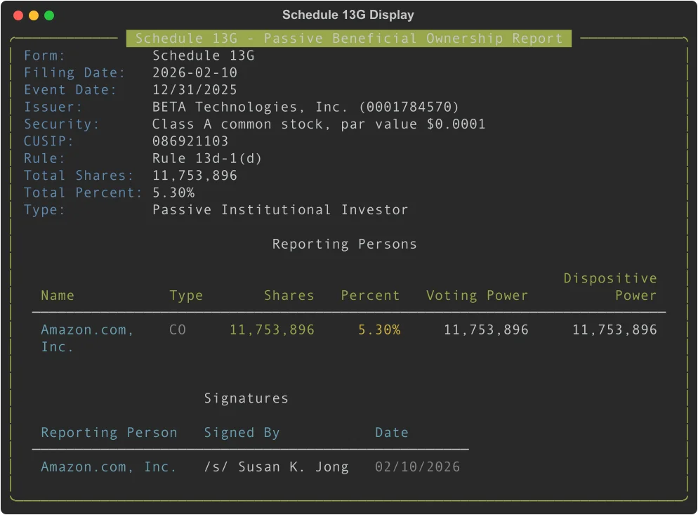

# Schedule 13D/G: Beneficial Ownership Reports

## Overview

**Schedule 13D** and **Schedule 13G** are SEC filings required when an investor acquires beneficial ownership of 5% or more of a company's voting securities.

- **Schedule 13D** is filed by **active investors** -- those who may seek to influence or control the company (activist investors, acquirers). It requires detailed narrative disclosures about the purpose and intent of the investment.
- **Schedule 13G** is a shorter form filed by **passive investors** -- institutional investors, mutual funds, or other holders with no intent to change or influence control.

The `Schedule13D` and `Schedule13G` classes parse these XML filings into structured Python objects.

## Access Pattern

```python
from edgar import Filing

# Schedule 13D (activist investor)
filing = Filing(form="SCHEDULE 13D", ...)
schedule_13d = filing.obj()    # Returns Schedule13D

# Schedule 13G (passive investor)
filing = Filing(form="SCHEDULE 13G", ...)
schedule_13g = filing.obj()    # Returns Schedule13G
```

You can also search for these filings by company or across all filers:

```python
from edgar import Company, get_filings

# Search by company
company = Company("AAPL")
filings_13d = company.get_filings(form="SCHEDULE 13D")
filings_13g = company.get_filings(form="SCHEDULE 13G")

# Or search across all recent filings
recent_13d = get_filings(form="SCHEDULE 13D").head(10)
recent_13g = get_filings(form="SCHEDULE 13G").head(10)
```

---

## Schedule 13D (Active Investors)

When you call `filing.obj()` on a Schedule 13D filing, edgartools parses the XML structure and displays it as a rich, formatted panel:



### Top-Level Properties

| Property | Type | Description |
|----------|------|-------------|
| `issuer_info` | `IssuerInfo` | The company whose shares are being reported |
| `security_info` | `SecurityInfo` | The class of securities (e.g., Common Stock) |
| `reporting_persons` | `List[ReportingPerson]` | Beneficial owners filing the report |
| `items` | `Schedule13DItems` | Items 1-7 narrative disclosures |
| `signatures` | `List[Signature]` | Filing signatures |
| `date_of_event` | `str` | Date that triggered the filing |
| `previously_filed` | `bool` | Whether a prior filing exists |
| `amendment_number` | `Optional[int]` | Amendment sequence number |
| `is_amendment` | `bool` | Whether this is an amendment (`/A`) |
| `filing_date` | `date` | Date filed with the SEC |
| `total_shares` | `int` | Aggregate beneficial ownership (handles joint/separate filers) |
| `total_percent` | `float` | Aggregate ownership percentage |

### Items (Narrative Disclosures)

Schedule 13D requires detailed narrative responses to 7 items. **Item 4 (Purpose of Transaction)** is the most important -- it reveals the investor's intentions.

| Property | Description |
|----------|-------------|
| `item1_security_title` | Title of the security |
| `item1_issuer_name` | Name of the issuer |
| `item1_issuer_address` | Address of the issuer |
| `item2_filing_persons` | Identity of reporting persons |
| `item2_principal_occupation` | Occupation or business of filer |
| `item2_citizenship` | Citizenship of filer |
| `item3_source_of_funds` | Where the money came from |
| **`item4_purpose_of_transaction`** | **Intent behind the investment** |
| `item5_percentage_of_class` | Ownership percentage details |
| `item5_number_of_shares` | Share count details |
| `item5_transactions` | Recent transactions |
| `item6_contracts` | Material contracts or arrangements |
| `item7_exhibits` | Exhibits filed with the report |

### Example: Reading a Schedule 13D

```python
from edgar import get_filings

# Find a recent Schedule 13D filing
filing = get_filings(form="SCHEDULE 13D").head(1)[0]
schedule = filing.obj()

# The rich panel is displayed automatically when you print the object
print(schedule)

# Issuer information
print(schedule.issuer_info.name)       # "ATLANTIC INTERNATIONAL CORP."
print(schedule.issuer_info.cusip)      # "048592109"

# Ownership summary
print(f"Total shares: {schedule.total_shares:,}")   # 12,516,070
print(f"Ownership: {schedule.total_percent:.1f}%")   # 16.7%

# Reporting persons
for person in schedule.reporting_persons:
    print(f"{person.name}: {person.aggregate_amount:,} shares ({person.percent_of_class}%)")
# Output:
# Guus Paul Wilhelm Franke: 12,516,070 shares (16.66%)
# Axiom Partners GmbH: 0 shares (0.0%)

# Purpose of transaction (activist intent)
# This reveals what the investor plans to do
purpose = schedule.items.item4_purpose_of_transaction
print(purpose[:200])  # First 200 characters
# "The information set forth in or incorporated by reference in Item 3
#  and Item 6 of this Schedule 13D is hereby incorporated by reference..."
```

---

## Schedule 13G (Passive Investors)

When you call `filing.obj()` on a Schedule 13G filing, edgartools parses the XML structure and displays it as a clean, formatted panel. Notice how it's more concise than Schedule 13D, reflecting the passive nature of the investment:



### Top-Level Properties

| Property | Type | Description |
|----------|------|-------------|
| `issuer_info` | `IssuerInfo` | The company whose shares are being reported |
| `security_info` | `SecurityInfo` | The class of securities |
| `reporting_persons` | `List[ReportingPerson]` | Beneficial owners |
| `items` | `Schedule13GItems` | Items 1-10 |
| `signatures` | `List[Signature]` | Filing signatures |
| `event_date` | `str` | Date that triggered the filing |
| `rule_designation` | `Optional[str]` | SEC rule under which filing is made (e.g., "Rule 13d-1(c)") |
| `is_amendment` | `bool` | Whether this is an amendment |
| `filing_date` | `date` | Date filed with the SEC |
| `total_shares` | `int` | Aggregate beneficial ownership |
| `total_percent` | `float` | Aggregate ownership percentage |
| `is_passive_investor` | `bool` | Always `True` for Schedule 13G |

### Example: Reading a Schedule 13G

```python
from edgar import get_filings

# Find a recent Schedule 13G filing
filing = get_filings(form="SCHEDULE 13G").head(1)[0]
schedule = filing.obj()

# The rich panel is displayed automatically
print(schedule)

# Ownership summary
print(schedule.issuer_info.name)                    # "BETA Technologies, Inc."
print(f"Total shares: {schedule.total_shares:,}")   # 11,753,896
print(f"Ownership: {schedule.total_percent:.1f}%")  # 5.3%
print(f"Rule: {schedule.rule_designation}")         # "Rule 13d-1(d)"
print(f"Passive: {schedule.is_passive_investor}")   # True

# Reporting persons with type
for person in schedule.reporting_persons:
    print(f"{person.name} ({person.type_of_reporting_person}): "
          f"{person.aggregate_amount:,} shares")
# Output: Amazon.com, Inc. (CO): 11,753,896 shares
```

---

## Practical Use Cases

### Finding Activist Investors

Schedule 13D filings reveal activist campaigns. You can monitor these to track potential corporate actions:

```python
from edgar import get_filings

# Get recent activist filings
activist_filings = get_filings(form="SCHEDULE 13D").head(20)

for filing in activist_filings:
    schedule = filing.obj()

    # Show high-ownership activist positions
    if schedule.total_percent > 10.0:
        print(f"{schedule.issuer_info.name}: {schedule.total_percent:.1f}%")

        # Check the purpose to understand their intent
        purpose_preview = schedule.items.item4_purpose_of_transaction[:200]
        print(f"  Intent: {purpose_preview}...")
        print()
```

### Tracking Institutional Ownership

Schedule 13G filings show passive institutional holdings:

```python
from edgar import Company

# Track who owns significant stakes in a company
company = Company("TSLA")
institutional_filings = company.get_filings(form="SCHEDULE 13G")

for filing in institutional_filings.head(10):
    schedule = filing.obj()

    for person in schedule.reporting_persons:
        print(f"{person.name}: {person.aggregate_amount:,} shares "
              f"({person.percent_of_class}%)")
```

---

## Shared Data Models

### ReportingPerson

Each reporting person (individual or entity) in the filing.

| Property | Type | Description |
|----------|------|-------------|
| `cik` | `str` | SEC Central Index Key |
| `name` | `str` | Person or entity name |
| `citizenship` | `str` | Citizenship or place of organization |
| `sole_voting_power` | `int` | Shares with sole voting authority |
| `shared_voting_power` | `int` | Shares with shared voting authority |
| `sole_dispositive_power` | `int` | Shares with sole dispositive authority |
| `shared_dispositive_power` | `int` | Shares with shared dispositive authority |
| `aggregate_amount` | `int` | Total shares beneficially owned |
| `percent_of_class` | `float` | Percentage of outstanding shares |
| `type_of_reporting_person` | `str` | Entity type code (e.g., "IN" = individual, "IA" = investment adviser) |
| `member_of_group` | `Optional[str]` | `"a"` = joint filer, `"b"` = separate filer |
| `total_voting_power` | `int` | Computed: sole + shared voting power |
| `total_dispositive_power` | `int` | Computed: sole + shared dispositive power |

### IssuerInfo

The company whose securities are being reported.

| Property | Type | Description |
|----------|------|-------------|
| `cik` | `str` | Issuer's SEC CIK number |
| `name` | `str` | Company name |
| `cusip` | `str` | CUSIP identifier for the security |
| `address` | `Optional[Address]` | Business address |

### SecurityInfo

The class of securities subject to the filing.

| Property | Type | Description |
|----------|------|-------------|
| `title` | `str` | Security title (e.g., "Common Stock") |
| `cusip` | `str` | CUSIP identifier |

### Signature

| Property | Type | Description |
|----------|------|-------------|
| `reporting_person` | `str` | Name of the reporting person |
| `signature` | `str` | Signature as signed |
| `title` | `str` | Title of signer |
| `date` | `str` | Date signed |

---

## Joint vs. Separate Filers

When multiple reporting persons appear on a filing, edgartools automatically determines whether they are filing **jointly** (reporting the same shares) or **separately** (each holding distinct shares):

- **Joint filers** (`member_of_group = "a"`): `total_shares` returns the shared amount, not a sum
- **Hierarchical ownership** (parent-subsidiary chains): detected when percentages exceed 100%, takes the top-level amount
- **Undeclared joint filers**: when all persons report identical share counts, treated as joint

This means `total_shares` and `total_percent` always give you the correct aggregate, regardless of filing structure.

---

## Tracking Amendments

Schedule 13D/G amendments (`/A` filings) report changes in ownership. You can compare amendments to track accumulation or liquidation:

```python
from edgar.beneficial_ownership.amendments import OwnershipComparison

original = Schedule13D.from_filing(original_filing)
amendment = Schedule13D.from_filing(amended_filing)

comparison = OwnershipComparison(current=amendment, previous=original)

print(f"Shares changed: {comparison.shares_change:+,}")
print(f"Percent changed: {comparison.percent_change:+.1f}%")
print(f"Accumulating: {comparison.is_accumulating}")
print(f"Liquidating: {comparison.is_liquidating}")
```

---

## Key Differences: Visual Comparison

Notice the differences between the two screenshots above:

**Schedule 13D (Activist)**:
- Longer, more detailed panel with narrative disclosures
- Includes "Purpose of Transaction" section explaining activist intent
- Shows "Source of Funds" section
- Multiple reporting persons common (individual + entity)
- Event date shows when the triggering event occurred

**Schedule 13G (Passive)**:
- Cleaner, shorter panel reflecting passive nature
- No narrative purpose section
- Shows "Rule" designation (e.g., Rule 13d-1(d))
- Often a single institutional filer
- Marks filing as "Passive Institutional Investor"

---

## 13D vs. 13G: When to Use Which

| | Schedule 13D | Schedule 13G |
|--|-------------|-------------|
| **Filer type** | Active / activist investors | Passive institutional investors |
| **Intent** | May seek to influence or control | No intent to change control |
| **Detail level** | 7 narrative items (purpose, source of funds, etc.) | 10 mostly procedural items |
| **Key field** | `item4_purpose_of_transaction` | `rule_designation` |
| **Filing deadline** | 10 days after crossing 5% | 45 days after calendar year-end |
| **Amendment trigger** | Material changes | Annual or upon crossing thresholds |

---

## Reporting Person Type Codes

Common values for `type_of_reporting_person`:

| Code | Description |
|------|-------------|
| `IN` | Individual |
| `IA` | Investment Adviser |
| `BD` | Broker-Dealer |
| `BK` | Bank |
| `IC` | Investment Company |
| `HC` | Holding Company |
| `CO` | Corporation |
| `CP` | Co-Partnership |
| `PN` | Pension Fund |
| `OO` | Other |
