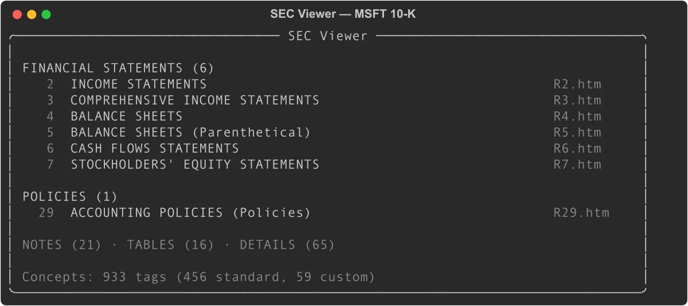
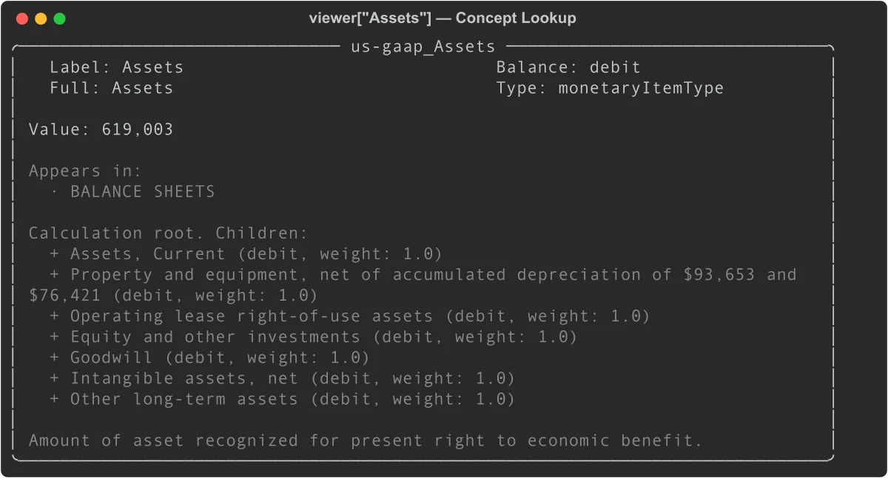
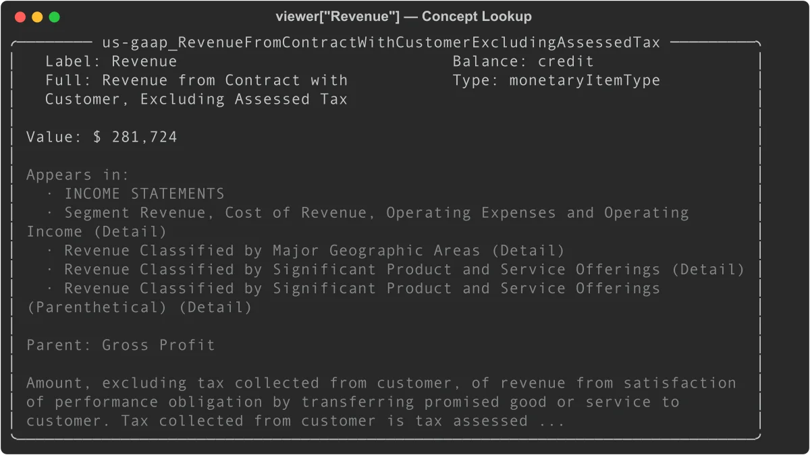

# SEC Viewer: Navigate XBRL Financial Data with Python

Every SEC filing with XBRL data has an Interactive Data Viewer on the SEC website — a structured view of financial statements, concepts, and calculation trees. EdgarTools gives you programmatic access to the same data.

```python
from edgar import Company

filing = Company("MSFT").get_filings(form="10-K").latest()
viewer = filing.viewer
print(viewer)
```



With three lines of code you have access to every tagged concept in the filing, the calculation structure behind each total, and the FASB definition for each line item.

## What You Can Do With the Viewer

The viewer is most useful for four tasks:

**Inspect a specific number.** When you see a line item in a financial statement and want to know exactly how it's defined, what it rolls up to, and where else it appears, `viewer['ConceptLabel']` answers all of those at once.

**Trace a total back to its components.** Every aggregate in GAAP filings has a calculation tree. `concept.children` shows the additive and subtractive components; `concept.calculation_tree()` shows the full recursive decomposition.

**Verify data quality.** `viewer.validate()` checks whether each total in the filing's calculation tree actually equals the sum of its children — surfacing any arithmetic inconsistencies in the filing itself.

**Cross-check the XBRL parser.** `viewer.compare(xbrl)` matches the SEC's own rendering against edgartools' XBRL parser output, giving you a match rate and a list of any discrepancies.

## Browse Reports by Category

The viewer organizes a filing's reports into five categories, matching the navigation tabs on the SEC website:

```python
# Financial statements (income statement, balance sheet, cash flows, etc.)
stmts = viewer.financial_statements   # List[ViewerReport]

# Note disclosures
notes = viewer.notes                  # List[ViewerReport]

# Accounting policy text
policies = viewer.policies

# Detailed breakdowns
tables = viewer.tables
details = viewer.details
```

Each `ViewerReport` wraps the underlying filing report with concept data:

```python
for report in viewer.financial_statements:
    print(report.short_name)
    print(f"  {len(report.concepts)} concepts, {len(report.period_headers)} periods")
    print(f"  Periods: {report.period_headers}")
```

To display a specific report in the terminal:

```python
viewer.view("Income Statement")
```

Or call `.view()` directly on a `ViewerReport`:

```python
income = viewer.financial_statements[0]
income.view()
```

### Report properties

| Property | Type | Description |
|----------|------|-------------|
| `short_name` | `str` | Display name (e.g., "Consolidated Balance Sheets") |
| `long_name` | `str` | Full XBRL role label |
| `category` | `str` | "Statements", "Notes", "Policies", "Tables", or "Details" |
| `html_file_name` | `str` | Source file (e.g., "R2.htm") |
| `concepts` | `List[str]` | Concept IDs present in this report |
| `period_headers` | `List[str]` | Column headers from the report |
| `concept_rows` | `list` | Concept-annotated rows from R*.htm |

## Look Up Concepts

The `[]` operator searches across all concepts by label or tag ID:

```python
# By tag ID (precise)
assets = viewer['us-gaap_Assets']
revenue = viewer['us-gaap_RevenueFromContractWithCustomerExcludingAssessedTax']

# By label (case-sensitive partial match)
eps = viewer['Earnings Per Share, Basic']
```

A concept panel shows its value, where it appears, calculation relationships, and FASB definition:

```python
print(viewer['us-gaap_Assets'])
```



```python
print(viewer['us-gaap_RevenueFromContractWithCustomerExcludingAssessedTax'])
```



### Concept properties

```python
c = viewer['us-gaap_Assets']

c.id             # 'us-gaap_Assets'
c.label          # 'Assets' (terse label)
c.full_label     # 'Assets'
c.crdr           # 'debit'
c.xbrltype       # 'monetaryItemType'
c.documentation  # Full FASB definition text
c.is_standard    # True (us-gaap taxonomy)
c.is_monetary    # True

# Values
c.value          # '619,003' (display string, latest period)
c.numeric_value  # 619003.0 (float, in display units)
c.values         # {'Jun. 30, 2025': '619,003', 'Jun. 30, 2024': '512,163', ...}
c.numeric_values # {'Jun. 30, 2025': 619003.0, ...}

# Where it appears
c.statements     # ['BALANCE SHEETS']
c.notes          # ['Revenue Recognition']
c.report_names   # All report names across every category
```

### Currency scaling

The R*.htm viewer files display monetary values in the units specified in the filing (often millions or thousands). To get the raw XBRL value:

```python
report = viewer.financial_statements[0]
scaling = report.concept_report.currency_scaling  # e.g., 1_000_000

c = viewer['us-gaap_RevenueFromContractWithCustomerExcludingAssessedTax']
raw_value = c.numeric_value * scaling             # 281_724_000_000
```

## Navigate Calculation Trees

Every total in a financial statement can be decomposed into its components via the calculation tree:

```python
total_assets = viewer['us-gaap_Assets']

# Is this a root (no parent)?
total_assets.is_root       # True
total_assets.parent        # None

# What are its components?
for child in total_assets.children:
    print(f"{child.label}: {child.value}  (weight: {child.weight})")
```

```
Assets, Current: 184,406  (weight: 1.0)
Property and equipment, net...: 130,133  (weight: 1.0)
Operating lease right-of-use assets: 25,640  (weight: 1.0)
...
```

Children can themselves have children. Use `calculation_tree()` for the full recursive structure:

```python
tree = total_assets.calculation_tree(max_depth=3)
# Returns nested dicts: {'concept': Concept, 'children': [...]}
```

A non-root concept shows its parent:

```python
current_assets = viewer['us-gaap_AssetsCurrent']
current_assets.is_root   # False
current_assets.parent    # Concept('Assets')
current_assets.weight    # 1.0
```

The `weight` is either `1.0` (additive) or `-1.0` (subtractive, common for cost items in the income statement).

## Search Across Concepts

`viewer.search()` looks across labels, FASB documentation, and concept IDs:

```python
# Search by keyword
results = viewer.search('revenue')
for concept in results:
    print(concept.id, concept.value)

# Narrow to a category
debt_notes = viewer.search('debt', category='Notes')
```

Search scans all tag metadata from MetaLinks.json, so it finds concepts even if they don't appear in the current period's statements.

## Validate Calculation Trees

The viewer can verify that children sum to their parents across every statement role:

```python
issues = viewer.validate()

# Each result has: parent, role, expected, computed, difference, valid
for r in issues:
    if not r['valid']:
        parent = r['parent']
        print(f"{parent.label}: expected {r['expected']:.0f}, got {r['computed']:.0f}")
```

By default, the tolerance is ±0.5 (in display units). Tighten it for strict validation:

```python
issues = viewer.validate(tolerance=0.01)
```

A clean filing with no validation failures returns an empty list for `[r for r in issues if not r['valid']]`.

## Cross-Validate Against the XBRL Parser

The `compare()` method checks the viewer's values against the edgartools XBRL parser. The viewer (R*.htm) is treated as ground truth since it reflects the SEC's authoritative rendering.

```python
xbrl = filing.xbrl()
results = viewer.compare(xbrl)

print(results.match_rate)   # 1.0 (100%)
print(results.total)        # Number of concept-period pairs compared
print(results.mismatches)   # List of ComparisonResult objects
```

For filings with discrepancies, print the full comparison:

```python
print(results)
```

```
Viewer vs XBRL
Compared: 94  Matched: 94  Match rate: 100.0%
```

Export the full comparison to a DataFrame for analysis:

```python
df = results.to_dataframe()
# Columns: concept_id, label, period, viewer_value, xbrl_value, difference, match, report
```

Cross-validation results from testing against major companies:

| Company | Match Rate | Notes |
|---------|-----------|-------|
| AAPL, MSFT, GOOGL, XOM, WMT, TSLA | 100% | Standard US GAAP |
| JPM | 89.9% | Bank segment structure edge cases |
| JNJ | 87.9% | Percentage decimal convention |

### LLM-based comparison

For qualitative differences that numeric comparison misses (labels, ordering, missing items), generate a side-by-side text prompt:

```python
xbrl = filing.xbrl()

# Returns a formatted string comparing viewer and XBRL text renderings
prompt = viewer.compare_context(xbrl, 'balance_sheet')

# Valid statement names: 'balance_sheet', 'income_statement',
#                        'cashflow_statement', 'comprehensive_income'
```

Pass `prompt` to any LLM for a natural-language audit of the two renderings.

## The Concept Graph

`viewer.concepts` returns a `ConceptGraph` — a navigable knowledge graph of every tagged XBRL concept in the filing. It combines tag definitions from MetaLinks.json (credit/debit, calculation trees, FASB documentation) with the actual values from R*.htm reports.

```python
graph = viewer.concepts
print(graph)  # ConceptGraph(tags=847, reports=62)
```

### Look up concepts directly

The graph supports the same `[]` lookup as the viewer itself:

```python
revenue = graph['Revenue']
assets = graph['us-gaap_Assets']

# Or by exact concept ID
concept = graph.concept('us-gaap_NetIncomeLoss')
```

### Search across all concepts

```python
results = graph.search('goodwill')
for concept in results:
    print(f"{concept.label}: {concept.value}")

# Filter by category
debt_concepts = graph.search('debt', category='Notes')
```

### Validate calculation trees

The graph can verify that every parent-children calculation relationship adds up:

```python
issues = graph.validate(tolerance=0.5)
for r in issues:
    if not r['valid']:
        print(f"{r['parent'].label}: expected {r['expected']:.0f}, got {r['computed']:.0f}")
```

### Export to DataFrame

```python
# All concepts with values
df = graph.to_dataframe()
# Columns: concept_id, label, crdr, value, display_value, report

# Filtered to one category
stmts_df = graph.to_dataframe(category='Statements')
notes_df  = graph.to_dataframe(category='Notes')
```

The `value` column contains the parsed numeric value in display units (millions or thousands, per the filing).

### Graph stats

```python
len(graph)                       # Total tag count from MetaLinks.json
graph.report_count               # Number of R*.htm reports parsed
graph.concept_count_with_values  # Concepts that appear in at least one report
```

### ConceptGraph reference

| Property / Method | Returns | Description |
|-------------------|---------|-------------|
| `graph['label']` | `Concept` | Look up by label or tag ID |
| `graph.concept(id)` | `Concept` | Look up by exact concept ID |
| `graph.search(query, category)` | `List[Concept]` | Search by keyword across labels, docs, and IDs |
| `graph.validate(tolerance)` | `List[dict]` | Check all calculation trees sum correctly |
| `graph.to_dataframe(category)` | `pd.DataFrame` | Export concepts with values |
| `len(graph)` | `int` | Total tag count from MetaLinks.json |
| `graph.report_count` | `int` | Number of R*.htm reports parsed |
| `graph.concept_count_with_values` | `int` | Concepts with at least one value |

## Check Viewer Availability

`viewer` returns `None` for filings that predate the SEC's XBRL viewer (pre-2012) or that don't include XBRL data:

```python
viewer = filing.viewer
if viewer is None:
    print(FilingViewer.viewer_support(filing))  # Explains why
```

To diagnose explicitly:

```python
from edgar.xbrl.viewer import FilingViewer

msg = FilingViewer.viewer_support(filing)
# Returns one of:
#   "Viewer is supported for this filing."
#   "No MetaLinks.json found — this filing predates the SEC viewer metadata (pre-2012) or is not XBRL."
#   "No FilingSummary.xml found — this filing has no interactive data."
#   "No SGML submission bundle available for this filing."
```

## AI Context

For feeding viewer data to an LLM:

```python
# Summary of all report categories
viewer.to_context()              # Standard detail
viewer.to_context(detail='full') # Includes available actions

# Individual concept
c = viewer['us-gaap_Assets']
c.to_context()               # id, label, balance, value, definition
c.to_context(detail='full')  # Adds components, appearances, FASB references
```

## When to Use the Viewer vs filing.xbrl()

Both provide financial data from the same filing. The right choice depends on what you need.

| Need | Use |
|------|-----|
| Financial statements rendered as tables | `xbrl.statements.income_statement()` |
| Query facts across many periods | `xbrl.facts.query()` |
| Navigate calculation tree for one concept | `viewer['Concept'].children` |
| FASB documentation for a concept | `viewer['Concept'].documentation` |
| Verify XBRL parser against SEC rendering | `viewer.compare(xbrl)` |
| Browse filing structure like the SEC website | `viewer.financial_statements` |
| Export all tagged values to DataFrame | `viewer.concepts.to_dataframe()` |

The viewer reflects what the SEC displays, so it's the definitive reference for "what the SEC says this number is." The XBRL parser is better for programmatic analysis across many periods or filings.

## Quick Reference

### FilingViewer

| Property / Method | Returns | Description |
|-------------------|---------|-------------|
| `viewer.financial_statements` | `List[ViewerReport]` | Statement-category reports |
| `viewer.notes` | `List[ViewerReport]` | Note-category reports |
| `viewer.policies` | `List[ViewerReport]` | Policy-category reports |
| `viewer.tables` | `List[ViewerReport]` | Table-category reports |
| `viewer.details` | `List[ViewerReport]` | Detail-category reports |
| `viewer.all_reports` | `List[ViewerReport]` | All reports |
| `viewer.concepts` | `ConceptGraph` | Full concept graph |
| `viewer['label']` | `Concept` | Concept lookup by label or tag ID |
| `viewer.search(query)` | `List[Concept]` | Search by keyword |
| `viewer.validate()` | `List[dict]` | Check calculation trees |
| `viewer.compare(xbrl)` | `ComparisonResults` | Cross-validate against XBRL parser |
| `viewer.compare_context(xbrl, stmt)` | `str` | LLM-ready side-by-side comparison |
| `viewer.view(name)` | — | Display a report in the terminal |
| `viewer.to_context()` | `str` | AI-optimized summary |

### Concept

| Property | Type | Description |
|----------|------|-------------|
| `concept.id` | `str` | Full tag ID (e.g., `us-gaap_Assets`) |
| `concept.label` | `str` | Terse label |
| `concept.full_label` | `str` | Full label |
| `concept.crdr` | `str` | `'credit'`, `'debit'`, or `None` |
| `concept.xbrltype` | `str` | XBRL data type |
| `concept.documentation` | `str` | FASB authoritative definition |
| `concept.is_standard` | `bool` | True for us-gaap, dei, srt, etc. |
| `concept.is_monetary` | `bool` | True for monetary item types |
| `concept.value` | `str` | Display string, latest period |
| `concept.numeric_value` | `float` | Parsed float, latest period |
| `concept.values` | `Dict[str, str]` | All period display values |
| `concept.numeric_values` | `Dict[str, float]` | All period floats |
| `concept.children` | `List[Concept]` | Calculation children |
| `concept.parent` | `Concept` | Calculation parent |
| `concept.weight` | `float` | Calculation weight (1.0 or -1.0) |
| `concept.is_root` | `bool` | True if no calculation parent |
| `concept.statements` | `List[str]` | Statement reports this appears in |
| `concept.notes` | `List[str]` | Note reports this appears in |
| `concept.report_names` | `List[str]` | All report names |
| `concept.auth_references` | `list` | FASB codification references |
| `concept.calculation_tree(max_depth)` | `dict` | Full recursive decomposition |
| `concept.to_context()` | `str` | AI-optimized summary |

### ComparisonResults

| Property / Method | Type | Description |
|-------------------|------|-------------|
| `results.match_rate` | `float` | Fraction matched (0.0-1.0) |
| `results.total` | `int` | Total concept-period pairs compared |
| `results.matched` | `int` | Matching pairs |
| `results.mismatched` | `int` | Mismatched pairs (value present but differs) |
| `results.missing` | `int` | Viewer concepts absent from XBRL |
| `results.mismatches` | `List[ComparisonResult]` | Only mismatched entries |
| `results.to_dataframe()` | `pd.DataFrame` | Full results as DataFrame |

---

## Related

- [Financial Statements](financial-data.md) — Extract income statements, balance sheets, and cash flow from 10-K and 10-Q filings
- [Working with Filings](working-with-filing.md) — Navigate filing documents, attachments, and reports
- [SGML Filing Bundle](sgml.md) — Access the raw SGML bundle directly
