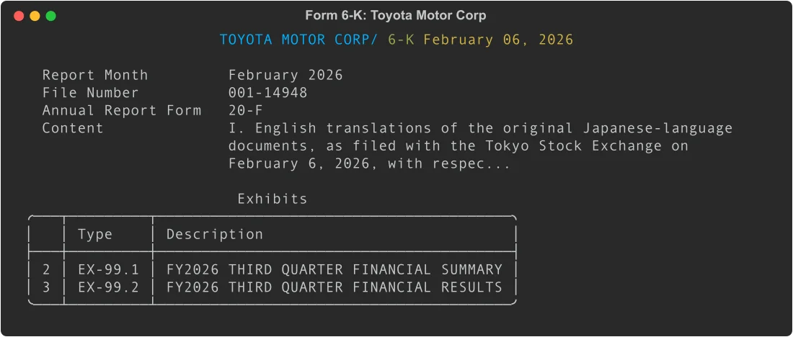
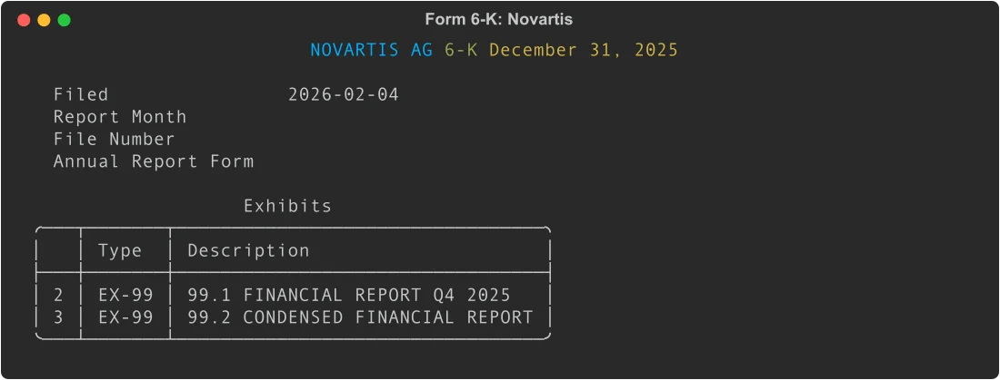

# Form 6-K: Parse Foreign Private Issuer Reports with Python

Form 6-K is the current report for non-US companies listed on US exchanges. Where a US company files an 8-K for material events, a foreign private issuer files a 6-K. EdgarTools parses these filings into structured Python objects, giving you the cover page metadata, exhibit list, and press release content in a few lines.

```python
from edgar import Company

tm = Company("TM")
filing = tm.get_filings(form="6-K")[3]
six_k = filing.obj()
six_k
```



Four lines to get a parsed 6-K with company metadata, report month, file number, and all exhibits.

---

## Read Cover Page Metadata

Every 6-K has a standardized cover page with identifying information. These fields are parsed automatically:

```python
six_k.company               # "TOYOTA MOTOR CORP/"
six_k.form                  # "6-K"
six_k.filing_date           # "2026-02-06"
six_k.date_of_report        # "February 06, 2026"
six_k.report_month          # "February 2026"
six_k.commission_file_number  # "001-14948"
six_k.annual_report_form    # "20-F" or "40-F"
six_k.content_description   # What this filing contains
```

The `content_description` comes from the "Material Contained in this Report" section of the cover page. It usually summarizes what exhibits are attached or what event prompted the filing.

The `annual_report_form` field reflects whether the issuer files annual reports on Form 20-F (most foreign private issuers) or Form 40-F (Canadian companies with US cross-listings).

---

## Access Exhibits

6-K content is almost always in exhibits rather than inline in the cover page. The `exhibits` property returns all non-graphic attachments:

```python
six_k.has_exhibits   # True
six_k.exhibits       # List of Attachment objects

for ex in six_k.exhibits:
    print(f"{ex.document_type}: {ex.description}")

# EX-99.1: FY2026 THIRD QUARTER FINANCIAL SUMMARY
# EX-99.2: FY2026 THIRD QUARTER FINANCIAL RESULTS
```

Each exhibit has:

| Property | What it is |
|----------|-----------|
| `document_type` | Type code (`"EX-99.1"`, `"EX-4.1"`, etc.) |
| `description` | Human-readable description |
| `sequence_number` | Position in filing package |
| `document` | Filename (e.g., `"exhibit99-1.htm"`) |

To download and read an exhibit:

```python
exhibit = six_k.exhibits[0]
content = exhibit.download()   # Returns raw HTML or text
```

---

## Access Press Releases

Earnings announcements and other company news arrive as EX-99.x press release exhibits. The `press_releases` property filters for these:

```python
from edgar import Company

nvs = Company("NVS")
filing = nvs.get_filings(form="6-K")[2]
six_k = filing.obj()
six_k
```



```python
if six_k.has_press_release:
    releases = six_k.press_releases
    pr = releases[0]

    pr.text()         # Plain text
    pr.html()         # HTML
    pr.to_markdown()  # Markdown
    pr.open()         # Open in browser
```

`press_releases` matches exhibits with document types `EX-99`, `EX-99.1`, or `EX-99.01`, or any exhibit description containing "RELEASE".

---

## Search Across Multiple Companies

To pull 6-K filings from a specific company, or scan recent filings across all foreign issuers:

```python
from edgar import Company, get_filings

# One company
shel = Company("SHEL")
shel_filings = shel.get_filings(form="6-K").head(10)

# All recent 6-K filings
recent = get_filings(form="6-K").head(20)
for filing in recent:
    six_k = filing.obj()
    if six_k.has_press_release:
        print(f"{six_k.company}: {six_k.content_description[:80]}")
```

---

## Get the Full Text

`text()` returns the complete filing content, including all exhibit text rendered as plain text:

```python
content = six_k.text()
print(content[:2000])
```

This is useful for passing filing content to language models or full-text search pipelines.

---

## XBRL Financials (Rare)

XBRL is filed with fewer than 3% of 6-K filings. When present, it uses the IFRS taxonomy rather than US-GAAP:

```python
if six_k.financials:
    financials = six_k.financials
    financials.income_statement
    financials.balance_sheet
    financials.cash_flow_statement
```

Most earnings data in 6-K filings is in HTML tables inside EX-99.x exhibits, not in XBRL. If you need structured financial data from a 6-K, parse the press release exhibits directly.

---

## Common Use Cases

### Collect earnings releases from a foreign issuer

```python
from edgar import Company

tsm = Company("TSM")
earnings_filings = []

for filing in tsm.get_filings(form="6-K").head(30):
    six_k = filing.obj()
    if six_k.has_press_release:
        earnings_filings.append(filing)

for f in earnings_filings:
    six_k = f.obj()
    print(f"{f.filing_date}: {six_k.content_description[:100]}")
```

### Scan for AGM notices

```python
from edgar import Company

nvs = Company("NVS")
for filing in nvs.get_filings(form="6-K").head(50):
    six_k = filing.obj()
    desc = six_k.content_description or ""
    if any(kw in desc.lower() for kw in ["annual general", "agm", "shareholders meeting"]):
        print(f"{filing.filing_date}: {desc[:120]}")
```

### Identify debt offering filings

```python
from edgar import Company

shel = Company("SHEL")
for filing in shel.get_filings(form="6-K").head(20):
    six_k = filing.obj()
    # Debt offerings often attach underwriting agreements (EX-1.1) or indentures (EX-4.x)
    for ex in six_k.exhibits:
        if ex.document_type and ex.document_type.startswith("EX-1"):
            print(f"{filing.filing_date}: {ex.document_type} - {ex.description}")
```

### Get AI-readable context

The `to_context()` method produces a compact string formatted for language model prompts:

```python
# Standard context (~300 tokens)
six_k.to_context()

# Minimal (~100 tokens) — just the key facts
six_k.to_context(detail='minimal')

# Full (~500+ tokens) — includes cover page text
six_k.to_context(detail='full')
```

---

## How 6-K Differs from 8-K

6-K and 8-K both report material events, but they have different structures:

| | 6-K | 8-K |
|--|-----|-----|
| **Filers** | Foreign private issuers | US domestic companies |
| **Items** | None -- no numbered item structure | Items 1.01 through 9.01 |
| **Content location** | Exhibits (EX-99.x) or inline cover page | Exhibit + item text |
| **XBRL** | Rare (~2-3%), IFRS taxonomy | DEI metadata only |
| **Filing trigger** | Material information disclosed in home country | Specified corporate events |
| **Amendment** | `6-K/A` | `8-K/A` |

Because 6-K has no item structure, there is no `items` property and no `['2.02']` item lookup. Content analysis relies on `content_description` from the cover page and the text of individual exhibits.

---

## Metadata Quick Reference

| Property | Type | Description | Example |
|----------|------|-------------|---------|
| `company` | `str` | Company name | `"TOYOTA MOTOR CORP/"` |
| `form` | `str` | Form type | `"6-K"` or `"6-K/A"` |
| `filing_date` | `str` | Date filed with SEC | `"2026-02-06"` |
| `date_of_report` | `str` | Period of report (formatted) | `"February 06, 2026"` |
| `report_month` | `str \| None` | Reporting month from cover | `"February 2026"` |
| `commission_file_number` | `str \| None` | SEC file number | `"001-14948"` |
| `annual_report_form` | `str \| None` | Annual report form type | `"20-F"` or `"40-F"` |
| `content_description` | `str \| None` | What the filing contains | `"English translation..."` |
| `has_exhibits` | `bool` | Has content exhibits? | `True` |
| `has_press_release` | `bool` | Has EX-99.x press release? | `True` |

---

## Methods Quick Reference

| Call | Returns | What it does |
|------|---------|--------------|
| `six_k.exhibits` | `list[Attachment]` | Non-graphic exhibit attachments |
| `six_k.press_releases` | `PressReleases \| None` | EX-99.x press release exhibits |
| `six_k.financials` | `Financials \| None` | XBRL financials (rare; IFRS) |
| `six_k.text()` | `str` | Full filing text including exhibits |
| `six_k.to_context(detail)` | `str` | AI-optimized context string |

---

## Things to Know

**No item structure.** 6-K filings have no numbered items. Do not try to access `six_k['2.02']` or `six_k.items` -- those properties belong to `EightK`, not `SixK`.

**Cover page metadata depends on formatting.** `report_month`, `commission_file_number`, and `annual_report_form` are parsed by pattern matching against the cover page text. A small number of filings use non-standard formatting and may return `None` for these fields.

**XBRL uses IFRS.** When XBRL is present, it uses the IFRS taxonomy, not US-GAAP. Concept names differ from what you'd find in domestic company filings.

**`exhibits` excludes graphics.** JPG, GIF, and PNG attachments are filtered out. Only text and HTML documents appear in the list.

**6-K/A is an amendment.** The `form` property will be `"6-K/A"` for amendments. The `SixK` class handles both.

**Filing volume varies.** Active foreign issuers file multiple 6-Ks per month (exchange notifications, executive changes, dividend announcements). TSMC and Toyota each have over 1,000 on record.

---

## Related

- [8-K Current Reports](../eightk-filings.md) -- the domestic equivalent, with item-based extraction
- [Working with Filings](working-with-filing.md) -- general filing access patterns
- [20-F Annual Reports](concepts/data-objects.md) -- annual reports from foreign private issuers
