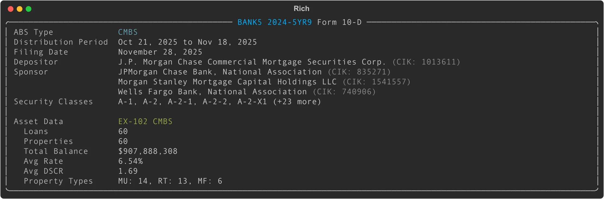

# Form 10-D: ABS Distribution Reports (CMBS)

## Overview

**Form 10-D** is an Asset-Backed Issuer Distribution Report required under Sections 13 and 15(d) of the Securities Exchange Act of 1934. These filings disclose distribution and pool performance data for publicly offered asset-backed securities (ABS).

ABS come in many forms — credit card receivables, auto loans, student loans, residential mortgages (RMBS), commercial mortgages (CMBS), and utility securitizations. However, **edgartools currently supports only CMBS (Commercial Mortgage-Backed Securities) filings** that include structured XML asset data in the EX-102 attachment.

For CMBS 10-D filings, edgartools extracts:
- **Loan-level data**: 49 fields covering origination, balance, rate, maturity, servicer, and payment status
- **Property-level data**: 46 fields covering location, type, valuation, occupancy, financials, and debt service coverage ratios
- **Summary statistics**: Pool metrics like total balance, average DSCR, occupancy, and property type distribution

### What About Non-CMBS 10-D Filings?

For non-CMBS 10-D filings (auto loans, credit cards, student loans, etc.), `filing.obj()` returns `None` because these filings do not include standardized XML asset data. Asset data for non-CMBS filings is typically reported in separate ABS-EE filings or in HTML tables with highly variable formats.

## Access Pattern

```python
from edgar import Filing

# Get a Form 10-D filing
filing = Filing(form="10-D", ...)

# Parse into TenD object
ten_d = filing.obj()  # Returns TenD for CMBS, None for non-CMBS

# Check if CMBS data is available
if ten_d and ten_d.has_asset_data:
    loans = ten_d.loans              # pandas DataFrame
    properties = ten_d.properties    # pandas DataFrame
    summary = ten_d.asset_data.summary()  # CMBSSummary
```

---

## Display

When you call `filing.obj()` on a CMBS Form 10-D filing, edgartools parses the filing and displays a rich panel with issuer information, distribution period, and asset data summary:



The panel shows:
- Issuing entity (ABS trust name and CIK)
- ABS type (detected as CMBS, AUTO, CREDIT_CARD, etc.)
- Distribution period dates
- Filing date
- Depositor and sponsor entities
- Security classes registered
- Asset data summary (loans, properties, total balance, average rates/DSCR/occupancy, property types)

---

## Core Data Structure

### TenD (Top-Level Object)

| Property | Type | Description |
|----------|------|-------------|
| `filing` | `Filing` | The underlying Filing object |
| `form` | `str` | Form type (10-D or 10-D/A for amendments) |
| `company` | `str` | Company name from the filing |
| `filing_date` | `date` | Filing date |
| `accession_number` | `str` | SEC accession number |
| `issuing_entity` | `ABSEntity` | The ABS trust/entity (parsed from HTML header) |
| `depositor` | `ABSEntity` | The depositor entity |
| `sponsors` | `List[ABSEntity]` | Sponsor entities |
| `distribution_period` | `DistributionPeriod` | Period covered (start_date, end_date) |
| `security_classes` | `List[str]` | Classes of securities registered |
| `abs_type` | `ABSType` | Detected ABS type enum (CMBS, AUTO, CREDIT_CARD, RMBS, STUDENT_LOAN, UTILITY, OTHER) |
| `has_asset_data` | `bool` | Whether EX-102 XML exists (CMBS indicator) |
| `asset_data` | `Optional[CMBSAssetData]` | Parsed CMBS asset data (lazy-loaded) |
| `loans` | `Optional[DataFrame]` | Convenience property for `asset_data.loans` |
| `properties` | `Optional[DataFrame]` | Convenience property for `asset_data.properties` |

---

## Supporting Data Models

### ABSEntity

Represents an entity involved in the ABS transaction (issuer, depositor, or sponsor).

| Field | Type | Description |
|-------|------|-------------|
| `name` | `str` | Entity name |
| `cik` | `Optional[str]` | SEC Central Index Key |
| `file_number` | `Optional[str]` | Commission file number |

### DistributionPeriod

The distribution period covered by the filing.

| Field | Type | Description |
|-------|------|-------------|
| `start_date` | `Optional[date]` | Period start date |
| `end_date` | `Optional[date]` | Period end date |

### ABSType (Enum)

Detected asset-backed security type. EdgarTools detects this by looking for EX-102 XML (CMBS) or by analyzing company/issuer name keywords.

| Value | Description |
|-------|-------------|
| `CMBS` | Commercial Mortgage-Backed Securities |
| `AUTO` | Auto Loan/Lease ABS |
| `CREDIT_CARD` | Credit Card Receivables |
| `RMBS` | Residential Mortgage-Backed Securities |
| `STUDENT_LOAN` | Student Loan ABS |
| `UTILITY` | Utility Securitizations |
| `OTHER` | Other asset types |

---

## CMBS Asset Data

### CMBSAssetData

The `asset_data` property provides access to the structured CMBS loan and property data parsed from the EX-102 XML attachment.

| Property | Type | Description |
|----------|------|-------------|
| `loans` | `DataFrame` | Loan-level data (49 fields) |
| `properties` | DataFrame` | Property-level data (46 fields) |
| `summary()` | `CMBSSummary` | Aggregate statistics for the pool |

### Loans DataFrame (49 Fields)

The `loans` DataFrame contains one row per loan with the following key columns:

| Column | Type | Description |
|--------|------|-------------|
| `loan_id` | `str` | Prospectus loan identifier |
| `originator` | `str` | Loan originator name |
| `origination_date` | `date` | Date loan was originated |
| `original_amount` | `float` | Original loan amount |
| `original_term_months` | `int` | Original loan term in months |
| `maturity_date` | `date` | Loan maturity date |
| `original_rate` | `float` | Original interest rate |
| `current_rate` | `float` | Current interest rate |
| `actual_balance` | `float` | Current actual balance |
| `scheduled_balance` | `float` | Scheduled principal balance at securitization |
| `payment_status` | `str` | Payment status code (0=current, 1=30 days, etc.) |
| `is_modified` | `bool` | Whether loan has been modified |
| `is_balloon` | `bool` | Whether loan has balloon payment |
| `is_interest_only` | `bool` | Whether loan is interest-only |
| `primary_servicer` | `str` | Primary servicer name |
| `lien_position` | `str` | Lien position code |
| `num_properties` | `int` | Number of properties securing the loan |

**Additional loan fields** include: `loan_id_type`, `period_start`, `period_end`, `securitization_rate`, `accrual_method`, `rate_type`, `io_term_months`, `first_payment_date`, `loan_structure`, `payment_type`, `payment_frequency`, `num_properties_securitization`, `grace_days`, `has_prepayment_premium`, `has_negative_amortization`, `lockout_end_date`, `yield_maintenance_end_date`, `prepayment_premium_end_date`, `period_begin_balance`, `scheduled_pi_due`, `servicer_fee_rate`, `scheduled_interest`, `scheduled_principal`, `unscheduled_principal`, `scheduled_end_balance`, `paid_through_date`, `servicing_advance_method`, `pi_advances_outstanding`, `ti_advances_outstanding`, `other_advances_outstanding`, `subject_to_demand`.

### Properties DataFrame (46 Fields)

The `properties` DataFrame contains one or more rows per loan (one per property securing the loan) with the following key columns:

| Column | Type | Description |
|--------|------|-------------|
| `loan_id` | `str` | Associated loan identifier |
| `name` | `str` | Property name |
| `address` | `str` | Street address |
| `city` | `str` | City |
| `state` | `str` | State code |
| `zip` | `str` | ZIP code |
| `county` | `str` | County |
| `property_type` | `str` | Property type code (MF, OF, RT, etc.) |
| `units` | `int` | Number of units/beds/rooms |
| `sqft` | `int` | Net rentable square feet |
| `year_built` | `int` | Year property was built |
| `year_renovated` | `int` | Year last renovated |
| `valuation` | `float` | Property valuation amount |
| `valuation_source` | `str` | Valuation source code |
| `valuation_date` | `date` | Valuation date |
| `occupancy_securitization` | `float` | Occupancy % at securitization |
| `occupancy_current` | `float` | Most recent occupancy % |
| `revenue_securitization` | `float` | Revenue at securitization |
| `opex_securitization` | `float` | Operating expenses at securitization |
| `noi_securitization` | `float` | Net Operating Income at securitization |
| `ncf_securitization` | `float` | Net Cash Flow at securitization |
| `dscr_noi_securitization` | `float` | Debt Service Coverage Ratio (NOI) at securitization |
| `dscr_ncf_securitization` | `float` | Debt Service Coverage Ratio (NCF) at securitization |

**Additional property fields** include: `units_securitization`, `sqft_securitization`, `status`, `defeased_status`, `tenant_1_name`, `tenant_1_sqft`, `tenant_1_lease_exp`, `tenant_2_name`, `tenant_2_sqft`, `tenant_2_lease_exp`, `tenant_3_name`, `tenant_3_sqft`, `tenant_3_lease_exp`, `financials_date_securitization`, `financials_start_date`, `financials_end_date`, `revenue_current`, `opex_current`, `noi_current`, `ncf_current`, `debt_service_current`, `dscr_noi_current`, `dscr_ncf_current`.

### CMBSSummary

The `summary()` method aggregates the loan and property data into pool-level statistics.

| Field | Type | Description |
|-------|------|-------------|
| `num_loans` | `int` | Total number of loans |
| `num_properties` | `int` | Total number of properties |
| `total_loan_balance` | `float` | Sum of actual balances |
| `total_original_loan_amount` | `float` | Sum of original amounts |
| `avg_interest_rate` | `Optional[float]` | Average current interest rate |
| `avg_dscr` | `Optional[float]` | Average DSCR (NOI-based) |
| `avg_occupancy` | `Optional[float]` | Average occupancy % |
| `property_types` | `Dict[str, int]` | Property type code → count |
| `states` | `Dict[str, int]` | State → count |
| `delinquent_loans` | `int` | Number of loans with payment_status != '0' |
| `modified_loans` | `int` | Number of modified loans |

---

## Property Type Codes

Common values for `property_type` in the properties DataFrame:

| Code | Description |
|------|-------------|
| `MF` | Multifamily |
| `OF` | Office |
| `RT` | Retail |
| `IN` | Industrial |
| `LO` | Lodging/Hotel |
| `HC` | Healthcare |
| `SS` | Self Storage |
| `MH` | Manufactured Housing |
| `OT` | Other |

---

## Example: Analyzing a CMBS Pool

```python
from edgar import find

# Find a CMBS 10-D filing (BANK5 2024-5YR9)
filing = find('0001888524-25-020550')
ten_d = filing.obj()

# Display the filing
print(ten_d)
# Shows the rich panel with issuer, distribution period, and asset data summary

# Check if CMBS data is available
print(ten_d.has_asset_data)  # True
print(ten_d.abs_type)         # ABSType.CMBS

# Access loan data
loans = ten_d.loans
print(f"Number of loans: {len(loans)}")
print(loans[['loan_id', 'actual_balance', 'current_rate', 'payment_status']].head())

# Access property data
properties = ten_d.properties
print(f"Number of properties: {len(properties)}")
print(properties[['name', 'city', 'state', 'property_type', 'valuation']].head())

# Get pool summary
summary = ten_d.asset_data.summary()
print(f"Total balance: ${summary.total_loan_balance:,.0f}")
print(f"Average rate: {summary.avg_interest_rate:.2%}")
print(f"Average DSCR: {summary.avg_dscr:.2f}")
print(f"Delinquent loans: {summary.delinquent_loans}")

# Property type distribution
for prop_type, count in sorted(summary.property_types.items(), key=lambda x: -x[1]):
    print(f"  {prop_type}: {count}")

# Top states by property count
for state, count in sorted(summary.states.items(), key=lambda x: -x[1])[:5]:
    print(f"  {state}: {count}")
```

---

## Example: Finding High-DSCR Properties

```python
from edgar import find

filing = find('0001888524-25-020550')
ten_d = filing.obj()

# Filter properties with strong debt service coverage
properties = ten_d.properties
high_dscr = properties[properties['dscr_noi_securitization'] > 1.5]

print(f"Found {len(high_dscr)} properties with DSCR > 1.5")
print(high_dscr[['name', 'property_type', 'state', 'dscr_noi_securitization']].sort_values('dscr_noi_securitization', ascending=False))
```

---

## Example: Tracking Delinquencies

```python
from edgar import find

filing = find('0001888524-25-020550')
ten_d = filing.obj()

# Find delinquent loans (payment_status != '0')
loans = ten_d.loans
delinquent = loans[loans['payment_status'] != '0']

print(f"Delinquent loans: {len(delinquent)} out of {len(loans)}")

if len(delinquent) > 0:
    print(delinquent[['loan_id', 'actual_balance', 'payment_status', 'primary_servicer']])
```

---

## Example: Geographic Distribution

```python
from edgar import find
import pandas as pd

filing = find('0001888524-25-020550')
ten_d = filing.obj()

# Aggregate property value by state
properties = ten_d.properties
state_totals = properties.groupby('state').agg({
    'valuation': 'sum',
    'loan_id': 'count'
}).rename(columns={'loan_id': 'num_properties'})

state_totals = state_totals.sort_values('valuation', ascending=False)
print(state_totals.head(10))
```

---

## Searching for 10-D Filings

```python
from edgar import get_filings, Company

# Search for all recent 10-D filings
recent_10d = get_filings(form="10-D").head(20)

for filing in recent_10d:
    ten_d = filing.obj()

    # Only CMBS filings will have asset_data
    if ten_d and ten_d.has_asset_data:
        print(f"{ten_d.issuing_entity.name}: {ten_d.abs_type.value}")
        summary = ten_d.asset_data.summary()
        print(f"  {summary.num_loans} loans, ${summary.total_loan_balance:,.0f}")

# Search for 10-D filings by a specific company
company = Company("1888524")  # BANK as Depositor
filings = company.get_filings(form="10-D")
```

---

## Important Notes

1. **CMBS-only support**: `filing.obj()` returns `TenD` only for CMBS filings with EX-102 XML asset data. Non-CMBS 10-D filings return `None`.

2. **DataFrames are pandas DataFrames**: You can use standard pandas operations to filter, aggregate, and analyze the data.

3. **Lazy loading**: The XML asset data is parsed on first access to `asset_data`, `loans`, or `properties`.

4. **Missing data**: Many fields can be `None` or `NaN`. Always handle missing data gracefully when doing calculations.

5. **Distribution report HTML parsing is not supported**: The narrative distribution report section has highly variable HTML formats across issuers and was found to have only ~42% extraction accuracy. EdgarTools focuses on the structured EX-102 XML data.

---

## Data Source

The structured CMBS data comes from the **EX-102 XML attachment** filed with the 10-D. The XML follows the SEC EDGAR schema: `http://www.sec.gov/edgar/document/absee/cmbs/assetdata`

The issuer, depositor, sponsor, distribution period, and security class information is parsed from the HTML header of the 10-D filing.

---

## Common Use Cases

### Portfolio Risk Analysis
- Identify loans with low DSCR or high vacancy
- Track delinquency rates across servicers
- Monitor properties in specific states or metros

### Investment Research
- Compare pool composition across issuers
- Analyze property type concentrations
- Evaluate geographic diversification

### Compliance Monitoring
- Track modified loans
- Monitor payment status trends
- Review servicer performance

### Market Intelligence
- Analyze securitization activity by sponsor
- Track originator market share
- Compare interest rates across pools
