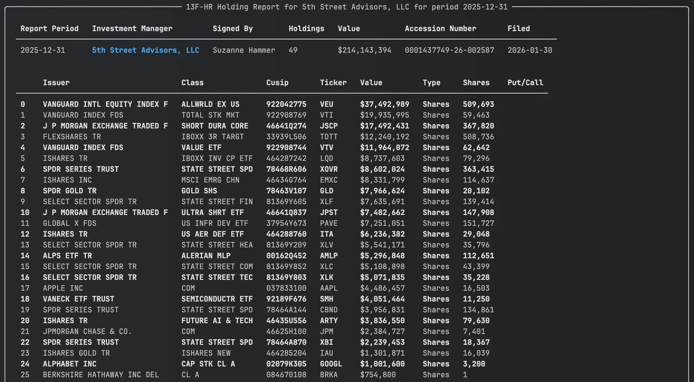
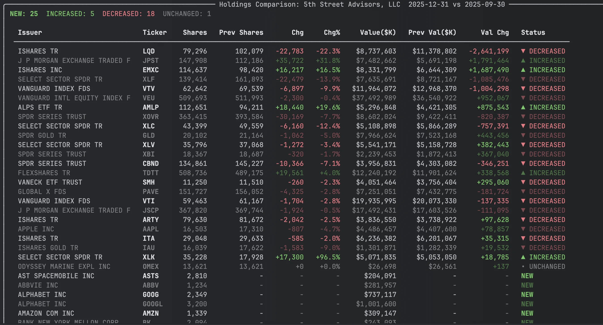

# 13F Holdings: Parse SEC Institutional Portfolio Filings with Python

See what the big funds are buying. SEC 13F filings disclose the equity holdings of institutional managers with over $100M in assets -- every quarter, publicly available. EdgarTools parses these filings into structured Python objects so you can analyze portfolios in a few lines of code.

```python
from edgar import get_filings

filings = get_filings(form="13F-HR")
report = filings[0].obj()
report
```



Three lines to get a fully parsed holdings report with management company, total portfolio value, and every position.

---

## Access Holdings Data

The `.holdings` property returns a DataFrame with one row per security, aggregated across managers, sorted by value:

```python
report.holdings
```

| Column | What it is |
|--------|-----------|
| `Issuer` | Company name (`"APPLE INC"`) |
| `Ticker` | Resolved ticker symbol (`"AAPL"`) |
| `Value` | Market value in **thousands** of dollars |
| `SharesPrnAmount` | Share count or principal amount |
| `Cusip` | 9-character CUSIP |
| `Type` | `"Shares"` or `"Principal"` |
| `PutCall` | `"PUT"`, `"CALL"`, or empty |

Values are in thousands -- the SEC's reporting unit. `Value` of 135,364 means $135.4 million.

---

## Compare 13F Holdings Quarter-over-Quarter

One call to see what changed:

```python
report.compare_holdings()
```



Every position gets a status: **NEW**, **CLOSED**, **INCREASED**, **DECREASED**, or **UNCHANGED**. Results are sorted by absolute value change so the biggest moves appear first.

```python
comparison = report.compare_holdings()

# Dig into the data
df = comparison.data
new_buys = df[df['Status'] == 'NEW']
exits = df[df['Status'] == 'CLOSED']
```

The comparison DataFrame includes `Shares`, `PrevShares`, `ShareChange`, `ShareChangePct`, `Value`, `PrevValue`, `ValueChange`, `ValueChangePct`, and `Status`.

---

## Track Holdings Trends Across Quarters

See how positions evolve across quarters with sparkline visualizations:

```python
report.holding_history(periods=4)
```


Each row shows share counts per quarter and a Unicode sparkline (`▁▂▃▅▇`) so you can spot trends at a glance.

```python
history = report.holding_history(periods=4)
df = history.data  # Full DataFrame with one column per quarter
```

---

## Using View Objects in Your Own App

`holdings_view()`, `compare_holdings()`, and `holding_history()` all return view objects that render in the terminal via Rich but also support iteration, indexing, and access to the underlying DataFrame. This makes them useful for building your own dashboards, reports, or exports.

All three views share the same interface:

```python
view = report.holdings_view()
comparison = report.compare_holdings()
history = report.holding_history(periods=4)

# Iterate rows as dicts
for row in view:
    print(row['Ticker'], row['Value'])

# Index a single row (returns dict)
view[0]

# Slice (returns DataFrame)
view[:10]

# Length
len(view)

# Access the full DataFrame directly
view.data
comparison.data
history.data
```

Each view also carries metadata useful for rendering headers:

| View | Metadata |
|------|----------|
| `HoldingsView` | `.display_limit` |
| `HoldingsComparison` | `.current_period`, `.previous_period`, `.manager_name` |
| `HoldingsHistory` | `.periods` (list of quarter dates), `.manager_name` |

---

## Look Up a Specific Fund

```python
from edgar import Company

berkshire = Company("BRK.A")
filing = berkshire.get_filings(form="13F-HR").latest(1)
report = filing.obj()

print(report.management_company_name)  # "Berkshire Hathaway Inc"
print(f"${report.total_value:,}K across {report.total_holdings} holdings")
```

---

## Common Analysis Patterns

### Portfolio concentration

```python
h = report.holdings
total = h['Value'].sum()
h['Weight'] = (h['Value'] / total * 100).round(2)
h[['Ticker', 'Issuer', 'Value', 'Weight']].head(10)
```

### Options positions

```python
report.holdings.query("PutCall in ['PUT', 'CALL']")
```

### Previous quarter's full report

```python
previous = report.previous_holding_report()  # Returns a ThirteenF or None
previous.holdings
```

---

## Multi-Manager Filings

Large institutions (Bank of America, State Street) file consolidated 13F reports. The `holdings` property automatically aggregates across all managers. If you need per-manager detail, use `infotable` instead:

```python
report.infotable   # Disaggregated: one row per manager-security pair
report.holdings    # Aggregated: one row per security (recommended)

# Example: Berkshire Hathaway
# infotable: ~121 rows (3 managers x ~40 securities)
# holdings:   ~40 rows (aggregated by CUSIP)

# See who the other managers are
for mgr in report.other_managers:
    print(f"{mgr.name} (CIK: {mgr.cik})")
```

---

## Metadata Quick Reference

| Property | Returns | Example |
|----------|---------|---------|
| `management_company_name` | Company that filed | `"Berkshire Hathaway Inc"` |
| `report_period` | Quarter end date | `"2024-03-31"` |
| `filing_date` | Date filed | `"2024-05-15"` |
| `total_value` | Portfolio value ($000s) | `Decimal('313218000')` |
| `total_holdings` | Number of positions | `40` |
| `filing_signer_name` | Who signed | `"Marc D. Hamburg"` |
| `filing_signer_title` | Signer's title | `"Senior Vice President"` |
| `form` | Form type | `"13F-HR"` |
| `accession_number` | SEC accession no. | `"0000950123-24-007092"` |
| `has_infotable()` | Has holdings data? | `True` for 13F-HR, `False` for 13F-NT |

---

## Methods Quick Reference

| Call | Returns | What it does |
|------|---------|-------------|
| `report.holdings` | `DataFrame` | Aggregated holdings, one row per security |
| `report.infotable` | `DataFrame` | Raw holdings, disaggregated by manager |
| `report.holdings_view()` | `HoldingsView` | Rich-renderable, iterable holdings |
| `report.compare_holdings()` | `HoldingsComparison` | Quarter-over-quarter changes with status labels |
| `report.holding_history(periods=4)` | `HoldingsHistory` | Multi-quarter share trends with sparklines |
| `report.previous_holding_report()` | `ThirteenF` | Previous quarter's 13F object |
| `report.other_managers` | `list[OtherManager]` | Affiliated managers in consolidated filings |
| `report.get_portfolio_managers()` | `list[dict]` | Curated lookup of known portfolio managers |

---

## Things to Know

**Values are in thousands.** The SEC requires 13F values in $000s. A `Value` of 135,364 is $135.4 million.

**`holdings` vs `infotable`.** Use `holdings` (aggregated by CUSIP) for portfolio analysis. Use `infotable` only when you need per-manager detail in multi-manager filings.

**Ticker resolution.** Tickers are resolved from CUSIPs. Most resolve correctly, but delisted or obscure securities may show as blank.

**Pre-2013 filings use TXT format.** EdgarTools parses both XML (2013+) and TXT (2012 and earlier) transparently, but older filings may have fewer columns.

**13F-NT means no holdings.** Notice filings indicate the manager had nothing to report. `has_infotable()` returns `False`.

**Report period vs filing date.** The `report_period` is the quarter end. The `filing_date` can be up to 45 days later. Some managers file multiple historical periods on the same day.

---

## Related

- [Institutional Holdings Guide](../13f-filings.md) -- workflow-oriented guide for finding, analyzing, and comparing 13F holdings
- [Working with Filings](working-with-filing.md) -- general filing access patterns
