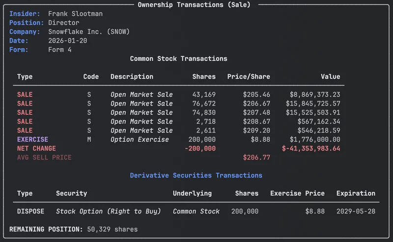
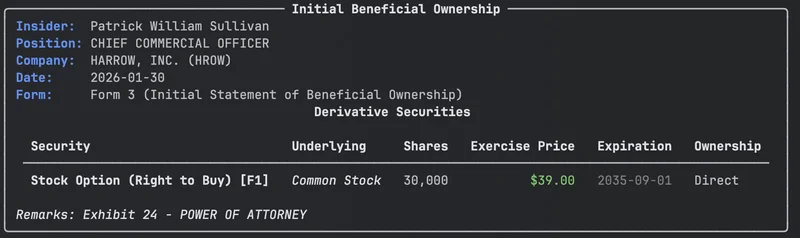

# Insider Trades: Track SEC Form 4 Insider Buying and Selling with Python

Know when insiders buy or sell their own company's stock. SEC Forms 3, 4, and 5 disclose every transaction by officers, directors, and major shareholders. EdgarTools parses these filings into structured Python objects with computed insights like net position change and trading plan detection.

```python
from edgar import Company

snow = Company("SNOW")
filing = snow.get_filings(form=4).latest(1)
form4 = filing.obj()
form4
```



Three lines to see who traded, what they traded, and the net impact on their position.

---

## Get the Transaction Summary

The `get_ownership_summary()` method returns a `TransactionSummary` with computed properties that answer the questions you actually care about.

```python
summary = form4.get_ownership_summary()

summary.insider_name          # "Bruce I. Sachs"
summary.position              # "Director"
summary.primary_activity      # "Purchase", "Sale", "Option Exercise", etc.
summary.net_change            # 15000 (positive = bought, negative = sold)
summary.net_value             # 3260400.0 (net dollar value of trades)
summary.remaining_shares      # 36599
```

| Property | What it tells you |
|----------|-------------------|
| `primary_activity` | One-word categorization: Purchase, Sale, Tax Withholding, Grant/Award, Option Exercise, Mixed |
| `net_change` | Net shares bought minus sold -- the single most important number |
| `net_value` | Net dollar value of all transactions |
| `remaining_shares` | Insider's position after all transactions |
| `transaction_types` | List of unique activity types in this filing |
| `has_non_derivatives` | Whether any common stock was traded |

<!-- IMAGE: Rich console output of TransactionSummary showing the color-coded transaction table with NET CHANGE and AVG PRICE rows. Capture new WebP showing a filing with both buys and sells if possible. -->

---

## Detect Automated Trading Plans

The `has_10b5_1_plan` property tells you whether trades were pre-scheduled under a Rule 10b5-1 plan. This matters because pre-scheduled sales are less informative than discretionary ones.

```python
summary.has_10b5_1_plan       # True, False, or None

# True  = trade executed under a 10b5-1 plan (automated, less signal)
# False = footnotes exist but no plan mentioned (discretionary)
# None  = no footnotes available
```

EdgarTools detects this by scanning transaction footnotes for 10b5-1 references -- something that would require manual XML parsing otherwise.

---

## Access Individual Transactions

For transaction-level detail, use the filtered DataFrame properties on the `Form4` object itself.

```python
form4.market_trades              # All open-market buys and sells
form4.common_stock_purchases     # Just the buys
form4.common_stock_sales         # Just the sells
form4.shares_traded              # Total shares across all market trades
```

The `market_trades` DataFrame includes these columns:

| Column | What it is |
|--------|-----------|
| `Date` | Transaction date |
| `Security` | Security title |
| `Shares` | Number of shares |
| `Price` | Price per share |
| `Remaining` | Shares owned after this transaction |
| `AcquiredDisposed` | `"A"` (acquired) or `"D"` (disposed) |
| `Code` | Transaction code (`P` = purchase, `S` = sale) |

<!-- IMAGE: DataFrame output of market_trades showing a few rows with Date, Security, Shares, Price columns. Use form4-dataframe.png or capture new WebP. -->

---

## Track Option Exercises and Derivatives

Insider filings often include option exercises, RSU conversions, and other derivative transactions.

```python
form4.option_exercises           # Transactions with exercise code
form4.derivative_trades          # All derivative transactions
```

The derivative table includes exercise price, expiration date, and underlying security information.

<!-- IMAGE: Derivative transaction table if a good example exists. Use derivative_transaction.png or capture new WebP. -->

---

## Convert to DataFrame

The `to_dataframe()` method gives you full control over output format.

### Detailed view (one row per transaction)

```python
df = form4.to_dataframe()
```

<!-- IMAGE: form4-dataframe.png showing detailed DataFrame output -->

### Summary view (one row per filing)

```python
df = form4.to_dataframe(detailed=False)
```

This aggregates everything into a single row with computed columns like `Net Change`, `Net Value`, `Primary Activity`, and per-type breakdowns (`Purchase Shares`, `Avg Purchase Price`, `Sale Shares`, etc.). Useful for building datasets across thousands of filings.

<!-- IMAGE: form4-dataframe-summary.png showing summary DataFrame output -->

### Strip metadata

```python
df = form4.to_dataframe(include_metadata=False)
```

Removes the filing-level columns (`Date`, `Form`, `Issuer`, `Ticker`, `Insider`, `Position`) when you only need transaction data.

<!-- IMAGE: form4-dataframe-nometadata.png showing DataFrame without metadata columns -->

---

## Initial Ownership (Form 3)

When an insider first joins a company, they file a Form 3 disclosing what they already own. EdgarTools parses these into the same object hierarchy.

```python
filing = Company("HROW").get_filings(form=3).latest(1)
form3 = filing.obj()
summary = form3.get_ownership_summary()    # Returns InitialOwnershipSummary

summary.total_shares          # Total non-derivative shares owned
summary.has_derivatives       # True if they hold options/warrants
summary.holdings              # List of SecurityHolding objects
```



Each `SecurityHolding` in the list has:

| Property | What it is |
|----------|-----------|
| `security_title` | Name of the security |
| `shares` | Number of shares or units |
| `direct_ownership` | `True` if directly owned |
| `ownership_description` | "Direct" or "Indirect (reason)" |
| `is_derivative` | Whether this is a derivative holding |
| `exercise_price` | Exercise price (derivatives only) |
| `expiration_date` | Expiration date (derivatives only) |

---

## Look Up a Specific Insider

```python
from edgar import Company

apple = Company("AAPL")

# All insider filings (Forms 3, 4, 5)
filings = apple.get_filings(form=[3, 4, 5])

# Just Form 4s
form4_filings = apple.get_filings(form=4)

# Latest transaction
latest = form4_filings.latest(1).obj()
print(f"{latest.insider_name} ({latest.position}): {latest.get_ownership_summary().primary_activity}")
```

---

## Common Analysis Patterns

### Find large purchases

```python
from edgar import get_filings

filings = get_filings(form=4)
for f in filings[:20]:
    form4 = f.obj()
    if form4:
        summary = form4.get_ownership_summary()
        if summary.net_change > 10000:
            print(f"{summary.insider_name} bought {summary.net_change:,} shares of {summary.issuer}")
```

### Filter out automated sales

```python
summary = form4.get_ownership_summary()
if summary.has_10b5_1_plan is False:
    # Discretionary trade -- potentially more informative
    print(f"{summary.primary_activity}: {summary.net_change:,} shares")
```

### Build a dataset across filings

```python
import pandas as pd

filings = Company("AAPL").get_filings(form=4)
rows = []
for f in filings[:50]:
    form4 = f.obj()
    if form4:
        rows.append(form4.to_dataframe(detailed=False))

df = pd.concat(rows, ignore_index=True)
```

---

## Metadata Quick Reference

| Property | Returns | Example |
|----------|---------|---------|
| `form` | Form type | `"4"` |
| `reporting_period` | Transaction date | `"2024-01-18"` |
| `insider_name` | Reporting insider | `"Bruce I. Sachs"` |
| `position` | Role at company | `"Director"` |
| `issuer.name` | Company name | `"VERTEX PHARMACEUTICALS INC"` |
| `issuer.ticker` | Ticker symbol | `"VRTX"` |
| `issuer.cik` | Company CIK | `"875320"` |
| `no_securities` | No securities owned | `False` |
| `remarks` | Filing remarks | `""` |
| `shares_traded` | Total shares in market trades | `15000` |

---

## Methods Quick Reference

| Call | Returns | What it does |
|------|---------|-------------|
| `form4.get_ownership_summary()` | `TransactionSummary` or `InitialOwnershipSummary` | Computed summary with net change, activity type, 10b5-1 detection |
| `form4.get_transaction_activities()` | `list[TransactionActivity]` | All transactions as structured objects |
| `form4.to_dataframe()` | `DataFrame` | Full transaction data, one row per trade |
| `form4.to_dataframe(detailed=False)` | `DataFrame` | Single summary row with aggregated metrics |
| `form4.market_trades` | `DataFrame` | Open-market buys and sells only |
| `form4.common_stock_purchases` | `DataFrame` | Filtered to acquisitions |
| `form4.common_stock_sales` | `DataFrame` | Filtered to dispositions |
| `form4.option_exercises` | `DataFrame` | Option exercise transactions |
| `form4.derivative_trades` | `DataHolder` | All derivative transactions |
| `form4.extract_form3_holdings()` | `list[SecurityHolding]` | Holdings from Form 3 filings |
| `form4.to_html()` | `str` | HTML representation |

---

## Things to Know

**Form 3 vs 4 vs 5.** Form 3 is initial ownership (when someone becomes an insider). Form 4 is changes (buys, sells, grants). Form 5 is an annual catch-up for anything not reported on Form 4. Most analysis focuses on Form 4.

**Transaction codes.** `P` = open-market purchase, `S` = open-market sale, `M` = option exercise, `A` = grant/award, `F` = tax withholding, `G` = gift, `C` = conversion. The `primary_activity` property translates these for you.

**Footnotes contain critical context.** Prices, share counts, and 10b5-1 plan disclosures often live in footnotes, not the transaction table. EdgarTools resolves footnote references automatically.

**Derivative transactions are complex.** Option exercises often pair with a same-day sale. The `derivative_trades` property keeps these separate from common stock transactions.

**Amended filings (3/A, 4/A, 5/A).** EdgarTools handles amendments transparently -- they parse identically to the original form types.

---

## Related

- [Track Company Insiders](guides/company-insiders.md) -- monitor insider activity for a specific company
- [Working with Filings](guides/working-with-filing.md) -- general filing access patterns
