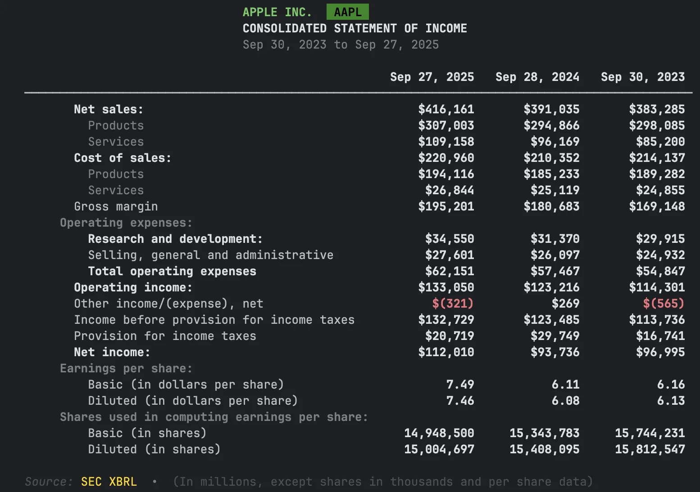

# Quick Start Guide

Get up and running with EdgarTools in 5 minutes. By the end, you'll have a company's financial statements in Python.

## Prerequisites

- Python 3.8 or higher
- Internet connection
- Basic familiarity with Python

## Step 1: Install EdgarTools

```bash
pip install edgartools
```

!!! warning "Trouble importing?"
    If you see `ImportError: cannot import name 'get_filings' from 'edgar'`, you may have installed the wrong package. There is an unrelated package called `edgar` on PyPI. Fix it with:
    ```bash
    pip uninstall edgar && pip install edgartools
    ```

## Step 2: Set Your Identity

The SEC requires all API users to identify themselves. Set your identity once:

```python
from edgar import set_identity

# Use your name and email (required by SEC)
set_identity("John Doe john.doe@company.com")
```

**Tip:** You can also set the `EDGAR_IDENTITY` environment variable to avoid doing this in every script.

## Step 3: Get a Company

Look up any public company by ticker symbol or CIK number:

```python
from edgar import Company

company = Company("AAPL")  # Apple Inc.
```


You can access basic company data as properties:

```python
company.industry        # 'ELECTRONIC COMPUTERS'
company.shares_outstanding  # 15115785000.0
company.public_float    # 2899948348000.0
```

## Step 4: Get Financial Statements

This is the most common task — getting a company's financial statements:

```python
financials = company.get_financials()

# The three financial statements
income    = financials.income_statement()
balance   = financials.balance_sheet()
cashflow  = financials.cashflow_statement()
```



That's it — three lines to get any company's income statement, balance sheet, or cash flow.

!!! note "Common gotcha"
    The method is `cashflow_statement()`, not `cash_flow()`. All three methods use the full name: `income_statement()`, `balance_sheet()`, `cashflow_statement()`.

## Step 5: Get Specific Values

Need just one number instead of the full statement?

```python
financials.get_revenue()
# 391035000000

financials.get_net_income()
# 93736000000
```

## Step 6: Export to DataFrame

Every financial statement converts to a pandas DataFrame for further analysis:

```python
df = financials.income_statement().to_dataframe()
```

You can also export company filings:

```python
filings = company.get_filings()
df = filings.to_pandas()
```

## Step 7: Browse Company Filings

Retrieve and filter a company's SEC filings:

```python
# Get all filings
filings = company.get_filings()

# Filter by form type
tenk_filings = company.get_filings(form="10-K")

# Get the latest 10-K as a data object
tenk = company.latest("10-K")
```


## How EdgarTools Is Organized

Here's a map of the main objects. Use it as a reference when you want to try something new:

```
Company("AAPL")                     # Start here — look up a company
  ├── .get_financials()                # Financial data (RECOMMENDED for most tasks)
  │     ├── .income_statement()        #   Revenue, expenses, profit
  │     ├── .balance_sheet()           #   Assets, liabilities, equity
  │     ├── .cashflow_statement()      #   Cash in and out
  │     ├── .get_revenue()             #   Quick: just the revenue number
  │     └── .get_net_income()          #   Quick: just net income
  │
  ├── .get_filings(form="10-K")        # Browse SEC filings
  │     ├── .head(5)                   #   See the first 5
  │     ├── .latest()                  #   Get the most recent one
  │     └── [0].obj()                  #   Parse into a data object (TenK, etc.)
  │
  └── .get_facts()                     # Historical data (for 4+ years of trends)
        ├── .income_statement()        #   Multi-year income data
        └── .balance_sheet()           #   Multi-year balance sheet
```

## Step 8: Next Steps

You just learned how to install EdgarTools, look up a company, get financial statements, and browse filings. Here's where to go next:

**Financial Data**

- [Choosing the Right API](xbrl/getting-started/choosing-the-right-api.md) — Which method to use for your task (start here!)
- [Financial Statements Guide](guides/financial-data.md) — Income statements, balance sheets, cash flow in depth
- [Extract Statements from Filings](guides/extract-statements.md) — XBRL data extraction
- [Company Facts](guides/company-facts.md) — Historical financial data across all filings

**Companies & Filings**

- [Find a Company](guides/finding-companies.md) — Search by name, ticker, CIK, industry, or exchange
- [Working with Filings](guides/working-with-filing.md) — Open, view, and parse any SEC filing
- [Search & Filter Filings](guides/searching-filings.md) — Find exactly the filings you need

**Filing Types**

- [Annual & Quarterly Reports](concepts/data-objects.md) — 10-K and 10-Q data objects
- [Current Events (8-K)](eightk-filings.md) — Material events and press releases
- [Insider Trades (Form 4)](insider-filings.md) — Monitor insider transactions
- [Institutional Holdings (13F)](guides/thirteenf-data-object-guide.md) — Who owns what

**Reference**

- [Cheat Sheet](quick-guide.md) — Common operations at a glance
- [Notebooks](notebooks.md) — Interactive Colab tutorials you can run in your browser

## Getting Help

- **[Documentation](https://edgartools.readthedocs.io/en/latest/)**: Browse our comprehensive guides
- **[GitHub Discussions](https://github.com/dgunning/edgartools/discussions)**: Ask questions and share insights
- **[Issues](https://github.com/dgunning/edgartools/issues)**: Report bugs or request features

## Support EdgarTools

If you found this quickstart helpful, consider supporting EdgarTools development:

<a href="https://www.buymeacoffee.com/edgartools" target="_blank">
  
</a>
