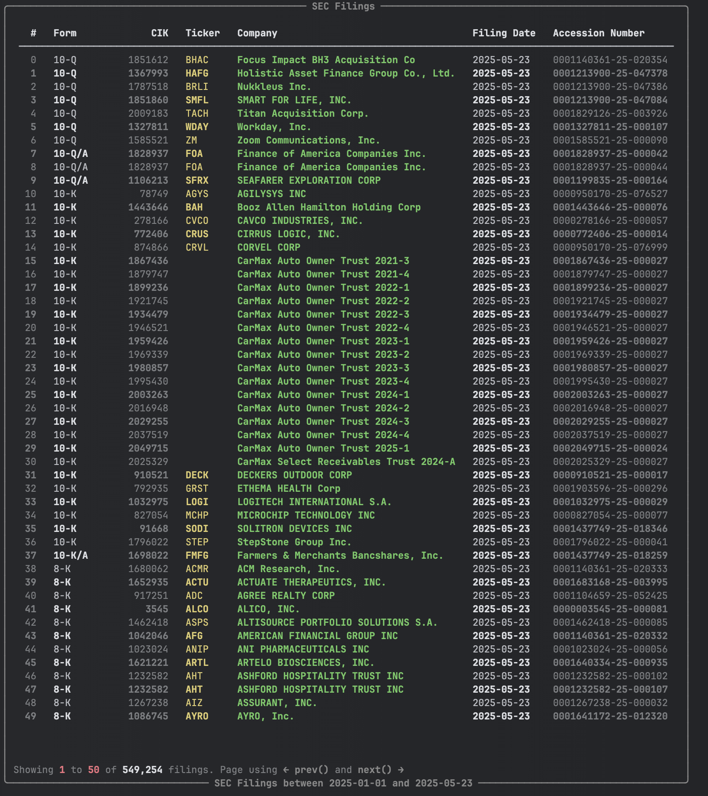
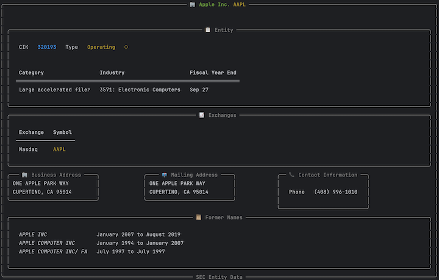
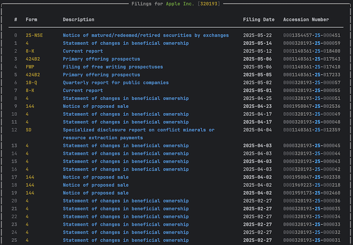

# Quick Start Guide

Get up and running with EdgarTools in 5 minutes. This guide will take you from installation to your first meaningful analysis.

## Prerequisites

- Python 3.8 or higher
- Internet connection
- Basic familiarity with Python

## Step 1: Install EdgarTools

```bash
pip install edgartools
```

## Step 2: Set Your Identity

The SEC requires all API users to identify themselves. Set your identity once:

```python
from edgar import set_identity

# Use your name and email (required by SEC)
set_identity("John Doe john.doe@company.com")
```

**💡 Tip:** You can also set the `EDGAR_IDENTITY` environment variable to avoid doing this in every script.

## Step 3: Your first filings

Let's see available filings on the SEC Edgar

```python
from edgar import *

filings = get_filings()
```




## Step 4: Filtering for insider trading filings

To focus on insider trading activity, filter for Form 4 filings:

```python
insider_filings = filings.filter(form="4")
```


## Step 5: Getting a Company

If you would like to focus on a specific company, you can use the `Company` class. For example, to analyze Apple Inc. (AAPL):

```python
c = Company("AAPL")  # Apple Inc.
```



## Step 6: Key Company Data

Once you have a company, you can access key data points as simple properties:

```python
c = Company("AAPL")

# Shares outstanding
c.shares_outstanding
# 15115785000.0

# Public float
c.public_float
# 2899948348000.0

# Industry
c.industry
# 'ELECTRONIC COMPUTERS'
```

## Step 7: Getting filings for a Company
You can retrieve all filings for a company using the `company.get_filings` method:

```python
# Get Apple's recent SEC filings
aapl_filings = c.get_filings()
```



## Step 8: Insider Filings for Apple Inc.

To analyze insider trading activity for Apple Inc., filter the filings for Form 4:

```python
insider_filings = c.get_filings(form="4")
# Get the first insider filing
f = insider_filings[0]

# Convert to a Form4 object
form4 = f.obj()
```


## What You Just Learned

In 5 minutes, you:

1. ✅ **Installed and configured** EdgarTools
2. ✅ **Retrieved and filtered** SEC filings
3. ✅ **Focused on insider trading** with Form 4
4. ✅ **Analyzed a specific company** (Apple Inc.)
5. ✅ **Accessed key company data** like shares outstanding and public float
6. ✅ **Extracted structured data** from filings
7. ✅ **Converted filings to data objects** for easy analysis
8. ✅ **Explored company filings** and insider activity

## Next Steps

Now that you've seen the basics, explore by what you want to do:

**Working with Companies**

- [Get Company Financials](guides/company-facts.md) - Balance sheets, income statements
- [Track Insiders](guides/company-insiders.md) - Monitor insider transactions

**Analyzing Filings**

- [Extract Financial Statements](guides/extract-statements.md) - XBRL data extraction
- [Query XBRL Facts](xbrl-querying.md) - Custom financial metrics

**Filing Types**

- [8-K Current Reports](guides/eightk-data-object-guide.md) - Material events
- [13F Holdings](guides/thirteenf-data-object-guide.md) - Institutional portfolios
- [Form 4 Transactions](guides/track-form4.md) - Insider trading details

## Getting Help

- **📖 [Documentation](https://edgartools.readthedocs.io/en/latest/)**: Browse our comprehensive guides
- **💬 [GitHub Discussions](https://github.com/dgunning/edgartools/discussions)**: Ask questions and share insights  
- **🐛 [Issues](https://github.com/dgunning/edgartools/issues)**: Report bugs or request features

## Support EdgarTools

If you found this quickstart helpful, consider supporting EdgarTools development:

<a href="https://www.buymeacoffee.com/edgartools" target="_blank">
  
</a>

Your support helps us maintain and improve EdgarTools!

---

**🎉 Congratulations!** You're now ready to analyze SEC data with EdgarTools. 

**What's your next analysis goal?** Choose a path above and dive deeper into the world of financial data analysis.