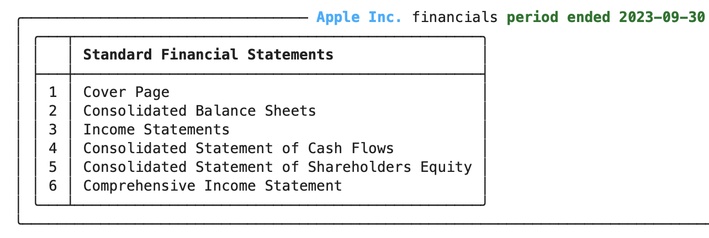

# Working with XBRL in edgartools

XBRL is an data format used by companies, mainly for financial reporting in their 10-Q and 10-K filings.
EdgarTools can parse and extract data from XBRL files into dataframes as well as rich objects that allow you to manipulate and visualize the data inside.

While the primary usage of XBRL is for reporting financial data, particularly for 10K and 10Q filings, it is also used to report for other non-financial filings such as 424B offerings.
The **EdgarTools** data model is flexible enough to accommodate a wide variation of data across companies and filings when it comes to XBRL.

## The Data Model
Looking at the data model, it is worth starting at the top. When searching for filings, you can limit the results to xbrl filings by using `index="xbrl"`.

```python
filings = get_filings(index="xbrl")
```


Each `Filing` has `xbrl()` function that will download and parse the XBRL attached to the filing or `None` if it does not. 

```python
filing = filings[0]
filing.xbrl()
```

The `xbrl()` function will return an `XBRLInstance` object in simple cases, or an `XbrlData` object in more complicated cases.


Here you can see the `XbrlData` object for Apple Inc. 10-K filing. It contains the `XBRLInstance` object, which holds the primary facts reported in the filings, as well as a list of statement.
Each statement is a container for a group of facts, such as a balance sheet or income statement.

For simpler filings there might only be an `XBRLInstance` document attached to the filing in which cases `.xbrl()` will return an `XbrlInstance` object, and there will be no statements.

### XbrlInstance
The main XBRL container for data is called XBRL instance. It contains the primary data reported for that filing.
The data is in a very well-structured XML format, but the EdgarTools XBRL parser unrolls that into a data frame.
For simple XBRL, the data inside an XBRL instance is self-contained, so it is straightforward to parse into data structures like data frames. 


### XbrlData
For more complicated XBRL, some aspects of the data will have to be resolved against the other XBRL files for that filing, such as the presentation and calculation files.
In this case, the parser will return an XBRLData container containing the XBRLInstance and the other XBRL files.

These files can include

- presentation: This file describes how the XBRL data is presented in the filing. It is used to resolve the hierarchy of the data.
- calculation: This file describes how the XBRL data is calculated. It is used to resolve the calculations of the data.
- definition: This file describes the definitions of the XBRL data. It is used to resolve the meaning of the data.
- label: This file describes the labels of the XBRL data. It is used to resolve the labels of the data.

## Statements
But those are the data that go into the XbrlData data object - the output is more interesting. Within the data are usually financial statements like the balance sheet and income statement, or other non-financial statements such as auditor information or firm disclosures.


These can be accessed using the XbrlData `get_statement()` function.

To see the statements that are included in the XBRL data, use `XbrlData.statements`. This is useful and often necessary since firms will use their own specific names for statements.

```python
statements = xbrl_data.statements
```

You can access a specific statement using the bracket notation or loop over all the statements

```python
statements['CONSOLIDATEDBALANCESHEETS']
```


This is equivalent to

```python
xbrl_data.get_statement('CONSOLIDATEDBALANCESHEETS')
```


### Statement

Inside each statement is a data frame which you can access using `statement.data`. 

```python
statement.data
```
This will also contain metadata columns that you may or may not need to see it's preferable to use `statement.get_dataframe()`


## Financials

Experts' data can contain both financial and non-financial statements. Mostly you will be interested in financial statements, so the `Financials` class
Is a convenient wrapper over the most common financial statements.

```python
financials = Financials(xbrl_data)
```



# Summary

Hopefully this gives you a good overview of working with XBRL data using **edgartools**. 
It's very complicated and a lot of work has gone into XBRL parsing in Edgar tools, and there may still be enhancements to be made. 
If you have any questions or suggestions, please feel free to reach out to us on the [Edgartools GitHub repository](https://github.com/dgunning/edgartools)   


