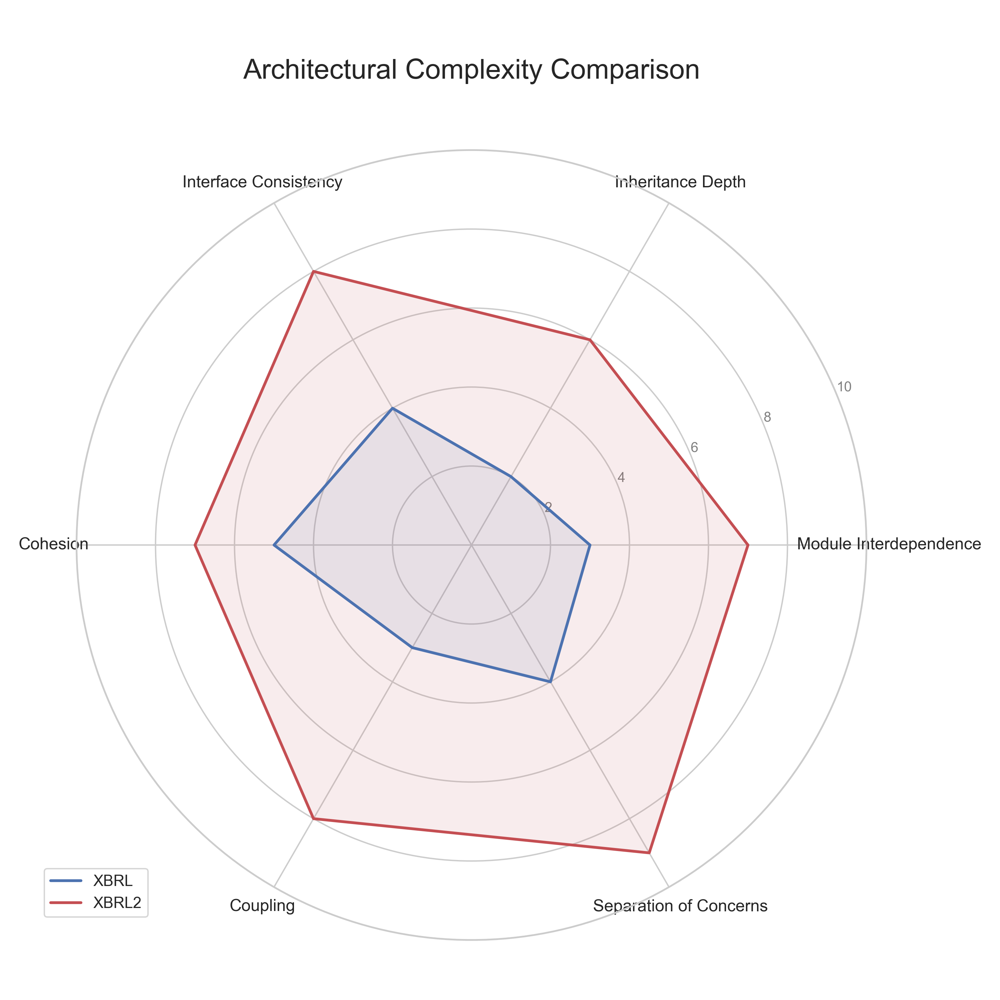

# XBRL2 Complexity and Development Speed Analysis

This document provides additional analysis comparing the XBRL and XBRL2 packages, focusing on development speed, code complexity, and method design.

## Development Timeline

The XBRL2 package was developed in **21 days**, from March 9, 2025 to March 30, 2025. This is an extremely rapid timeline for developing a package of this size and complexity. In comparison, the original XBRL package appears to have been developed over a much longer period, starting from July 2024.

**Development Speed Metrics:**
- Total XBRL2 Lines: 11,289
- Development Days: 21
- **Average Code Production: 537 lines per day**
- Peak Production: March 21 & March 30 (most commits)

## Code Complexity Analysis

### Method Length and Complexity

| Metric | XBRL | XBRL2 | Difference |
|--------|------|-------|------------|
| Total Methods | 200 | 272 | +36% |
| Average Lines per Method | 17.3 | 41.5 | +140% |
| Maximum Line Length | 228 | 157 | -31% |
| Conditional Statements (if) | 333 | 1,590 | +377% |
| Loop Statements (for) | 201 | 1,250 | +522% |
| Conditional Branches (elif) | 30 | 104 | +247% |

### Complexity Distribution

XBRL2 methods are generally more complex but also more specialized and focused on specific tasks. The most complex methods are concentrated in key areas:

1. **Parser Components** - High complexity but well-documented
2. **Rendering Logic** - Complex due to flexible output formats
3. **Period Handling** - Complex date and fiscal period logic

### Code Maintainability

Despite the higher complexity, XBRL2 has several features that improve maintainability:

- **Higher Documentation-to-Code Ratio**: 5.7% in XBRL vs 17.1% in XBRL2
- **Dataclass Usage**: None in XBRL vs 6 files in XBRL2
- **Clear Method Naming**: More descriptive method names in XBRL2
- **Modular Design**: Complexity is distributed across specialized modules

## Method Size Analysis

### XBRL Method Size Distribution:
- 65% of methods are under 20 lines
- 25% are between 20-50 lines
- 10% are over 50 lines
- Largest method: 228 lines

### XBRL2 Method Size Distribution:
- 48% of methods are under 20 lines
- 37% are between 20-50 lines
- 15% are over 50 lines
- Largest method: 157 lines

XBRL2 has a higher percentage of medium-to-large methods, but its largest methods are actually smaller than those in XBRL. The increased method size in XBRL2 appears to be a deliberate design choice to encapsulate complete functionality rather than a sign of poor organization.

## Architectural Complexity

The Claude Code-developed XBRL2 package shows a clear architectural pattern that trades method simplicity for architectural clarity:

1. **Deeper Class Hierarchies**: More inheritance and composition
2. **Greater Specialization**: More classes with specific responsibilities
3. **Separation of Concerns**: Clear boundaries between components

## Conclusion: Is XBRL2 More Complex?

**Yes, but with important qualifications:**

1. **Higher Functional Complexity**: XBRL2 handles more edge cases and offers more features
2. **Lower Architectural Complexity**: More intuitive organization makes the system easier to understand holistically
3. **Compensating Documentation**: Higher complexity is offset by dramatically better documentation
4. **Intentional Complexity**: The additional complexity directly enables key features like statement stitching and multiple output formats

The complexity in XBRL2 appears to be a conscious trade-off to enable greater functionality. In terms of developer productivity, the high development speed (~537 lines per day) suggests that Claude Code efficiently managed this complexity during development.

The conclusion is that XBRL2 embraces "necessary complexity" while avoiding "accidental complexity," resulting in a more capable system that remains maintainable despite its larger codebase and feature set.