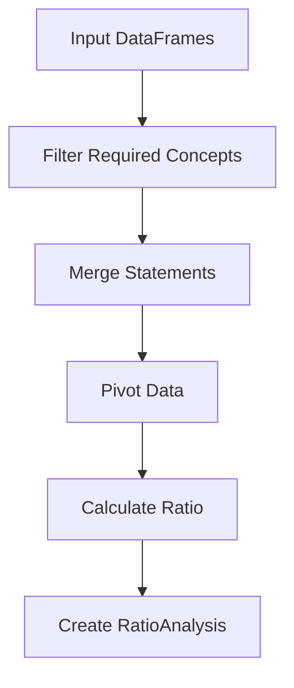

# Financial Ratio Analysis Design

## Overview
The financial ratio analysis system is designed to calculate financial ratios using DataFrame transformation pipelines. This approach treats each ratio calculation as a series of data transformations on financial statement DataFrames, making the calculations more transparent, maintainable, and extensible.

## Core Components

### RatioAnalysis
A dataclass that encapsulates the results of a ratio calculation:
```python
@dataclass
class RatioAnalysis:
    name: str                      # Name of the ratio
    description: str               # Description of what the ratio measures
    calculation_df: pd.DataFrame   # DataFrame used in calculation
    results: pd.Series             # Final ratio values by period
    components: Dict[str, pd.Series]  # Individual components used
    equivalents_used: Dict[str, str]  # Equivalent calculations used
```

### FinancialRatios
The main class responsible for ratio calculations:
```python
class FinancialRatios:
    def __init__(self, xbrl)
```

## Data Flow Pipeline

1. **Input**
   - Balance Sheet DataFrame
   - Income Statement DataFrame
   - Cash Flow Statement DataFrame
   - List of reporting periods

2. **Data Preparation**
   ```python
   def _prepare_ratio_df(required_concepts, statement_dfs):
   ```
   - Filters required concepts from source DataFrames
   - Merges data from multiple statements if needed
   - Pivots data into calculation-ready format

3. **Ratio Calculation**
   - Each ratio method follows a consistent pattern:
     1. Define required concepts
     2. Prepare calculation DataFrame
     3. Calculate ratio for each period
     4. Return list of RatioAnalysis objects

## Example Ratio Calculation Flow



## Design Components

### 1. RatioData

A structured class that encapsulates the data needed for ratio calculations:

```python
@dataclass
class RatioData:
    calculation_df: pd.DataFrame         # Raw data for calculation
    periods: List[str]                   # Available reporting periods
    equivalents_used: Dict[str, str]     # Concept equivalents used
    required_concepts: List[str]         # Required concepts for the ratio
    optional_concepts: Dict[str, float]  # Optional concepts with default values
    
    def has_concept(self, concept: str) -> bool: ...
    def get_concept(self, concept: str, default_value: Optional[float] = None) -> pd.Series: ...
    def get_concepts(self, concepts: List[str]) -> Dict[str, pd.Series]: ...
```

### 2. RatioAnalysis

A dataclass that encapsulates the results of a ratio calculation:

```python
@dataclass
class RatioAnalysis:
    name: str                      # Name of the ratio
    description: str               # Description of what the ratio measures
    calculation_df: pd.DataFrame   # DataFrame used in calculation
    results: pd.Series             # Final ratio value(s)
    components: Dict[str, pd.Series] # Individual components used
    equivalents_used: Dict[str, str] # Equivalent calculations used
```

## Key Features

1. **Structured Data Management**
   - Uses dedicated data classes for ratio calculation and results
   - Clear separation between data preparation and calculation logic
   - Consistent interface for accessing concepts and their values

2. **Multi-Period Support**
   - Calculates ratios across all available periods
   - Handles period-to-period comparisons
   - Supports rolling averages (e.g., average total assets)

3. **Transparency**
   - Preserves calculation DataFrame
   - Records all components used
   - Clear documentation of ratio formulas

4. **Error Handling**
   - Graceful handling of missing data
   - Protection against zero division
   - Period-by-period calculation resilience
   - Proper handling of optional concepts (e.g., treating inventory as 0 for companies without inventory)

5. **Extensibility**
   - Consistent pattern for adding new ratios
   - Reusable data preparation logic
   - Standardized result format

6. **Optional Concepts Management**
   - Explicit declaration of optional concepts with default values
   - Configurable fallback values for missing concepts
   - Consistent handling across all ratio calculations
   - Clear documentation of assumptions when optional concepts are missing

## Usage Example

```python
ratios = FinancialRatios(xbrl)

# Calculate ratios
current_ratio = ratios.calculate_current_ratio()
roa_ratio = ratios.calculate_return_on_assets()

# Access results
print(current_ratio.results)
print(roa_ratio.results)
```

## Implemented Ratios

1. **Liquidity Ratios**
   - Current Ratio
   - Quick Ratio (inventory treated as 0 when absent)
   - Cash Ratio
   - Working Capital

2. **Profitability Ratios**
   - Gross Margin
   - Operating Margin
   - Net Margin
   - Return on Assets
   - Return on Equity

3. **Efficiency Ratios**
   - Asset Turnover
   - Inventory Turnover (skipped when inventory is absent)
   - Receivables Turnover
   - Days Sales Outstanding

4. **Leverage Ratios**
   - Debt to Equity
   - Debt to Assets
   - Interest Coverage (skipped when interest expense is absent)
   - Equity Multiplier

## Future Extensions

1. **Additional Ratios**
   - Industry-specific ratios
   - Cash flow coverage ratios

2. **Enhanced Features**
   - Industry average comparisons
   - Trend analysis
   - Ratio benchmarking
   - Custom ratio definitions

## Benefits

1. **Maintainability**
   - Clear separation of concerns
   - Consistent calculation pattern
   - Centralized data preparation

2. **Usability**
   - Excel-ready calculations
   - Multi-period analysis
   - Comprehensive ratio metadata

3. **Reliability**
   - Robust error handling
   - Calculation transparency
   - Data validation
