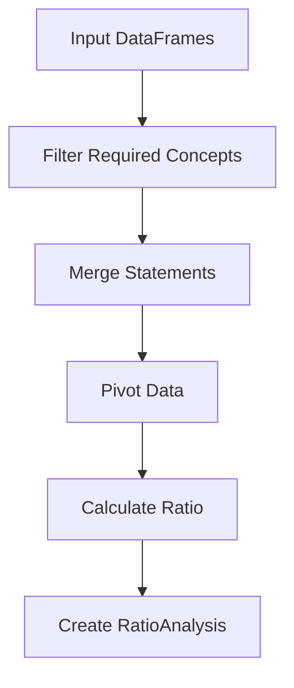

# Financial Ratio Analysis Design

## Overview
The financial ratio analysis system is designed to calculate financial ratios using DataFrame transformation pipelines. This approach treats each ratio calculation as a series of data transformations on financial statement DataFrames, making the calculations more transparent, maintainable, and extensible.

## Core Components

### RatioAnalysis
A dataclass that encapsulates the results of a ratio calculation:
```python
@dataclass
class RatioAnalysis:
    name: str               # Name of the ratio
    description: str        # Description of what the ratio measures
    calculation_df: pd.DataFrame  # DataFrame used in calculation
    result: float          # Final ratio value
    components: Dict[str, float]  # Individual components used
    period: str            # Period the ratio is calculated for
```

### FinancialRatioAnalyzer
The main class responsible for ratio calculations:
```python
class FinancialRatioAnalyzer:
    def __init__(self, balance_sheet_df, income_stmt_df, 
                 cash_flow_df, periods)
```

## Data Flow Pipeline

1. **Input**
   - Balance Sheet DataFrame
   - Income Statement DataFrame
   - Cash Flow Statement DataFrame
   - List of reporting periods

2. **Data Preparation**
   ```python
   def _prepare_ratio_df(required_concepts, statement_dfs):
   ```
   - Filters required concepts from source DataFrames
   - Merges data from multiple statements if needed
   - Pivots data into calculation-ready format

3. **Ratio Calculation**
   - Each ratio method follows a consistent pattern:
     1. Define required concepts
     2. Prepare calculation DataFrame
     3. Calculate ratio for each period
     4. Return list of RatioAnalysis objects

## Example Ratio Calculation Flow



## Key Features

1. **Multi-Period Support**
   - Calculates ratios across all available periods
   - Handles period-to-period comparisons
   - Supports rolling averages (e.g., average total assets)

2. **Transparency**
   - Preserves calculation DataFrame
   - Records all components used
   - Clear documentation of ratio formulas

3. **Error Handling**
   - Graceful handling of missing data
   - Protection against zero division
   - Period-by-period calculation resilience

4. **Extensibility**
   - Consistent pattern for adding new ratios
   - Reusable data preparation logic
   - Standardized result format

## Usage Example

```python
analyzer = FinancialRatioAnalyzer(
    balance_sheet_df=balance_sheet_df,
    income_stmt_df=income_stmt_df,
    cash_flow_df=cash_flow_df,
    periods=['2023-12-31', '2022-12-31', '2021-12-31']
)

# Calculate ratios
current_ratios = analyzer.calculate_current_ratio()
roa_ratios = analyzer.calculate_return_on_assets()

# Access results
for ratio in current_ratios:
    print(f"{ratio.name} ({ratio.period}): {ratio.result:.2f}")
    # DataFrame available for Excel export
    ratio.calculation_df.to_excel(f"{ratio.name}_{ratio.period}.xlsx")
```

## Implemented Ratios

1. **Current Ratio**
   - Formula: Current Assets / Current Liabilities
   - Measures: Company's ability to pay short-term obligations

2. **Return on Assets (ROA)**
   - Formula: Net Income / Average Total Assets
   - Measures: Asset utilization efficiency

3. **Operating Margin**
   - Formula: Operating Income / Revenue
   - Measures: Operating efficiency and pricing strategy

## Future Extensions

1. **Additional Ratios**
   - Quick Ratio
   - Debt-to-Equity
   - Asset Turnover
   - Inventory Turnover

2. **Enhanced Features**
   - Industry average comparisons
   - Trend analysis
   - Ratio benchmarking
   - Custom ratio definitions

## Benefits

1. **Maintainability**
   - Clear separation of concerns
   - Consistent calculation pattern
   - Centralized data preparation

2. **Usability**
   - Excel-ready calculations
   - Multi-period analysis
   - Comprehensive ratio metadata

3. **Reliability**
   - Robust error handling
   - Calculation transparency
   - Data validation
