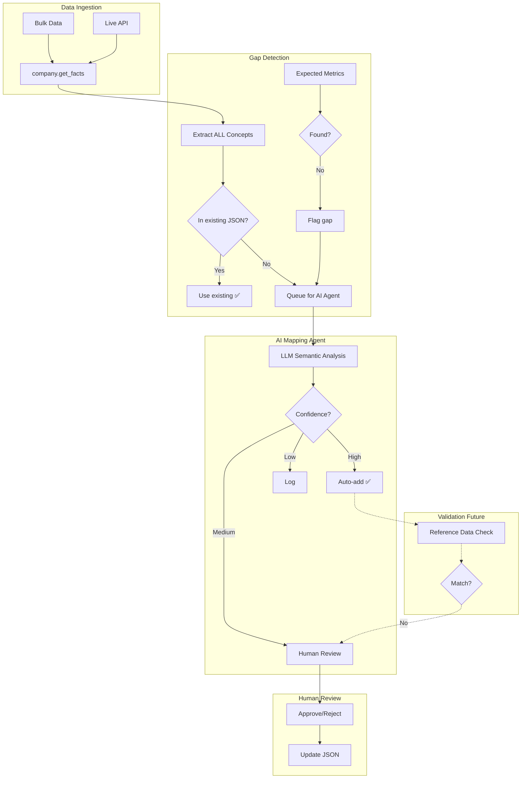

# AI Agent System for Concept Mapping

**Date:** 2026-01-05  
**Author:** Antigravity (Assistant)  
**Related Task:** Build AI-powered concept mapping expansion  
**Tags:** #ai-agent #concept-mapping #architecture #planning

---

## Context

This note documents our research findings on the EdgarTools concept mapping system and proposes an AI agent architecture to expand mapping coverage. See also:
- [001_initial_mag7_mapping_observation](../001_initial_mag7_mapping_observation/) - MAG7 data extraction tests
- [002_concept_mapper_learn_mappings](../002_concept_mapper_learn_mappings/) - `learn_mappings()` analysis

---

## Problem Statement

EdgarTools has ~85 standard concepts in `concept_mappings.json`, but companies use thousands of unique XBRL tags. The existing similarity-based `_infer_mapping()` method can **cause wrong mappings**:

```
"Net Sales" → SequenceMatcher → "Cost of Sales" (0.6) > "Revenue" (0.4)
```

If ≥0.9 confidence triggers auto-add, wrong mappings are **permanently persisted**.

---

## Current Gaps

| Gap | Problem | Our Solution |
|-----|---------|--------------|
| **Similarity misclassification** | String matching ≠ semantic meaning | AI agent for ALL unmapped concepts |
| **No reference validation** | No external data to verify mappings | Cross-check with free financial APIs |
| **No expected metrics detection** | Don't know what SHOULD exist | Define expected metrics per filing type |

---

## Proposed Architecture



---

## Key Design Decisions

1. **Skip similarity-based inference entirely**
   - Existing `_infer_mapping()` can misclassify
   - ALL unmapped concepts → AI agent
   - Simpler, safer, more maintainable

2. **Expected Metrics Gap Detection**
   - Define metrics that SHOULD exist (Revenue, Net Income, etc.)
   - Missing metric → flag as mapping gap
   - Helps prioritize investigation

3. **Reference Data Validation (Future)**
   - Cross-check with Yahoo Finance, Alpha Vantage, etc.
   - If mismatch → flag for review

4. **Human-in-the-loop**
   - AI doesn't auto-add unless HIGH confidence
   - Build training data from human decisions

---

## Next Steps

1. [ ] **Coverage measurement script** - Count mapped vs unmapped concepts
2. [ ] **Define expected metrics list** - Revenue, Net Income, Total Assets, etc.
3. [ ] **Build AI mapping agent v1** - LLM-based semantic analysis
4. [ ] **Research reference data sources** - Free APIs for validation
5. [ ] **Human review workflow** - Queue and approve/reject interface

---

## References

| File | Purpose |
|------|---------|
| [core.py](file:///mnt/c/Users/Sangicook/LAB_FHI/Project/Side_project/edgartools/edgar/xbrl/standardization/core.py) | ConceptMapper, MappingStore |
| [concept_mappings.json](file:///mnt/c/Users/Sangicook/LAB_FHI/Project/Side_project/edgartools/edgar/xbrl/standardization/concept_mappings.json) | ~85 standard concepts |
| [customizing-standardization.md](file:///mnt/c/Users/Sangicook/LAB_FHI/Project/Side_project/edgartools/docs/advanced/customizing-standardization.md) | Upstream docs |
