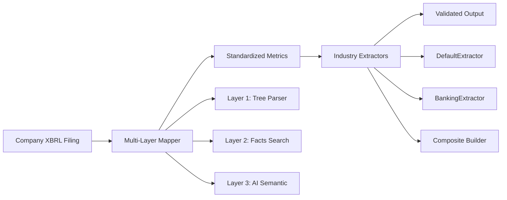
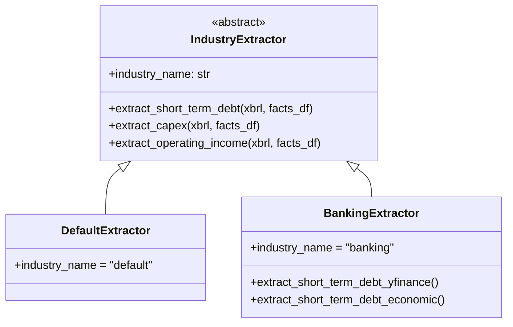
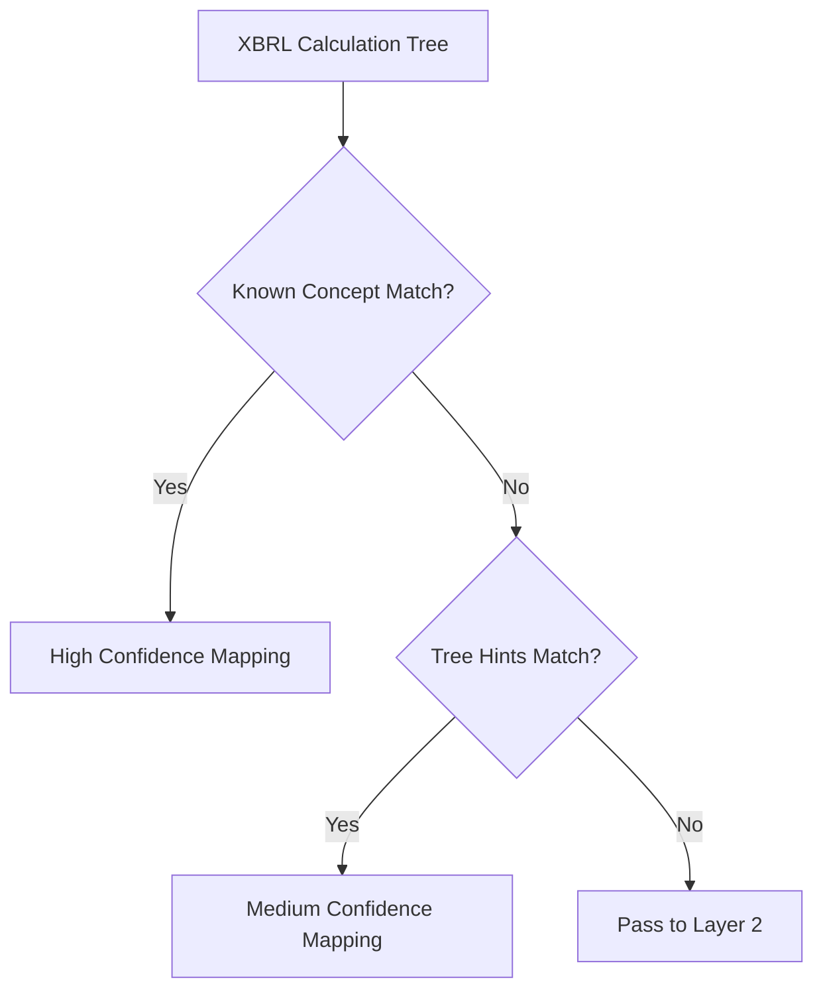
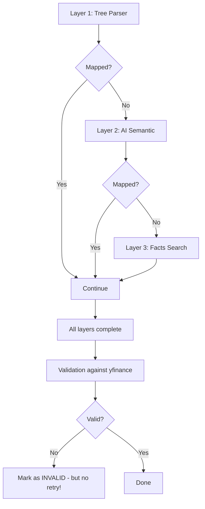
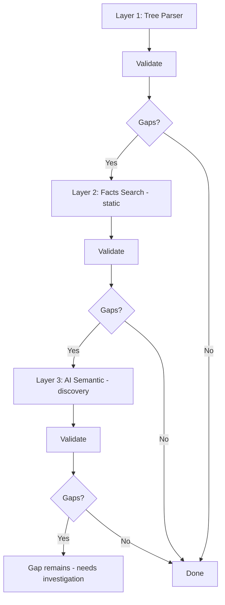
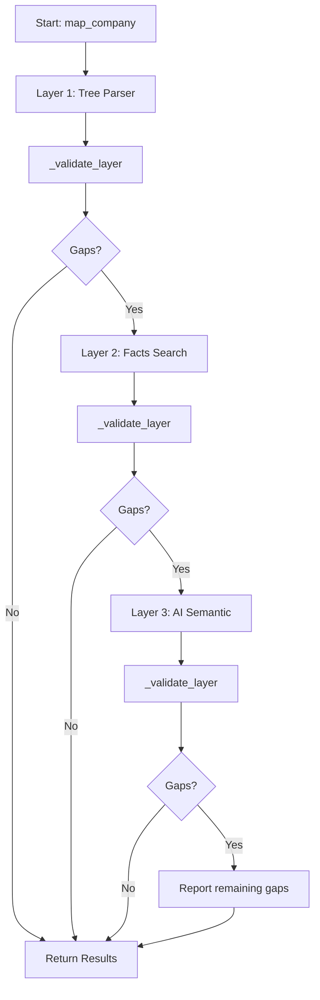
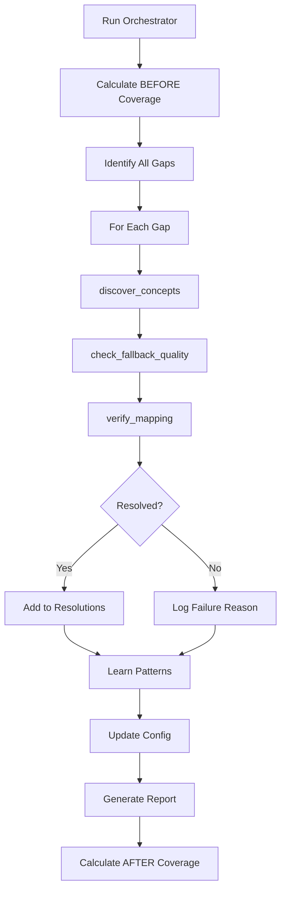

# Concept Mapping Workflow - Developer Walkthrough

This document explains the XBRL Concept Mapping system for new developers joining the edgartools project.

## Overview

The concept mapping system does **three things**:

1. **Maps** XBRL concepts - Standardizes company-specific concept names to unified metrics
2. **Organizes** data - Builds composite structures from multiple XBRL facts
3. **Extracts** values - Uses industry-aware logic to compute financial metrics

Each company may use different XBRL concept names for the same financial metric (e.g., "Revenue" might be `RevenueFromContractWithCustomerExcludingAssessedTax` for one company and `Revenues` for another). Some metrics don't exist as direct XBRL tags and must be **calculated from components**. This system resolves all these differences.



---

## Commit History & Evolution

The concept mapping system was developed iteratively. Here's the evolution based on recent commits:

### Phase 1: Core Mapping Infrastructure

| Commit | Description | Key Changes |
|--------|-------------|-------------|
| `45c31700` | Initial AI agent tools | Created reusable tools for concept mapping workflow |
| `7a954a2b` | Concept-mapping-resolver agent | Added the AI agent definition and bulk data support |
| `f71a2d7f` | **Workflow restructure** | Reordered layers (Facts before AI), validation-in-loop |
| `139e298d` | Composite metrics | Defined IntangibleAssets as a composite metric |

### Phase 2: Self-Improving Workflow

| Commit | Description | Key Changes |
|--------|-------------|-------------|
| `09c21d7e` | Failure pattern classification | Auto-classify extraction failures by pattern |
| `8876ac84` | Industry-specific tolerance | Banking gets 20% tolerance vs 15% default |
| `179e9c49` | Dimensional-only detection | Find concepts reported only with dimensions |
| `2eb41379` | **Auto-discovery system** | Record new mappings, track patterns, suggest updates |

### Phase 3: Industry-Aware Architecture

| Commit | Description | Key Changes |
|--------|-------------|-------------|
| `ba8a0da9` | **Industry extractors** | `DefaultExtractor`, `BankingExtractor` classes |
| `10238ed8` | Validation integration | Industry logic integrated into reference validator |
| `d1e96020` | **Bank dual-track debt** | yfinance-aligned vs economic view (with/without Repos) |
| `8f22fba3` | OperatingIncome formula | yfinance excludes D&A; formula corrected |

### Phase 4: Configuration & Rules

| Commit | Description | Key Changes |
|--------|-------------|-------------|
| `46fb8949` | **Extraction rules JSON** | `company_mappings/_defaults.json` for composite logic |
| `fd0f6d75` | SIC auto-detection | Detect industry from SEC filing SIC code |
| `168720cd` | Discrepancy documentation | Track known yfinance/XBRL mismatches |
| `15051ba1` | Progress tracker | S&P25: 93.6%, S&P50: 92.9% coverage |

---

## Architecture - The Multi-Layer System

### Directory Structure

```
edgar/xbrl/standardization/
├── config/
│   ├── metrics.yaml           # Target metric definitions
│   ├── companies.yaml         # Company-specific overrides
│   └── industry_metrics.yaml  # Industry counterpart mappings
├── company_mappings/           # JSON extraction rules
│   ├── _defaults.json         # Universal extraction rules
│   ├── _industry_banking.json # Banking-specific rules
│   └── {ticker}_mappings.json # Per-company overrides
├── industry_logic/             # Sector-specific extractors
│   └── __init__.py            # DefaultExtractor, BankingExtractor
├── layers/
│   ├── tree_parser.py         # Layer 1: XBRL calc tree parsing
│   ├── facts_search.py        # Layer 2: Facts database search
│   ├── ai_semantic.py         # Layer 3: AI-powered semantic mapping
│   └── dimensional_aggregator.py # [NEW] Aggregate dimensional values
├── tools/
│   ├── discover_concepts.py
│   ├── check_fallback_quality.py
│   ├── verify_mapping.py
│   ├── learn_mappings.py
│   ├── resolve_gaps.py        # Main gap resolution entry point
│   ├── auto_discovery.py      # Record new mappings automatically
│   ├── discrepancy_manager.py # Track known data mismatches
│   ├── kpi_tracker.py         # Coverage metrics tracking
│   └── validate_multi_period.py # Multi-period yfinance checks
├── models.py                  # Data structures (MappingResult, etc.)
├── orchestrator.py            # Main pipeline coordinator
├── extraction_rules.py        # Load/apply extraction rules
├── reference_validator.py     # yfinance validation + industry logic + PiT handling
└── README.md
```

### Key Components Explained

---

### 1. Configuration Layer

The system uses a **three-tier configuration hierarchy**:

#### 1.1 [metrics.yaml](file:///mnt/c/Users/Sangicook/LAB_FHI/Project/Side_project/edgartools/edgar/xbrl/standardization/config/metrics.yaml)

Defines **target metrics** we want to extract:

```yaml
Revenue:
  description: "Total revenue from operations"
  known_concepts:      # XBRL concepts that map to this metric
    - RevenueFromContractWithCustomerExcludingAssessedTax
    - Revenues
    - SalesRevenueNet
  tree_hints:          # Hints for tree-based discovery
    statements: [INCOME, OPERATIONS]
    parent_pattern: OperatingIncome
  universal: true      # Present in all MAG7 companies
```

#### 1.2 [industry_metrics.yaml](file:///mnt/c/Users/Sangicook/LAB_FHI/Project/Side_project/edgartools/edgar/xbrl/standardization/config/industry_metrics.yaml)

Maps standard metrics to **industry counterparts** by SIC range:

```yaml
banking:
  sic_ranges: [[6020, 6099]]
  concept_mapping:
    COGS:
      counterpart: InterestExpense
      notes: "Bank raw material cost is interest paid to depositors"
    OperatingIncome:
      counterpart: PPNR
      calculation: "NetInterestIncome + NonInterestIncome - NonInterestExpense"
```

#### 1.3 [company_mappings/](file:///mnt/c/Users/Sangicook/LAB_FHI/Project/Side_project/edgartools/edgar/xbrl/standardization/company_mappings)

JSON files with **extraction rules** for composite metrics:

```json
// _defaults.json - applies to all companies
{
  "extraction_rules": {
    "IntangibleAssets": {
      "method": "composite_sum",
      "components": ["Goodwill", "IntangibleAssetsNetExcludingGoodwill"],
      "concept_priority": {
        "Goodwill": ["us-gaap:Goodwill"],
        "IntangibleAssetsNetExcludingGoodwill": [
          "us-gaap:IntangibleAssetsNetExcludingGoodwill",
          "us-gaap:FiniteLivedIntangibleAssetsNet"
        ]
      }
    }
  }
}
```

---

### 2. Industry-Aware Extraction: [industry_logic/](file:///mnt/c/Users/Sangicook/LAB_FHI/Project/Side_project/edgartools/edgar/xbrl/standardization/industry_logic)

> [!IMPORTANT]
> **Key Architecture: Extractors, Not Just Mappers**
>
> Some metrics like `OperatingIncome` for pharma companies or `ShortTermDebt` for banks **don't have direct XBRL tags**. The industry extractors **calculate** these values from components.



**Key extractor methods:**

| Extractor | Metric | Logic |
|-----------|--------|-------|
| `DefaultExtractor` | `OperatingIncome` | `GrossProfit - R&D - SGA` (no D&A per yfinance) |
| `DefaultExtractor` | `Capex` | Includes intangibles (software, patents) |
| `BankingExtractor` | `ShortTermDebt` | **Dual-track**: yfinance view (excludes Repos) + economic view (includes Repos) |
| `BankingExtractor` | `OperatingIncome` | PPNR = `NetInterestIncome + NonInterestIncome - NonInterestExpense` |

---

### 3. Data Models: [models.py](file:///mnt/c/Users/Sangicook/LAB_FHI/Project/Side_project/edgartools/edgar/xbrl/standardization/models.py)

**Core data structures:**

| Class | Purpose |
|-------|---------|
| `MappingResult` | Output of a mapping operation (concept, confidence, source) |
| `MappingSource` | Enum: `TREE`, `AI`, `MANUAL`, `CONFIG`, etc. |
| `ConfidenceLevel` | Enum: `HIGH`, `MEDIUM`, `LOW`, `NONE`, `INVALID` |
| `MetricConfig` | Loaded metric definition from YAML |
| `MappingState` | Tracks progress through layers |

---

### 4. The Mapping Layers

#### Layer 1: Tree Parser - [tree_parser.py](file:///mnt/c/Users/Sangicook/LAB_FHI/Project/Side_project/edgartools/edgar/xbrl/standardization/layers/tree_parser.py)

**Handles ~85% of mappings** by parsing XBRL calculation trees.



**Strategy:**
1. Try direct match against `known_concepts` from config
2. Use `tree_hints` (parent patterns, statement type) for discovery
3. Return with appropriate confidence level

#### Layer 2: Facts Search - [facts_search.py](file:///mnt/c/Users/Sangicook/LAB_FHI/Project/Side_project/edgartools/edgar/xbrl/standardization/layers/facts_search.py)

Searches the company facts database. Only matches against **known concepts from config**.

> [!NOTE]
> **Layer order changed!** Facts Search (static) now runs before AI Semantic (dynamic) - cheaper/faster methods first.

#### Layer 3: AI Semantic - [ai_semantic.py](file:///mnt/c/Users/Sangicook/LAB_FHI/Project/Side_project/edgartools/edgar/xbrl/standardization/layers/ai_semantic.py)

> [!IMPORTANT]
> **What is "AI Semantic" exactly?**
> 
> It uses an **LLM API via OpenRouter** (specifically `mistralai/devstral-2512:free` by default). The code imports `OpenAI` client and connects to `https://openrouter.ai/api/v1`. It requires the `OPENROUTER_API_KEY` environment variable.

**What it does:**
1. Extracts all concepts from calc trees
2. Finds **candidate concepts** using keyword matching against metric names
3. Sends each candidate to the LLM with tree context (parent, weight, statement type)
4. LLM evaluates if the concept matches the target metric
5. Returns the best match with confidence and reasoning

**Fallback:** If `OPENROUTER_API_KEY` is not set, it falls back to simple heuristic matching (no LLM call).

```python
# Example LLM prompt sent:
"""Evaluate if this XBRL concept matches the target metric:

Target Metric: Revenue
Description: Total revenue from operations

XBRL Concept: SalesRevenueNet
Tree Context:
  - Parent: CostsAndExpenses
  - Weight: 1.0
  - Trees: IncomeStatement, Operations

Does this concept represent Revenue?"""
```

---

### Critical Discussion: Layer Order & Validation Integration

> [!CAUTION]
> **Architectural Observation: The Current Design Has a Flaw**
> 
> The current workflow has a limitation that future developers should understand:

#### Current Design (What Actually Happens)



**Problem:** Validation happens **AFTER** all layers complete. If AI finds a mapping but it fails validation, we **don't retry** with the next layer.

#### Implemented Architecture (After Restructure)

> [!TIP]
> **This architecture has been implemented!**
> 
> The workflow now follows the improved design with validation-in-loop.

A properly resolved concept has **two properties** (see `is_resolved` property in `models.py`):
1. ✅ **Mapped** - We found an XBRL concept
2. ✅ **Validated** - The value matches yfinance reference



**Key features of implemented design:**
1. **Static methods first** - Tree Parser, then Facts Search, then AI
2. **Validation in the loop** - `_validate_layer()` runs after each layer
3. **"Gap" = Unmapped OR Invalid** - Invalid mappings are reset and retried
4. **yfinance caching** - Single API call per company via `_get_stock()`

#### How Invalid Mappings Are Handled

When a layer produces a mapping that fails validation:
1. The mapping is marked as `validation_status='invalid'`
2. `_validate_layer()` resets `concept`, `confidence`, and `source`
3. The metric becomes a "gap" again
4. The next layer can attempt a fresh mapping

```python
# From _validate_layer() in orchestrator.py
if result.validation_status == 'invalid':
    result.concept = None
    result.confidence = 0.0
    result.source = MappingSource.UNKNOWN
    gaps.append(metric)  # Retry with next layer
```

#### Does AI Semantic Update `metrics.yaml` Config?

> [!NOTE]
> **No! AI Semantic does NOT automatically update `known_concepts` in config.**
> 
> During a normal orchestrator run:
> - AI Semantic finds a concept → Returns a `MappingResult`
> - The concept is used for **this run only**
> - Nothing is written to `metrics.yaml`
> 
> **Config updates happen separately** via the gap resolution workflow (either manually or through the `concept-mapping-resolver` agent). That workflow explicitly calls `update_config()` after discovering new concepts.

---

### 4. The Orchestrator: [orchestrator.py](file:///mnt/c/Users/Sangicook/LAB_FHI/Project/Side_project/edgartools/edgar/xbrl/standardization/orchestrator.py)

**The main entry point** that coordinates all layers with validation-in-loop.



**Key methods:**
- `map_company(ticker)` - Map all metrics for one company
- `map_companies(tickers)` - Map multiple companies (defaults to MAG7)
- `_validate_layer()` - **NEW** - Validate after each layer, returning updated gaps

**Usage:**
```python
from edgar.xbrl.standardization.orchestrator import Orchestrator

orchestrator = Orchestrator()
results = orchestrator.map_companies(['AAPL', 'GOOG', 'MSFT'])
orchestrator.print_summary(results)
```

---

### 5. Reference Validator: [reference_validator.py](file:///mnt/c/Users/Sangicook/LAB_FHI/Project/Side_project/edgartools/edgar/xbrl/standardization/reference_validator.py)

**Validates mappings against yfinance** as external truth.

Key features:
- `COMPOSITE_METRICS` dict defines metrics that sum multiple concepts
- `tolerance_pct` - 15% variance threshold
- `validate_and_update_mappings()` - Updates `MappingResult.validation_status`
- `_get_stock()` - **NEW** - Cached yfinance Stock objects to avoid redundant API calls

**Validation statuses:**
- `"valid"` - XBRL value matches yfinance within tolerance
- `"invalid"` - Variance exceeds threshold (mapping will be retried by next layer)
- `"no_ref"` - No yfinance reference available

---

### 6. AI Agent Tools: [tools/](file:///mnt/c/Users/Sangicook/LAB_FHI/Project/Side_project/edgartools/edgar/xbrl/standardization/tools)

Reusable functions for AI agents and direct use:

| Tool | Purpose |
|------|---------|
| `discover_concepts()` | Find candidate XBRL concepts from calc trees and facts |
| `check_fallback_quality()` | Validate semantic quality, reject parent-concept fallbacks |
| `verify_mapping()` | Compare extracted XBRL values against yfinance reference |
| `learn_mappings()` | Discover patterns across multiple companies |
| `resolve_all_gaps()` | Main entry point for gap resolution |

---

## The Gap Resolution Workflow

When the orchestrator leaves gaps (unmapped or invalid mappings), use the gap resolution process.

> [!IMPORTANT]
> **Is this conducted by the `concept-mapping-resolver` agent?**
> 
> **Both options are available:**
> 
> 1. **Direct Python code** - You can run `resolve_gaps.py` functions directly without any AI agent
> 2. **AI Agent** - The `concept-mapping-resolver.md` provides a prompt for Claude/AI assistants to follow this workflow systematically
> 
> The agent is just a **prompt template** that instructs an AI assistant how to use the Python tools. The actual logic lives in `tools/resolve_gaps.py` and can be called programmatically.

### Two Ways to Run Gap Resolution

**Option 1: Direct Python (No AI agent needed)**
```python
from edgar.xbrl.standardization.tools.resolve_gaps import resolve

# Run full resolution workflow programmatically
report = resolve(tickers=['AAPL', 'GOOG', 'AMZN'])
print(report)
```

**Option 2: AI Agent (for interactive/complex scenarios)**
- Open Claude or similar AI assistant
- Invoke the `concept-mapping-resolver` agent
- The agent follows the systematic workflow, investigates failures, and generates reports



**Entry point:** [resolve_gaps.py](file:///mnt/c/Users/Sangicook/LAB_FHI/Project/Side_project/edgartools/edgar/xbrl/standardization/tools/resolve_gaps.py)

---

## Key Insights from Commit History

### Composite Metrics Problem (commits `139e298d`, `69c4ffbc`)

**Problem:** yfinance "Goodwill And Other Intangible Assets" sums multiple XBRL concepts, but we were extracting only one.

**Solution:** Define composite metrics that sum components:
```yaml
IntangibleAssets:
  composite: true
  components:
    - Goodwill
    - IntangibleAssetsNetExcludingGoodwill
```

### Variance Tolerance Tuning (commit `f2a8f115`)

**Problem:** 10% variance was too strict for some companies.

**Solution:** Increased to 15% to reduce false negatives while maintaining accuracy.

### XBRL Value Extraction Fixes (commit `16aea1a1`)

**Problem:** Extraction was picking up dimensional (segment-specific) values instead of consolidated totals.

**Solution:** Filter for non-dimensioned values (consolidated entity).

---

## How to Expand the System

### Adding a New Metric

1. Add to [metrics.yaml](file:///mnt/c/Users/Sangicook/LAB_FHI/Project/Side_project/edgartools/edgar/xbrl/standardization/config/metrics.yaml):
```yaml
NewMetric:
  description: "Description here"
  known_concepts:
    - ConceptName1
    - ConceptName2
  tree_hints:
    statements: [BALANCE]  # or INCOME, CASHFLOW
  universal: false
```

2. If composite, add components:
```yaml
NewMetric:
  composite: true
  components:
    - Component1
    - Component2
```

3. Run orchestrator to test:
```python
results = orchestrator.map_companies(['AAPL'])
```

### Adding a New Company

1. Run for the company:
```python
results = orchestrator.map_company('TICKER')
```

2. Review gaps and investigate:
```python
from edgar.xbrl.standardization.tools import discover_concepts
candidates = discover_concepts('MetricName', xbrl, facts_df)
```

3. Add company-specific overrides if needed to `companies.yaml`

---

## Testing & Verification

1. **Run Orchestrator:**
```bash
python -m edgar.xbrl.standardization.orchestrator --companies AAPL,GOOG
```

2. **Check Coverage:**
```python
from edgar.xbrl.standardization.tools.resolve_gaps import calculate_coverage
stats = calculate_coverage(results)
print(stats)
```

3. **Run E2E Test:**
```python
from edgar.xbrl.standardization.tools.resolve_gaps import resolve
report = resolve()  # Defaults to MAG7
```

---

## Quick Reference

| Task | Location |
|------|----------|
| Add new metric | `config/metrics.yaml` |
| Add industry mapping | `config/industry_metrics.yaml` |
| Add company override | `config/companies.yaml` |
| Add extraction rule | `company_mappings/_defaults.json` |
| Debug mapping | `TreeParser.map_metric()` |
| Add composite metric | `company_mappings/_defaults.json` |
| Add industry extractor | `industry_logic/__init__.py` |
| Run full pipeline | `orchestrator.py` |
| Resolve gaps | `tools/resolve_gaps.py` |
| Track discoveries | `tools/auto_discovery.py` |
| Document discrepancy | `tools/discrepancy_manager.py` |
| AI agent config | `.agent/workflows/concept-mapping-resolver.md` |

---

## The AI Agent: concept-mapping-resolver

The [concept-mapping-resolver.md](file:///mnt/c/Users/Sangicook/LAB_FHI/Project/Side_project/edgartools/.claude/agents/concept-mapping-resolver.md) is an AI agent prompt that:

1. **Analyzes all gaps** from orchestrator results
2. **Resolves each gap** using AI tools in sequence
3. **Learns cross-company patterns** for metrics that fail in multiple companies
4. **Auto-updates config** with newly discovered concepts
5. **Generates reports** with before/after coverage
6. **Investigates unresolved issues** with detailed root cause analysis

This agent can be invoked by Claude or similar AI assistants to systematically improve mapping coverage.

---

## Summary

The concept mapping system uses a **multi-layer fallback architecture** with **industry-aware extraction** to map company-specific XBRL concepts to standardized metrics:

1. **Layer 1 (Tree Parser)** - Primary, handles ~85%
2. **Layer 2 (Facts Search)** - Static lookup for known concepts
3. **Layer 3 (AI Semantic)** - Dynamic discovery for new concepts
4. **Validation after each layer** - Invalid mappings retry with next layer
5. **Industry Extractors** - Calculate metrics from components for banks, pharma, etc.

The system is:
- **Configurable** via YAML (metrics, industry mappings) and JSON (extraction rules)
- **Extensible** with new metrics, companies, and industry extractors
- **Self-improving** through auto-discovery and pattern learning
- **Industry-aware** with dual-track approaches (yfinance-aligned vs economic reality)

---

## E2E Test Results (2026-01-10)

### Latest Coverage Statistics

> [!TIP]
> **Current Performance:** S&P25: **93.6%**, S&P50: **92.9%**

| Test Set | Companies | Coverage | Notes |
|----------|-----------|----------|-------|
| S&P25 | 25 | **93.6%** | Diverse industries |
| S&P50 | 50 | **92.9%** | Full sector coverage |
| MAG7 | 7 | ~95% | Tech focus |

### Key Wins from Recent Development

| Company | Metric | Resolution |
|---------|--------|------------|
| BAC | ShortTermDebt | **Exact match** with yfinance using `OtherShortTermBorrowings` |
| LLY | OperatingIncome | Corrected formula (yfinance excludes D&A) |
| AXP | Full coverage | SIC 6199 (finance services) classification |
| V, MA | COGS | Correctly excluded (payment networks) |

### Historical Progression

| Date | S&P50 Coverage | Key Change |
|------|----------------|------------|
| 2026-01-07 | 86.4% | Initial diverse SP500 test |
| 2026-01-08 | 90.5% | SIC auto-detection |
| 2026-01-09 | 93.0% | Multi-period validation |
| 2026-01-10 | **92.9%** | Removed incorrect OperatingIncome fallback (more accurate) |

---

## Understanding Gap Types

Based on real-world testing (commit `6977c22d`), gaps fall into three categories:

| Type | Description | Resolution |
|------|-------------|------------|
| **Structural** | Metric doesn't exist (banks lack COGS) | Exclude in config |
| **Validation** | Mapping exists but value mismatch | Investigate definition |
| **Unmapped** | No concept found | Use AI tools |

---

## Dimensional Reporting Issues

> [!CAUTION]
> **Key Discovery from JPM Investigation (commit `3c09bd5a`)**
>
> Current validator filters ALL dimensional values, but some companies report concepts ONLY with dimensions.

**Example: JPM CommercialPaper**
- `ShortTermBorrowings`: $52.89B (non-dimensioned, extracted ✓)
- `CommercialPaper`: $21.80B (dimensioned as "VIE", filtered out ✗)
- Gap vs yfinance: 18% variance

**Root cause:** JPM reports CommercialPaper ONLY under "Beneficial interests issued by consolidated VIEs" dimension.

**Recommendations:**
1. **Short-term:** Industry-specific tolerance (20% for financials)
2. **Long-term:** Selective dimensional value inclusion framework

See: [jpm_investigation_summary.md](file:///mnt/c/Users/Sangicook/LAB_FHI/Project/Side_project/edgartools/sandbox/notes/005_calculation_tree_study/jpm_investigation_summary.md)
