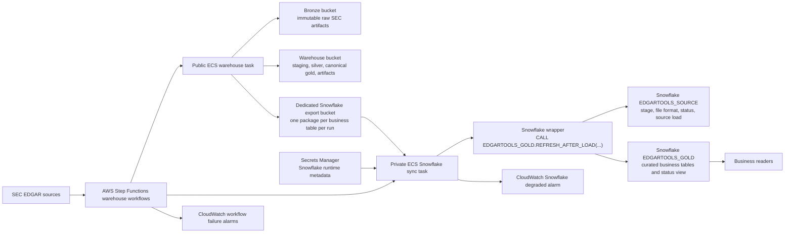

# SEC EDGAR Analysis Hosting Specification

## Objective

Implement a durable, analytics-friendly storage and processing system for SEC EDGAR data that:

- preserves all source data needed for replay and reparsing
- supports fast company and filing lookup
- supports analysis of forms that edgartools already models well
- provides a path to analyze forms that are only captured today as filing metadata

This specification extends the normalized model in [docs/sec-company-filings-data-model.md](C:/work/projects/edgartools/docs/sec-company-filings-data-model.md).

The implementation verification plan is documented in [docs/sec-hosting-verification-plan.md](C:/work/projects/edgartools/docs/sec-hosting-verification-plan.md).

The AWS deployment guide is documented in [docs/guides/aws-warehouse-deployment.md](C:/work/projects/edgartools/docs/guides/aws-warehouse-deployment.md).

The Snowflake gold mirror guide is documented in [docs/guides/snowflake-gold-mirror.md](C:/work/projects/edgartools/docs/guides/snowflake-gold-mirror.md).

## Implementation Contract

This section is normative for implementation. If it is more specific than a later generalized section, this section wins.

### Runtime And Policy

- Python compatibility for this workstream is `3.10+`
- all repo-authored code, tests, SQL, docs, comments, and plans must be ASCII-only
- SEC payloads may contain non-ASCII data, but that data is external and must not be hard-coded in repo-authored files
- v1 runtime is Python jobs or CLI in this repo, DuckDB, Parquet, and `fsspec`
- supported storage backends are local filesystem, S3, and Azure Blob
- Databricks is a future-compatible target, not a v1 runtime dependency
- Snowflake is an approved downstream gold mirror for analytics serving, not the canonical runtime for bronze or silver

### AWS Terraform Deployment Contract

The AWS reference deployment for this warehouse uses Terraform CLI and HCL.

Pinned toolchain:

- Terraform CLI: `~> 1.14.7` (pessimistic constraint; allows patch releases e.g. 1.14.8)
- AWS provider: `= 6.39.0` (exact pin)

Repository layout:

- `infra/terraform/bootstrap-state/`
- `infra/terraform/accounts/dev/`
- `infra/terraform/accounts/prod/`
- `infra/terraform/modules/`

AWS deployment rules:

- use separate AWS accounts for `dev` and `prod`
- use one immutable bronze bucket and one mutable warehouse bucket per account
- use ECS Fargate for compute
- use Step Functions plus EventBridge Scheduler for orchestration
- use S3 backend lockfiles with `use_lockfile = true` for Terraform state locking; commit `.terraform.lock.hcl` files
- do not use Terraform workspaces for environments
- do not provision DynamoDB in v1
- do not provision Glue or Athena in v1
- do not require private networking in v1
- declare `blocked_encryption_types = ["SSE-C"]` explicitly in all S3 encryption rules to match account-level enforcement and keep plans clean
- CloudWatch failure alarms must cover all five Step Functions state machines, not only scheduled ones
- `container_image` must default to `null` with `coalesce(var.container_image, "scratch")` in task definitions to allow a first apply before the ECR image exists
- S3 bucket tags must be declared via the `tags` argument on `aws_s3_bucket`; the resource type `aws_s3_bucket_tagging` does not exist in `hashicorp/aws`

Required S3 layout:

- `s3://<bronze-bucket>/warehouse/bronze/...`
- `s3://<warehouse-bucket>/warehouse/staging/...`
- `s3://<warehouse-bucket>/warehouse/silver/sec/...`
- `s3://<warehouse-bucket>/warehouse/gold/...`
- `s3://<warehouse-bucket>/warehouse/artifacts/...`

Bucket rules:

- bronze bucket versioning must be enabled
- warehouse bucket versioning must be enabled
- bronze and warehouse storage must be separate buckets
- bronze objects are immutable by application contract; task role must have `GetObject` and `PutObject` only (no `DeleteObject`)
- warehouse task role must have `GetObject`, `PutObject`, and `DeleteObject`
- silver, gold, staging, and derived artifacts are mutable and live only in the warehouse bucket

Operational constraints:

- only one mutating warehouse execution may run at a time per environment in v1
- overlapping protection is operational and scheduler-driven, not enforced by DynamoDB
- manual `bootstrap_*`, `targeted_resync`, and `full_reconcile` runs must be started only when no other mutating Step Functions execution is active

Container runtime rules:

- deploy one container image for warehouse jobs
- image build and push happen outside Terraform
- Terraform deploys by image tag or digest; use immutable digest (`sha256:...`) in production
- the container must expose the `edgar-warehouse` CLI entrypoint
- install the package without the full analysis dependency tree and then add the curated warehouse runtime dependency set
- the warehouse runtime dependency set must include DuckDB, PyArrow, zstandard, `fsspec`, and the selected cloud filesystem package for the target environment
- ECR repository must use `image_tag_mutability = "IMMUTABLE"` and `scan_on_push = true`
- the Docker build must copy only the files required to install the package and execute `edgar-warehouse`
- the `.dockerignore` file must exclude `.git`, `.venv`, `tests/`, `infra/`, `data/`, `docs/`, `examples/`, `scripts/`, `notebooks/`, local temp directories, and `**/.terraform` to keep the build context minimal

### Snowflake Gold Mirror Contract

Snowflake is a downstream serving mirror for the canonical warehouse. It must not become the source of
truth for bronze, staging, silver, or canonical gold.

Canonical boundary:

- bronze remains immutable object storage
- silver remains the canonical normalized lakehouse layer
- canonical gold remains the warehouse contract in object storage
- Snowflake mirrors selected gold-serving datasets for business access

Repository layout:

- `infra/terraform/snowflake/accounts/dev/`
- `infra/terraform/snowflake/accounts/prod/`
- `infra/terraform/snowflake/modules/`

Baseline Snowflake object names:

- databases: `EDGARTOOLS_DEV`, `EDGARTOOLS_PROD`
- schemas: `EDGARTOOLS_SOURCE`, `EDGARTOOLS_GOLD`
- roles: `EDGARTOOLS_<ENV>_DEPLOYER`, `EDGARTOOLS_<ENV>_REFRESHER`, `EDGARTOOLS_<ENV>_READER`
- warehouses: `EDGARTOOLS_<ENV>_REFRESH_WH`, `EDGARTOOLS_<ENV>_READER_WH`

Snowflake operating rules:

- keep Snowflake Terraform state separate from AWS Terraform state
- use Terraform for stable Snowflake platform objects and infrequent structural changes
- use SnowCLI for Snowflake SQL execution and for bootstrap-only escape hatches when provider auth blocks Terraform
- use dbt for ongoing Snowflake gold model changes, including new columns
- use Snowflake dynamic tables for runtime refresh, not ad hoc manual SQL chains
- trigger Snowflake refresh after every successful gold-affecting AWS warehouse run
- if Snowflake refresh fails, mark the mirror stale and keep the canonical warehouse successful

Current reference architecture:

- canonical warehouse ECS tasks run in public subnets
- Snowflake sync ECS tasks run in private subnets
- AWS writes canonical bronze, staging, silver, and gold data into the warehouse S3 buckets
- AWS writes one Snowflake export package per business table per run into a dedicated Snowflake export bucket
- the Snowflake sync task reads runtime metadata from Secrets Manager and calls one public Snowflake wrapper
- CloudWatch alarms separate true Step Functions failure from Snowflake stale or degraded mirror state



Snowflake build order:

1. baseline platform objects: database, schemas, warehouses, account roles
2. import path: storage integration, stage, file format, technical status table
3. runtime SQL layer: source load procedure and public refresh wrapper
4. dbt layer: business-facing models, dynamic tables, tests, and `EDGARTOOLS_GOLD_STATUS`
5. runtime cutover: replace infrastructure-validation mode with real Snowflake import and refresh

Preferred Snowflake E2E path:

- AWS exports one package per business table per run into the dedicated Snowflake export bucket
- Snowflake ingests from S3 through a Snowflake storage integration, not direct application credentials
- one public wrapper call remains the AWS runtime contract:
  - `CALL EDGARTOOLS_GOLD.REFRESH_AFTER_LOAD(workflow_name, run_id)`
- business users see only curated `EDGARTOOLS_GOLD` objects and the freshness view `EDGARTOOLS_GOLD_STATUS`

Current warehouse runtime modes:

- `infrastructure_validation`: write run manifests only
- `bronze_capture`: write real bronze raw objects for reference files, daily index files, and submissions JSON while silver and gold remain staged
- in `bronze_capture`, `daily_incremental` may derive impacted CIKs from the raw daily index and capture main submissions JSON before silver state exists
- `WAREHOUSE_BRONZE_CIK_LIMIT` may be used as a temporary bounded-validation cap until tracked-universe state exists

Five-whys rationale for the preferred path:

1. Why keep Snowflake downstream of the warehouse? Because the canonical warehouse must remain replayable even when Snowflake is unavailable.
2. Why use S3 export plus Snowflake import instead of direct writes? Because exports are deterministic, replayable, and isolate AWS pipeline success from Snowflake outages.
3. Why keep Terraform separate from dbt? Because structural platform changes are infrequent, while gold model changes happen continuously.
4. Why use one refresh wrapper instead of many table-level commands? Because orchestration needs one stable contract with centralized retry, status, and cost control.
5. Why use dynamic tables after the load rather than always-on refresh? Because post-load refresh gives better cost control and keeps freshness tied to canonical warehouse success.

### Identifier Classes

- Natural business keys: `cik`, `accession_number`, `file_name`
- Surrogate keys: gold `*_key` fields only
- Generated partition keys: `cik_bucket`, `filing_year`, `accepted_date`, `fetch_date`
- Lineage and control keys: `sync_run_id`, `raw_object_id`, `parse_run_id`

`cik_bucket` is generated by the warehouse, not inherited from the SEC, and must never be used as a business join key.

### Tracked Universe

`silver.sec_tracked_universe` is the authoritative membership table keyed by `cik`.

Required behavior:

- seed discovery from `company_tickers_exchange.json`
- use `company_tickers.json` as fallback and identity support
- auto-enroll newly discovered SEC companies
- default new auto-enrolled companies to `history_mode = 'recent_only'`
- soft-deactivate out-of-scope companies instead of deleting them

Recommended columns:

| Column | Type | Notes |
|---|---|---|
| `cik` | `BIGINT` | Primary key |
| `input_ticker` | `TEXT` | Nullable |
| `current_ticker` | `TEXT` | Nullable |
| `universe_source` | `TEXT` | `manual`, `watchlist`, `seeded_from_sec_reference` |
| `tracking_status` | `TEXT` | `active`, `paused`, `inactive` |
| `history_mode` | `TEXT` | `recent_only`, `full_history` |
| `effective_from` | `TIMESTAMPTZ` | |
| `effective_to` | `TIMESTAMPTZ` | Nullable |
| `load_priority` | `INTEGER` | Nullable |
| `scope_reason` | `TEXT` | Nullable |
| `added_at` | `TIMESTAMPTZ` | |
| `removed_at` | `TIMESTAMPTZ` | Nullable |

### Gold Contract

Gold is the only star-schema layer. Silver remains normalized.

Canonical gold tables:

- dimensions:
  - `gold.dim_date`
  - `gold.dim_company`
  - `gold.dim_form`
  - `gold.dim_filing`
  - `gold.dim_party`
  - `gold.dim_security`
  - `gold.dim_ownership_txn_type`
  - `gold.dim_geography`
  - `gold.dim_disclosure_category`
  - `gold.dim_private_fund`
- facts:
  - `gold.fact_filing_activity`
  - `gold.fact_ownership_transaction`
  - `gold.fact_ownership_holding_snapshot`
  - `gold.fact_adv_office`
  - `gold.fact_adv_disclosure`
  - `gold.fact_adv_private_fund`

Rules:

- `dim_party` is the conformed actor dimension
- `dim_company` is issuer and business specific
- surrogate-key assignment must be deterministic
- Type 2 dimensions use business key plus attribute-hash change detection
- fact rebuilds are idempotent by natural key
- legacy `gold.sec_*` names are compatibility views only, not canonical storage

### Daily Incremental Canonical Source

`daily_incremental` must use the SEC daily form index as the authoritative daily discovery source.

Canonical source URL:

`https://www.sec.gov/Archives/edgar/daily-index/{year}/QTR{quarter}/form.YYYYMMDD.idx`

Rules:

- daily indexes are updated nightly starting about `10:00 p.m. America/New_York`
- the build usually completes within a few hours
- business date `D` is eligible for canonical loading at `06:00 America/New_York` on `D + 1`
- current Atom feed remains optional acceleration only, not authoritative daily discovery
- expected business days are Monday-Friday excluding US federal holidays

### Daily Stage And Checkpoint Contract

#### `stg_daily_index_filing`

One row per filing line from `form.YYYYMMDD.idx`.

| Column | Type | Notes |
|---|---|---|
| `sync_run_id` | `TEXT` | Generated |
| `raw_object_id` | `TEXT` | Generated |
| `source_name` | `TEXT` | Fixed `daily_form_index` |
| `source_url` | `TEXT` | Exact SEC URL |
| `business_date` | `DATE` | Date represented by the file |
| `source_year` | `SMALLINT` | Derived from `business_date` |
| `source_quarter` | `SMALLINT` | Derived from `business_date` |
| `row_ordinal` | `INTEGER` | 1-based line order after header |
| `form` | `TEXT` | SEC raw field |
| `company_name` | `TEXT` | SEC raw field |
| `cik` | `BIGINT` | SEC raw field |
| `filing_date` | `DATE` | SEC raw field |
| `file_name` | `TEXT` | SEC raw field |
| `accession_number` | `TEXT` | Derived from `file_name` |
| `filing_txt_url` | `TEXT` | Derived archive URL |
| `record_hash` | `TEXT` | Row hash |
| `staged_at` | `TIMESTAMPTZ` | Generated |

#### `silver.sec_daily_index_checkpoint`

One row per expected daily form-index business date.

| Column | Type | Notes |
|---|---|---|
| `business_date` | `DATE` | Primary key |
| `source_name` | `TEXT` | Fixed `daily_form_index` |
| `source_key` | `TEXT` | `date:YYYY-MM-DD` |
| `source_url` | `TEXT` | Exact SEC URL |
| `expected_available_at` | `TIMESTAMPTZ` | `06:00 America/New_York` on next calendar day |
| `first_attempt_at` | `TIMESTAMPTZ` | Nullable |
| `last_attempt_at` | `TIMESTAMPTZ` | Nullable |
| `attempt_count` | `INTEGER` | |
| `raw_object_id` | `TEXT` | Nullable |
| `last_sha256` | `TEXT` | Nullable |
| `row_count` | `INTEGER` | Nullable |
| `distinct_cik_count` | `INTEGER` | Nullable |
| `distinct_accession_count` | `INTEGER` | Nullable |
| `status` | `TEXT` | `pending`, `running`, `waiting_for_publish`, `skipped_non_business_day`, `succeeded`, `failed_retryable`, `failed_terminal` |
| `error_message` | `TEXT` | Nullable |
| `finalized_at` | `TIMESTAMPTZ` | Nullable |
| `last_success_at` | `TIMESTAMPTZ` | Nullable |

### Load Interfaces

#### `bootstrap_full`

```python
def bootstrap_full(
    cik_list: list[int] | None = None,
    tracking_status_filter: str = "active",
    include_reference_refresh: bool = True,
    artifact_policy: str = "all_attachments",
    parser_policy: str = "configured_forms",
    force: bool = False,
) -> BootstrapResult:
    ...
```

Inputs:

- tracked universe rows, optionally narrowed by `cik_list`
- SEC reference files if `include_reference_refresh=True`
- `CIK##########.json`
- all `filings.files[]` pagination files

Outputs:

- full company metadata
- full filing history
- all artifacts for included filings
- downstream text and parser outputs

#### `bootstrap_recent_10`

```python
def bootstrap_recent_10(
    cik_list: list[int] | None = None,
    tracking_status_filter: str = "active",
    include_reference_refresh: bool = True,
    recent_limit: int = 10,
    artifact_policy: str = "all_attachments",
    parser_policy: str = "configured_forms",
    force: bool = False,
) -> BootstrapResult:
    ...
```

Inputs:

- tracked universe rows, optionally narrowed by `cik_list`
- SEC reference files if `include_reference_refresh=True`
- `CIK##########.json`

Outputs:

- full company metadata
- only the latest `recent_limit` recent filings per company from `filings.recent`
- all artifacts for included filings
- downstream text and parser outputs

Rule:

- same pipeline as `bootstrap_full`, only narrower filing selection

#### `daily_incremental`

```python
def daily_incremental(
    start_date: date | None = None,
    end_date: date | None = None,
    include_reference_refresh: bool = False,
    tracking_status_filter: str = "active",
    force: bool = False,
) -> IncrementalResult:
    ...
```

Inputs:

- `silver.sec_tracked_universe`
- `silver.sec_daily_index_checkpoint`
- SEC daily `form.YYYYMMDD.idx`
- impacted `CIK##########.json`
- impacted artifacts

Behavior:

- if `start_date` is omitted, start from the next expected business day after the last successful checkpoint
- if `end_date` is omitted, use the latest eligible finalized business date
- use Monday-Friday excluding US federal holidays
- stop on first unresolved expected business date

#### `load_daily_form_index_for_date`

```python
def load_daily_form_index_for_date(
    target_date: date,
    force: bool = False,
) -> DailyIndexLoadResult:
    ...
```

Inputs:

- one business date
- the SEC daily form-index file for that date

Behavior:

- skip non-business dates
- write one checkpoint row per business date
- stage one `stg_daily_index_filing` dataset for that date
- derive impacted CIK and accession work sets

#### `catch_up_daily_form_index`

```python
def catch_up_daily_form_index(
    end_date: date | None = None,
    force: bool = False,
) -> DailyIndexCatchupResult:
    ...
```

Inputs:

- daily checkpoint state
- expected business-day sequence up to `end_date`

Behavior:

- load dates in ascending order
- do not skip gaps
- stop on first unresolved expected date

#### `targeted_resync`

```python
def targeted_resync(
    scope_type: str,
    scope_key: str,
    include_artifacts: bool = True,
    include_text: bool = True,
    include_parsers: bool = True,
    force: bool = True,
) -> ResyncResult:
    ...
```

Valid inputs:

- `scope_type="reference"` and `scope_key` like `company_tickers_exchange`
- `scope_type="cik"` and `scope_key` like `320193`
- `scope_type="accession"` and `scope_key` like `0001140361-26-013192`

Behavior:

- force fresh SEC download
- preserve bronze history
- rebuild only affected silver and gold scope

#### `full_reconcile`

```python
def full_reconcile(
    cik_list: list[int] | None = None,
    sample_limit: int | None = None,
    include_reference_refresh: bool = True,
    auto_heal: bool = True,
) -> ReconcileResult:
    ...
```

Inputs:

- tracked universe or explicit `cik_list`
- live SEC reference and submissions sources
- current silver state

Behavior:

- detect drift
- write `sec_reconcile_finding`
- if `auto_heal=True`, launch targeted resync for mismatches
- persist reconciliation summary results

#### `submissions_orchestrator`

```python
def submissions_orchestrator(
    cik: int,
    load_mode: str,
    recent_limit: int | None = None,
    force: bool = False,
) -> SubmissionsScopeResult:
    ...
```

Inputs:

- one `CIK##########.json`
- `load_mode` in `bootstrap_full`, `bootstrap_recent_10`, `daily_incremental`, `targeted_resync`

Behavior:

- fetch raw submissions JSON
- call company-scope sub-loaders
- only merge to silver after all company-scope staging succeeds

### Company Submissions Loader Contract

Use these sub-loaders:

- `stage_company_loader(payload, cik, sync_run_id, raw_object_id, load_mode)`
- `stage_address_loader(payload, cik, sync_run_id, raw_object_id, load_mode)`
- `stage_former_name_loader(payload, cik, sync_run_id, raw_object_id, load_mode)`
- `stage_manifest_loader(payload, cik, sync_run_id, raw_object_id, load_mode)`
- `stage_recent_filing_loader(payload, cik, sync_run_id, raw_object_id, load_mode, recent_limit=None)`

Rules:

- stage all company-scope rowsets before any silver merge
- if any company-scope stage step fails, do not partially merge silver for that company scope
- loaders must be idempotent

Common stage columns:

- `sync_run_id`
- `raw_object_id`
- `source_name`
- `source_url`
- `cik`
- `load_mode`
- `staged_at`
- `record_hash`

Silver merge order:

1. `sec_company`
2. `sec_company_address`
3. `sec_company_former_name`
4. `sec_company_submission_file`
5. `sec_company_filing`

For each sub-loader, implement:

- accepted input object
- output stage table
- grain
- natural key
- required validation rules

### Numbered Runbooks

#### `bootstrap_recent_10`

1. Refresh SEC reference files if configured.
2. Resolve tracked-universe scope.
3. Fetch `CIK##########.json` for each target company.
4. Stage company, address, former-name, manifest, and recent-filing rows.
5. Select the top 10 recent filings by `acceptanceDateTime desc, accession_number desc`.
6. Merge company-scope silver rows.
7. Fetch all attachments for selected filings.
8. Extract text.
9. Run parsers.
10. Build affected gold dimensions and facts.
11. Update checkpoints and sync state.

#### `bootstrap_full`

1. Refresh SEC reference files if configured.
2. Resolve tracked-universe scope.
3. Fetch `CIK##########.json` for each target company.
4. Stage company, address, former-name, manifest, and recent-filing rows.
5. Merge company-scope silver rows.
6. Fetch and stage each listed pagination file.
7. Merge full filing history.
8. Fetch all attachments for included filings.
9. Extract text.
10. Run parsers.
11. Build affected gold dimensions and facts.
12. Update checkpoints and sync state.

#### `daily_incremental`

1. Determine the expected business-date range.
2. Load missing or requested daily `form.YYYYMMDD.idx` files in ascending date order.
3. Stage `stg_daily_index_filing`.
4. Filter staged rows to the tracked universe.
5. Derive impacted CIK and accession work sets.
6. Refresh submissions JSON for impacted CIKs.
7. Fetch artifacts for impacted accessions.
8. Extract text.
9. Run parsers.
10. Rebuild only affected gold rows.
11. Update date checkpoints and company sync state.

#### `targeted_resync`

1. Resolve scope.
2. Force fetch from SEC.
3. Rebuild affected stage rows.
4. Rebuild affected silver rows.
5. Refetch artifacts and rerun text and parsers if configured.
6. Rebuild affected gold rows.
7. Mark findings and checkpoints resolved only after success.

#### `full_reconcile`

1. Refresh references if configured.
2. Snapshot tracked universe.
3. Fetch live submissions truth for target scope.
4. Build reconcile staging rowsets.
5. Compare live truth to silver.
6. Write `sec_reconcile_finding`.
7. Group mismatches into resync scopes.
8. Launch targeted resync if auto-heal is enabled.
9. Recompare healed scopes.
10. Persist reconciliation summary.

## Problem Statement

The current company/submissions flow gives strong coverage for:

- ticker to CIK lookup
- company metadata
- filing metadata
- current filing feed metadata

But many forms are not captured in detail. For those forms, the repo may know:

- the form type
- filing dates
- accession number
- primary document name
- XBRL flags

without extracting the full analytical payload.

Examples:

- Forms `3`, `4`, `5`: filing metadata is available, but not a normalized ownership-transaction warehouse
- Forms `ADV`, `ADV-E`, `ADV-H`, `ADV-NR`, `ADV-W`: form types are recognized, but there is no dedicated ADV parser or ADV analytic schema
- Other uncommon forms: available as filing rows, but not parsed into structured fact tables

The system must therefore host both:

- normalized metadata tables
- raw filing artifacts and parser outputs for future analysis

## Scope

### In Scope

- Raw storage for SEC reference files, submissions JSON, pagination JSON, filing pages, primary documents, and attachments
- Normalized metadata tables for companies and filings
- Parser execution tracking
- Form-family-specific analytic tables for ownership and ADV
- Searchable text extraction for forms not deeply parsed
- Reprocessing and schema versioning

### Out Of Scope

- Replacing edgartools runtime APIs
- Building every possible form parser on day 1
- Frontend/dashboard design
- Fine-grained XBRL fact warehousing beyond what existing edgartools modules already provide

## Design Principles

- Raw is immutable: every fetched SEC artifact is stored exactly once and never mutated
- Normalized is reproducible: silver tables can be rebuilt from bronze raw
- Gold is versioned: parser outputs carry parser name and parser version
- Metadata first: company and filing metadata is the index into everything else
- Form-specific parsing is incremental: build detailed parsers only for the forms that matter
- Reparse is normal: schema changes should trigger rebuilds from raw, not redownloads

## Target Architecture

Use a 3-layer design.

### Bronze

Immutable raw SEC payloads in object storage.

Content:

- `company_tickers.json`
- `company_tickers_exchange.json`
- `CIK##########.json`
- `CIK##########-submissions-###.json`
- filing homepages
- primary documents
- all filing attachments
- current-filings Atom snapshots

Recommended storage:

- Azure Blob, S3, or GCS
- compressed raw files where appropriate
- content hash stored in metadata

### Silver

Normalized warehouse tables.

Content:

- `sec_company`
- `sec_company_ticker`
- `sec_company_address`
- `sec_company_former_name`
- `sec_company_submission_file`
- `sec_company_filing`
- `sec_current_filing_feed`
- raw-object registry and attachment registry
- extracted filing text

Recommended storage:

- Parquet, Delta, or Iceberg in a lakehouse
- optional Postgres replica for serving APIs and low-latency lookup

### Gold

Form-specific analytic tables and curated marts.

Examples:

- ownership transaction mart
- insider holdings mart
- ADV adviser profile mart
- current-feed trend mart
- filing search index

Recommended engines:

- DuckDB for local and medium-scale analysis
- Spark/BigQuery for large-scale canonical processing
- Snowflake for large-scale downstream gold serving

## Required Data Assets

### Base Metadata Model

Implement the tables defined in [docs/sec-company-filings-data-model.md](C:/work/projects/edgartools/docs/sec-company-filings-data-model.md):

- `sec_company`
- `sec_company_ticker`
- `sec_company_address`
- `sec_company_former_name`
- `sec_company_submission_file`
- `sec_company_filing`
- `sec_current_filing_feed`

These tables are the canonical metadata index.

### Raw Hosting Tables

Add the following tables to support forms that are not deeply modeled today.

#### `sec_raw_object`

One row per fetched raw artifact.

| Column | Type | Notes |
|---|---|---|
| `raw_object_id` | `TEXT` | Primary key |
| `source_type` | `TEXT` | `reference`, `submissions`, `pagination`, `filing_index`, `filing_document`, `attachment`, `current_feed` |
| `cik` | `BIGINT` | Nullable for non-company assets |
| `accession_number` | `TEXT` | Nullable |
| `form` | `TEXT` | Nullable |
| `source_url` | `TEXT` | Original SEC URL |
| `storage_path` | `TEXT` | Object storage path |
| `content_type` | `TEXT` | MIME type if known |
| `content_encoding` | `TEXT` | Nullable |
| `byte_size` | `BIGINT` | Nullable |
| `sha256` | `TEXT` | Content hash |
| `fetched_at` | `TIMESTAMPTZ` | Fetch timestamp |
| `http_status` | `INTEGER` | Expected `200` for successful persisted fetches |
| `source_last_modified` | `TIMESTAMPTZ` | Nullable |
| `source_etag` | `TEXT` | Nullable |

#### `sec_filing_attachment`

One row per document listed on the filing page or attachment index.

| Column | Type | Notes |
|---|---|---|
| `accession_number` | `TEXT` | Foreign key to `sec_company_filing` |
| `sequence_number` | `TEXT` | SEC sequence field, nullable |
| `document_name` | `TEXT` | Raw filename |
| `document_type` | `TEXT` | Example: `EX-10.1`, `GRAPHIC`, `XML`, `4` |
| `document_description` | `TEXT` | Nullable |
| `document_url` | `TEXT` | SEC archive URL |
| `is_primary` | `BOOLEAN` | True if this is the primary document |
| `raw_object_id` | `TEXT` | Foreign key to `sec_raw_object` once downloaded |

Recommended key: `PRIMARY KEY (accession_number, document_name)`

#### `sec_filing_text`

One row per normalized text extraction.

| Column | Type | Notes |
|---|---|---|
| `accession_number` | `TEXT` | Foreign key |
| `text_version` | `TEXT` | Extraction pipeline version |
| `source_document_name` | `TEXT` | Usually primary document |
| `text_storage_path` | `TEXT` | Object storage path for extracted text |
| `text_sha256` | `TEXT` | Hash of normalized text |
| `char_count` | `INTEGER` | Text length |
| `extracted_at` | `TIMESTAMPTZ` | Extraction time |

Recommended key: `PRIMARY KEY (accession_number, text_version)`

#### `sec_parse_run`

Tracks parser execution and reprocessing.

| Column | Type | Notes |
|---|---|---|
| `parse_run_id` | `TEXT` | Primary key |
| `accession_number` | `TEXT` | Nullable for batch jobs |
| `parser_name` | `TEXT` | Example: `ownership_v1`, `adv_v1`, `generic_text_v1` |
| `parser_version` | `TEXT` | Semantic version or git SHA |
| `target_form_family` | `TEXT` | `ownership`, `adv`, `generic`, `xbrl`, etc. |
| `status` | `TEXT` | `queued`, `running`, `succeeded`, `failed`, `skipped` |
| `started_at` | `TIMESTAMPTZ` | Nullable |
| `completed_at` | `TIMESTAMPTZ` | Nullable |
| `error_code` | `TEXT` | Nullable |
| `error_message` | `TEXT` | Nullable |
| `rows_written` | `INTEGER` | Nullable |

## Form-Family Extensions

### Ownership Forms: `3`, `4`, `5`

Implement a dedicated ownership analytic model because filing metadata alone is not enough for insider analysis.

#### `sec_ownership_reporting_owner`

| Column | Type | Notes |
|---|---|---|
| `accession_number` | `TEXT` | Foreign key |
| `owner_index` | `SMALLINT` | 1-based owner ordinal |
| `owner_cik` | `BIGINT` | Nullable |
| `owner_name` | `TEXT` | |
| `is_director` | `BOOLEAN` | Nullable |
| `is_officer` | `BOOLEAN` | Nullable |
| `is_ten_percent_owner` | `BOOLEAN` | Nullable |
| `is_other` | `BOOLEAN` | Nullable |
| `officer_title` | `TEXT` | Nullable |

#### `sec_ownership_non_derivative_txn`

| Column | Type | Notes |
|---|---|---|
| `accession_number` | `TEXT` | Foreign key |
| `owner_index` | `SMALLINT` | Foreign key component to owner |
| `txn_index` | `SMALLINT` | Row ordinal |
| `security_title` | `TEXT` | |
| `transaction_date` | `DATE` | Nullable |
| `transaction_code` | `TEXT` | |
| `transaction_shares` | `NUMERIC(28,8)` | Nullable |
| `transaction_price` | `NUMERIC(28,8)` | Nullable |
| `acquired_disposed_code` | `TEXT` | `A` or `D`, nullable |
| `shares_owned_after` | `NUMERIC(28,8)` | Nullable |
| `ownership_nature` | `TEXT` | Nullable |
| `ownership_direct_indirect` | `TEXT` | Nullable |

#### `sec_ownership_derivative_txn`

Same structure as non-derivative plus derivative-specific fields:

- `conversion_or_exercise_price`
- `exercise_date`
- `expiration_date`
- `underlying_security_title`
- `underlying_security_shares`

### ADV Forms

The repo recognizes ADV-family forms, but does not provide a dedicated ADV object model. Host the data as follows.

#### `sec_adv_filing`

| Column | Type | Notes |
|---|---|---|
| `accession_number` | `TEXT` | Primary key and foreign key |
| `cik` | `BIGINT` | |
| `form` | `TEXT` | `ADV`, `ADV-E`, `ADV-H`, `ADV-NR`, `ADV-W` |
| `adviser_name` | `TEXT` | Nullable |
| `sec_file_number` | `TEXT` | Nullable |
| `crd_number` | `TEXT` | Nullable |
| `effective_date` | `DATE` | Nullable |
| `filing_status` | `TEXT` | Nullable |
| `source_format` | `TEXT` | `xml`, `html`, `text`, `pdf`, `unknown` |

#### `sec_adv_office`

| Column | Type | Notes |
|---|---|---|
| `accession_number` | `TEXT` | Foreign key |
| `office_index` | `SMALLINT` | 1-based ordinal |
| `office_name` | `TEXT` | Nullable |
| `city` | `TEXT` | Nullable |
| `state_or_country` | `TEXT` | Nullable |
| `country` | `TEXT` | Nullable |
| `is_headquarters` | `BOOLEAN` | Nullable |

#### `sec_adv_disclosure_event`

| Column | Type | Notes |
|---|---|---|
| `accession_number` | `TEXT` | Foreign key |
| `event_index` | `SMALLINT` | 1-based ordinal |
| `disclosure_category` | `TEXT` | |
| `event_date` | `DATE` | Nullable |
| `is_reported` | `BOOLEAN` | Nullable |
| `description` | `TEXT` | Nullable |

#### `sec_adv_private_fund`

| Column | Type | Notes |
|---|---|---|
| `accession_number` | `TEXT` | Foreign key |
| `fund_index` | `SMALLINT` | 1-based ordinal |
| `fund_name` | `TEXT` | Nullable |
| `fund_type` | `TEXT` | Nullable |
| `jurisdiction` | `TEXT` | Nullable |
| `aum_amount` | `NUMERIC(28,2)` | Nullable |

## Generic Approach For Any Unparsed Form

For any form without a dedicated parser:

1. Persist the filing metadata in `sec_company_filing`
2. Persist all raw artifacts in `sec_raw_object`
3. Register all documents in `sec_filing_attachment`
4. Extract normalized text into `sec_filing_text`
5. Run a generic parser that extracts:
   - title
   - section headers
   - tables
   - key-value candidates
6. Store parser execution in `sec_parse_run`
7. Add a form-specific gold parser only if analysis needs justify it

This ensures no data is blocked on parser availability.

## Storage Layout

Use a deterministic object storage layout.

### Reference

```text
bronze/reference/sec/company_tickers/{YYYY}/{MM}/{DD}/company_tickers.json
bronze/reference/sec/company_tickers_exchange/{YYYY}/{MM}/{DD}/company_tickers_exchange.json
bronze/reference/sec/current_feed/{YYYY}/{MM}/{DD}/{HH}/current_feed_atom.xml
```

### Daily Index

```text
bronze/daily_index/sec/{YYYY}/{MM}/{DD}/form.YYYYMMDD.idx
```

### Submissions

```text
bronze/submissions/sec/cik={cik}/main/{YYYY}/{MM}/{DD}/CIK{cik_10}.json
bronze/submissions/sec/cik={cik}/pagination/{YYYY}/{MM}/{DD}/{file_name}
```

### Filing Artifacts

```text
bronze/filings/sec/cik={cik}/accession={accession_number}/index/{file_name}
bronze/filings/sec/cik={cik}/accession={accession_number}/primary/{file_name}
bronze/filings/sec/cik={cik}/accession={accession_number}/attachments/{file_name}
silver/text/sec/cik={cik}/accession={accession_number}/{text_version}.txt
gold/parser_output/{parser_name}/{parser_version}/cik={cik}/accession={accession_number}/part-*.parquet
```

## Source Precedence And Sync Semantics

Use the SEC sources with explicit precedence.

1. `company_tickers.json` and `company_tickers_exchange.json` are authoritative for reference snapshots and ticker-to-CIK resolution.
2. `CIK##########.json` is authoritative for current company profile, `filings.recent`, and the list of pagination files under `filings.files`.
3. `CIK##########-submissions-###.json` files are authoritative for the older filings named in the current pagination manifest.
4. Filing index pages and filing documents are authoritative for attachment-level detail and primary-document discovery.
5. The current-feed Atom endpoint is a low-latency signal only. It may accelerate discovery, but company filing metadata should be confirmed through submissions or filing index data before it is treated as canonical.

Apply these storage semantics:

- Bronze is immutable and append-only.
- Silver is current-state and upsertable.
- Gold is versioned by parser name and parser version.
- If the SEC changes values for an existing primary key, update the silver row in place and preserve the old bronze snapshots for auditability.

## Load Modes

The system must support these operational modes:

- `bootstrap_full`
- `bootstrap_recent_10`
- `daily_incremental`
- `targeted_resync`
- `full_reconcile`

Rules:

- `bootstrap_full` and `bootstrap_recent_10` use the same metadata, artifact, text, parser, silver, and gold pipelines
- the only difference between them is filing scope
- `daily_incremental` uses the SEC daily `form.YYYYMMDD.idx` as the authoritative daily discovery source
- `targeted_resync` force-refreshes one scope while preserving bronze history
- `full_reconcile` compares live SEC truth to silver state and heals drift through targeted resync

## Sync Control Tables

These tables are operational state, not part of the public analytical contract. They exist to make bootstrap, incremental sync, and resync deterministic.

#### `sec_sync_run`

One row per job run or sub-run.

| Column | Type | Notes |
|---|---|---|
| `sync_run_id` | `TEXT` | Primary key |
| `sync_mode` | `TEXT` | `bootstrap`, `incremental`, `resync`, `reconcile` |
| `scope_type` | `TEXT` | `reference`, `submissions`, `pagination`, `current_feed`, `artifact_fetch`, `text`, `parser` |
| `scope_key` | `TEXT` | Nullable; example: `cik:320193`, `accession:0001140361-26-013192` |
| `started_at` | `TIMESTAMPTZ` | |
| `completed_at` | `TIMESTAMPTZ` | Nullable |
| `status` | `TEXT` | `queued`, `running`, `succeeded`, `failed`, `partial`, `skipped` |
| `rows_inserted` | `INTEGER` | Nullable |
| `rows_updated` | `INTEGER` | Nullable |
| `rows_deleted` | `INTEGER` | Nullable |
| `rows_skipped` | `INTEGER` | Nullable |
| `error_message` | `TEXT` | Nullable |

#### `sec_source_checkpoint`

Stores the most recent successful checkpoint for a source object or source partition.

| Column | Type | Notes |
|---|---|---|
| `source_name` | `TEXT` | Example: `company_tickers`, `company_tickers_exchange`, `submissions_main`, `submissions_pagination`, `current_feed` |
| `source_key` | `TEXT` | Example: `global`, `cik:320193`, `file:CIK0000320193-submissions-001.json` |
| `raw_object_id` | `TEXT` | Latest successful bronze snapshot |
| `last_success_at` | `TIMESTAMPTZ` | |
| `last_sha256` | `TEXT` | Nullable |
| `last_etag` | `TEXT` | Nullable |
| `last_modified_at` | `TIMESTAMPTZ` | Nullable |
| `last_acceptance_datetime_seen` | `TIMESTAMPTZ` | Nullable |
| `last_accession_number_seen` | `TEXT` | Nullable |

Recommended key: `PRIMARY KEY (source_name, source_key)`

#### `sec_company_sync_state`

Tracks lifecycle and freshness by CIK.

| Column | Type | Notes |
|---|---|---|
| `cik` | `BIGINT` | Primary key |
| `tracking_status` | `TEXT` | `active`, `paused`, `bootstrap_pending`, `historical_complete`, `error` |
| `bootstrap_completed_at` | `TIMESTAMPTZ` | Nullable |
| `last_main_sync_at` | `TIMESTAMPTZ` | Nullable |
| `last_main_raw_object_id` | `TEXT` | Nullable |
| `last_main_sha256` | `TEXT` | Nullable |
| `latest_filing_date_seen` | `DATE` | Nullable |
| `latest_acceptance_datetime_seen` | `TIMESTAMPTZ` | Nullable |
| `pagination_files_expected` | `INTEGER` | Nullable |
| `pagination_files_loaded` | `INTEGER` | Nullable |
| `pagination_completed_at` | `TIMESTAMPTZ` | Nullable |
| `next_sync_after` | `TIMESTAMPTZ` | Nullable |
| `last_error_message` | `TEXT` | Nullable |

#### `sec_daily_index_checkpoint`

One row per expected daily form-index business date.

| Column | Type | Notes |
|---|---|---|
| `business_date` | `DATE` | Primary key |
| `source_name` | `TEXT` | Fixed `daily_form_index` |
| `source_key` | `TEXT` | `date:YYYY-MM-DD` |
| `source_url` | `TEXT` | Exact SEC URL |
| `expected_available_at` | `TIMESTAMPTZ` | `06:00 America/New_York` on next calendar day |
| `first_attempt_at` | `TIMESTAMPTZ` | Nullable |
| `last_attempt_at` | `TIMESTAMPTZ` | Nullable |
| `attempt_count` | `INTEGER` | |
| `raw_object_id` | `TEXT` | Nullable |
| `last_sha256` | `TEXT` | Nullable |
| `row_count` | `INTEGER` | Nullable |
| `distinct_cik_count` | `INTEGER` | Nullable |
| `distinct_accession_count` | `INTEGER` | Nullable |
| `status` | `TEXT` | `pending`, `running`, `waiting_for_publish`, `skipped_non_business_day`, `succeeded`, `failed_retryable`, `failed_terminal` |
| `error_message` | `TEXT` | Nullable |
| `finalized_at` | `TIMESTAMPTZ` | Nullable |
| `last_success_at` | `TIMESTAMPTZ` | Nullable |

#### `sec_reconcile_finding`

Persisted reconciliation mismatch rows.

| Column | Type | Notes |
|---|---|---|
| `reconcile_run_id` | `TEXT` | Parent run id |
| `cik` | `BIGINT` | |
| `scope_type` | `TEXT` | `reference`, `cik`, `accession` |
| `object_type` | `TEXT` | `company`, `address`, `former_name`, `manifest`, `filing` |
| `object_key` | `TEXT` | Object identifier inside the scope |
| `drift_type` | `TEXT` | Specific mismatch type |
| `expected_value_hash` | `TEXT` | SEC truth hash |
| `actual_value_hash` | `TEXT` | Silver hash |
| `severity` | `TEXT` | `high`, `medium`, `low` |
| `recommended_action` | `TEXT` | `reference_resync`, `cik_resync`, `accession_resync`, `manual_review` |
| `status` | `TEXT` | `detected`, `queued_for_resync`, `resolved`, `unresolved`, `suppressed` |
| `detected_at` | `TIMESTAMPTZ` | |
| `resolved_at` | `TIMESTAMPTZ` | Nullable |
| `resync_run_id` | `TEXT` | Nullable |

## Ingestion Workflows

### Workflow 0: Initial Bootstrap

Frequency:

- once per environment
- whenever a new CIK universe is onboarded

Steps:

1. Run reference sync first and persist both reference snapshots to bronze.
2. Determine the bootstrap CIK universe.
3. Insert or update `sec_company_sync_state` with `tracking_status = 'bootstrap_pending'`.
4. Fetch `CIK##########.json` for each target CIK.
5. Persist raw submissions JSON to bronze and write source checkpoints.
6. Upsert `sec_company`, `sec_company_address`, `sec_company_former_name`, `sec_company_submission_file`, and the recent rows in `sec_company_filing`.
7. Compare `filings.files` to `sec_company_submission_file` and enqueue all referenced pagination files.
8. Fetch every missing pagination file and upsert older filing rows.
9. Mark `pagination_completed_at` and `bootstrap_completed_at` only after all expected pagination files have been loaded successfully.
10. After metadata bootstrap completes, enqueue artifact fetch, text extraction, and parsing according to configured form families and retention windows.

### Workflow 1: Reference Sync

Frequency:

- daily

Steps:

1. Download `company_tickers.json`.
2. Download `company_tickers_exchange.json`.
3. Persist both raw files to bronze and compute hashes.
4. Compare to `sec_source_checkpoint`.
5. If neither file changed, record a skipped `sec_sync_run` and stop.
6. If either file changed, replace the current-state slice of `sec_company_ticker` for that source snapshot.
7. Add newly discovered CIKs to `sec_company_sync_state`.
8. Do not delete historical bronze snapshots; only replace the silver current-state rows for the reference source.

### Workflow 1A: Daily Index Incremental Discovery

Trigger:

- `daily_incremental`

Steps:

1. Determine the expected business-date range from `sec_daily_index_checkpoint`.
2. Load missing or requested daily `form.YYYYMMDD.idx` files in ascending date order.
3. Persist each raw file to bronze and update `sec_daily_index_checkpoint`.
4. Parse rows into `stg_daily_index_filing`.
5. Filter staged rows to the tracked universe by `cik`.
6. Derive impacted CIK and accession work sets.
7. Stop on the first unresolved expected business date.
8. Use the impacted CIK and accession sets to drive downstream submissions refresh and artifact fetch.

### Workflow 2: Company Submissions Refresh For Impacted CIKs

Trigger:

- `bootstrap_full`
- `bootstrap_recent_10`
- `daily_incremental`
- `targeted_resync`

Steps:

1. Resolve target CIKs from the current load mode:
   - explicit `cik_list`, or
   - active tracked companies, or
   - impacted CIKs derived from the daily form index, or
   - explicit resync scope
2. Download `CIK##########.json`.
3. Persist raw JSON to bronze and update `sec_source_checkpoint`.
4. If hash, ETag, and effective latest acceptance timestamp are unchanged, record a skipped run, update `last_main_sync_at`, and stop.
5. If changed, upsert current-state company rows into:
   - `sec_company`
   - `sec_company_address`
   - `sec_company_former_name`
   - `sec_company_submission_file`
   - `sec_company_filing` for the rows present in `filings.recent`
6. Detect new or changed filings by:
   - accession numbers not already present, or
   - mutable filing columns changed for an existing accession number
7. Enqueue downstream artifact fetch, text extraction, and parser work only for those new or changed accessions.
8. Compare the current pagination manifest to `sec_company_submission_file` and enqueue only the pagination files that are missing or changed.
9. Update `sec_company_sync_state`:
   - `last_main_sync_at`
   - `last_main_raw_object_id`
   - `last_main_sha256`
   - `latest_filing_date_seen`
   - `latest_acceptance_datetime_seen`
   - `pagination_files_expected`
   - `next_sync_after`

### Workflow 3: Pagination Backfill And Incremental History Completion

Trigger:

- when `sec_company_submission_file` contains new files

Steps:

1. Download `CIK##########-submissions-###.json`.
2. Persist raw JSON to bronze and update `sec_source_checkpoint`.
3. If the pagination file hash is unchanged, skip reparsing.
4. Parse the filing rows from the pagination file.
5. Upsert into `sec_company_filing` on `accession_number`.
6. Increment `pagination_files_loaded` for the CIK when the load succeeds.
7. Mark `pagination_completed_at` when `pagination_files_loaded == pagination_files_expected`.
8. If the latest manifest no longer lists a previously known pagination file, keep the raw bronze snapshot but treat the manifest in `sec_company_submission_file` as current-state only after a successful refresh of the full manifest for that CIK.

### Workflow 4: Current Feed Polling

Trigger:

- optional intraday polling every 5 to 15 minutes

Steps:

1. Download the current-feed Atom page.
2. Persist the Atom payload to bronze and update `sec_source_checkpoint`.
3. Parse feed rows into `sec_current_filing_feed`.
4. Derive a candidate work queue of CIKs and accession numbers.
5. Use the queue only to prioritize Workflow 2 and Workflow 5.
6. Do not use current-feed rows as the authoritative source for daily change discovery or silver company filing metadata.

### Workflow 5: Filing Artifact Fetch

Trigger:

- for selected forms
- for all filings if full archive hosting is desired
- on analyst demand

Steps:

1. Fetch filing homepage/index
2. Enumerate attachments
3. Persist index and documents to bronze
4. Populate `sec_filing_attachment`
5. Mark `sec_raw_object`

Incremental rule:

- fetch artifacts only for accession numbers that are new, changed, explicitly resynced, or within a configured backfill policy

### Workflow 6: Text Extraction

Trigger:

- after primary document download

Steps:

1. Convert HTML, XML, TXT, or SGML to normalized text
2. Persist text to silver
3. Create `sec_filing_text` row

Incremental rule:

- re-extract only when the source document raw hash changes or the text pipeline version changes

### Workflow 7: Parser Execution

Trigger:

- based on form family and parser availability

Steps:

1. Select filings by form
2. Dispatch parser
3. Write gold tables
4. Record `sec_parse_run`

Incremental rule:

- rerun only when the filing raw object changes or the parser version changes

### Workflow 8: Targeted Resync From SEC

Trigger:

- manual operator request
- failed or partial load recovery
- suspected SEC correction for one CIK or accession

Steps:

1. Select the target scope:
   - reference source
   - one CIK
   - one accession number
2. Force a fresh SEC download even if the stored checkpoints match.
3. Persist the new raw snapshot to bronze.
4. Rebuild the affected silver rows from the fresh authoritative source.
5. Requeue artifact fetch, text extraction, and parsing only for the affected accessions.
6. Preserve all previous bronze snapshots and parser outputs.
7. Update checkpoints and sync state only after the resync completes successfully.

### Workflow 9: Full Reconciliation Resync

Trigger:

- scheduled monthly or quarterly reconciliation
- after a known SEC schema or content change

Steps:

1. Rerun reference sync against live SEC sources.
2. Rerun main submissions sync for the full tracked CIK universe or a sampled reconciliation cohort.
3. Build reconcile staging rowsets for company metadata, addresses, former names, manifest, and filings.
4. Compare staged live SEC truth to silver current state and write `sec_reconcile_finding`.
5. Respect `history_mode` during comparison:
   - `recent_only` compares company metadata and recent filing window only
   - `full_history` compares manifest and full filing set too
6. Heal drift through Workflow 8 using these mappings:
   - metadata drift -> CIK resync
   - manifest drift -> CIK resync with manifest refresh
   - one isolated filing drift -> accession resync
   - multiple filing drifts or any manifest drift -> CIK resync
7. Produce persisted reconciliation results from `sec_sync_run` and `sec_reconcile_finding`.

## Change Detection And Upsert Rules

Apply these rules consistently.

- `sec_company` is upserted by `cik`.
- `sec_company_ticker` is replaced by source snapshot for the relevant reference source.
- `sec_company_address` is upserted by `(cik, address_type)`.
- `sec_company_former_name` is replaced for the current CIK snapshot because the source array is authoritative current-state history.
- `sec_company_submission_file` is replaced for the current CIK manifest after a successful manifest refresh.
- `sec_company_filing` is upserted by `accession_number`, updating mutable metadata columns when SEC values change.
- `sec_raw_object` is append-only. The same SEC URL may produce multiple raw objects over time if the content changes.
- `sec_filing_attachment` is replaced per accession when a filing index is refetched successfully.
- `sec_filing_text` is versioned by `text_version`.
- Gold parser tables are versioned by parser version and should not overwrite prior parser outputs.

## Hosting Recommendations

### Small To Medium

- Bronze: local disk or blob storage
- Silver and Gold: Parquet
- Query engine: DuckDB
- Optional API DB: Postgres

### Large Scale

- Bronze: Azure Blob or S3
- Silver and Gold: Delta or Iceberg
- Compute: Spark for canonical processing, Snowflake for downstream gold serving
- Search: OpenSearch

## Data Quality Rules

- `accession_number` must be unique in `sec_company_filing`
- `cik` must be present for all company and filing rows
- all bronze objects must have `sha256`
- every `sec_company_filing` row must map to at least one raw submissions object
- every parsed gold row must map to a successful `sec_parse_run`
- parser reruns must not overwrite old outputs without version change
- every tracked CIK must have one `sec_company_sync_state` row
- incremental sync must be able to prove why a scope was skipped, refreshed, or resynced using `sec_sync_run` and `sec_source_checkpoint`

## Reprocessing Strategy

When a parser changes:

1. increment `parser_version`
2. select affected filings by `form`
3. rerun from bronze raw
4. write new gold outputs side by side
5. rebuild derived marts/views

Do not redownload SEC artifacts for parser-only changes.

When SEC source data changes:

1. force a fresh download for the affected source scope
2. persist the new raw source to bronze as a new immutable snapshot
3. update the current-state silver rows for the affected keys
4. rerun downstream text extraction and parser jobs only where the upstream raw content changed
5. retain the old bronze snapshots and old gold outputs for auditability

## Security And Compliance

- include SEC identity on all live fetches
- respect SEC rate limits
- do not overwrite raw source artifacts
- retain original URLs and hashes for auditability
- log fetch and parse failures with enough detail for replay

## Initial Implementation Phases

### Phase 1

- implement bronze storage for reference and submissions files
- implement silver tables from `docs/sec-company-filings-data-model.md`
- implement `sec_raw_object`, `sec_filing_attachment`, `sec_filing_text`, `sec_parse_run`
- implement `sec_sync_run`, `sec_source_checkpoint`, and `sec_company_sync_state`
- implement initial bootstrap for reference plus submissions metadata
- support latest-filings and company-history queries

### Phase 2

- implement incremental submissions sync and current-feed prioritization
- implement targeted CIK and accession resync
- implement filing artifact fetcher
- implement text extraction pipeline
- build search over extracted text

### Phase 3

- implement ownership parser and ownership gold tables
- validate on Forms `3`, `4`, and `5`

### Phase 4

- implement ADV parser and ADV gold tables
- validate on `ADV` and `ADV-E` samples first

## Acceptance Criteria

- initial bootstrap can load the configured CIK universe from the SEC reference files and mark historical completion state per CIK
- reference sync loads `AAPL`, `MSFT`, and `NVDA` correctly into normalized tables
- submissions sync loads company metadata, addresses, former names, pagination files, and filing rows for `AAPL`
- `daily_incremental` uses the SEC daily form index and does not guess change scopes
- incremental submissions sync skips unchanged CIKs based on checkpoints and only enqueues changed filings and pagination files
- latest filings query ordered by `acceptance_datetime` returns the same ordering as the live SEC submissions feed
- targeted resync for one CIK or one accession updates silver current-state rows while preserving prior bronze snapshots
- full reconciliation can detect drift and write persisted reconciliation findings
- raw bronze storage contains exact copies of submissions and filing artifacts with hashes
- text extraction runs on at least one `10-K`, one `4`, and one `ADV` family filing
- ownership parser writes normalized transaction rows for at least one Form `4`
- ADV parser writes at least one structured row into `sec_adv_filing`
- all parser runs are auditably tracked in `sec_parse_run`

## Deliverables

- object storage layout implementation
- normalized metadata DDL
- raw object and parser tracking DDL
- sync control table DDL
- initial bootstrap loader
- ingestion jobs for reference and submissions data
- incremental sync jobs for reference, submissions, pagination, and current feed
- targeted and full resync jobs
- filing artifact fetcher
- text extraction job
- ownership parser
- ADV parser
- validation queries and sample notebooks

## Minimal Query Set

The implementation must support these queries:

```sql
-- latest filings for a company
select *
from sec_company_filing
where cik = 320193
order by acceptance_datetime desc
limit 10;

-- insider forms for a company
select *
from sec_company_filing
where cik = 320193
  and form in ('3', '4', '5', '3/A', '4/A', '5/A')
order by acceptance_datetime desc;

-- company history
select *
from sec_company_former_name
where cik = 320193
order by ordinal;

-- available raw artifacts for a filing
select *
from sec_filing_attachment
where accession_number = '0001140361-26-013192';

-- ownership transactions
select *
from sec_ownership_non_derivative_txn
where accession_number = '0001140361-26-013192';
```

## Deferred Decisions

These do not block implementation of the warehouse contract above:

- whether silver tables are also mirrored to Postgres for serving workloads
- whether all filings are downloaded or only selected form families in specific environments
- whether ADV parsing is sourced only from standard EDGAR artifacts or supplemented by another provider
- whether full-text search is implemented in OpenSearch or directly in the warehouse

## Recommended Default

Use this default unless requirements change:

- Bronze in object storage
- Silver and Gold as Parquet
- DuckDB for transformation and analyst access
- Postgres only for serving lookup APIs
- start with all company/submissions metadata, plus detailed parsing for ownership forms first, then ADV
- use the SEC daily `form.YYYYMMDD.idx` as the daily change source
